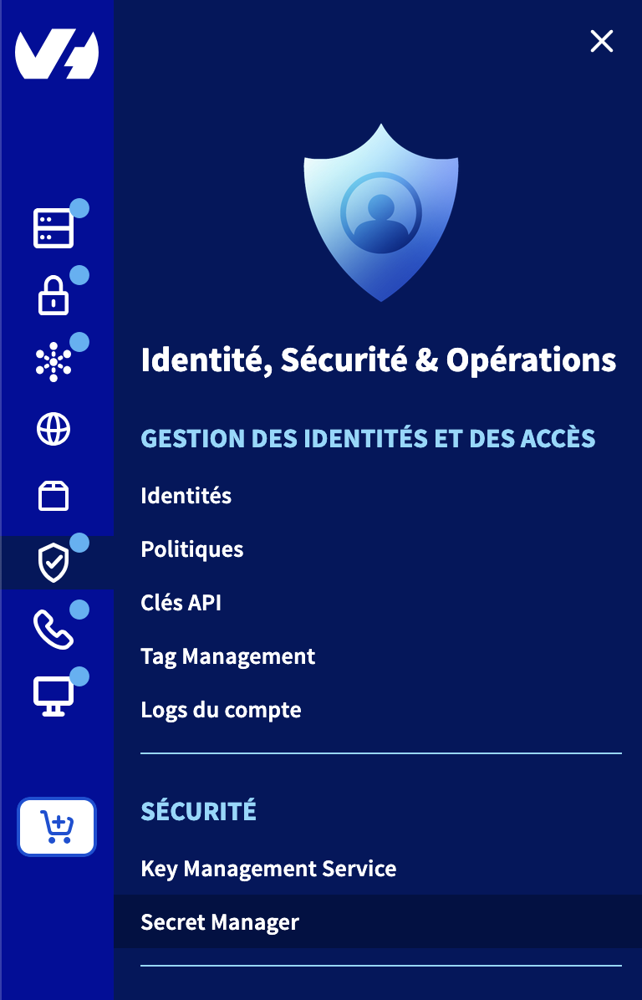
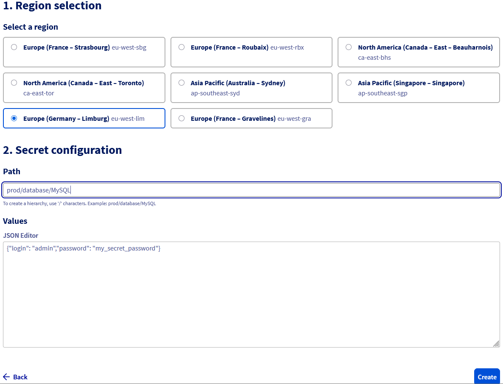
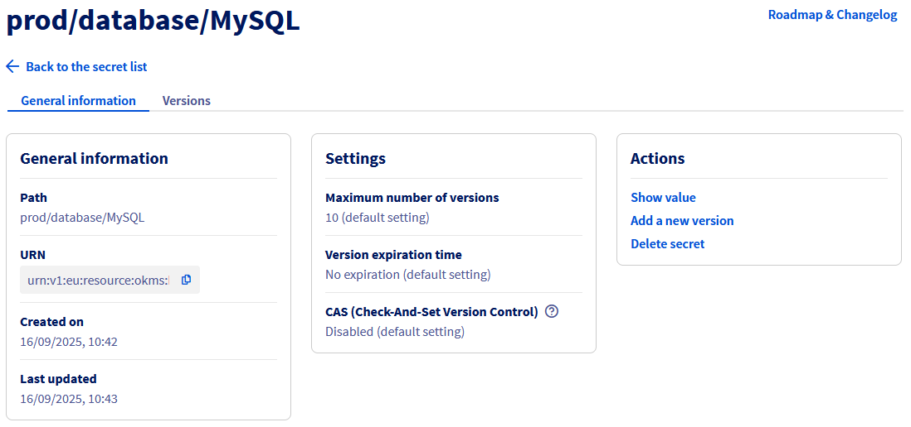
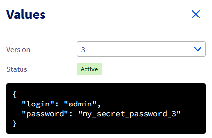
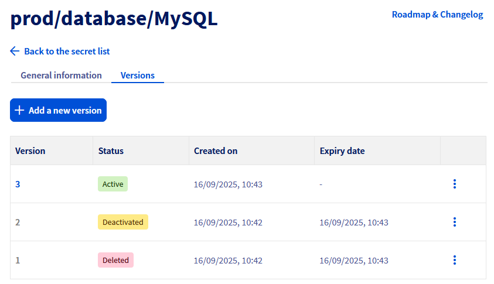
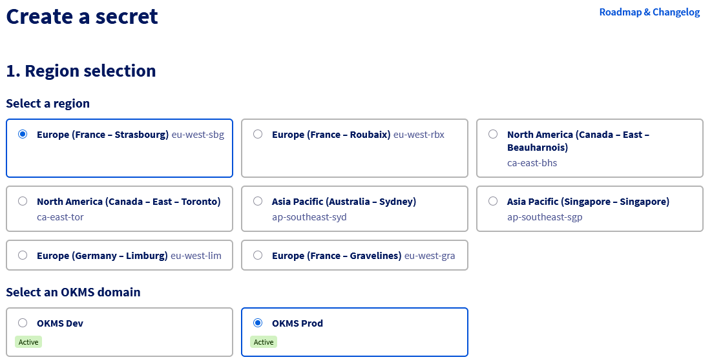
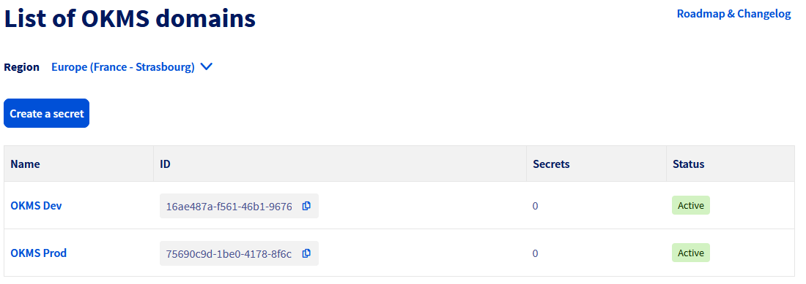

> [!primary]
> Secret Manager is currently in beta phase. This guide can be updated in the future with the advances of our teams in charge of this product.
>

## Objectif

L'objectif de ce guide est de présenter l'utilisation du Secret Manager à travers l'espace client OVHcloud.

## Prérequis

- Disposer d'un [compte client OVHcloud](/pages/account_and_service_management/account_information/ovhcloud-account-creation).

## En pratique

### Description

Le Secret Manager est un produit vous permettant de stocker de manière sécurisé les credentials, clés d'API, clés SSH ou tout autre types de secrets nécessaires au fonctionnement de vos applications.

Un secret est une collection de une ou plusieurs clés/valeurs regroupés au sein d'une version.
Chaque modification d'un secret amène la création d'une nouvelle version de ce secret, permettant de remonter dans l'historique des modifications du secret.

### Création d'un secret

Le Secret Manager est accessible depuis le menu `Identité, Sécurité & Opérations`{.action} dans la section `Sécurité`{.action}

{.thumbnail}

Pour créer un secret, cliquez directement sur le bout `Créer un secret`{.action}

Sélectionnez ensuite la région sur laquelle créer le secret.

> [!primary]
>
> Lors de la création d'un secret pour la première fois dans une nouvelle région une étape d'activation préalable est nécessaire en cliquant sur le bouton `Activer`{.action} pour créer un domaine OKMS dans la région sélectionnée.
> Cette activation peut prendre quelques minutes pour être effective.

Indiquez ensuite le `Path` du secret, par exemple **prod/database/MySQL**. Ce Path servira a hiérarchiser les secrets entre eux.

Puis indiquez le contenu du secret. Le secret doit contenir une liste de clés/valeurs renseignées sous la forme d'un JSON :

```json
{
    "login": "admin",
    "password": "my_secret_password"
}
```

{.thumbnail}

> [!primary]
>
> Il n'y a pas de limite dans le nombre de clé/valeur d'un secret, mais une limite d'au maximum 64 ko de données.

Une fois le secret créé, celui-ci apparait dans la liste des secrets du Secret Manager.

### Gestion des secrets

Une fois un secret créé, la liste des secrets s'affichent dans l'espace client.
Un sélecteur est présent pour naviguer entre les différentes régions ou un secret est présent.

il est possible d'accéder à la configuration de celui-ci en cliquant dessus dans la liste des secret pour en afficher le contenu, créer une nouvelle version ou le supprimer.

Le tableau de bord du secret affiche plusieurs informations comme les informations générales ainsi que les paramètres s'appliquant au secret :

- Nombre maximum de versions : Au dela de la valeur indiqué, la plus ancienne version est supprimée
- Durée d'expiration d'une version : Au dela de la durée indiqué, la version est désactivée
- CAS : Si activé, il est nécessaire de systématiquement préciser le numéro de version actuelle lors des modifications

{.thumbnail}

#### Accéder au contenu d'un secret

Un utilisateur avec les droits IAM nécessaire peut accéder au contenu d'un secret.

> [!primary]
>
> Les droits pour lister une version (**okms:apiovh:secret/get**) sont différent du droit pour récupérer le contenu de cette version (**okms:apiovh:secret/version/getData**)

Pour cela cliquez sur `Afficher la valeur`{.action} dans le tableau de bord d'un secret.

Un panneau latéral s'ouvre avec le contenu de la version la plus récente du secret.

{.thumbnail}

Un sélecteur permet de naviguer entre les différentes versions du secret ainsi que le statut de la version sélectionnées.
Si la version est désactivée ou supprimée, aucune valeur n'est affichée.

#### Gestion des versions

Pour accéder aux versions d'un secret, un onglet `Versions` amène vers le tableau listant l'ensemble des versions d'un secret.
Chaque modification d'un secret amène la création d'une nouvelle version.

{.thumbnail}

Les versions peuvent être soit :

- Active : La valeur de cette version est accessible
- Désactivée : La valeur de cette version est encore présente dans le système mais n'est plus accessible tant que la version n'est pas réactivée
- Supprimée : La valeur de cette version n'est plus présente dans le système et ne peut plus être restaurée.

Les boutons d'action de chaque version permettent d'afficher la valeur, désactiver ou réactiver la version, ou de supprimer celle-ci.

Une version supprimée par le paramétrage **Nombre maximum de versions** n'apparait plus dans la liste des versions.

### Gestion du domaine OKMS

Le domaine OKMS du Secret Manager est commun avec le domaine OKMS du Key Management Service.
La création ou la suppression d'un domaine OKMS à donc des conséquence sur les deux produits.

Dans le cadre de la bêta du Secret Manager, il n'est pas encore possible de modifier la configuration du domaine OKMS via l'interface graphique.

#### Cas du multi-domaine OKMS

Dans le cas ou deux ou plus domaines OKMS sont déjà présent dans une région, une étape de sélection supplémentaire apparait à la création du secret.

{.thumbnail}

De plus dans la liste des secrets, si une région contient plusieurs domaine OKMS un tableau intermédiaire est présent pour sélectionner le domaine OKMS ciblé.

{.thumbnail}

Dans le cadre de la bêta du Secret Manager, il n'est pas encore possible d'ajouter un domaine OKMS dans une région via l'interface graphique.

### Utilisation du Secret Manager par API

Le Secret Manager est accessible par deux jeu d'API différentes :

- Une [API REST](/pages/manage_and_operate/secret_manager/secret_manager-rest-api) similaire aux standard d'API d'OVHcloud
- Une [API Hashicorp Vault KV2 compatible](/pages/manage_and_operate/secret_manager/secret_manager-kv2-api) apportant une compatibilité avec les applications déjà compatibles avec Hashicorp Vault KV2.

Les deux API manipulent les mêmes objets. Un secret créé par une méthode est accessible par l'autre méthode.

## Aller plus loin

Échangez avec notre [communauté d'utilisateurs](/links/community).
