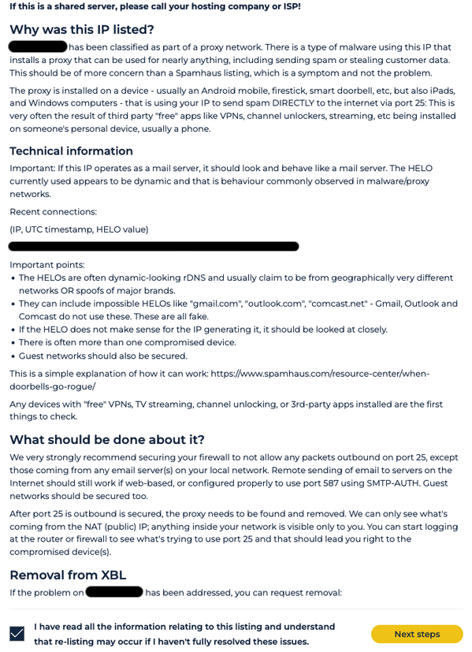
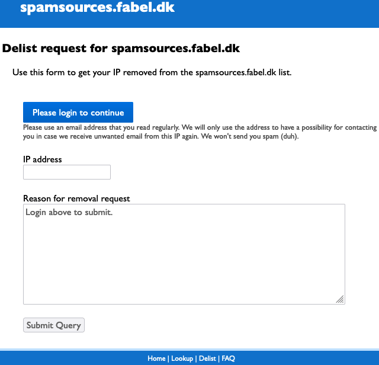

<style>
details>summary {
    color:rgb(33, 153, 232) !important;
    cursor: pointer;
}
details>summary::before {
    content:'\25B6';
    padding-right:1ch;
}
details[open]>summary::before {
    content:'\25BC';
}
</style>

## Wprowadzenie

*Blocklist* (lub lista blokowania) to narzędzie do walki ze spamem używane do blokowania wiadomości e-mail rozpoznawanych jako spam lub mogących zawierać złośliwe oprogramowanie (adresów IP lub zakresów adresów IP). Jeśli domena e-mail lub adres IP są zablokowane(e), e-maile pochodzące z tej domeny lub adresu IP mogą nie dotrzeć do ich klienta (serwer poczty przychodzącej / antywirus), co ma wpływ na dostarczalność i reputację nadawcy. Wiadomości, które mimo to dotrą do odbiorców, mogą zostać wysłane do folderu spamu odbiorcy, a nie do jego skrzynki odbiorczej.

Należy pamiętać, że listy blokowania mogą zawierać domeny i adresy IP, które nie stanowią zagrożenia dla użytkowników. Ponadto niektóre usługi filtrowania spamu uwzględniają rewers DNS podczas oceny adresów IP, takie jak SpamRATS.

> [!primary]
> Zapoznaj się z naszym przewodnikiem [Jak zapobiec oznaczaniu wiadomości e-mail jako spam](/pages/bare_metal_cloud/dedicated_servers/mail_sending_optimization), aby poznać dobre praktyki, których należy przestrzegać podczas korzystania z serwera poczty elektronicznej.
>

**Dowiedz się, jakie działania należy podjąć w celu usunięcia adresów IP OVHcloud z listy bloków, jeśli są one na niej umieszczone.**

> [!warning]
> Informacje w tym przewodniku mogą ulec zmianie i dotyczą nowo zakupionych adresów IP. OVHcloud nie ponosi odpowiedzialności za działania podejmowane przez dostawców zewnętrznych.
>
> W przypadku trudności lub wątpliwości związanych z administrowaniem, użytkowaniem lub wdrażaniem usług na serwerze zalecamy kontakt z [wyspecjalizowanym usługodawcą](/links/partner) lub [naszą społecznością](/links/community).
>

## Wymagania początkowe

- Twoje usługi nie są aktualnie objęte procedurą zgłaszania nadużyć.

## W praktyce

### Obsługiwanych dostawców

- [Spamhaus](https://check.spamhaus.org/)

    - [Spamhaus Block List (SBL)](https://www.spamhaus.org/blocklists/spamhaus-blocklist/)  
    Jeśli [adres IP jest wyświetlany na liście blokowania (SBL) programu Spamhaus](https://check.spamhaus.org/sbl/listings/ovh.net/), yutwórz zgłoszenie z [Centrum pomocy OVHcloud](https://help.ovhcloud.com/csm?id=csm_get_help). Nasz zespół pomocy technicznej prześle Twoją prośbę do naszego zespołu ds. zgłaszania nadużyć, który następnie skontaktuje się z dostawcą listy blokowanych.
    - [Exploits Block List (XBL)](https://www.spamhaus.org/blocklists/exploits-blocklist/) lub  [Combined Spam Sources (CSS)](https://www.spamhaus.org/blocklists/combined-spam-sources/)  
    Jeśli Twój adres IP znajduje się na *Exploits Block List* i/lub na połączonej liście źródeł spamu, jest to spowodowane problemami z konfiguracją. Postępuj zgodnie z instrukcjami zawartymi na stronie Spamhaus, aby usunąć adres IP z listy (patrz przykład poniżej). Po wykonaniu kroków możesz go usunąć z listy.  
    /// details | Przykład
    
    {.thumbnail}  
    {.thumbnail}

    ///

- [SpamCop](https://www.spamcop.net/bl.shtml)

- [Barracuda](https://www.barracudacentral.org/lookups)

- [SpamRATS](https://spamrats.com/lookup.php)  
    Jeśli używasz własnego serwera poczty e-mail, wpisz nazwę domeny w polu PTR, w którym znajdują się dane kontaktowe menedżera. Z tej listy są usuwane tylko prawidłowo skonfigurowane serwery e-mail.  
    Musisz również [skonfigurować odwrotną konfigurację DNS](/pages/bare_metal_cloud/virtual_private_servers/configuring-reverse-dns).
    
    > [!primary]
    > **Dobre praktyki:**
    >
    > Adresy IP używane do wysyłania wiadomości e-mail muszą być zgodne z nazwą domeny menedżera. Możesz również użyć subdomen dla odwrotnego rozpoznawania DNS, takich jak `mail.nazwa_domeny.com` lub `gateway.nazwa_domeny.com`.

### Dostawcy nie są obsługiwani

#### s5h.net

/// details | Więcej informacji...

Aby zażądać usunięcia adresu, przejdź do tej strony z zablokowanego adresu IP. Powinieneś zostać natychmiast usunięty z listy.

Możesz to również zrobić za pomocą narzędzi *telnet*, *curl* lub *wget*.

Aby usunąć adres IPv4 z listy za pomocą *curl*, zaloguj się do wskazanego serwera e-mail i wykonaj następujące polecenie:

```bash
curl -4 http://www.usenix.org.uk/content/rblremove
```

Aby wykonać tę samą operację przy użyciu narzędzia *telnet* na hoście Windows/Linux, wprowadź linie *GET* i *Host* po poleceniu *telnet*, jak pokazano poniżej.

```bash
telnet www.usenix.org.uk 80
```

```bash
GET /content/rblremove HTTP/1.1
```

```bash
Host: www.usenix.org.uk
```

Szczegółowe informacje można znaleźć na stronie <http://www.usenix.org.uk/content/rbl.html>.

///

### UCEprotect

/// details | Więcej informacji...

Ostatnio firma UCE Protect umieściła na swoim blockliście ponad tysiąc nowych numerów ASN. Niestety, miało to wpływ na naszą ASN (). Aby zapoznać się z listą pozostałych krajowych organów regulacyjnych, których to dotyczy, oraz liczbą nowo dodanych krajowych organów regulacyjnych, należy kliknąć poniższe linki:

- http://www.uceprotect.net/en/l3charts.php
- http://stats.uceprotect.net/?page=su

Nasz zespół ds. zgłaszania nadużyć skontaktował się z firmą UCEProtect, aby usunąć naszą ASN z blocklisty. Ogólnie UCEProtect chce, aby operatorzy sieciowi nowo zablokowanych sieci SAN płacili za natychmiastowe usunięcie z listy. Podobnie jak wszyscy wiodący dostawcy, OVHcloud nie płaci za usunięcie bloku, ponieważ jest to usługa, nad którą nie mamy kontroli. Płacenie za usunięcie blocklisty tylko zwiększa liczbę blocklist w całości, szkodząc branży.

UCEProtect twierdzi, że usunie krajowe organy regulacyjne automatycznie po tygodniu, co miejmy nadzieję nastąpi, ale ponieważ pozostaje to poza naszą kontrolą, nie możemy udzielić żadnych gwarancji w tym zakresie.

Jeśli jesteś aktualnie zainteresowany(a) tą sytuacją, zalecamy:

1. Użyj adresów IPv6 do wysyłania wiadomości e-mail. UCEProtect nie blokuje wiadomości e-mail wysyłanych przez protokół IPv6. Wszystkie usługi OVHcloud są dostarczane z co najmniej jednym adresem IPv6, który możesz skonfigurować. Wszyscy główni dostawcy poczty elektronicznej obsługują teraz protokół IPv6.
2. Poproś odbiorcę o skontaktowanie się z dostawcą poczty e-mail w celu chwilowego zaprzestania korzystania z funkcji blocklist UCEProtect.

///

### Fabel Spamsources

/// details | Więcej informacji...

Aby usunąć adres IP z listy źródeł Fabel Spamsources, przejdź do jego [strony usuwania z listy](https://www.spamsources.fabel.dk/delist).

Kliknij `Please login to continue`{.action}, wprowadź adres e-mail i sprawdź skrzynkę odbiorczą. Użyj kodu weryfikacyjnego, aby zakończyć logowanie.

Wpisz adres IP, podaj przyczynę zlecenia usunięcia, następnie kliknij przycisk `Submit Query`{.action}.

{.thumbnail}

Usunięcie listy powinno zająć od 20 do 30 minut.

///

### MIPSpace

/// details | Więcej informacji...

Aby [usunąć adres IP z MIPSpace](https://www.mipspace.com/remove.php), najpierw zaloguj się do [Panelu klienta OVHcloud](/links/manager) i upewnij się, że następujące informacje są aktualne:

- [Rewers DNS](/pages/bare_metal_cloud/virtual_private_servers/configuring-reverse-dns) (pole PTR).
- Informacje na temat Twojej organizacji (*RWhois*) w sekcji `Network`{.action}: Otwórz `IP`{.action} i kliknij na przycisk `Koła zębatego`{.action} po prawej stronie. Z menu rozwijanego wybierz opcję Zarządzaj moimi organizacjami {.action}.

///

## Sprawdź również

W przypadku wyspecjalizowanych usług (pozycjonowanie, rozwój, etc.) skontaktuj się z [partnerami OVHcloud](/links/partner).

Dołącz do [grona naszych użytkowników](/links/community).