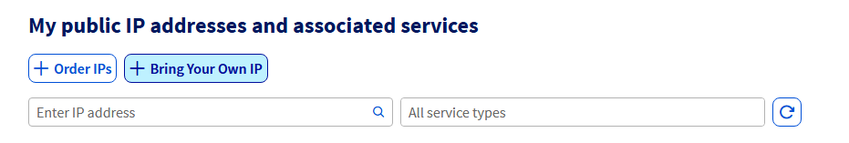
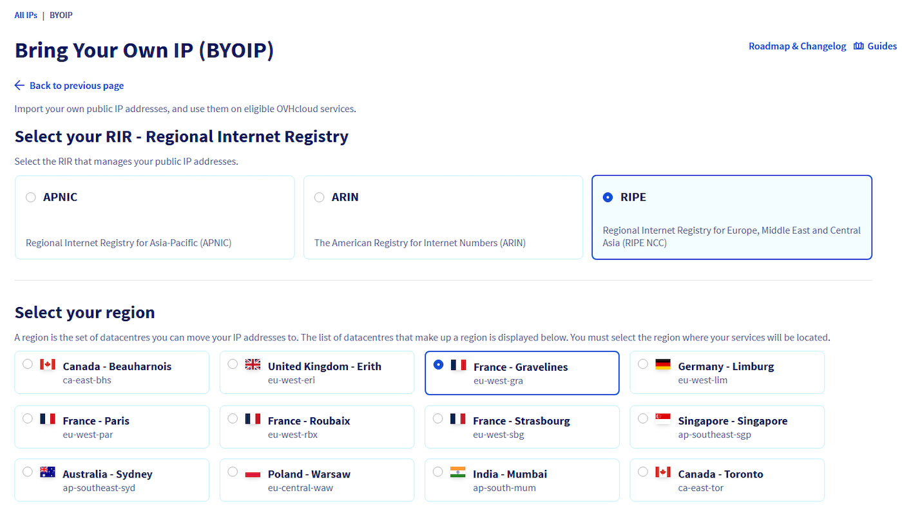
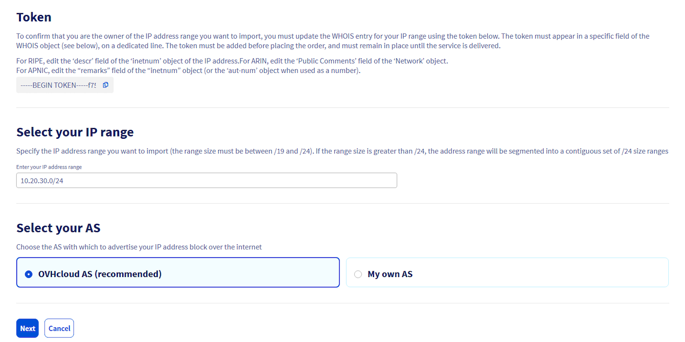
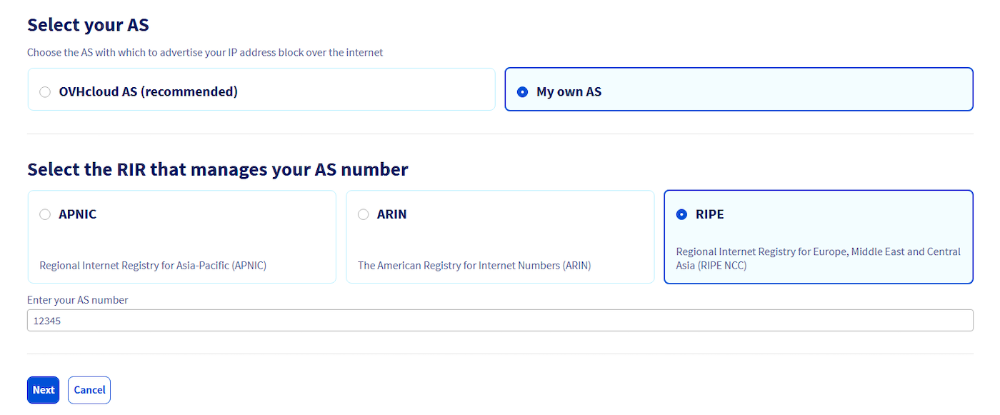
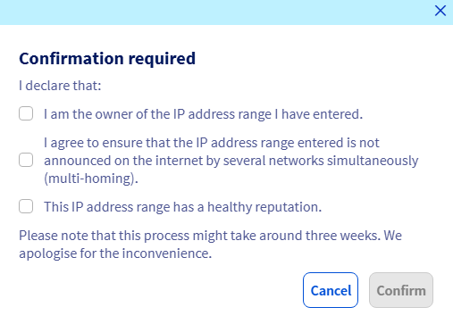
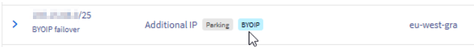
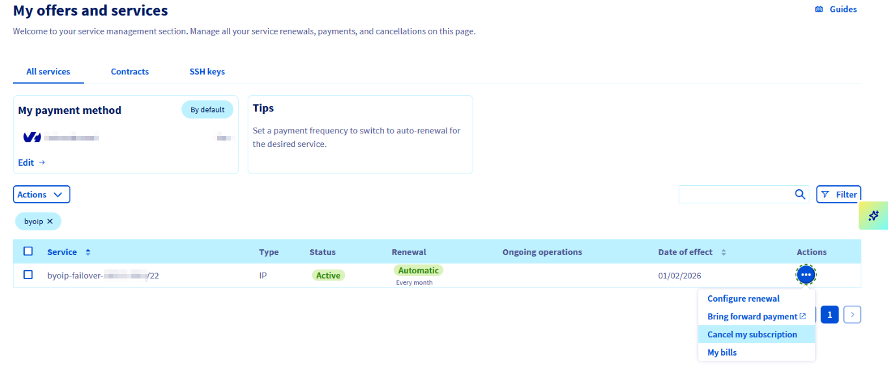
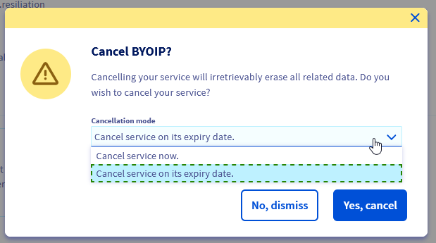

## Objectif

La fonctionnalité [Bring Your Own IP (BYOIP)](/links/network/byoip) vous permet d'utiliser les plages d'adresses IP que vous possédez déjà en tant qu'adresses Additional IP, directement sur le réseau et les produits OVHcloud.

Ces adresses IP seront importées sous la forme d'un bloc d'adresses IP de taille /24 et se comporteront comme une adresse [Additional IP](/links/bare-metal/ip) OVHcloud.

## Prérequis

- [Avoir une plage d'IP dans un RIR pris en charge](#supportedrir)
- [Avoir une plage d'IP d'une taille prise en charge](#supportedsize)
- [Avoir une plage d'IP non utilisée sur Internet](#notinuseontheinternet)
- [Avoir une plage d'IP ou numéro AS avec une réputation propre](#cleanipreputation)
- [Choix de la région](#choosearegion)
- [Prouver que vous êtes propriétaire de la plage d'IP](#proveownershipip)
- [Prouver que vous êtes propriétaire du numéro AS](#proveownershipas)
- [Permettre à OVHcloud d'annoncer la plage d'IP](#announceip)

### Avoir une plage d'IP dans un RIR pris en charge 

Un Registre Internet régional (RIR) est une autorité régionale qui gère les adresses IP dans une région donnée. 

Vous devez posséder (voir ci-dessous) un bloc IPv4 public auprès de l'un des RIR suivants :

- [ARIN](https://www.arin.net/)
- [RIPE](https://www.ripe.net/)
- [APNIC](https://www.apnic.net/) (Veuillez noter que le support pour les Registres Internet Nationaux - NIRs - est actuellement en phase expérimentale)

Veuillez noter que l'enregistrement WHOIS du bloc IPv4 public fourni **doit correspondre précisément à la plage souhaitée**. La sélection d'un bloc IPv4 parent ou enfant vous empêchera d'utiliser cette plage.

Il est désormais possible d'utiliser des blocs IP ARIN, RIPE ou APNIC sur n'importe quelle région OVHcloud. Cette flexibilité améliorée permet une gestion plus efficace et une allocation optimisée des adresses IP pour répondre aux besoins spécifiques de votre entreprise.

Contrairement à la politique précédente, où un bloc ARIN ne pouvait être utilisé qu'avec des services OVHcloud situés au Canada ou aux États-Unis et un bloc RIPE ne pouvait être utilisé qu'avec des services OVHcloud situés en Europe, cette restriction a été levée.

Pour que le bloc soit considéré comme valide, les blocs importés doivent être des types suivants :

| ARIN (object « Network type ») | RIPE (object « status ») | APNIC (object « status ») |
| :--- | :--- | :--- |
| &bull; Direct Allocation  &bull; Direct Assignment  &bull; Reallocated  &bull; Reassigned  |  &bull; ALLOCATED PA  &bull; LIR-PARTITIONED PA   &bull; SUB-ALLOCATED PA   &bull; ASSIGNED PA   &bull; ASSIGNED PI   &bull; LEGACY   |  &bull; Allocated-Portable  &bull; Allocated-Non-Portable  &bull; Assigned-Portable  &bull; Assigned-Non-Portable  |
| **Pour plus d’informations :**  &bull; [« Using WhoIs - Network »](https://www.arin.net/resources/registry/whois/#network)  &bull; [« Reporting Reassignments »](https://www.arin.net/resources/registry/reassignments/) | **Pour plus d'informations :**  [« Description of the INETNUM Object »](https://docs.db.ripe.net/entire-documentation-HTML.html#description-of-the-inetnum-object) |  **Pour plus d'informations :**  &bull; [« INETNUM Quick Guide »](https://www.apnic.net/manage-ip/using-whois/guide/inetnum/)  &bull; [« Recording network assignments »](https://www.apnic.net/manage-ip/using-whois/updating-whois/network-assignments/) |

### Avoir une plage d'IP d'une taille prise en charge 

Nous acceptons les blocs IP de tailles comprises entre /24 et /19. Vous trouverez ci-dessous le nombre de /24 que vous recevrez en fonction de la plage importée :

|CIDR|Nombre de /24|
|---|---|
| /24 | 1 |
| /23 | 2 |
| /22 | 4 |
| /21 | 8 |
| /20 | 16 |
| /19 | 32 |

### Avoir une plage d'IP non utilisée sur Internet 

La plage d'IP ne doit pas être annoncée ou utilisée sur Internet (pas d'annonce en terme de Border Gateway Protocol (BGP) sur au moins un réseau public). Vous êtes libre de ne pas satisfaire à ce prérequis, auquel cas OVHcloud ne pourra assurer le bon fonctionnement et le support de ce service.

### Avoir une plage d'IP ou numéro AS avec une réputation propre 

Nous pouvons refuser l’utilisation d’adresses IP ou de numéros AS ayant une mauvaise réputation, et nous nous réservons le droit de ne plus les annoncer si leur réputation a un impact négatif sur la réputation d’OVHcloud.

### Choix de la région 

Une région peut être vue comme une liste de datacentres où une IP peut être utilisée.

Vous devrez choisir une région où votre IP sera utilisée. Une fois la livraison effectuée, vous pourrez déplacer n’importe quel bloc de taille /24, obtenu à partir de la plage importée, vers n’importe quel service OVHcloud dans la même région que celle choisie au moment de la commande.

Pour choisir une région, veuillez vous référer à la liste des régions disponibles accessible sur [cette page](/links/network/byoip).

### Prouver que vous êtes propriétaire de la plage d'adresses IP 

Afin de prouver que vous êtes le propriétaire de la plage d'adresses IP, il vous sera demandé de renseigner un *token* spécial que nous mettrons à disposition, dans l'objet *whois* public correspondant à votre plage. 
Cela se fera via le portail web du RIR gérant vos adresses IP. Ce token sera fourni lors de la commande (il peut aussi être trouvé directement dans l'espace client OVHcloud, dans la section IP).

- Pour RIPE, éditez le champ « **descr** » de l'objet « **inetnum** » de l'IP.
- Pour ARIN, éditez le champ « **Public Comments** » de l'objet « **Network** ».
- Pour APNIC, éditez le champ « **remarks** » de l'objet « **inetnum** ».

Il est nécessaire que le token apparaisse dans le champ de description (voir ci-dessus) de l'objet WHOIS, sur une ligne dédiée. D'autres lignes peuvent être présentes, à condition que le token soit présent dans sa propre ligne dédiée dans la description. Le token doit être ajouté avant la commande et ne doit pas être supprimé avant la fin de la livraison.

### Prouver que vous êtes propriétaire du numéro AS (requis uniquement si vous fournissez un numéro AS) 

Afin de prouver que vous êtes le propriétaire du numéro AS, il vous sera demandé de réutiliser le même *token* précédemment utilisé pour prouver la propriété de la plage d'adresses IP, et de l'insérer dans l'objet WHOIS public correspondant au numéro AS. 
Cela se fera via le portail web du RIR gérant votre numéro AS. Ce token sera fourni lors de la commande.

- Pour RIPE, éditez le champ « **descr** » de l'objet « **aut-num** » du numéro AS.
- Pour ARIN, éditez le champ « **Public Comments** » de l'objet « **ASN** ».
- Pour APNIC, éditez le champ « **remarks** » de l'objet « **aut-num** ».

Il est nécessaire que le token apparaisse dans le champ de description (voir ci-dessus) de l'objet WHOIS, sur une ligne dédiée. D'autres lignes peuvent être présentes, à condition que le token soit présent dans sa propre ligne dédiée dans la description. Le token doit être ajouté avant la commande et ne doit pas être supprimé avant la fin de la livraison.

### Permettre à OVHcloud d'annoncer la plage d'IP 

Sur le RIR où la plage d'adresses IP est inscrite, il faudra créer un objet de routage (*route object*) pour celle-ci (correspondant exactement à la plage d'IP), avec le numéro **AS** de OVHcloud ("AS16276") ou votre propre numéro AS dans le champ **origin** de l'objet de routage.

Pour plus d'informations sur les objets de routage (*route objects*), veuillez consulter la page de votre RIR :

- RIPE - [Managing Route Objects](https://www.ripe.net/manage-ips-and-asns/db/support/managing-route-objects-in-the-irr)
- ARIN - [Submitting Routing Information](https://www.arin.net/resources/manage/irr/#submitting-routing-information)
- APNIC - [Creating Route Objects](https://www.apnic.net/manage-ip/using-whois/guide/creating-route-objects/)

> [!warning]
> Si votre bloc IP importé est déjà annoncé sur Internet à partir d’autre sites qu’OVHcloud lors de l’utilisation du service BYOIP (multihoming), vous risquez d’éventuelles pertes de paquets ou d'autres difficultés de routage. Nous ne serons par conséquent pas en mesure de vous garantir la connectivité aux services OVHcloud avec votre bloc IP importé.

<!-- CP-NAV-START:network-public-ip -->
---

### Accès à l'espace client OVHcloud

- **Lien direct :** [IP publiques](/links/control-panel/network-public-ip)
- **Pour accéder à vos services :** `Network`{.action} > `Adresses IP Publiques`{.action}

---
<!-- CP-NAV-END:network-public-ip -->

## En pratique

### Comment commander un service BYOIP

{.thumbnail}

Cliquez sur le bouton `+ Bring your own IP`{.action} en haut de la page. Vous serez redirigé vers la page de configuration BYOIP.

{.thumbnail}

Sélectionnez le **RIR** qui gère le bloc d'adresses IP publiques que vous souhaitez importer, puis sélectionnez le **campus** dans lequel vos adresses IP seront situées. Renseignez ensuite la plage d'adresses IP que vous souhaitez importer.

Vous pourrez ensuite choisir d'utiliser l'AS OVHcloud (recommandé) ou votre propre AS pour annoncer votre bloc d'adresses IP. 

Si vous choisissez d'utiliser votre propre AS, vous devrez sélectionner le RIR qui gère votre ASN, puis renseigner votre numéro d'AS. Si vous choisissez l'AS OVHcloud, aucune information supplémentaire n'est requise.

{.thumbnail}

{.thumbnail}

Enfin, cliquez sur le bouton `Suivant`{.action} en bas de la page. Une fenêtre de confirmation s'ouvre. Veuillez vous assurer que tous les prérequis sont respectés, puis cliquez sur le bouton `Confirmer`{.action} pour soumettre votre commande. 

{.thumbnail}

Tous vos blocs IP importés porteront le tag `BYOIP`.

{.thumbnail}

Le filtrage des adresses IP publiques par tag n’est pas disponible actuellement. Nous vous recommandons de les filtrer en cliquant sur la barre `Tous les types de service`{.action} au-dessus du tableau, puis en sélectionnant `Toutes les Additional IP`{.action}. Vous pourrez ainsi différencier vos Additional IP classiques des adresses importées grâce au tag `BYOIP` mentionné ci-dessus.

### Comment utiliser les adresses IP

Les adresses IP importées se comporteront comme le produit Additional IP OVHcloud. Une plage d'adresses IP importée sera fractionnée en blocs de /24 pouvant être déplacés vers n’importe quel service d’une même région. 
Pour activer l'annonce de votre plage IP importée sur Internet, il vous suffit d'affecter un de vos blocs à un produit éligible via l'espace client ou l'API OVHcloud. 

> [!warning]
> Certaines opérations disponibles sur l'offre Additional IP ne seront pas disponibles sur l'offre BYOIP.
>
> Par exemple, il ne vous sera pas possible de personnaliser le WHOIS de vos blocs via l'espace client ou l'API OVHcloud, car OVHcloud n'en est pas propriétaire.
>
> Pour la même raison, il ne vous sera pas possible de modifier les *reverse* de vos IPs dès leur réception directement via l'espace client ou l'API OVHcloud.
>

Lors de la livraison, nous créerons des zones ARPA sur nos serveurs DNS et toute modification de *reverse DNS* via l'espace client ou l'API OVHcloud y sera appliquée. Ces modifications seront visibles au public lorsque nos serveurs DNS auront reçu les délégations des zones ARPA par le RIR (ceci est facultatif, si vous voulez continuer à gérer votre *reverse DNS* par vous-même, vous pouvez le faire).

### Découpage de plages d'adresses 

Tout bloc IP importé peut être divisé en blocs plus petits et/ou en adresses individuelles.

> [!warning]
> Pour pouvoir découper/fusionner un bloc IP existant, il doit être inutilisé (c'est-à-dire au parking) et aucune tâche en attente ne doit lui être associée (par exemple aucune opération de déplacement en attente).

Pour segmenter votre bloc BYOIP, suivez les étapes ci-dessous :

> [!tabs]
> Via l'espace client OVHcloud
>> 1. Rendez-vous sur la page `Adresses IP Publiques`{.action} et repérez votre bloc BYOIP.
>> 2. Cliquez sur le bouton `⋮`{.action} à droite du tableau.
>> 3. Sélectionnez `Segmenter`{.action}.
>> 4. Choisissez le **masque de sous-réseau CIDR** souhaité pour définir la taille des blocs enfants.
>> 5. Vérifiez l'aperçu des blocs générés, puis cliquez sur `Confirmer`{.action} pour finaliser la segmentation.
>>
> Via l'API OVHcloud
>>
>> > [!api]
>> >
>> > @api {v1} /ip POST /ip/{ip}/bringYourOwnIp/slice
>> >
>>
>> Avec les paramètres suivants :
>>
>> - ip : le bloc IP que vous souhaitez découper, en notation CIDR.
>> - slicingSize : la taille résultante des blocs découpés, exprimée en taille de préfixe réseau, en bits. Par exemple, si vous souhaitez découper un bloc /24 en 2 blocs plus petits de taille /25, vous devez saisir la valeur « 25 ».
>>
>> > [!primary]
>> > Cet appel API est asynchrone, les blocs nouvellement créés sont rendus disponibles peu de temps après l'appel. Ils seront utilisables comme tout autre bloc Additional IP ou adresse individuelle.
>>
>> Vous pouvez prévisualiser les blocs résultants qui seraient créés pour chaque taille de bloc, à l'aide de l'appel API suivant :
>>
>> > [!api]
>> >
>> > @api {v1} /ip GET /ip/{ip}/bringYourOwnIp/slice
>> >
>>
>> Avec les paramètres suivants :
>>
>> - ip : le bloc IP que vous souhaitez découper, en notation CIDR.

Pour agréger plusieurs blocs enfants en un bloc parent, suivez les étapes ci-dessous :

> [!tabs]
> Via l'espace client OVHcloud
>> 1. Rendez-vous sur la page `Adresses IP Publiques`{.action} et repérez l'un des segments de bloc BYOIP que vous souhaitez agréger.
>> 2. Cliquez sur le bouton `⋮`{.action} à droite du tableau.
>> 3. Sélectionnez `Agréger`{.action}.
>> 4. Choisissez le bloc parent souhaité.
>> 5. Vérifiez l'aperçu des blocs générés, puis cliquez sur `Confirmer`{.action} pour finaliser l'agrégation.
>>
> Via l'API OVHcloud
>>
>> > [!api]
>> >
>> > @api {v1} /ip POST /ip/{ip}/bringYourOwnIp/aggregate
>> >
>>
>> Avec les paramètres suivants :
>>
>> - ip : le bloc IP que vous souhaitez agréger, en notation CIDR.
>> - aggregationIp : le bloc résultant, en notation CIDR.
>>
>> Le bloc résultant sera un agrégat de tous ses blocs enfants.
>>
>> > [!primary]
>> > Cet appel API est asynchrone, les blocs nouvellement fusionnés sont rendus disponibles peu de temps après l'appel.
>>
>> Vous pouvez prévisualiser toutes les configurations possibles des blocs agrégés pour un bloc IP donné, en utilisant l'appel API suivant :
>>
>> > [!api]
>> >
>> > @api {v1} /ip GET /ip/{ip}/bringYourOwnIp/aggregate
>> >
>>
>> Avec les paramètres suivants :
>>
>> - ip : le bloc IP que vous souhaitez fusionner dans un bloc parent, en notation CIDR.
>>
>> Cet appel renvoie une liste de blocs agrégés possibles et, pour chacun d'eux, donne la liste des blocs enfants à fusionner.

**Limites** :

- Les éléments de configuration associés aux adresses IP individuelles (/32) tels que les règles de pare-feu ou les entrées reverse DNS seront conservés après les opérations de découpage/fusion.
- Les tâches API découpage/fusion ne peuvent pas être suivies par le numéro de tâche asynchrone renvoyé par l'API, car les objets IP associés seront détruits dans le processus de découpage/fusion.
- La liste des adresses IP et des blocs renvoyés par l'API est classée par taille de préfixe réseau. Nous travaillons pour fournir une solution permettant de répertorier les adresses IP par ordre numérique.
- Une fois découpés, les petits blocs ne sont pas déplaçables en dehors de la région choisie lors de la commande du produit.
- Déplacer un bloc /24 entre les régions françaises n'est pas possible si celui-ci a été réagrégé à partir d'un découpage antérieur.

## Comment résilier un service BYOIP

Depuis votre [espace client OVHcloud](/links/manager), cliquez sur votre `nom de compte`{.action} en haut à droite de la fenêtre, puis sélectionnez `Mes offres et services`{.action} dans le menu déroulant.

Dans la barre de recherche en haut à droite du tableau qui s'est ouvert, à côté du bouton de filtre, tapez "byoip", puis appuyez sur la touche `Entrée`{.action} pour filtrer vos services BYOIP.

{.thumbnail}

Trouvez le service que vous souhaitez annuler, puis cliquez sur le bouton `...`{.action} correspondant sur la droite du tableau et sélectionnez `Résilier mon service`{.action}.

Une fenêtre de confirmation s'affichera :

{.thumbnail}

Choisissez si vous souhaitez résilier le service immédiatement ou à la date d'expiration, puis cliquez sur `Oui, résilier`{.action}.

## FAQ

### Est-il possible d'importer une plage d'adresses IP inférieure à un /24 ?

Non, la taille minimum acceptée est un /24.

### Est-il possible d'importer une plage d'adresses IP supérieure à un /19 ?

Pas au lancement de l'offre BYOIP. Cependant, si tel est votre souhait, nous vous invitons à nous contacter pour en discuter.

### Le fractionnement d'un bloc importé /24 en une taille de bloc plus petite (/25, /26, /27, /28, /29, /30) ou en /32 est-il pris en charge ?

Oui. Pour plus d'informations, veuillez vous reporter à la section [Découpage de plages d'adresses](#range-slicing) ci-dessus.

### Puis-je importer un numéro AS et une plage d'adresses IP provenant de RIR différents ?

Oui.

### Puis-je importer une plage d’adresses IP ou un numéro AS géré par AFRINIC/LACNIC ?

Pas pour le moment.

### Est-il possible d'utiliser une plage d'adresses IP dans plusieurs régions ?

Non, une plage d'IP doit être utilisée dans une seule région.

### Est-il possible de changer la région d'une plage IP importée ?

Il n'est pas possible de changer la région d'une plage IP importée. Pour y parvenir, il vous faudrait résilier le produit et le commander à nouveau. En revanche, si vous avez choisi la région de Gravelines, Roubaix ou Strasbourg au moment de la commande et si vous avez commandé le service après le 1er janvier 2023, vous pourrez déplacer vos blocs IP **/24** dans ces 3 régions (et uniquement dans ces 3 régions).

Veuillez noter que, comme mentionné dans les limites du découpage de plages d'adresses, cette option n'est disponible que si le bloc IP que vous souhaitez déplacer n'a pas été réagrégé à partir d'un découpage antérieur.

### Comment savoir quels serveurs DNS OVHcloud géreront la zone ARPA de mon IP importée ?

Leurs noms vous seront communiqués dans l'e-mail de livraison.

### Est-il possible d'importer une IPv6 ?

Pas pour le moment.

### Puis-je commander le service alors que ma plage IP est encore annoncée depuis un autre site ?

Oui, mais une fois la livraison du service BYOIP effectuée, vous devrez immédiatement annuler les annonces depuis l'autre site, sous peine de problème de connectivité avec vos éventuels services hébergés chez OVHcloud. Le cas échéant, OVHcloud ne pourra être tenu responsable.

## Allez plus loin

Échangez avec notre [communauté d'utilisateurs](/links/community).
