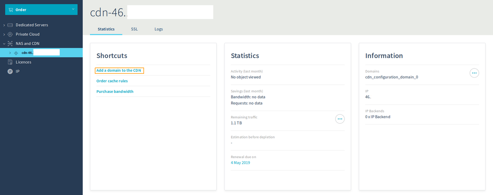
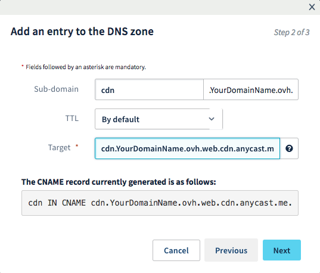

## Sumário

Ao configurar a solução Content Delivery Network (CDN) pela primeira vez, deverá declarar os seus domínios a partir da Área de Cliente OVH e realizar as configurações necessárias para poder utilizar este serviço de forma otimizada.

**Este manual explica-lhe as operações que deve realizar na Área de Cliente, assim como as boas práticas de utilização da CDN da OVH.**


## Requisitos

- Possuir a solução [Content Delivery Network (CDN) da OVH](https://www.ovh.pt/cdn/){.external}.
- Ter acesso à gestão da zona DNS do seu nome de domínio.
- Ter acesso à [Área de Cliente OVH](https://www.ovh.com/auth/?action=gotomanager&from=https://www.ovh.pt/&ovhSubsidiary=pt){.external}.


## Instruções

### Adicionar o domínio na CDN

O primeiro passo desta configuração é a adição de um subdomínio à sua escolha na CDN para que esta última aceite os pedidos HTTP(S) deste domínio.

Para isso, aceda à [Área de Cliente OVH](https://www.ovh.com/auth/?action=gotomanager&from=https://www.ovh.pt/&ovhSubsidiary=pt){.external}, na janela `Serviços Dedicados`{.action} selecione a opção `NAS e CDN`{.action}.

A seguir, clique em `Adicionar domínio à CDN`{.action}.

{.thumbnail}

No passo 1, poderá escolher o subdomínio que quer adicionar à CDN.

{.thumbnail}

No *backend*, pode selecionar um *backend* já existente, se for a primeira vez que adiciona um domínio, ou adicionar um IP à sua escolha. 

{.thumbnail}


Após alguns instantes, o seu domínio ficará disponível na Área de Cliente e poderá realizar a respetiva configuração.

Para que os pedidos passem corretamente pela nossa infraestrutura CDN, deve modificar a zona DNS desse subdomínio e apontar um registo CNAME para a **cdn.*seudominio.ovh*.web.cdn.anycast.me**.


> [!warning]
>
> A utilização do registo CNAME é importante, pois permite que a função `Bypass` funcione corretamente. Se utiliza um registo de tipo A, a CDN funcionará, mas não poderá usufruir da função *bypass*.
>


Se configurar a zona DNS do seu domínio a partir da Área de Cliente, pode adicionar a seguinte entrada (adaptando o subdomínio à configuração que deseja):

{.thumbnail}

 

### Verificar que um ficheiro está armazenado em cache
Para verificar se um ficheiro está corretamente armazenado em cache, execute o seguinte comando:

```sh
curl -I http://sous.domaine/
```

Irá obter um resultado semelhante ao seguinte:

```bash
HTTP/1.1 200 OK
Date: Tue, 09 Jan 2018 10:30:57 GMT
Content-Type: text/plain
Last-Modified: Fri, 29 Dec 2017 13:30:42 GMT
ETag: W/"(5a464382-4ddf"
Expires: Wed, 09 Jan 2019 10:30:58 GMT
X-IPLB-Instance: 5905
Vary: Accept-Encoding
X-CDN-Pop: rbx1
X-CDN-Pop-IP: 51.254.41.128/26
X-Cacheable: Matched cache
Accept-Ranges: bytes
Connection: keep-alive
```

Se o seu ficheiro é enviado a partir da cache, irá obter o resultado `Matched cache`.

Também pode consultar o ponto de presença (PoP) a partir do qual é enviado o seu ficheiro (*rbx1* no exemplo).

Também pode consultar esta informação a partir do browser, na janela `Rede` das ferramentas de desenvolvimento (tecla de atalho F12). Ao clicar no ficheiro que pretende verificar, receberá a resposta HTTP e os seus cabeçalhos.


### Utilizar um subdomínio específico na CDN em vez de um domínio principal

Não é possível adicionar um registo CNAME a um domínio principal. Trata-se de uma limitação relativa às normas RFC, que não é possível contornar ao nível da zona DNS.

A atribuição de um domínio específico aos ficheiros que quer armazenar em cache permitir-lhe-á realizar uma melhor gestão.

- Ficheiros: apenas os ficheiros recebidos no subdomínio serão publicados em cache. Deste modo, poderá conservar os ficheiros dinâmicos ou aqueles que não pretende armazenar em cache no seu domínio principal. Isto permite-lhe determinar rapidamente a origem de um problema de visualização no seu website.
- Faturação: todo o tráfego (armazenado em cache ou não) que passa pela CDN é faturado, de forma a que é possível limitar o número de pedidos não úteis que se realizam para a CDN para otimizar a sua utilização.


### Configurar um novo subdomínio na CDN

Se pretender configurar um novo subdomínio para utilizar a CDN, provavelmente deverá modificar determinadas configurações no website e no serviço web.

Em primeiro lugar, certifique-se de que o seu serviço web responde corretamente a este subdomínio. Para isso, deve configurar um *vhost* para este domínio, quer com a sua própria pasta de destino, quer como alias de outro domínio.

Se o domínio responde corretamente no seu serviço web, só terá de editar o código HTML para modificar a origem dos ficheiros que devem passar pela CDN, e assegurar-se de que estes têm o nome correto no subdomínio.

 
## Quer saber mais?

Fale com a nossa comunidade de utilizadores em [https://community.ovh.com/en/](https://community.ovh.com/en/){.external}