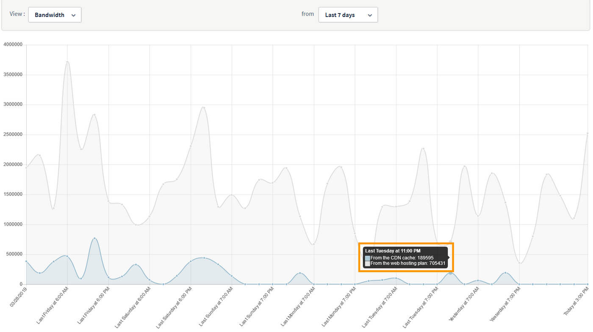

**Última atualização: 17/12/2018**

## Sumário

A solução CDN da OVH permite-lhe otimizar os tempos de resposta dos seus websites para todos os utilizadores. Qualquer ligação a um website gerará um fluxo de dados que, por sua vez, consome o tráfego disponível na solução (limite do volume total que pode circular para e a partir da CDN).

**Este manual explica como administrar o tráfego na solução CDN da OVH.**

## Requisitos

- Ter acesso à [Área de Cliente OVH](https://www.ovh.com/auth/?action=gotomanager&from=https://www.ovh.pt/&ovhSubsidiary=pt){.external}.

## Instruções

### Renovar tráfego

Ao contratar a solução CDN, poderá usufruir de **1 TB** de tráfego incluído. Contudo, este limite não é renovado mensalmente juntamente com a sua solução. Uma vez consumido (independentemente do prazo), deverá renovar o tráfego disponível.

Caso necessite de tráfego adicional, poderá adicionar diretamente a partir da [Área de Cliente OVH](https://www.ovh.com/auth/?action=gotomanager&from=https://www.ovh.pt/&ovhSubsidiary=pt){.external}.

{.thumbnail}

Pode consultar os preços dos pacotes de tráfego disponíveis no [nosso site](https://www.ovh.com/pt/cdn/infrastructure/){.external}.

Quando o tráfego disponível for inferior a **100 GB**, receberá um aviso indicando-lhe que é necessário adquirir mais largura de banda. Se não possuir tráfego na solução, a função `bypass` será automaticamente ativada até que adquira mais largura de banda.

### Faturação do tráfego na solução CDN

> [!primary]
>
> Todo o tráfego de saída da CDN será faturado.  
>

Analisemos este exemplo:

{.thumbnail}

- Os 21,74 MB representam os ficheiros na cache. É possível que a CDN tenha respondido diretamente aos pedidos relativos a esses ficheiros.

- Os 72,96 MB representam os ficheiros cujo pedido é diretamente enviado desde o *back end*, atrás da CDN. Os ficheiros que são guardados na cache ou cujo pedido é diretamente enviado desde o *backend* dependerão das regras de cache configuradas no seu domínio.

Em ambos os casos, quer os ficheiros estejam guardados na cache ou enviados para o *back end* passando pela CDN, **utilizar-se-á o tráfego disponível na solução**. Por essa razão, recomendamos que crie um subdomínio específico para o qual serão enviados os pedidos dos ficheiros que devem ser guardados em cache e que conserve domínios que apontem para o seu *back end* para os restantes ficheiros.

## Quer saber mais?

Fale com a nossa comunidade de utilizadores em [https://community.ovh.com/en/](https://community.ovh.com/en/){.external}