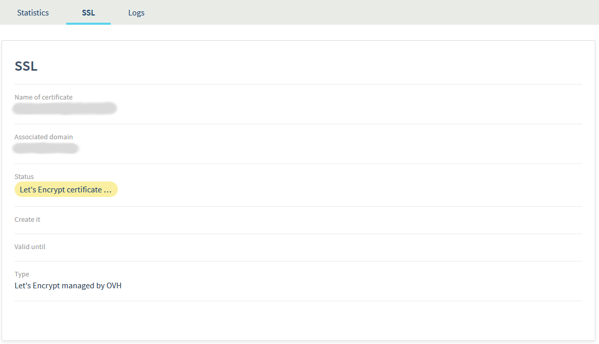
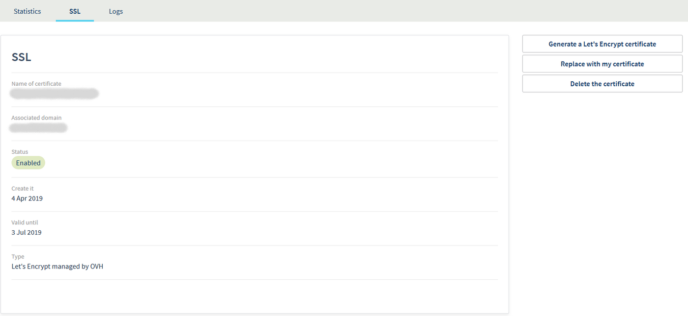
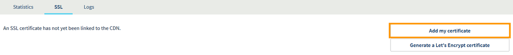
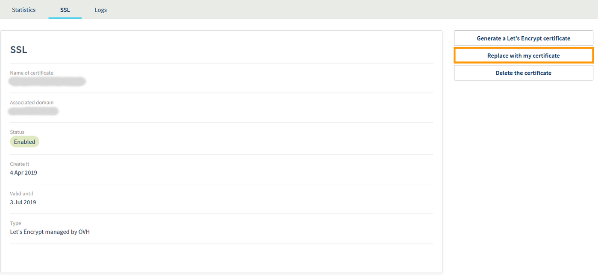

**Última atualização: 18/12/2018**

## Sumário

É possível adicionar um [certificado SSL](https://www.ovh.com/pt/ssl/){.external} na solução CDN (Content Delivery Network) para que os seus utilizadores possam estabelecer ligações seguras, mesmo passando pela CDN.

**Este manual explica em detalhes o funcionamento do SSL Let's Encrypt fornecido pela OVH.**

## Requisitos

- Dispor da solução [CDN da OVH](https://www.ovh.com/pt/cdn/){.external}.
- Ter acesso à gestão da zona DNS do seu domínio.

## Instruções

### Obter o certificado Let's Encrypt fornecido pela OVH para os subdomínios que utilizam a CDN

- Se não configurou nenhum certificado e adicionou o seu primeiro subdomínio à CDN, um certificado Let's Encrypt será automaticamente criado para esse nome de domínio.
- Se adicionar outro subdomínio à CDN, o certificado será automaticamente regenerado para incluir o novo subdomínio que configurou.

Para que o certificado seja criado corretamente, é necessário que o subdomínio recentemente adicionado aponte corretamente para a CDN. Para isso, consulte a secção do manual que explica como realizar uma [primeira configuração de um domínio](/pages/network/content_delivery_network_infrastructure/first_domain_name_configuration){.external} (versão em inglês).

A renovação do certificado é realizada automaticamente nos 20 dias antes da expiração do certificado.

> [!warning]
>
> O certificado Let's Encrypt fornecido pela OVH pode utilizar-se nos 100 primeiros nomes de domínio ou subdomínios configurados na CDN. Se pretender utilizá-lo em mais de 100 domínios, deverá configurar o seu próprio certificado “wildcard” ou multidomínio.
>

### O meu certificado está a ser criado. Quanto tempo tenho de esperar?

Gerar (ou regenerar) um certificado e implementá-lo em todos os nossos pontos de presença demora cerca de duas horas.

{.thumbnail}

Se o processo de criação estiver bloqueado, verifique que todos os domínios configurados na solução apontam para a CDN. Caso contrário, não será possível criar o certificado.

Caso tenha efetuado uma correção de apontamento durante a criação do certificado, o nosso sistema voltará a tentar criar o certificado de forma regular durante 48 horas. Depois desse prazo, a tarefa de criação será cancelada.

O sistema tentará novamente criar o certificado quando adicionar um novo domínio ou solicitar manualmente um certificado.

Uma vez ativado o certificado, irá obter o seguinte resultado:

{.thumbnail}

### Adicionar o seu próprio certificado

- Se ainda não adicionou um domínio ou não possui nenhum certificado, pode utilizar a opção `Adicionar o meu certificado`{.action} a partir da janela SSL da sua CDN:

{.thumbnail}

- Se já possui um certificado Let's Encrypt, pode simplesmente utilizar a opção `Substituir pelo meu certificado`{.action}:

{.thumbnail}

## Quer saber mais?

[Primeira configuração de um domínio](/pages/network/content_delivery_network_infrastructure/first_domain_name_configuration){.external} (versão em inglês)

Fale com a nossa comunidade de utilizadores em [https://community.ovh.com/en/](https://community.ovh.com/en/){.external}