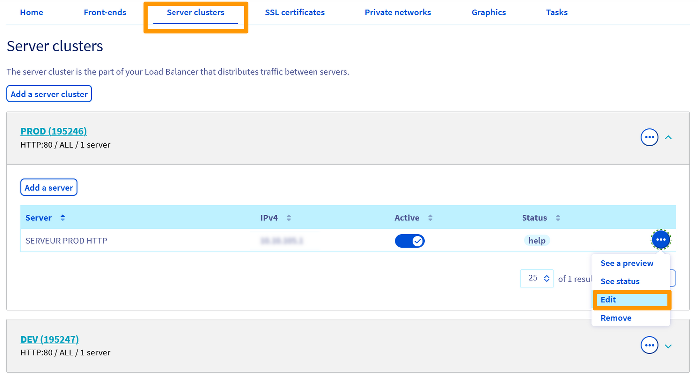
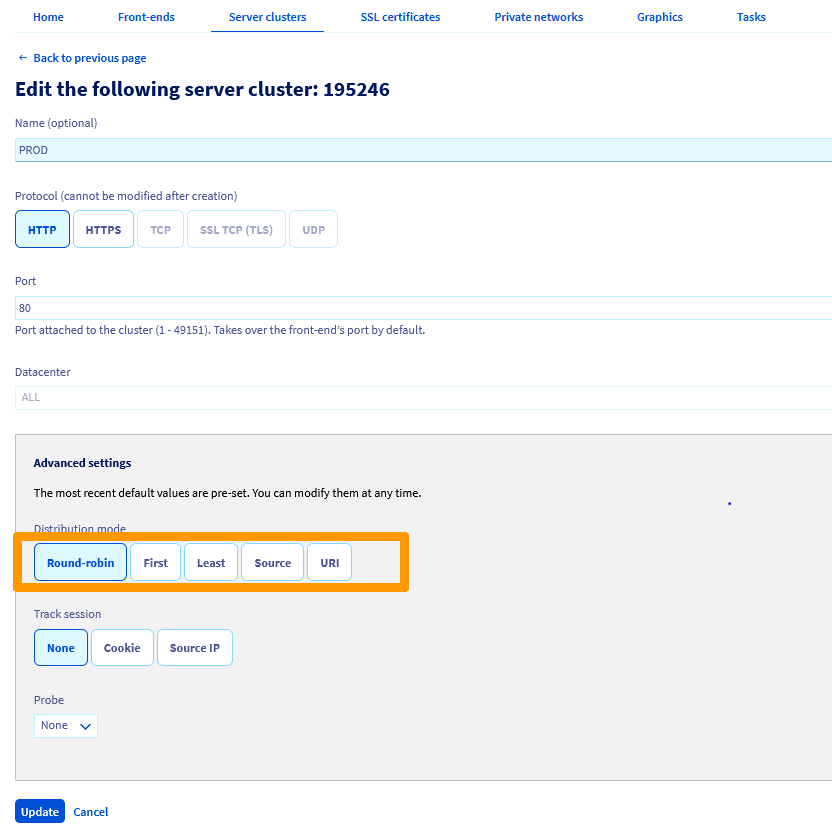
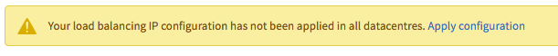

## Objective

The new OVH Load Balancer service offers a variety of load balancing methods for your services. This process determines the way in which the OVH Load Balancer distributes the requests received by your servers.

**This guide will provide an introduction to the various load balancing methods, and will explain how you can modify them.**

## Requirements

- You must be logged in to the [OVH Control Panel](/links/manager).
- You need to have created a server cluster.

## Instructions

### Different load balancing methods

Load balancing is used in server clusters. This setting defines the way that requests are distributed between the servers within the cluster.

To understand the basics of the OVH Load Balancer service, please refer to the [Load Balancer Introduction](/pages/network/load_balancer/use_presentation){.external}.

|Algorithm|Features|
|---|---|
|First|The first available server receives the connection. The server is chosen according to its ID, from smallest to largest.|
|LeastConn|Selects the server that has the lowest number of active connections. This setting is recommended for long sessions, with low levels of traffic. The *RoundRobin* algorithm is applied to groups of servers that have the same number of active connections.|
|RoundRobin|Selects the servers one after the other for each connection. **This is the default algorithm.**|
|Source|This algorithm *hashes* the source IP address, then divides the result by the number of servers currently running. The same source IP address will then still be redirected to the same server, provided that it continues to run.|
|URI|This algorithm *hashes* part or all of the URI, then divides the result by the number of servers currently running. The same URI will then still be redirected to the same server, provided that it continues to run.|

### Modify a server cluster’s load balancing method via the Control Panel

- In the `Server clusters`{.action} section (1), you will see the clusters that have been created. You can edit them by clicking the three dots on the right-hand side (2), then `Change`{.action}:

{.thumbnail}

In `Advanced settings`{.action}, you can modify your `Load balancing method`{.action}:

{.thumbnail}

Once you have selected your preferred load balancing method, click `Update`{.action}, then `Apply configuration`{.action} in the yellow banner that appears:

{.thumbnail}

### Modify a server cluster’s load balancing method via the API

You can modify the load balancing method settings by editing them in the server cluster.

- View details on a server cluster

With this call instruction, you can view details on a server cluster if you know its ID.  In this example, we will work on an HTTP cluster:

> [!api]
>
> @api {v1} /ipLoadbalancing GET /ipLoadbalancing/{serviceName}/http/farm/{farmId}
> 

|Setting|Meaning|
|---|---|
|ServiceName*|Your Load Balancer service ID|
|farmId*|The cluster’s ID number|

|Response (BackendHttp)|Meaning|
|---|---|
|farmId|The cluster’s ID number|
|balance|Balance type currently set for the cluster|
|zone|Name of the zone in which the cluster is configured|
|port|Port used to contact the servers configured on the cluster|
|probe|Type of probe currently configured on the cluster|
|displayName|Name given to this cluster|
|stickiness|Connection monitoring method currently set for the cluster|

- Modify a server cluster’s load balancing method

With this call instruction, you can edit the settings of a server cluster if you know its ID.  In this example, we will work on an HTTP cluster. To modify the balancing method, the `BackendHttp.balance` field must be updated with an available balancing method:

> [!api]
>
> @api {v1} /ipLoadbalancing PUT /ipLoadbalancing/{serviceName}/http/farm/{id}
> 

|Setting|Meaning|
|---|---|
|ServiceName*|Your Load Balancer service ID|
|farmId*|The cluster’s ID number|
|BackendHttp.balance|Preferred balancing method for this cluster|

- Apply the modifications

> [!api]
>
> @api {v1} /ipLoadbalancing POST /ipLoadbalancing/{serviceName}/refresh
> 

|Setting|Meaning|
|---|---|
|ServiceName*|Your Load Balancer service ID|
|zone*|Name of the zone in which to deploy the configuration|

## Go further

Join our community of users on <https://community.ovh.com/en/>.
