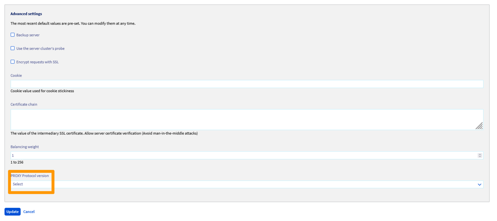

## Objectif

Le service OVHcloud Load Balancer agit comme un mandataire ou « Proxy ». Comme un mandataire humain, il agit comme un intermédiaire, de telle sorte que le client s'adresse au mandataire et le mandataire au fournisseur de service, au nom du client. Dans cette configuration, seul le mandataire connaît à la fois le véritable client (l'utilisateur de votre service) et le véritable fournisseur de service (l'un de vos serveurs).

Pour le visiteur, cela ne pose aucun souci. Il n'a pas besoin de connaître avec précision le serveur qui répond à sa requête. C'est un détail d'implémentation. En revanche, pour des raisons de statistiques et de sécurité, il est parfois indispensable que le serveur final ait connaissance de la véritable adresse du client. Or, par défaut, il ne voit que le mandataire (en l’occurrence, votre service OVHcloud Load Balancer).

Si vous utilisez un frontend HTTP, nous vous recommandons le guide « [Configuration d'un service OVHcloud Load Balancer - Les en-têtes HTTP](/pages/network/load_balancer/create_headers) » qui décrit la manière standard d'utiliser les en-têtes HTTP pour retrouver l'adresse IP, le port ainsi que le protocole source.

**Si vous utilisez un frontend TCP, alors ce guide vous est destiné.**

## Obligations légales

Vous pouvez être tenus de conserver des logs et certaines données relatives au trafic en vertu des lois et règlementations vous étant applicables. Il vous incombe de respecter ces obligations.

**A titre d’exemple :**

- [L’article L34-1 du Code des postes et des communications électroniques](https://www.legifrance.gouv.fr/affichCodeArticle.do?cidTexte=LEGITEXT000006070987&idArticle=LEGIARTI000006465770&dateTexte=&categorieLien=cid) ainsi que le [décret n°2006-358 du 24 mars 2006 relatif à la conservation des données des communications électroniques](https://www.legifrance.gouv.fr/affichTexte.do?cidTexte=JORFTEXT000000637071&dateTexte=20180110) imposent notamment à toute personne physique ou morale fournissant au public un service de communications électroniques de conserver des données d'identification des personnes utilisatrices des services fournis, etc.
- La [loi n° 2004-575 du 21 juin 2004 pour la confiance dans l'économie numérique](https://www.legifrance.gouv.fr/affichTexteArticle.do?idArticle=JORFARTI000002457442&cidTexte=JORFTEXT000000801164) et le [décret n° 2011-219 du 25 février 2011](https://www.legifrance.gouv.fr/affichTexte.do?cidTexte=JORFTEXT000023646013&categorieLien=id) imposent notamment aux personnes dont l’activité est d’offrir un accès à des services de communication au public en ligne de conserver pour chaque connexion les données relatives à l’identifiant de la connexion, les dates et heure de début et de fin de la connexion, etc.

## Prérequis

Ce guide est un guide avancé. Il fait l'hypothèse que vous vous êtes déjà familiarisé avec les fonctionnalités principales de votre service OVHcloud Load Balancer, en particulier les **frontend** et les **fermes**. Si ce n'est pas encore le cas, nous vous recommandons de consulter le guide « [Configurer un service OVHcloud Load Balancer HTTP/HTTPS](/pages/network/load_balancer/create_http_https) ». Ce guide est plus particulièrement orienté sur les services TCP mais les principes généraux sont les mêmes.

Vous devez disposer de :

- un service OVHcloud Load Balancer avec un frontend et une ferme TCP fonctionnels;
- Nginx ou Apache avec mod_proxyprotocol sur un serveur OVHcloud.

> [!warning]
> Les champs ProxyProtocol pouvant être forgés par un client malicieux, ils ne doivent être pris en compte que s’ils viennent d’une source de confiance.
>
> Il est donc indispensable de limiter leur utilisation à des adresses IP de confiance, en l’occurrence les adresses IP de sortie de votre service OVHcloud Load Balancer. Les principaux serveurs tels que Nginx et Apache disposent de modules capable de gérer cet aspect de sécurité et de confiance.

## En pratique

### Obtenir la liste de vos adresses IP de sortie

#### Depuis l'espace client OVHcloud

La liste des IPv4 de sortie potentiellement utilisées par votre service OVHcloud Load Balancer se trouve sur la page d'accueil de votre service OVHcloud Load Balancer sous le nom « IPv4 de sortie ».

{.thumbnail}

#### Depuis l'API OVHcloud

- Liste des adresses IP utilisées par votre service OVHcloud Load Balancer :

> [!api]
>
> @api {v1} /ipLoadbalancing GET /ipLoadbalancing/{serviceName}/natIp
> 

### Présentation du ProxyProtocol

Le ProxyProtocol a été développé par l'équipe du Load Balancer [HAPRoxy](http://haproxy.org/){.external} comme l'homologue en TCP des en-têtes HTTP standards tels que X-Forwarded-For. Il a été pensé pour faire suivre au minimum :

- le nom du protocole L4 utilisé (TCP4 pour l'IPv4 ou TCP6 pour l'IPv6);
- l'adresse IPv4 ou IPv6 source;
- le port source.

Quand le ProxyProtocol est activé pour un de vos serveurs, le service OVHcloud Load Balancer ajoute un préfixe avec le ProxyProtocol avant d'envoyer la suite de la requête. Cette modification étant intrusive, il est indispensable de bien s'assurer que le serveur est bien compatible avec ce protocole, et, le cas échéant, quelles sont les version gérées.

En effet, ce protocole existe en 2 versions : 

- la version 1, au format texte;
- la version 2, au format binaire optimisé et extensible.

La version 1 étant largement suffisante pour la plupart des usages (bien que moins optimisée), elle est souvent la seule version gérée par les logiciels compatibles. La version 2 étant un format binaire, elle est plus rapide à analyser. Elle ajoute également la possibilité d'indiquer si la connexion d'origine était chiffrée (l'équivalent de l'en-tête X-Forwarded-Proto) ainsi que le domaine spécifié dans le champ Common Name du certificat utilisé le cas échéant.

Pour en savoir plus sur le ProxyProtocol, nous vous invitons à consulter la [spécification du ProxyProtocol](http://www.haproxy.org/download/1.8/doc/proxy-protocol.txt){.external}.

### Activation du ProxyProtocol pour un de vos serveurs

Le ProxyProtocol doit être activé pour chaque serveur enregistré dans une ferme de serveurs. Cette fonctionnalité étant intrusive et ne pouvant être activée de manière transparente, cela permet de la tester sur une machine en particulier puis de déployer progressivement la configuration sur une ferme active.

Votre service OVHcloud Load Balancer gère 4 modes pour le ProxyProtocol:

|Mode|Description|
|---|---|
|v1|Version 1 au format texte. C'est la version la plus largement gérée.|
|v2|Version 2 au format binaire sans aucune option. Il s'agit d'une version optimisée de la version 1.|
|v2-ssl|v2, avec un champ décrivant la connexion SSL, si applicable.|
|v2-ssl-cn|v2-ssl, avec le champ "Common Name" du certificat utilisé, si applicable.|

Lorsque le ProxyProtocol est activé pour l'un de vos serveurs, les sondes insèrent automatiquement cet en-tête **sauf** si un port spécifique a été spécifié pour les sondes. Dans ce cas, la sonde se connectera de manière classique sur le port de la sonde.

#### Depuis l'espace client OVHcloud

Dans la section `Fermes`{.action}, sélectionnez la ferme contenant le serveur sur lequel activer le ProxyProtocol puis cliquez sur le bouton d'édition du serveur concerné.

Le ProxyProtocol se configure via l'option `Version du ProxyProtocol`{.action}. Vous y retrouverez les 4 modes décrits ci-dessus.

{.thumbnail}

Une fois le mode souhaité sélectionné, cliquez sur `Mettre à jour`{.action} puis sur `Déployer la zone: VOTRE ZONE`{.action} pour appliquer vos changements dans la zone concernée.

#### Depuis l'API OVHcloud

L'activation du ProxyProtocol via l'API se fait de la même manière que depuis l'espace client OVHcloud.
Le champ d'API correspondant dans le serveur est proxyProtocolVersion.

- Modifier un `Serveur`{.action} existant :

> [!api]
>
> @api {v1} /ipLoadbalancing PUT /ipLoadbalancing/{serviceName}/http/farm/{farmId}/server/{serverId}
> 

- Appliquer les modifications:

> [!api]
>
> @api {v1} /ipLoadbalancing POST /ipLoadbalancing/{serviceName}/refresh
> 

### Configuration du ProxyProtocol coté serveur

#### Nginx

Nginx gère la version 1 du ProxyProtocol. Il est capable d'en extraire les principales informations, à savoir l'adresse IP et le port source du client tels que vus par votre service OVHcloud Load Balancer. Dans Nginx, ces informations sont exposées à travers la variable proxy_protocol_addr. De même que pour son homologue HTTP X-Forwarded-For, Nginx se servira de cette variable pour prendre en compte la bonne adresse source dans les logs avec le module ngx_http_realip.

Pour utiliser le ProxyProtocol avec Nginx, vous pouvez configurer le section server de votre configuration avec :

```nginx
1. server {
2.     # Enable the Proxy protocol on port 80
3.     listen 80 proxy_protocol;
4.
5.     # Trust the proxy protocol provided informations from your OVHcloud Load Balancer service
6.     # See https://www.ovh.com/manager/cloud/index.html#/network/iplb/ for an up to date list
7.     set_real_ip_from 10.108.0.0/14;
8.     real_ip_header proxy_protocol;
9.
10.     # (optional) Set some headers
11.     proxy_set_header X-Real-IP        $proxy_protocol_addr;
12.     proxy_set_header X-Forwarded-For  $proxy_protocol_addr;
13.
14.     # Insert your regular configuration here
15.     ...
16. }
```

Une fois configuré, vous pouvez re-charger la configuration :

```bash
service nginx reload
```

> [!primary]
>
> Cet exemple utilise le protocole HTTP pour plus de simplicité. Si vous utilisez du HTTP, nous vous recommandons vivement d'utiliser les en-têtes HTTP au lieu du ProxyProtocol, sauf si votre service OVHcloud Load Balancer est configuré en TCP. Cela peut se produire dans le cas d'une terminaison SSL pour du HTTP/2 par exemple.
> 

Pour plus d'informations sur la configuration du ProxyProtocol dans Nginx, nous vous invitons à consulter la documentation officielle du projet: [https://www.nginx.com/resources/admin-guide/proxy-protocol/](https://www.nginx.com/resources/admin-guide/proxy-protocol/){.external}

#### Apache

La gestion du ProxyProtocol dans Apache est encore jeune. Une implémentation non-officielle et compatible avec Apache 2.4 est disponible sur Github ([https://github.com/roadrunner2/mod-proxy-protocol](https://github.com/roadrunner2/mod-proxy-protocol){.external}) mais n'est plus maintenue depuis 2014. Une implémentation officielle se trouve dans le module mod_remoteip qui est également utilisé pour gérer les en-têtes de la famille X-Forwarded-For.

mod-proxy-protocol gère les versions 1 et 2 du ProxyProtocol. En revanche, il ne permet pas de spécifier une liste d'adresses IP source autorisées à utiliser le ProxyProtocol, bien que ce soit évoqué dans les projets du module.

mod_remoteip gère également les versions 1 et 2 du ProxyProtocol. Il ajoute également la possibilité de spécifier une liste d'adresses pour lesquelles le ProxyProtocol ne doit pas être activé. Ce qui reste limitant du point de vue de la configuration. Ce module est uniquement disponible dans la version expérimentale Apache 2.5, bien que la documentation mentionne une disponibilité à partir de Apache 2.4.26.

Quelle que soit l'approche choisie, nous vous recommandons vivement de bien restreindre les connexions à vos serveurs aux adresses de sortie de votre service OVHcloud Load Balancer.<br>
Cela peut être aisément configuré avec iptables:

```bash
# Trust connections from your OVHcloud Load Balancer service, ONLY
iptables -A INPUT -s 10.108.0.0/14 -p tcp --dport 80 -j ACCEPT
iptables -A INPUT                  -p tcp --dport 80 -j DROP
```

##### **Avec mod-proxy-protocol**

- Ce module n'étant pas officiel, il faudra commencer par en télécharger les sources, compiler et installer :

```bash
# Install build tools
sudo apt install git apache2-dev

# Grab the sources
git clone https://github.com/roadrunner2/mod-proxy-protocol.git
cd mod-proxy-protocol

# Build and install the module
sudo apxs -i -a -c mod_proxy_protocol.c
```

- Puis configurer Apache :

```apache
1. <VirtualHost *:80>
2.     ProxyProtocol On
3.     ...
4. </VirtualHost>
```

- Remplacez les variables `%h` par `%a` dans les directives LogFormat de la configuration Apache
- Enfin, activez la nouvelle configuration avec :

```bash
# Restart apache to load the new module ("reload" is enough if the module was already enabled)
service apache2 restart
```

Pour en savoir plus sur la configuration du module mod-proxy-protocol nous vous invitons à consulter [sa documentation](http://roadrunner2.github.io/mod-proxy-protocol/mod_proxy_protocol.html){.external}.

##### **Avec mod_remoteip**

- Le module étant expérimental, il faudra au préalable installer une version expérimentale de Apache, ce qui n'est pas recommandé dans un environnement de production, à moins de savoir précisément ce que l'on fait !
- Puis configurer Apache :

```apache
1. <VirtualHost *:80>
2.     RemoteIPProxyProtocol On
3.     ...
4. </VirtualHost>
```

- Remplacez les variables `%h` par `%a` dans les directives LogFormat de la configuration Apache
- Enfin, activez la nouvelle configuration avec :

```bash
# Enable the 'remoteip' module and configuration
a2enmod remoteip

# Restart apache to load the new module ("reload" is enough if the module was already enabled)
service apache2 restart
```

Pour en savoir plus sur la configuration du module mod_remoteip, nous vous invitons à consulter [sa documentation](https://httpd.apache.org/docs/trunk/mod/mod_remoteip.html#remoteipproxyprotocol){.external}.

#### HAProxy

Le ProxyProtocol a été conçu par l'équipe de HAProxy. Il est donc le logiciel gérant le mieux ce protocole. Cela pourra être utile dans un scénario où le suivi de la véritable adresse IP source du client est indispensable, mais le logiciel cible ne gère pas ce protocole. Ce sera le cas par exemple de MySQL et PostgreSQL pour n'en citer que 2.

Dans ce cas, une astuce est de placer une instance HAProxy locale, en frontal du logiciel et assurer la journalisation des requêtes et leur filtrage avancé dans l'instance HAProxy locale.

Ce guide vous propose un exemple de configuration possible pour le port TCP 3306 utilisé par MySQL. Cette configuration n'a pas vocation a être un exemple complet mais plutôt à servir de base, de manière à partir sur une configuration fonctionnelle.

- Installez HAProxy

```bash
sudo apt install haproxy
```

- Configurez votre proxy

```haproxy
1. listen mysql
2.     # Listen on all interfaces, port 3306, tcp mode (ie: not HTTP)
3.     mode tcp
4.     option tcplog
5.     bind *:3306
6. 
7.     # Expect ProxyProtocol header if and only if from a trusted network
8.     # See https://www.ovh.com/manager/cloud/index.html#/network/iplb/ for an up to date list
9.     tcp-request connection expect-proxy layer4 if { src 10.108.0.0/14 }
10. 
11.     # Declare local server, on a non standard port to avoid collisions
12.     server mysql 127.0.0.1:3316 check
```

- Enfin, activez la nouvelle configuration avec :

```bash
service haproxy reload
```

## Aller plus loin

Échangez avec notre communauté d'utilisateurs sur <https://community.ovh.com>.
