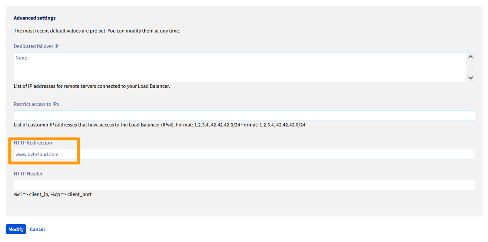

## Objectif

Le service OVH Load Balancer agit par défault comme un mandataire ou "Proxy". Il peut aussi être configuré pour rediriger vos clients vers un site tiers dans le cas d'un changement de nom de domaine ou pour rediriger vos clients en HTTPS par exemple. C'est que l'on appelle la redirection HTTP.

## Prérequis

- Disposer d'un [Load Balancer OVH](https://www.ovh.com/ca/fr/solutions/load-balancer/){.external}.
- Avoir accès :
    - à l'[espace client OVH](https://ca.ovh.com/auth/?action=gotomanager&from=https://www.ovh.com/ca/fr/&ovhSubsidiary=qc){.external}, ou bien
        - à l'[API OVH](https://ca.api.ovh.com/){.external}.

## En pratique

### Présentation

Une redirection HTTP se présente ainsi :

```bash
HTTP/1.1 301 Moved Permanently
Location: http://www.example.org/
Content-Type: text/html
Content-Length: 174
```

Les Redirections personnalisées doivent être de la forme `<scheme>://<net_loc>/<path>;<params>?<query>#<fragment>`. Il n'est possible de spécifier qu'une seule Redirection par Frontend.

Les Redirections personnalisées peuvent être spécifiées via le Manager et via l'API, tant sur un nouveau `Frontend`{.action} qu'un existant.

### Ajouter une redirection personnalisée via le Manager

Il est possible de définir une redirection personnalisée depuis l'[espace client](https://ca.ovh.com/auth/?action=gotomanager&from=https://www.ovh.com/ca/fr/&ovhSubsidiary=qc){.external} dans la partie `Cloud`{.action}, section `Load Balancer`{.action}.
Cela peut-être effectué tant sur un nouveau Frontend pendant sa création, que sur un Frontend existant.

* Ajout d'un nouveau Frontend

Dans la section `Frontends`{.action} de votre Manager, cliquez sur le bouton `Ajouter un frontend`{.action} pour en créer un nouveau.

Dans la page d'édition d'un frontend, sélectionnez le protocole `HTTP`{.action} ou `HTTPS`{.action}.
Configurez les informations normalement.
Il est cependant inutile de préciser la `Ferme par défaut`{.action}, celle-ci ne sera pas utilisée.

Dans les paramètres avancés, renseignez la `Redirection HTTP`{.action}.

* Édition d'un Frontend existant

Dans la section `Frontends`{.action} de votre Manager, sélectionnez le frontend que vous souhaitez éditer.
Pour ce faire, cliquez que le bouton `...`{.action} et sélectionnez `Modifier`{.action} dans le menu apparu.
Assurez vous que le frontend choisi soit bien de  protocole `HTTP` ou `HTTPS`.

Dans la page d'édition du frontend, complétez la configuration du si besoin.
Il est cependant inutile de préciser la `Ferme par défaut`{.action}, celle-ci ne sera pas utilisée.

Dans les paramètres avancés, renseignez la `Redirection HTTP`{.action}.

{.thumbnail}

Une fois le frontend configuré, cliquez sur `Ajouter`{.action} ou `Modifier`{.action} selon que vous configuriez un nouveau frontend, ou un frontend existant.
N'oubliez pas de déployer la configuration.
Pour ce faire, vous pouvez au choix :

- dans la section `Statut`{.action} de la page d'accueil du Manager,
cliquez sur le bouton `...`{.action} de votre Load Balancer,
et sélectionnez `Appliquer la configuration`{.action} ;

- dans le bandeau de rappel du Manager vous précisant que la configuration n'est pas appliquée,
cliquez sur `Appliquer la configuration`{.action}.

{.thumbnail}

### Ajouter une redirection personnalisée via l'API

Dans l'[API OVH](https://ca.api.ovh.com/){.external}, les Redirections sont spécifiées dans la chaîne de caractère redirectLocation :

* création d'un nouveau Frontend

> [!api]
>
> @api {v1} /ipLoadbalancing POST /ipLoadbalancing/{serviceName}/http/frontend
> 

|Paramètre|Signification|
|---|---|
|serviceName|Identifiant de votre service Load Balancer|
|port|Port(s) d'écoute du frontend|
|zone|Zone de déploiement du frontend|
|redirectLocation|URL de redirection HTTP|

* mise à jour d'un Frontend existant

> [!api]
>
> @api {v1} /ipLoadbalancing PUT /ipLoadbalancing/{serviceName}/http/frontend/{frontendId}
> 

|Paramètre|Signification|
|---|---|
|serviceName|Identifiant de votre service Load Balancer|
|frontendId|Identifiant du frontend à metter à jour|
|redirectLocation|URL de redirection HTTP|

Puis appliquer les modifications :

> [!api]
>
> @api {v1} /ipLoadbalancing POST /ipLoadbalancing/{serviceName}/refresh
>

|Paramètre|Signification|
|---|---|
|serviceName|Identifiant de votre service Load Balancer|
|zone|Zone de déploiement du frontend|

## Aller plus loin

Échangez avec notre communauté d'utilisateurs sur <https://community.ovh.com>.
