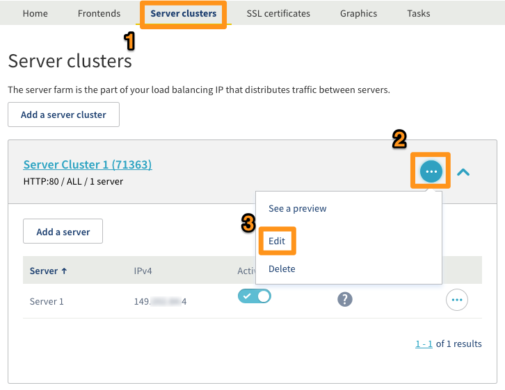
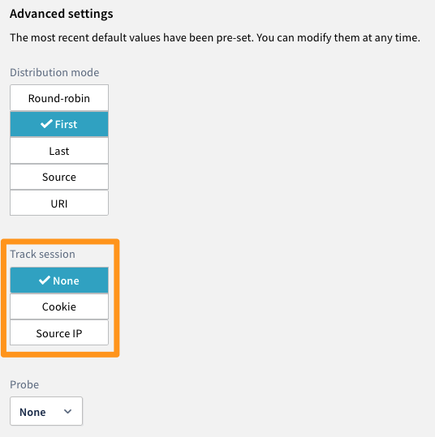

## Objectif

Le service [Load Balancer OVH](https://www.ovh.com/ca/fr/solutions/load-balancer/){.external} offre différents types de suivi de connexion pour vos services.

Chaque session du service OVH Load Balancer est maintenue par un système de persistence de connexion. Ce dernier est configuré au niveau de la couche applicative du service OVH Load Balancer, c'est elle qui assure la persistence de la connexion vers le serveur.

Cette documentation présente différentes façon de configurer cette options pour le Load Balancer OVH.

**Ce guide présente différentes façon de configurer cette option pour le Load Balancer OVH.**

## Prérequis

- Disposer d'un [Load Balancer OVH](https://www.ovh.com/ca/fr/solutions/load-balancer/){.external}.
- Avoir accès :
    - à l'[espace client OVH](https://ca.ovh.com/auth/?action=gotomanager&from=https://www.ovh.com/ca/fr/&ovhSubsidiary=qc){.external}, ou bien
    - à l'[API OVH](https://ca.api.ovh.com/){.external}.

## En pratique

### Les différents types de suivi de connexion

Il existe 2 types principaux de suivi de connexion qui peuvent être configurés avec vos services :

|Suivi de connexion|Détails|
|---|---|
|Cookie|Configure un cookie de session qui sera utilisé pour toujours répartir le trafic d'une même session HTTP vers le même serveur dans la ferme|
|SourceIp|Un algorithme de hash sera appliqué sur l'adresse IP source de la requête reçue par le service OVH Load Balancer.

Les éléments suivants auront un impact sur la redirection de trafic :

- le poids configuré change ;
- un serveur de la ferme se réactive ;
- un serveur de la ferme ne répond plus.

> [!warning]
>
> Après un rafraichissement de votre configuration, les connexions seront re-balancées, vos sessions HTTP seront donc perdues.
> 

### Modifier le mode de suivi de connexion d'une ferme via l'espace client

Pour modifier le suivi de connexion d'une ferme il faut éditer celle-ci en allant dans la section `Ferme de serveurs`{.action} (*1* sur l'impression écran ci-dessous) puis cliquer sur le bouton d'édition `...`{.action} (*2* sur l'impression écran ci-dessous) de la ferme voulue et faire `Modifier`{.action} (*3* sur l'impression écran ci-dessous) :

{.thumbnail}

Dans les `Paramètres avancés` vous aurez accès au `Suivi de session`:

{.thumbnail}

Une fois la ferme configurée, cliquez sur `Ajouter`{.action} ou `Modifier`{.action} selon que vous configuriez une nouvelle ferme, ou une ferme existante.
N'oubliez pas de déployer la configuration.
Pour ce faire, vous pouvez au choix :

- dans la section `Statut`{.action} de la page d'accueil du Manager,
cliquez sur le bouton `...`{.action} de votre Load Balancer,
et sélectionnez `Appliquer la configuration`{.action} ;

- dans le bandeau de rappel du Manager vous précisant que la configuration n'est pas appliquée,
cliquez sur `Appliquer la configuration`{.action}.

{.thumbnail}

### Modifier le mode de suivi de connexion d'une ferme via l'API

#### Voir le détail d'une ferme

Cet appel permet de consulter le détail d'une ferme, connaissant son identifiant. Dans cet exemple, nous allons travailler sur une ferme HTTP.

> [!api]
>
> @api {v1} /ipLoadbalancing GET /ipLoadbalancing/{serviceName}/http/farm/{farmId}
> 

|Paramètre|Signification|
|---|---|
|serviceName\*|Identificant de votre service Load Balancer|
|farmId\*|Identifiant numérique de la ferme|

|Réponse (BackendHttp)|Signification|
|---|---|
|farmId|Identifiant numérique de la ferme|
|balance|Type de répartition actuellement activé sur la ferme|
|zone|Nom de la zone où est configurée la ferme|
|port|Port utilisé pour contacter les serveurs configurés sur la ferme|
|probe|Type de sonde actuellement configurée sur la ferme|
|displayName|Nom donné à cette ferme|
|stickiness|Mode de suivi de connexion actuellement configuré sur la ferme|

#### Modifier le mode de suivi de connexion d'une ferme

Cet appel permet de modifier la configuration d'une ferme, connaissant son identifiant. Dans cet exemple, nous allons travailler sur une ferme HTTP. Pour modifier le mode de suivi de connexion, le champ BackendHttp.stickiness doit être mis à jour avec un mode de suivi de connexion disponible.

> [!api]
>
> @api {v1} /ipLoadbalancing PUT /ipLoadbalancing/{serviceName}/http/farm/{id}
> 

|Paramètre|Signification|
|---|---|
|serviceName\*|Identificant de votre service Load Balancer|
|farmId\*|Identifiant numérique de la ferme|
|BackendHttp.stickiness|Mode de suivi de connexion souhaité pour cette ferme|

#### Appliquer les modifications:

> [!api]
>
> @api {v1} /ipLoadbalancing POST /ipLoadbalancing/{serviceName}/refresh
> 

|Paramètre|Signification|
|---|---|
|serviceName\*|Identificant de votre service Load Balancer|
|zone|Nom de la zone dans laquelle déployer la configuration. "all" ou "rbx" par exemple|

## Aller plus loin

Échangez avec notre communauté d'utilisateurs sur <https://community.ovh.com>.
