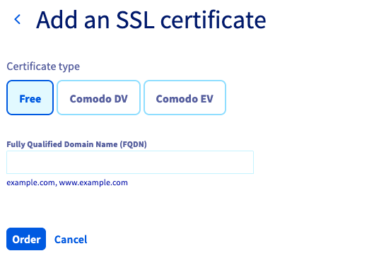

## Presentation
Le service OVH Load Balancer peut être configuré pour prendre en charge la terminaison SSL.

La terminaison SSL a pour but de déchiffrer le flux chiffré entrant avant de le faire suivre vers le service approprié (Serveur web par exemple).

La terminaison SSL a un coût pour le service qui le gère. Plutôt que de laisser vos serveurs la faire, il est possible de configurer votre service OVH Load Balancer pour la faire.

De plus, tous vos certificats sont ainsi centralisés au même endroit et leur maintenance s'en trouve facilitée.

## Configurer le frontend pour la terminaison SSL
La première chose à faire est de configurer votre frontend pour gérer la terminaison SSL.

### Via le Manager
Dans la section `Frontends` de votre Manager, cliquez sur le bouton `Ajouter un frontend`{.action} pour en créer un nouveau. Une fenêtre d'édition apparait alors, selectionnez le protocole `HTTPS`. Il faudra aussi renseigner le champ `Ferme par défaut` ou `Redirection HTTP` dans les paramètres avancés.

{.thumbnail}

Une fois le frontend créé, il vous sera proposé d'`Appliquer la configuration`{.action} pour appliquer vos changements dans la zone concernée.

### Via l'API
Dans l'API, la terminaison SSL est spécifiée par le booléen ssl : (N'oubliez pas de renseigner defaultFarmId ou redirectLocation)

> [!api]
>
> @api {v1} /ipLoadbalancing POST /ipLoadbalancing/{serviceName}/http/frontend
>

Puis appliquer les modifications :

> [!api]
>
> @api {v1} /ipLoadbalancing POST /ipLoadbalancing/{serviceName}/refresh
>

## Commander le certificate SSL gratuit

### Via le Manager
Dans la section `Certificats SSL` de votre Manager, cliquez sur le bouton `Commander un certificat SSL`{.action} pour en créer un nouveau. Une fenêtre d'édition apparait alors avec un champ `FQDN` à renseigner.

{.thumbnail}

### Via l'API
Dans l'API, la commande se fait comme suit. Pour que la commande se finalise, il faut obligatoirement que le nom de domaine choisi pointe vers votre service OVH Load Balancer.

> [!api]
>
> @api {v1} /ipLoadbalancing POST /ipLoadbalancing/{serviceName}/freeCertificate
>

## Suivi de la commande

### Via le Manager
Dans la section `Tâches`{.action} de votre Manager, les tâches relatives à la commandes d'un certificat SSL gratuit correspondent au type `orderFreeCertificate`.

### Via l'API

#### Retourner la liste des taches
Vous pouvez spécifier le type d'action orderFreeCertificate pour affiner la recherche.

> [!api]
>
> @api {v1} /ipLoadbalancing GET /ipLoadbalancing/{serviceName}/task
>

#### Retourner le statut d'une tache en particulier

> [!api]
>
> @api {v1} /ipLoadbalancing GET /ipLoadbalancing/{serviceName}/task/{id}
>

## Livraison du certificat SSL gratuit
Une fois la commande finie, le certificat SSL est automatiquement installé sur votre service OVH Load Balancer.
