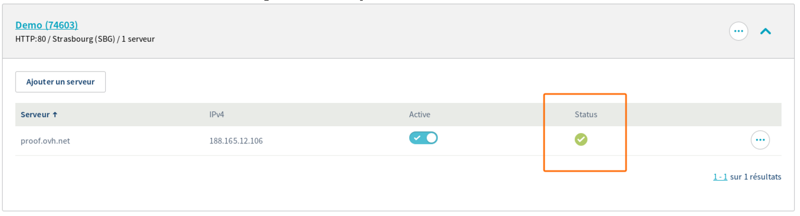

## Presentation
The OVH Load Balancer service acts by default as a proxy. That is to say that it distributes the load (requests) it receives between all the servers of the desired farm.

Each server can be configured for the load balancer to check its status frequently.

Once a server is detected as "down", the load balancer no longer sends any data to it and distributes the load among the remaining servers.

This can be practical in the case of server maintenance: you can take the server out of the farm, perform maintenance and then reintegrate it into the farm.

However, when a server is removed from the farm by the load balancer beyond our control, it can be interesting to know about it and why.

This tutorial explains how to know the health status of each server for each instance of your OVH Load Balancer.

## Retrieve the health status of the servers

### Via API
In the API, server health status is available in the serverState table :

> [!api]
>
> @api {v1} /ipLoadbalancing GET /ipLoadbalancing/{serviceName}/http/farm/{farmId}/server/{serverId}
> 

> [!api]
>
> @api {v1} /ipLoadbalancing GET /ipLoadbalancing/{serviceName}/tcp/farm/{farmId}/server/{serverId}
> 

#### Result

{.thumbnail}

In the picture above, we have the result of the command in the API.

### Via the Manager
In the "Farms" section, after selecting one of them, the status of each of its servers is displayed in the line corresponding to it.

#### Result

{.thumbnail}

In order to obtain details on the health status of a server, simply click on the pictogram in the "Status" column.

{.thumbnail}

### Explanation of the details
As explained previously, we have successfully retrieved the server health status for each instance of your OVH Load Balancer.

For each instance, we have several pieces of information :

|Field|Description|
|---|---|
|Status|Server Status|
|Check code|Probe return code|
|Check status|Probe Status|
|Last check content|Contents of the probe response|
|Check time|Probe execution date|

## Appendix

### Getting the list of instances of your OVH Load Balancer

> [!api]
>
> @api {v1} /ipLoadbalancing GET /ipLoadbalancing/{serviceName}/instancesState
> 
