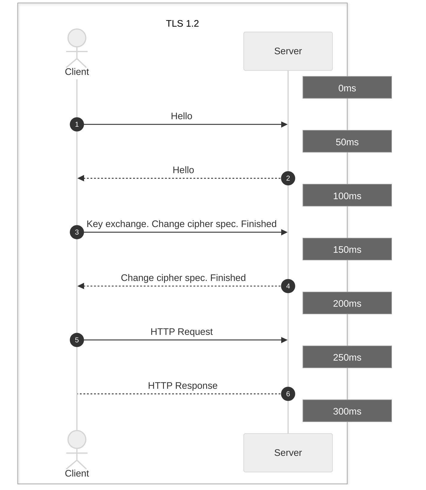
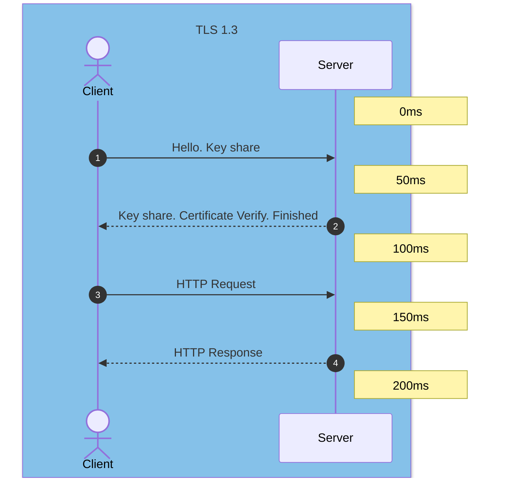

## Objective

The objective of this article is to highlight the key differences between TLS 1.2 and TLS 1.3, two major versions of the transport layer security protocol. We will explore the performance and security improvements brought by TLS 1.3, and how these changes impact secure web browsing.

## Prerequisites

Before delving into the technical details, it is essential to understand the basics of the TLS protocol, its role in securing communications on the Internet, and why it is crucial for online privacy. Prior knowledge of cryptographic protocols and how browsers interact with web servers would also be beneficial.

## In Practice

### Key differences between TLS 1.2 and TLS 1.3

Transport Layer Security (TLS) is a fundamental technology for online privacy. As a cryptographic protocol, TLS encrypts data and authenticates connections when data is transferred over the Internet via HTTP, an extension of the protocol known as HTTPS. When a user visits a website, the browser checks the site for a TLS certificate. If a certificate is present, the browser performs a TLS handshake to verify its validity and authenticate the server. Once a link has been established between the two servers, TLS encryption and SSL decryption enable data to be transported securely.

Since its initial definition in January 1999, TLS has undergone a series of updates. The most recent, TLS 1.3, was published in August 2018. The differences between TLS 1.2 and 1.3 are vast and significant, offering improvements in both performance and security. At the same time, TLS 1.2 remains widely used due to the lack of known vulnerabilities and its continued suitability for enterprise use. The decision of whether or when to move to TLS 1.3 is an open question for many organisations.

#### TLS 1.2 vs TLS 1.3: What are the main differences?

TLS 1.3 offers several improvements over previous versions, including a faster TLS handshake and simpler, more secure cipher suites. Zero Round-Trip Time (0-RTT) key exchanges further simplify the TLS handshake. Together, these changes deliver improved performance and enhanced security.

**A faster TLS handshake**

TLS encryption and SSL decryption require CPU time and add latency to network communications, degrading performance somewhat. Under TLS 1.2, the initial handshake was in clear text, meaning it had to be encrypted and decrypted. Given that a typical handshake involved the exchange of 5 to 7 packets between the client and server, this added considerable overhead to the connection. In version 1.3, server certificate encryption has been adopted by default, allowing a TLS handshake to be performed with 0 to 3 packets, reducing or eliminating this overhead and enabling faster, more responsive connections.

**Simpler and stronger encryption leaks**

In addition to reducing the number of packets to be exchanged during the TLS handshake, version 1.3 has also reduced the size of the cipher suites used for encryption. In TLS 1.2 and previous versions, the use of ciphers with cryptographic weaknesses posed potential security vulnerabilities. TLS 1.3 only supports algorithms that currently have no known vulnerabilities, including those that do not support perfect forward secrecy (PFS). The update has also removed the ability to perform a "renegotiation", where a client and server with an existing TLS connection can negotiate new parameters and generate new keys, a feature that can increase risk.

**Zero Round-Trip Time (0-RTT)**

As with SSL, TLS relies on key exchanges to establish a secure session. In previous versions, keys could be exchanged during the handshake using one of two mechanisms: a static RSA key or a Diffie-Hellman key. In TLS 1.3, RSA has been removed, as have all static (non-PFS) key exchanges, while still retaining ephemeral Diffie-Hellman keys. As well as eliminating the security risk posed by a static key, which can compromise security if accessed illegally, relying exclusively on the Diffie-Hellman family allows the client to send the randoms and inputs required for key generation during its 'hello'. By eliminating a full round trip on the handshake, this saves time and improves overall site performance. In addition, when accessing a previously visited site, a client can send data on the first message to the server using pre-shared keys (PSKs) from the previous session, hence the term "zero round-trip time" (0-RTT).

## Going further

Exchange with our community of users on <https://community.ovh.com>.