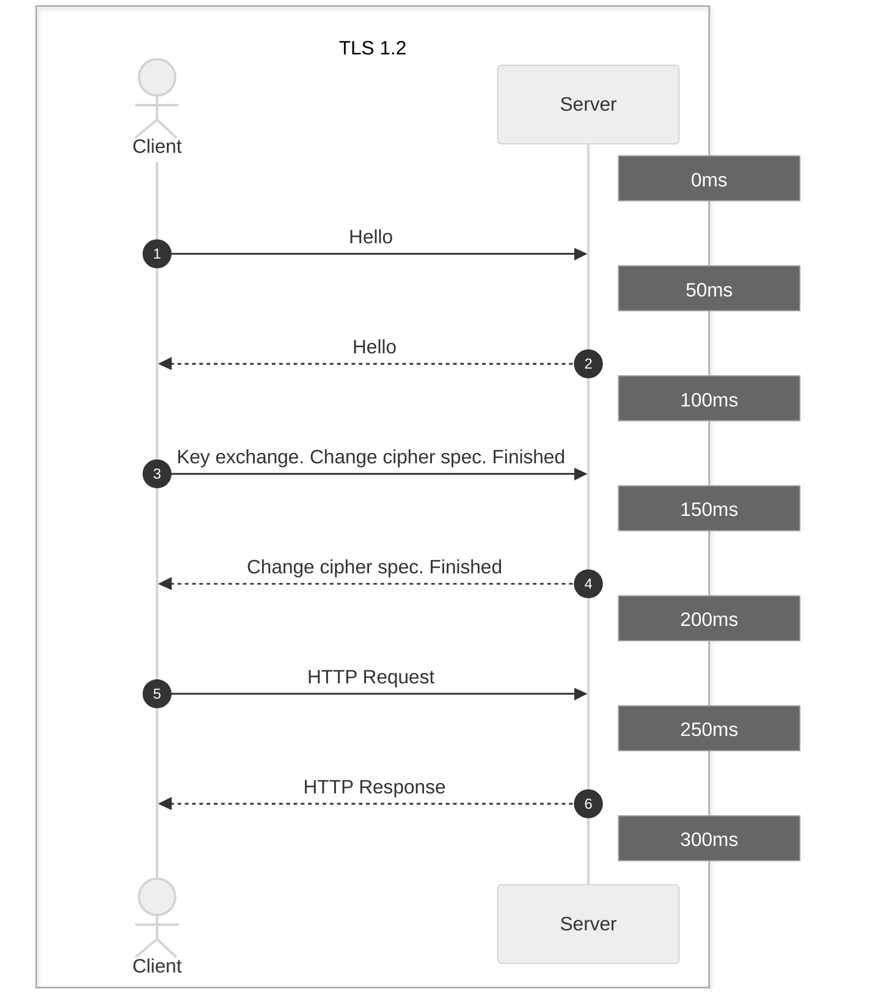
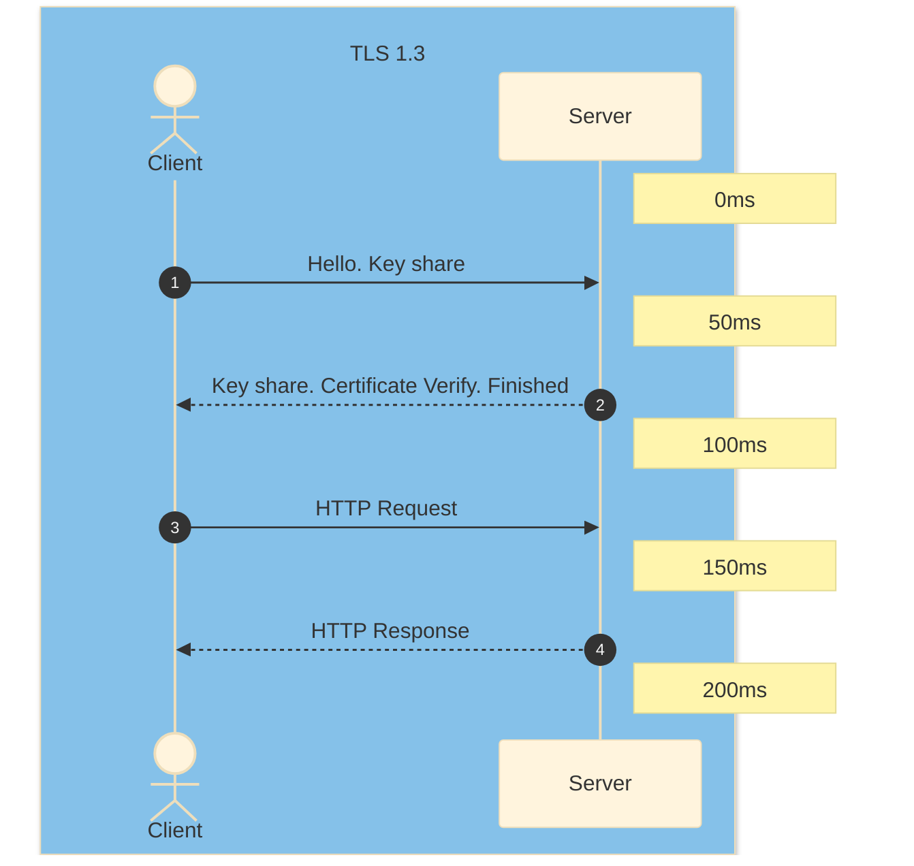

## Objectif

L'objectif de cet article est de mettre en lumière les différences clés entre TLS 1.2 et TLS 1.3, deux versions majeures du protocole de sécurité de la couche de transport. Nous explorerons les améliorations apportées par TLS 1.3 en termes de performance et de sécurité, et comment ces changements impactent la navigation sécurisée sur le web.

## Prérequis

Avant de plonger dans les détails techniques, il est essentiel de comprendre les bases du protocole TLS, son rôle dans la sécurisation des communications sur Internet, et pourquoi il est crucial pour la confidentialité en ligne. Une connaissance préalable des protocoles cryptographiques et de la manière dont les navigateurs interagissent avec les serveurs web serait également bénéfique.

## En pratique

### Différences Clés Entre TLS 1.2 et TLS 1.3

La sécurité de la couche de transport (TLS) est une technologie fondamentale pour la confidentialité en ligne. En tant que protocole cryptographique, TLS crypte les données et authentifie les connexions lors du transfert des données sur Internet via HTTP, une extension du protocole connue sous le nom de HTTPS. Lorsqu'un utilisateur visite un site Web, son navigateur vérifie la présence d'un certificat TLS sur le site. Si un certificat est présent, le navigateur effectue une poignée de main TLS pour vérifier sa validité et authentifier le serveur. Une fois qu'un lien a été établi entre les deux serveurs, le cryptage TLS et le décryptage SSL permettent un transport sécurisé des données.

Depuis sa définition initiale en janvier 1999, TLS a subi une série de mises à jour. La plus récente, TLS 1.3, a été publiée en août 2018. Les différences entre TLS 1.2 et 1.3 sont vastes et significatives, offrant des améliorations à la fois en termes de performance et de sécurité. En même temps, TLS 1.2 reste largement utilisé en raison de l'absence de vulnérabilités connues et de son adéquation continue pour une utilisation en entreprise. La décision de savoir si ou quand passer à TLS 1.3 est une question ouverte pour de nombreuses organisations.

#### TLS 1.2 vs TLS 1.3 : Quelles sont les principales différences ?

TLS 1.3 offre plusieurs améliorations par rapport aux versions précédentes, notamment une poignée de main TLS plus rapide et des suites de chiffrement plus simples et plus sécurisées. Les échanges de clés Zero Round-Trip Time (0-RTT) simplifient davantage la poignée de main TLS. Ensemble, ces changements offrent de meilleures performances et une sécurité renforcée.

**Une poignée de main TLS plus rapide**

Le cryptage TLS et le décryptage SSL nécessitent du temps CPU et ajoutent une latence aux communications réseau, dégradant quelque peu les performances. Sous TLS 1.2, la poignée de main initiale était effectuée en texte clair, ce qui signifie qu'elle devait être cryptée et décryptée. Étant donné qu'une poignée de main typique impliquait l'échange de 5 à 7 paquets entre le client et le serveur, cela ajoutait une surcharge considérable à la connexion. Sous la version 1.3, le cryptage du certificat serveur a été adopté par défaut, permettant d'effectuer une poignée de main TLS avec 0 à 3 paquets, réduisant ou éliminant cette surcharge et permettant des connexions plus rapides et plus réactives.

**Suites de chiffrement plus simples et plus fortes**

En plus de réduire le nombre de paquets à échanger pendant la poignée de main TLS, la version 1.3 a également réduit la taille des suites de chiffrement utilisées pour le cryptage. Dans TLS 1.2 et les versions précédentes, l'utilisation de chiffrements avec des faiblesses cryptographiques posait des vulnérabilités de sécurité potentielles. TLS 1.3 ne prend en charge que les algorithmes qui n'ont actuellement aucune vulnérabilité connue, y compris ceux qui ne prennent pas en charge la confidentialité parfaite vers l'avant (PFS). La mise à jour a également supprimé la possibilité d'effectuer une « renégociation », où un client et un serveur ayant déjà une connexion TLS peuvent négocier de nouveaux paramètres et générer de nouvelles clés, une fonction qui peut augmenter le risque.

**Zero Round-Trip Time (0-RTT)**

Comme avec SSL, TLS repose sur des échanges de clés pour établir une session sécurisée. Dans les versions précédentes, les clés pouvaient être échangées pendant la poignée de main en utilisant l'un des deux mécanismes : une clé RSA statique ou une clé Diffie-Hellman. Dans TLS 1.3, RSA a été supprimé, ainsi que tous les échanges de clés statiques (non-PFS), tout en conservant les clés Diffie-Hellman éphémères. En plus d'éliminer le risque de sécurité posé par une clé statique, qui peut compromettre la sécurité si elle est accédée illégalement, le fait de s'appuyer exclusivement sur la famille Diffie-Hellman permet au client d'envoyer les aléatoires et les entrées nécessaires à la génération de clés pendant son « bonjour ». En éliminant un aller-retour complet sur la poignée de main, cela économise du temps et améliore les performances globales du site. De plus, lors de l'accès à un site déjà visité précédemment, un client peut envoyer des données sur le premier message au serveur en utilisant des clés pré-partagées (PSK) de la session précédente, d'où le terme « zero round-trip time » (0-RTT).

## Aller plus loin

Échangez avec notre communauté d'utilisateurs sur <https://community.ovh.com>.