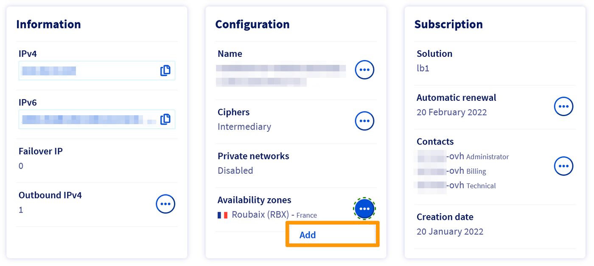
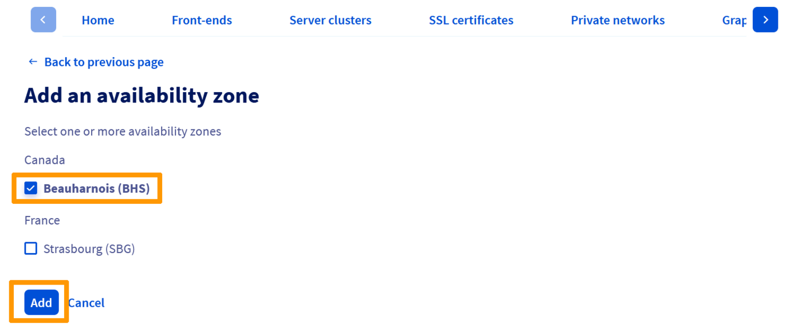
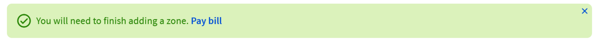
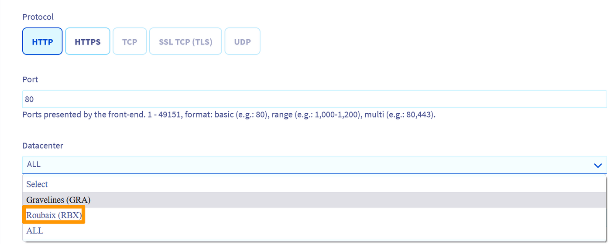
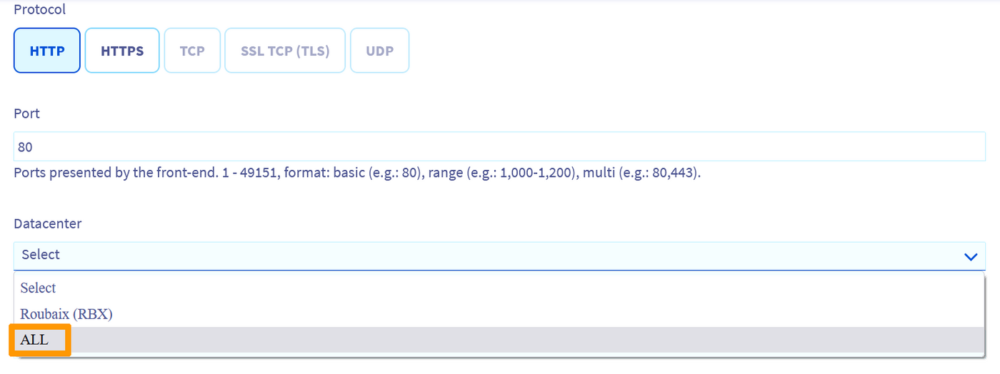

## Objectif

Le service OVHcloud Load Balancer est localisé dans une ou plusieurs zone(s) de disponibilité, définie(s) lors de la souscription au service.

Vous pouvez commander des zones supplémentaires pour votre service.
Vous augmentez ainsi la disponibilité de votre service Load Balancer en cas d'indisponibilité d'une zone.

Via une configuration adéquate, vous pouvez également utiliser plusieurs zones afin de minimiser la latence pour vos visiteurs.

**Découvrez comment commander et gérer des zones supplémentaires.**

## Prérequis

- Posséder une offre [OVHcloud Load balancer](https://www.ovh.com/fr/solutions/load-balancer/) dans votre compte OVHcloud.
- Être connecté à votre [espace client OVHcloud](https://www.ovh.com/auth/?action=gotomanager&from=https://www.ovh.com/fr/&ovhSubsidiary=fr).
- Être connecté à l'[API OVHcloud](https://api.ovh.com/).

## En pratique

### Commander une zone supplémentaire

#### Depuis l'espace client OVHcloud

Vous pouvez commander une zone supplémentaire depuis l'[espace client OVHcloud](https://www.ovh.com/auth/?action=gotomanager&from=https://www.ovh.com/fr/&ovhSubsidiary=fr) dans la partie `Bare Metal Cloud`{.action}, puis `Load Balancer`{.action}.

Sélectionnez votre Load Balancer puis, dans l'onglet `Accueil`{.action} et le menu `Configuration`{.action}, cliquez sur `Ajouter`{.action} dans la partie « Zones de disponibilité ».

{.thumbnail}

Sélectionnez alors le(s) zone(s) que vous souhaitez commander et cliquez sur `Ajouter`{.action}.
 
{.thumbnail}

Un bon de commande est généré, il vous faudra le régler.

{.thumbnail}

#### Depuis l'API OVHcloud

Pour commander une zone via l'API, vous devez tout d'abord créer un panier (*cart*)

> [!api]
>
> @api {v1} /order POST /order/cart
>

Veuillez noter le numéro du panier (*cart*), il vous sera utile pour la suite.

Assignez-vous le panier via l'appel suivant :

> [!api]
>
> @api {v1} /order POST /order/cart/{cartId}/assign
>

Vous pouvez lister les options disponibles sur votre service Load Balancer via :

> [!api]
>
> @api {v1} /order GET /order/cartServiceOption/ipLoadbalancing/{serviceName}
>

Quand vous avez trouvé l'option correspondant à la zone souhaitée, vous pouvez l'ajouter à votre panier (*cart*) via :

> [!api]
>
> @api {v1} /order POST /order/cartServiceOption/ipLoadbalancing/{serviceName}
>

Enfin, vous pouvez valider votre panier (*cart*) via :

> [!api]
> @api {v1} /order POST /order/cart/{cartId}/checkout
>

N'oubliez pas de régler le bon de commande ainsi généré.

### Ajouter une zone

Une fois que la commande de votre zone est finalisée, vous pouvez l'ajouter depuis votre espace client OVHcloud.

Sélectionnez le Load Balancer que vous souhaitez modifier puis créez un nouveau frontend, ou éditez-en un existant, via l'onglet `Frontends`{.action}

Dans le champ `Datacenter`{.action}, choisissez la zone que vous souhaitez associer à votre frontend.

{.thumbnail}

Une fois le frontend configuré, cliquez sur `Ajouter`{.action} ou `Modifier`{.action} selon que vous configurez un nouveau frontend ou un frontend existant.

N'oubliez pas de déployer la configuration. Pour ce faire, dans le bandeau de rappel vous précisant que la configuration n'est pas appliquée, cliquez sur `Appliquer la configuration`{.action}.

{.thumbnail}

### Utiliser plusieurs zones

#### Pour la haute disponibilité

Si vous voulez utiliser plusieurs zones afin d'obtenir une haute disponibilité, vous pouvez utiliser la valeur `Tous (ALL)` lorsque vous déclarez un frontend ou une ferme de serveurs.

{.thumbnail}

Cette valeur spéciale `Tous (ALL)` va permettre de déployer la même configuration sur toutes les zones souscrites sur votre service Load Balancer, et vous évite de dupliquer la configuration pour toutes les zones.

#### Pour réduire la latence

Si le but est de réduire la latence, vous pouvez diriger les requêtes venant depuis le load balancer de la zone1 vers des serveurs backends proches géographiquement de cette zone1. 
De façon similaire, vous pouvez diriger les requêtes venant depuis le load balancer de la zone2 vers des serveurs backends proches de la zone2.

Afin de réaliser cela, il vous faut spécifier un frontend dans chaque zone qui utilise une ferme dans la même zone. 
Cela va vous permettre de déclarer les serveurs backends dans des fermes différentes par zone et de contrôler les serveurs backends utilisés en fonction de la zone.

{.thumbnail}

Par exemple, si vous avez des serveurs backends dans les datacentres de Gravelines (gra) et Beauharnois (bhs),
vous pouvez commander un service Load Balancer dans les zones `gra` et `bhs` et configurer :

- un frontend dans la zone gra avec une ferme (farm) par défaut dans la zone gra qui contient des serveurs dans le datacentre de Gravelines;
- un frontend dans la zone bhs avec une ferme (farm) par défaut dans la zone bhs qui contient des serveurs dans le datacentre de Beauharnois.

## Aller plus loin

Échangez avec notre communauté d'utilisateurs sur <https://community.ovh.com>.
