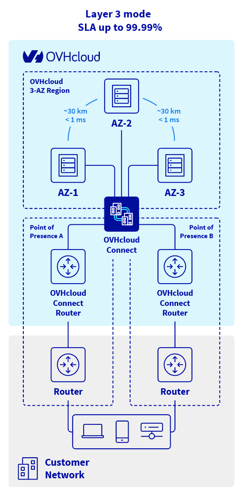

## Objective

**Multi-AZ (Multiple Availability Zones)** is an architecture strategy where your resources and network connections are distributed across two or more physically separated data centres (Availability Zones) within a region. This protects against the failure of a single site.

## Why Multi-AZ matters for OVHcloud Connect

A single OVHcloud Connect link through a single PoP is a **single point of failure**. If that PoP, the cross-connect, or the physical link experiences an outage, your private connectivity is lost.

Multi-AZ designs address this by establishing **redundant connections through different PoPs or Availability Zones**, so that traffic can automatically reroute if one path fails.

## Architecture Overview

## How Multi-AZ works with OVHcloud Connect

1. **Order two OVHcloud Connect services** in two **different PoPs**.
2. **Configure BGP on both links** with appropriate route priorities (using BGP attributes like Local Preference, MED, or AS-path prepending) so that traffic prefers one path but can fall back to the other.
3. **Distribute your OVHcloud resources** across multiple Availability Zones within the same region.
4. **Test failover** by simulating a link outage and verifying that traffic switches to the backup path.

## Multi-AZ and BGP configuration

For automatic failover, your BGP configuration must distinguish between the primary and backup paths. Common approaches:

- **Local Preference** — Set a higher Local Preference on routes learned from the primary link.
- **AS-path prepending** — Make the backup path's AS-path longer so it is less preferred.
- **MED (Multi-Exit Discriminator)** — Use MED values to influence inbound routing from OVHcloud.

See [Configure OCC L3 with BGP](../3.7_occ_l3_bgp/guide.en-gb.md) for detailed configuration guidance.

## When to use Multi-AZ

| Scenario | Recommendation |
|---|---|
| Test / development workloads | Single connection is usually sufficient |
| Non-critical production | Single connection with monitoring |
| Business-critical production | **Multi-AZ recommended** |
| Regulated / compliance workloads | **Multi-AZ required** |

## What's next?

- Learn about [SLAs](../1.7_slas/guide.en-gb.md) and how Multi-AZ affects your uptime guarantees
- See the [AZ configuration guide](../3.6_vrack_network_setup/guide.en-gb.md) to set up subnets across zones
- Explore [resilient architecture tutorials](../4.2_resilient/4.1.2_onprem_resilient/guide.en-gb.md) for step-by-step examples

## Go further

If you would like training or technical assistance for the implementation of our solutions, contact your sales representative or click [this link](/links/professional-services) to get a quote and request a personalized analysis of your project from our Professional Services team experts.

Join our [community of users](/links/community).
