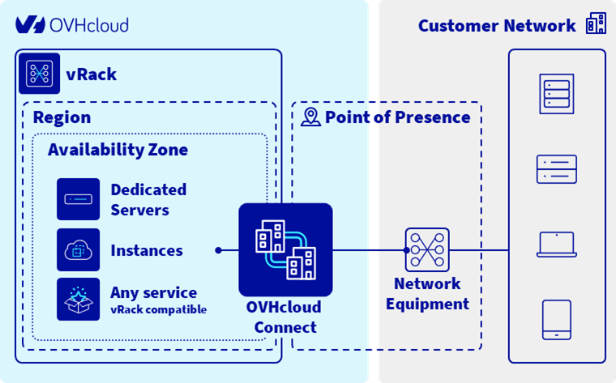

# What is OVHcloud Connect?

OVHcloud Connect is a **dedicated, private network connection** between your infrastructure and OVHcloud. Instead of routing traffic over the public internet, OVHcloud Connect establishes a direct link that offers better security, lower latency, and guaranteed bandwidth.

## Who is it for?

OVHcloud Connect is designed for organisations that need:

- **Reliable connectivity** for business-critical applications (ERP, databases, backups)
- **Enhanced security** by keeping traffic off the public internet
- **Predictable performance** with dedicated bandwidth (no shared bottlenecks)
- **Multi-cloud or hybrid-cloud** architectures connecting on-premises data centres, AWS, Azure, GCP, or WAN networks to OVHcloud

## How does it work?

OVHcloud Connect links your network to OVHcloud through a **Point of Presence (PoP)** — a physical location where OVHcloud has networking equipment. You can establish this link in two ways:

| Connection type | How it works | Best for |
|---|---|---|
| **OVHcloud Connect Direct** | You manage a physical cable (cross-connect) between your equipment and OVHcloud's equipment in a common Point of Presence. | Organisations already present in an OVHcloud PoP data centre. |
| **OVHcloud Connect Provider** | A third-party network provider (e.g. Megaport, Equinix Fabric, Console Connect) handles the physical connection on your behalf. | Organisations that are not co-located with OVHcloud or prefer a managed connectivity service. |

### Layer 2 (L2) service - OVHcloud Connect Direct only

OVHcloud Connect L2 links your infrastructure to OVHcloud services at the data link layer (Layer 2). It allows you to extend your private network to OVHcloud datacenters, creating a seamless bridge between your local network and cloud resources, no routing involved. As opposed to Layer 3 service, it is transparent to VLANs (802.1q).

### Layer 3 (L3) service

OVHcloud Connect L3 links your infrastructure to OVHcloud services at the network layer (Layer 3). It allows routing and requires routes exchange.

Once the physical link is established, routing is configured using **BGP (Border Gateway Protocol)**, and the connection is associated with your **vRack** — OVHcloud's virtual private network — so your OVHcloud resources can communicate privately with your external infrastructure.

## Architecture overview

## Key benefits

- **Security** — Traffic stays on a private link, reducing exposure to internet-based threats.
- **Performance** — Dedicated bandwidth means no congestion from other users.
- **Reliability** — SLA-backed uptime with options for redundant, multi-path architectures.
- **Flexibility** — Works with on-premises, WAN, and major public cloud providers (AWS, Azure, GCP).
- **Integration** — Connects seamlessly with OVHcloud's vRack private networking and all vRack-compatible services (Bare Metal, Hosted Private Cloud, Public Cloud).

## What's next?

- Review the [Glossary](../1.2_glossary/guide.en-gb.md) to understand key terms
- See the list of [Providers](../1.3_providers/guide.en-gb.md) available for managed connectivity
- Jump to the [Quick Start guides: Direct](../2.1_quick_start_direct/guide.en-gb.md) to get connected
- Jump to the [Quick Start guides: Provider](../2.1_quick_start_direct/guide.en-gb.md) to get connected
