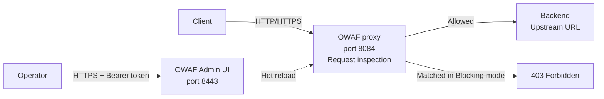

## Objective

The OVHcloud Web Application Firewall is an HTTP/HTTPS inspection layer designed to sit in front of your backend applications and stop common web attacks before they reach your origin. This guide introduces the product, summarises what it can do today during the closed alpha, and shows where it fits in a typical request path.

**This guide explains how to understand what the OVHcloud Web Application Firewall is, what it protects against, and how it is operated during the alpha programme.**

> [!warning]
>
> The OVHcloud Web Application Firewall is currently in **closed alpha**. The feature set, limits, and Admin UI described in this guide may change before general availability. Access is granted on a case-by-case basis via the [OVHcloud Labs](https://labs.ovhcloud.com/en/) page.

## What the OVHcloud Web Application Firewall is

The OVHcloud Web Application Firewall is a high-performance Web Application Firewall built by OVHcloud. It is designed as a multi-tenant service, although during the alpha programme each instance hosts a single tenant and multi-tenancy is on the general availability roadmap. It inspects, filters, and blocks malicious HTTP/HTTPS traffic before it reaches your backend, with no code changes required on the protected application. Its rules engine is based on the **OWASP Core Rule Set (CRS)** and covers the most common web attack vectors. It is operated through the **OVHcloud Web Application Firewall** Admin UI (OWAF Admin UI), a web console where you configure rules, tune the engine, define proxy behaviour, and monitor live traffic in real time.

## Capabilities

The OVHcloud Web Application Firewall covers the following capabilities during the alpha:

- **Full request inspection** of inbound HTTP/HTTPS traffic, including headers, body, URI, cookies, and query parameters.
- **OWASP Core Rule Set coverage** with 900+ built-in rules detecting SQL injection (SQLi), cross-site scripting (XSS), remote code execution (RCE), local file inclusion (LFI), server-side template injection (SSTI), scanner detection, and other common attack categories.
- **Custom rules** authored from the Admin UI using regular expressions, exact match, IP match, comparison operators, or the built-in SQLi and XSS detectors.
- **Three operating modes** — **Blocking** (matched requests receive a `403 Forbidden`), **Detection** (rules are evaluated and logged but traffic is allowed through), and **Disabled** (traffic is forwarded without inspection).
- **Anomaly scoring** that aggregates the scores of all matching rules and blocks the request only when the total reaches the configured threshold, which helps reduce false positives.
- **Paranoia Levels 1 to 4** (Basic, Standard, Strict, Paranoid) to tune how aggressively the engine flags suspicious traffic.
- **Request header manipulation** on the proxy path, including `Set value`, `Remove`, `Move to`, and `Copy to` actions for transforming headers before they reach the backend.
- **CORS handling**, with injection of CORS response headers on every response (including block pages) and an optional OPTIONS preflight passthrough that answers preflights with `204 No Content`.
- **Live statistics** in the Admin UI, including total requests, blocked counts, pass rate, active connections, per-category breakdowns, and uptime.
- **Hot reload** of all configuration changes, applied immediately without restarting the WAF.

## How it works

The OVHcloud Web Application Firewall is deployed as an inline reverse proxy. Client traffic is sent to the WAF instance on port `8084`, where each request is inspected against the active rule set and scored against the anomaly threshold. Requests that pass the inspection are forwarded to the backend defined as the **Upstream URL** on the **Proxy** page; requests that exceed the threshold in **Blocking** mode are rejected with a `403 Forbidden` response. Operators configure the engine and view live metrics through the OWAF Admin UI on port `8443`, which is fully independent from the data path.

## Use cases

The OVHcloud Web Application Firewall fits a range of protection scenarios. The table below reproduces the use cases supported during the alpha.

| Use case | How the OVHcloud Web Application Firewall helps |
|---|---|
| Protect a public API | Block SQLi, XSS, and RCE attempts targeting API endpoints. Use path-prefix rules to apply stricter policies to sensitive routes such as `/admin/`. |
| Protect a web application | Enable Blocking mode with Paranoia Level 1 for broad coverage with minimal false positives. Tune up to Paranoia Levels 2 to 3 for higher-risk applications. |
| Pre-production security testing | Run in Detection mode to see what would be blocked without impacting users. Review the **Stats** dashboard to identify noisy rules before going live. |
| Credential and token rotation | Use the **Proxy** request header rules to rotate service tokens transparently — strip the client's `Authorization` header and inject a backend service token. |
| IP allowlisting and blocklisting | Create custom rules using the `ipmatch` operator on `REMOTE_ADDR` to allow trusted IPs or block known malicious ranges. |
| Bot and scraper mitigation | Create custom rules matching user-agent strings or suspicious request patterns to block automated traffic. |
| Multi-layer defence | Deploy the WAF in front of an existing load balancer or CDN as an additional inspection layer, without changing your existing infrastructure. |

## Variants and availability

During the alpha programme there is a single tier of the OVHcloud Web Application Firewall. Each instance hosts a single tenant, runs on a single node, and is provisioned by the OVHcloud team during onboarding. You receive an instance address of the form `https://<instance>:8443/control-plane` for the OWAF Admin UI together with a Bearer token. Multi-tenancy, high availability, API rate limiting, and persistent rules save are explicitly planned for general availability and are not part of the alpha.

## Considerations and limitations

The alpha release applies several constraints that you should be aware of before evaluating the OVHcloud Web Application Firewall for a given workload. Programmatic configuration through an OVHcloud API or a Terraform resource is not part of the alpha — all configuration is performed in the OWAF Admin UI.

> [!primary]
>
> For the full list of prerequisites, supported browsers, network requirements, and the inspected request body size cap, see the [Prerequisites and alpha limitations](../1.3_prerequisites_and_limitations/guide.en-gb.md) guide and the [OVHcloud Web Application Firewall limits](../ovhcloud_waf-limits/guide.en-gb.md) reference.

## Go further

- [Glossary](../1.2_glossary/guide.en-gb.md)
- [Prerequisites and alpha limitations](../1.3_prerequisites_and_limitations/guide.en-gb.md)
- [Quick start](../2.1_quickstart/guide.en-gb.md)
- [Request access to the alpha](../3.1_request_alpha_access/guide.en-gb.md)

Join our [community of users](/links/community).
