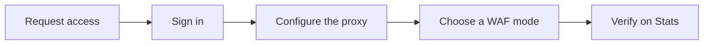

## Objective

The OVHcloud Web Application Firewall (OWAF) inspects HTTP and HTTPS traffic before it reaches your backend, applies the OWASP Core Rule Set together with any custom rules you define, and either blocks or logs requests that look malicious. This quick start walks through the shortest path from "no protection" to "WAF in front of my application", from requesting alpha access to verifying that a test request appears on the **Stats** page. Deeper detail for each step lives in the dedicated how-to guides linked at the end of every section.

**This guide explains how to deploy the OVHcloud Web Application Firewall in front of a web application end-to-end during the closed alpha.**

> [!warning]
>
> The OVHcloud Web Application Firewall is currently in **closed alpha**. The feature set, limits, and Admin UI described in this guide may change before general availability. Access is granted on a case-by-case basis via the [OVHcloud Labs](https://labs.ovhcloud.com/en/) page.

## Requirements

- A web application reachable over HTTP or HTTPS
- An [OVHcloud account](/links/manager)
- The Bearer token and instance URL provided by OVHcloud after alpha approval (see [Request access to the alpha](../3.1_request_alpha_access/guide.en-gb.md))
- Network access from your operator workstation to the instance on port `8443` (the OVHcloud Web Application Firewall Admin UI, hereafter the **OWAF Admin UI**)
- The ability to direct end-user traffic to the OWAF instance on port `8084` (via DNS, an existing load balancer, or a CDN origin override)
- A modern browser (Chrome, Firefox, Edge, or Safari — latest two versions)

## Steps overview

The quick start follows five steps in order. You request access to the alpha, sign in to the OWAF Admin UI with the Bearer token issued by OVHcloud, point the proxy at your backend, choose a WAF mode (start in Detection), and verify that traffic is processed on the **Stats** page before switching to Blocking.

## Instructions

### Step 1 — Request access to the alpha

The OVHcloud Web Application Firewall is granted on a case-by-case basis through the [OVHcloud Labs](https://labs.ovhcloud.com/en/) page. Submit your OVHcloud NIC handle (customer ID), a brief description of your use case, and the URL of the application you want to protect. Once your request is approved, the OVHcloud team sends you the OWAF instance URL (in the form `https://<instance>:8443/control-plane`) and a Bearer token to authenticate to the Admin UI.

For detailed steps, see [Request access to the alpha](../3.1_request_alpha_access/guide.en-gb.md).

### Step 2 — Sign in to the OWAF Admin UI

1. Open `https://<instance>:8443/control-plane` in your browser.
2. Paste your Bearer token in the login field (with or without the `Bearer ` prefix).
3. Click `Sign in`{.action}.

After a successful sign-in, the OWAF Admin UI opens on the **Rules** page by default.

<!-- DRAFT: To screenshot — capture the OWAF Admin UI sign-in screen with the Bearer token field visible -->
{.thumbnail}

For detailed steps, see [Sign in to the OWAF Admin UI](../3.2_sign_in_to_admin_ui/guide.en-gb.md).

### Step 3 — Configure the proxy

1. Go to the **Proxy** page.
2. Set the **Upstream URL** to your backend (must start with `http://` or `https://`).
3. Decide whether to enable **Preserve Host header** — enable it when your backend routes by Host header (virtual hosting); leave it disabled when the Upstream URL already points at the correct site.
4. Click `Save Changes`{.action}. The proxy reloads immediately.

From this point on, any traffic you direct to the OVHcloud Web Application Firewall instance on port `8084` is forwarded to the Upstream URL after inspection.

<!-- DRAFT: To screenshot — capture the Proxy page showing the Upstream URL field and the Preserve Host header checkbox -->
{.thumbnail}

For detailed steps, see [Configure the proxy and Upstream URL](../3.3_configure_proxy/guide.en-gb.md).

### Step 4 — Choose a WAF mode and start in Detection

1. Go to the **Configuration** page.
2. Set **WAF Mode** to `Detection` (rules are evaluated and logged, but no traffic is blocked).
3. Leave **Paranoia Level** at `Basic` (PL 1) and **Anomaly Threshold** at `5` to begin with.
4. Click `Save Changes`{.action}.

> [!primary]
>
> Stay in Detection mode for 24 to 48 hours so you can review the **Stats** page for false positives before switching to Blocking.

<!-- DRAFT: To screenshot — capture the Configuration page showing WAF Mode set to Detection, Paranoia Level at Basic, and Anomaly Threshold at 5 -->
{.thumbnail}

For detailed steps, see [Configure WAF mode, Paranoia Level and Anomaly Threshold](../3.4_configure_waf_mode_and_paranoia/guide.en-gb.md).

### Step 5 — Verify and switch to Blocking

1. Send a known-bad test request to the OWAF instance — for example, request `https://<your-app>/?param=' OR 1=1--` to trigger an SQL-injection rule.
2. Open the **Stats** page. The request should appear in the "Blocked Requests by Category" chart under `SqlInjection` (in Blocking mode) or be logged (in Detection mode).
3. Once you have reviewed at least one false-positive-free day in Detection, go back to **Configuration**, set **WAF Mode** to `Blocking`, and click `Save Changes`{.action}.

<!-- DRAFT: To screenshot — capture the Stats page after a test SQL-injection request, showing the SqlInjection bar on "Blocked Requests by Category" -->
{.thumbnail}

For ongoing operation, see [Monitor the OVHcloud Web Application Firewall](../3.9_monitor/guide.en-gb.md).

## Verify

Use the table below to confirm that the OVHcloud Web Application Firewall is correctly deployed.

| Check | How |
|---|---|
| You can sign in | The OWAF Admin UI **Rules** page loads after you paste the Bearer token and click `Sign in`{.action} |
| Your Upstream URL is set | Visible on the **Proxy** page; saving shows a confirmation and the value persists on reload |
| WAF Mode is Detection (or Blocking) | Visible on the **Configuration** page and on the **Stats** `WAF MODE` summary card |
| Built-in rules are active | The **Rules** page shows a non-zero "active rules" count; the **ACTIVE RULES** card on **Stats** matches |
| A test request is observed | The **Stats** page shows the request in the per-category chart within `15 seconds` |

## Troubleshooting

The table below covers the most common issues encountered during the quick start. For a full diagnostic walkthrough, see the troubleshooting guide linked below the table.

| Issue | What to check | Where to find it |
|---|---|---|
| Cannot sign in | Bearer token value, instance URL, and reachability of port `8443` from your workstation | Section 5 of the README; [Troubleshooting the OVHcloud WAF](../1.5_troubleshooting/guide.en-gb.md) |
| Backend not receiving traffic | Upstream URL set on **Proxy**; end-user DNS or load balancer points to the OWAF instance on port `8084`; **WAF Mode** is not `Disabled` | **Proxy** page |
| Legitimate traffic blocked | Lower the **Paranoia Level**, raise the **Anomaly Threshold**, or change the offending rule's action from `block` to `log` | **Configuration** page and **Rules** page |
| CORS preflight blocked | Enable **OPTIONS preflight passthrough** so the OVHcloud Web Application Firewall answers `OPTIONS` with `204 No Content` without inspection | **Proxy** page |
| Stats not updating | Click `Refresh`{.action} manually; if the page still does not update, sign out and sign in again | **Stats** page |

For a full diagnostic walkthrough, see [Troubleshooting the OVHcloud WAF](../1.5_troubleshooting/guide.en-gb.md).

## Go further

- [Security best practices](../1.4_security_best_practices/guide.en-gb.md)
- [Manage built-in OWASP CRS rules](../3.5_manage_built_in_rules/guide.en-gb.md)
- [Create, edit, and delete custom rules](../3.6_create_custom_rule/guide.en-gb.md)
- [Monitor the OVHcloud Web Application Firewall](../3.9_monitor/guide.en-gb.md)

Join our [community of users](/links/community).
