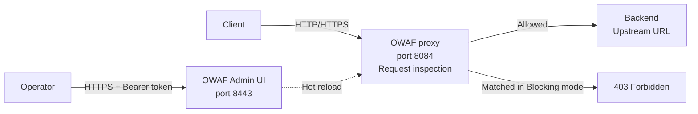

## Objective

This guide presents the capabilities and walks you through the end-to-end setup of the OVHcloud Web Application Firewall (OWAF) during the alpha programme, from requesting access to applying custom rules and monitoring live traffic. It also describes the most common configuration scenarios and best practices.

> [!warning]
>
> **Important**: The OVHcloud Web Application Firewall is currently in **closed alpha**. The feature set, limits, and Admin UI described in this guide may change before general availability. Access is granted on a case-by-case basis via the [OVHcloud Labs](https://labs.ovhcloud.com/en/) page.
>

## Requirements

- An active [OVHcloud account](/links/manager)
- Approved access to the OVHcloud Web Application Firewall alpha programme (see [Step 1: Join the alpha](#step-1-join-the-alpha))
- A **Bearer token** issued by OVHcloud during onboarding, required to authenticate to the OWAF Admin UI
- The **OWAF instance URL** provided by the OVHcloud team (typically `https://<your-instance-ip>:8443/control-plane`)
- A reachable **backend (origin) server** addressable over HTTP or HTTPS that will receive proxied traffic
- A modern browser — Chrome, Firefox, Edge, or Safari (latest two versions)
- Network access from your client to the OWAF instance on port `8443` (Admin UI) and from your clients to port `8084` (WAF data path)
- Knowledge of HTTP/HTTPS traffic, web application security concepts, and the OWASP Core Rule Set

## Introduction to the OVHcloud Web Application Firewall

The OWAF is a high-performance, multi-tenant Web Application Firewall that inspects, filters, and blocks malicious HTTP/HTTPS traffic before it reaches your backend applications, with no code changes required on the protected service. Its rules engine is based on the **OWASP Core Rule Set (CRS)**, covering common attack vectors such as SQL injection (SQLi), cross-site scripting (XSS), remote code execution (RCE), local file inclusion (LFI), server-side template injection (SSTI), and scanner detection. The WAF is operated through the **OWAF Admin UI**, a web console for real-time configuration and monitoring.

The OWAF is deployed as an inline reverse proxy. Client traffic is sent to the WAF instance on port `8084`, where each request is inspected against the active rule set and scored against the anomaly threshold. Requests that pass the inspection are forwarded to the backend defined as the **Upstream URL** on the **Proxy** page; requests that exceed the threshold in **Blocking** mode are rejected with a `403 Forbidden` response. Operators configure the engine and view live metrics through the OWAF Admin UI on port `8443`, which is fully independent from the data path.

For more a more detailed overview of the OWAF, you may consult the dedicated [OVHcloud Labs page](https://labs.ovhcloud.com/en/web-application-firewall).

## Potential use cases

The OWAF supports a range of protection scenarios; the following examples highlight some of the most frequent implementations:

| Use case | How the OWAF helps |
| :--- | :--- |
| **Protect a public API** | Block SQLi, XSS, and RCE attempts targeting API endpoints. Use path-prefix rules to apply stricter policies to sensitive routes such as `/admin/`. |
| **Protect a web application** | Enable Blocking mode with Paranoia Level 1 for broad coverage with minimal false positives. Tune up to Paranoia Levels 2 to 3 for higher-risk applications. |
| **Pre-production security testing** | Run in Detection mode to see what would be blocked without impacting users. Review the **Stats** dashboard to identify noisy rules before going live. |
| **Credential and token rotation** | Use the **Proxy** request header rules to rotate service tokens transparently — strip the client's `Authorization` header and inject a backend service token. |
| **IP allowlisting and blocklisting** | Create custom rules using the `ipmatch` operator on `REMOTE_ADDR` to allow trusted IPs or block known malicious ranges. |
| **Bot and scraper mitigation** | Create custom rules matching user-agent strings or suspicious request patterns to block automated traffic. |
| **Multi-layer defence** | Deploy the WAF in front of an existing load balancer or CDN as an additional inspection layer, without changing your existing infrastructure. |

## Service capabilities and limits

Before configuring the OWAF, be aware of the following capabilities and constraints.

### What the OWAF can do

- **Full request inspection** of inbound HTTP/HTTPS traffic, including headers, body, URI, cookies, and query parameters.
- **OWASP Core Rule Set coverage** with 900+ built-in rules detecting SQLi, XSS, RCE, LFI, SSTI, scanner detection, and other common attack categories.
- **Custom rules** authored from the Admin UI using regular expressions, exact match, IP match, comparison operators, or the built-in SQLi and XSS detectors.
- **Three operating modes** — **Blocking** (matched requests receive a `403 Forbidden`), **Detection** (rules are evaluated and logged but traffic is allowed through), and **Disabled** (traffic is forwarded without inspection).
- **Anomaly scoring** that aggregates the scores of all matching rules and blocks the request only when the total reaches the configured threshold, which helps reduce false positives.
- **Paranoia Levels 1 to 4** (Basic, Standard, Strict, Paranoid) to tune how aggressively the engine flags suspicious traffic.
- **Request header manipulation** on the proxy path — `Set value`, `Remove`, `Move to`, and `Copy to` actions applied before forwarding to the backend.
- **CORS handling**, with injection of CORS response headers on every response (including block pages) and an optional OPTIONS preflight passthrough.
- **Live statistics** in the Admin UI — total requests, blocked counts, pass rate, active connections, per-category breakdowns, and uptime.
- **Hot reload** of all configuration changes, applied immediately without restarting the WAF.

### Current limits (alpha)

| Limit | Value |
| :--- | :--- |
| Tenants per instance | 1 (multi-tenancy planned for general availability) |
| Maximum request body inspected | 128 KB |
| Custom rules | Up to 500 |
| Supported protocols | HTTP/1.1, HTTP/2 |
| High availability | Single node (HA mode planned for general availability) |
| API rate limiting | Not yet included |
| Persistent rules save | Not yet included |

> [!primary]
>
> These limits apply to the **alpha** release and will evolve before general availability. Programmatic configuration through an OVHcloud API or a Terraform resource is not part of the alpha — all configuration is performed in the OWAF Admin UI.
>

## Instructions

### Step 1: Join the alpha

The OWAF is currently available as a closed alpha. To request access, fill in the form on the [OVHcloud Labs](https://labs.ovhcloud.com/en/) page with the following information:

- Your OVHcloud NIC handle (customer identifier)
- A brief description of your use case
- The URL of the application you want to protect

Once your request is approved, the OVHcloud team will send you:

- The **OWAF instance URL** (for example, `https://<your-instance-ip>:8443/control-plane`)
- A **Bearer token** to authenticate to the Admin UI

> [!primary]
>
> **Important**: during the alpha phase, OVHcloud cannot commit to a specific delivery time. Onboarding can take up to several weeks. Your feedback during the alpha is essential — report issues, false positives, or feature requests directly to your OVHcloud contact.
>

### Step 2: Sign in to the OWAF Admin UI

Once you have received your credentials, open your browser and navigate to your OWAF instance URL. The login page asks for your Bearer token.

1. Open your browser and navigate to the instance URL provided by the OVHcloud team.
2. Paste your Bearer token in the login field (with or without the `Bearer ` prefix).
3. Click `Sign in`{.action}.

You are now redirected to the OWAF Admin UI dashboard. The Admin UI is organised into a left **sidebar** with navigation links to the four main sections (**Rules**, **Configuration**, **Proxy**, **Stats**) and a footer that displays your masked token, the running version, and a Logout button. The right side of the screen shows the content of the active section. A status panel refreshes automatically every 30 seconds.

<!-- DRAFT: To screenshot — capture the OWAF Admin UI dashboard after first sign-in, sidebar visible -->

### Step 3: Configure the proxy

The **Proxy** page configures how the WAF forwards traffic to your backend server.

1. In the sidebar, click `Proxy`{.action}.
2. In the **Upstream URL** field, enter the URL of your backend server (for example, `https://my-backend.example.com`). The value must start with `http://` or `https://`.
3. Under **Routing**, check or uncheck **Preserve Host header**:
    - **Check** when your backend uses virtual hosting (routes by `Host` header).
    - **Uncheck** when the upstream URL already points to the correct site.
4. Click `Save Changes`{.action}.

Changes are hot-reloaded — the WAF starts forwarding non-blocked requests to the new upstream immediately without a restart.

<!-- DRAFT: To screenshot — capture the Proxy page with Upstream URL and Routing options visible -->

### Step 4: Choose the WAF mode and Paranoia Level

The **Configuration** page controls the global engine settings that apply to all traffic. For a first deployment, start in **Detection** mode at Paranoia Level 1 to observe what would be blocked before enforcing anything.

1. In the sidebar, click `Configuration`{.action}.
2. Under **WAF Mode**, click the mode you want to apply:

    | Mode | Behaviour |
    | :--- | :--- |
    | **Blocking** | Requests that match rules and exceed the anomaly threshold receive a `403 Forbidden`. Recommended for production. |
    | **Detection** | Rules are evaluated and events are logged, but all requests are allowed through. Recommended for testing new rules without impact on users. |
    | **Disabled** | The WAF is bypassed completely. All traffic is forwarded to the backend without inspection. Use only for debugging. |

3. Under **Paranoia Level**, move the slider to the desired level:

    | Level | Name | Description |
    | :--- | :--- | :--- |
    | **1** | Basic | Only the most common and reliable attack patterns. Lowest false positive rate. Recommended for most deployments. |
    | **2** | Standard | Broader detection coverage. May produce some false positives. |
    | **3** | Strict | Aggressive detection. Expect more false positives. Recommended for high-security applications. |
    | **4** | Paranoid | Maximum detection. Will produce many false positives. Suitable for security-critical environments with careful tuning. |

4. Optionally, adjust the **Anomaly Threshold**. This is the score at which a request is blocked. Each matching rule adds its score to the request's total; if the total reaches or exceeds the threshold, the request is blocked. The default is **5**. A lower value is stricter; a higher value is more permissive.
5. Click `Save Changes`{.action}.

> [!primary]
>
> **How Paranoia Levels work**: each rule has an assigned Paranoia Level. Only rules at or below the global Paranoia Level are active. For example, at Paranoia Level 1, only PL 1 rules are active. At Paranoia Level 3, PL 1, PL 2, and PL 3 rules are all active.
>

<!-- DRAFT: To screenshot — capture the Configuration page with WAF Mode buttons and Paranoia Level slider -->

### Step 5: Verify the setup

After Steps 2 to 4, validate that the WAF is processing traffic as expected:

1. From a client, send a normal request to the WAF data path (port `8084`) and confirm the response is served by your backend.
2. Send a known-malicious request, for example a basic SQL injection probe in a query parameter (`?id=1' OR '1'='1`).
3. In the Admin UI, open the **Stats** page and confirm that the **TOTAL REQUESTS** counter increases. In Detection mode the malicious request is logged but allowed through; in Blocking mode it is rejected with a `403 Forbidden`.
4. Open the **Rules** page and check that the rule matching the probe (for example, *SQL Injection Detected*) appears in the active rule list.

> [!warning]
>
> The OWAF is currently single-tenant per instance and does not persist rule changes across reboots in the alpha release. Do not rely on it as the sole protection layer for a production workload until general availability.
>

## Use case: Managing built-in rules

The **Rules** page is the default landing page after sign-in. It lets you view, search, enable, disable, and tune the OWASP Core Rule Set rules shipped with the OWAF.

### Rules summary bar

At the top of the page, the summary bar shows:

- The **total** number of rules and the number of **active** rules.
- The **current Paranoia Level**.
- A note that rules with a Paranoia Level higher than the current setting are marked as inactive.

### Rules table

Each rule is displayed as a row in the rules table with the following columns:

| Column | Description |
| :--- | :--- |
| **RULE** | Rule name and ID number (for example, "SQL Injection Detected #942100"). |
| **CATEGORY** | Attack type: `sqli`, `xss`, `rce`, `lfi`, `scanner_detection`, etc. |
| **SEVERITY** | Risk level: `CRITICAL`, `ERROR`, `WARNING`, or `NOTICE`. |
| **ACTION** | What happens when the rule matches: **block**, **allow**, or **log**. Can be changed inline via the dropdown. |
| **PHASE** | When the rule is evaluated: *Request headers* or *Request body*. |
| **PL** | Paranoia Level (1 to 4). Can be changed inline for built-in rules. |
| **TYPE** | **BUILT-IN** (shipped with the WAF) or **CUSTOM** (user-created). |
| **STATUS** | `ENABLED`, `DISABLED`, or `PL X — INACTIVE` (inactive because the rule's PL is higher than the current global PL). |
| **ACTIONS** | Enable or Disable button. Custom rules also expose Edit and Delete options. |

### Understanding rule status

A rule can be in one of three states:

- **ENABLED** — the rule is active and evaluates incoming traffic.
- **DISABLED** — the rule has been manually disabled and does not evaluate traffic.
- **PL X — INACTIVE** — the rule's Paranoia Level is higher than the current global Paranoia Level, so it is not active. For example, if the global Paranoia Level is 1, a rule with PL 2 will show `PL 2 — INACTIVE`.

### Searching and filtering rules

Use the controls at the top of the rules table to narrow the list:

- The **search box** filters by rule name, ID, or category.
- The **category dropdown** restricts the view to a single rule type (for example, `sqli`, `xss`).
- Click `Refresh`{.action} to reload the current rule set.

### Disabling and enabling a rule

1. Locate the rule in the table.
2. Click `Disable`{.action} in the **ACTIONS** column to deactivate it, or `Enable`{.action} to reactivate it.

Disabled rules appear in the **Disabled Rules** read-only list on the **Configuration** page. To re-enable a rule from there, return to the **Rules** page and click `Enable`{.action}.

> [!primary]
>
> Built-in rules cannot be deleted, but they can be disabled and their **Action** and **Paranoia Level** can be changed inline from the table.
>

## Use case: Creating a custom rule

Custom rules let you extend the built-in detection with patterns specific to your application — for example, blocking a known bad bot, allowing a trusted IP, or rejecting requests that target an internal path.

### Add a custom rule

1. On the **Rules** page, click `+ Add Rule`{.action} in the top-right corner of the page.
2. Fill in the rule form:

    | Field | Description |
    | :--- | :--- |
    | **Rule ID** | Auto-assigned starting from `200001`. You can change it if needed. |
    | **Name** | A descriptive name (for example, "Block bad bot"). |
    | **Targets** | What part of the request to inspect. Select one or more: `ARGS` (query/body parameters), `REQUEST_PATH`, `REQUEST_URI`, `REQUEST_HEADERS`, `REQUEST_COOKIES`, `REQUEST_BODY`, `REMOTE_ADDR`. Use **Select all** to check every target. |
    | **Operator** | How to match the pattern: **rx** (regex), **contains**, **streq** (exact match), **ipmatch** (IP list), **gt** / **lt** (greater/less than), **detectsqli**, **detectxss**. |
    | **Pattern** | The pattern to match against (regex, string, or comma-separated IPs for `ipmatch`). |
    | **Category** | The attack category (`custom`, `sqli`, `xss`, `rce`, `lfi`, etc.). |
    | **Score** | Anomaly score added when the rule matches (higher = more severe). |
    | **Severity** | Auto-calculated from the score, or set manually to `critical`, `error`, `warning`, `notice`. |
    | **Action** | What to do on match: **block** (reject the request), **allow** (let it through), **log** (record only). |
    | **Paranoia Level** | The Paranoia Level at which this rule activates (1 to 4). |
    | **Path Prefix** | Optional. Only apply this rule to URLs starting with this prefix (for example, `/api/`). |
    | **Enabled/Disabled** | Toggle whether the rule is active immediately on save. |

3. Click `Save Rule`{.action} to create the rule, or `Cancel`{.action} to discard.

<!-- DRAFT: To screenshot — capture the Add Rule form with the fields populated for a sample bot-block rule -->

### Edit a custom rule

1. Click `Edit`{.action} on the row of a custom rule.
2. Modify the fields as needed. The **Rule ID** cannot be changed.
3. Click `Save Rule`{.action}.

### Delete a custom rule

1. Click `Delete`{.action} on the row of a custom rule.
2. Confirm the deletion. The rule is permanently removed.

> [!warning]
>
> Only custom rules (TYPE = `CUSTOM`) can be edited or deleted. Built-in rules can only be enabled, disabled, or have their action and Paranoia Level changed.
>

### Common custom-rule recipes

The table below shows three common custom-rule configurations.

| Goal | Targets | Operator | Pattern | Action |
| :--- | :--- | :--- | :--- | :--- |
| Block a bad bot by User-Agent | `REQUEST_HEADERS` | `rx` (regex) | `(?i)badbot` | **block** |
| Allow a trusted IP | `REMOTE_ADDR` | `ipmatch` | `10.0.0.1,10.0.0.2` | **allow** |
| Block requests targeting `/admin/` from outside a CIDR | `REQUEST_PATH` + `REMOTE_ADDR` | `rx` + `ipmatch` | `^/admin/` / `203.0.113.0/24` | **block** |

## Use case: Transforming request headers on the proxy

The **Proxy** page also exposes a **Request Header Rules** section that transforms request headers before they are forwarded to the backend. Rules are applied **in order** from top to bottom. Each rule is composed of a header name, an action, and a value or destination.

### Available actions

| Action | Behaviour |
| :--- | :--- |
| **Set value** | Sets the header to the specified value. Creates it if it does not exist, overwrites it if it does. |
| **Remove** | Strips the header from the request entirely. |
| **Move to** | Renames the header — removes the original and creates the destination with the same value. |
| **Copy to** | Duplicates the header value to another header name (the original is kept). |

### Add a header rule

1. On the **Proxy** page, scroll to **Request Header Rules**.
2. Click `+ Add rule`{.action} to append an empty rule row.
3. Fill in:
    - **HEADER** — the header name to act on (for example, `Authorization`).
    - **ACTION** — `Set value`, `Remove`, `Move to`, or `Copy to`.
    - **VALUE / DESTINATION** — the value to set, or the destination header name for `Move to` / `Copy to`.
4. Use the up and down arrows to reorder rules, or `X` to delete a rule.
5. Click `Save Changes`{.action} to apply.

### Presets

The Proxy page also exposes one-click presets for common scenarios:

| Preset | What it does |
| :--- | :--- |
| **Credential rotation (auth token)** | Moves the client's `Authorization` header to `X-Forwarded-Authorization`, then sets a new service token in `Authorization`. |
| **Strip internal headers** | Removes `X-Internal-Role` and `X-Internal-User-Id` headers to prevent clients from spoofing internal headers. |
| **Add tenant header** | Sets an `X-Tenant` header to identify the tenant. |

## Use case: Configuring CORS

CORS settings are configured on the **Proxy** page, under the **CORS Settings** section. When enabled, the WAF injects CORS response headers on every response, including `403` block pages.

| Setting | Description |
| :--- | :--- |
| **Access-Control-Allow-Origin** | Leave empty to disable CORS headers. Use `*` to allow all origins, or specify a domain (for example, `https://app.example.com`). |
| **Access-Control-Allow-Headers** | Custom allowed headers for preflight responses. Leave empty to use the built-in default. Example: `authorization, content-type, x-requested-with`. |
| **OPTIONS preflight passthrough** | When checked, the WAF answers `OPTIONS` preflight requests immediately with `204 No Content`, without WAF inspection or forwarding to the backend. This prevents preflight requests from being accidentally blocked by WAF rules. |

Click `Save Changes`{.action} to apply the new CORS settings.

## Use case: Monitoring live traffic

The **Stats** page provides a real-time monitoring dashboard for the WAF.

### Summary cards

The top row of the **Stats** page displays the following counters:

| Card | Description |
| :--- | :--- |
| **TOTAL REQUESTS** | Total number of requests processed since the WAF started. |
| **BLOCKED** | Number of requests blocked by WAF rules (shown in red when greater than 0). |
| **PASS RATE** | Percentage of requests allowed through (shown in red when below 95%, green otherwise). |
| **ACTIVE CONNECTIONS** | Number of currently active connections. |
| **WAF MODE** | Current operating mode — `Blocking`, `Detection`, or `Disabled`. |
| **ACTIVE RULES** | Number of currently active rules. |
| **UPTIME** | How long the WAF has been running. |
| **VERSION** | Current WAF version. |

### Charts

Below the summary cards, two bar charts surface attack patterns:

- **Blocked Requests by Category** — distribution of blocks across attack categories (`Lfi`, `Rce`, `Xss`, `SqlInjection`, etc.). This helps you understand what types of attacks your application is receiving.
- **Requests by Action** — distribution of requests across `allowed` and `blocked` actions.

### Refresh behaviour

- The **Stats** page auto-refreshes every **15 seconds**.
- The last refresh time is shown below the page title.
- Click `Refresh`{.action} to refresh on demand.

<!-- DRAFT: To screenshot — capture the Stats page with summary cards and both bar charts visible -->

## Best practices

The recipes below cover the most common operational tasks during the alpha. Each builds on the steps in the **Instructions** section above.

### Onboard a new website safely

To start protecting a new website without risking downtime:

1. On the **Proxy** page, set the **Upstream URL** to your backend address and save.
2. On the **Configuration** page, set **WAF Mode** to **Detection** and save.
3. Send representative traffic through the WAF for a few hours (manual traffic or shadow traffic from a load balancer).
4. Open the **Stats** page and review blocked categories and rule matches.
5. Tune any noisy rules (disable, lower their Paranoia Level, or change their action to `log`).
6. When the false-positive rate is acceptable, switch **WAF Mode** to **Blocking** on the **Configuration** page and save.

### Reduce false positives

1. On the **Stats** page, identify which categories or rules are blocking legitimate traffic.
2. Go to the **Rules** page and locate the rule causing false positives.
3. Choose one of the following remediations:
    - **Disable** the rule if it is not relevant to your application.
    - **Change the action** from `block` to `log` to keep visibility without blocking.
    - **Lower the Paranoia Level** in the **Configuration** page to deactivate stricter rules.
    - **Increase the Anomaly Threshold** in the **Configuration** page to require more rule matches before blocking.

### Test changes without impacting users

1. On the **Configuration** page, switch **WAF Mode** to **Detection** and save.
2. Apply the rule or threshold change you want to evaluate.
3. Monitor the **Stats** page to review what would have been blocked.
4. When the change is validated, switch back to **Blocking**.

### Rotate a backend service token transparently

Use the **Credential rotation (auth token)** preset on the **Proxy** page. It moves the client's `Authorization` header to `X-Forwarded-Authorization` and sets the backend service token in `Authorization`. This pattern lets you rotate the backend token from the WAF without changing the client code.

## Troubleshooting

If you encounter issues with the OWAF, work through the checks below.

| Symptom | Possible cause | Resolution |
| :--- | :--- | :--- |
| Cannot reach the OWAF Admin UI on port `8443` | Network access is blocked between your client and the WAF instance. | Verify your firewall allows outbound traffic to the instance on TCP `8443`. Confirm the instance URL provided by OVHcloud is the latest one. |
| Sign-in fails with the supplied token | The Bearer token is malformed or has been revoked. | Paste the token again exactly as received, with or without the `Bearer ` prefix. If the issue persists, contact your OVHcloud contact for a new token. |
| Legitimate requests are blocked | A built-in rule is firing on benign input, or the Paranoia Level is too high. | Identify the rule on the **Stats** and **Rules** pages, then either disable it, change its action to `log`, or lower the global Paranoia Level. See the [Reduce false positives](#reduce-false-positives) recipe. |
| The WAF is not forwarding traffic to the backend | The **Upstream URL** is missing or incorrect, or the backend is unreachable from the WAF. | On the **Proxy** page, confirm the Upstream URL is set with an `http://` or `https://` scheme. Verify the backend is reachable from the WAF instance. |
| A custom rule does not match expected traffic | The wrong target or operator is selected, or the pattern is incorrect. | Open the rule on the **Rules** page and verify the **Targets**, **Operator**, and **Pattern**. Test the regular expression against sample input outside the WAF. |
| Preflight requests are blocked | An OWASP CRS rule is rejecting the `OPTIONS` request. | On the **Proxy** page, enable **OPTIONS preflight passthrough** under **CORS Settings**. |
| Changes are not applied | The form was not saved. | Verify the `Save Changes`{.action} button has been clicked on the page you edited. Configuration is applied immediately on save without a restart. |

If the steps above do not resolve the issue, gather:

- The exact request that fails (method, path, headers, body sample).
- The matching rule ID and category from the **Rules** page, if known.
- A screenshot of the **Stats** page when the issue occurs.

Then report the issue to your OVHcloud contact.

## Glossary

| Term | Definition |
| :--- | :--- |
| **Anomaly Score** | Cumulative score assigned to a request. Each matching rule adds its score. When the total reaches the threshold, the request is blocked. |
| **Anomaly Threshold** | The score value at which a request is blocked. Lower = stricter. Default: `5`. |
| **Blocking Mode** | The WAF actively blocks requests that exceed the anomaly threshold. Recommended for production. |
| **Built-in Rule** | A rule shipped with the WAF based on the OWASP Core Rule Set. Cannot be edited or deleted, but can be disabled or have its action and Paranoia Level changed. |
| **CRS** | OWASP Core Rule Set — the industry-standard open-source WAF rule set that the OWAF is based on. |
| **Custom Rule** | A user-created rule. Can be fully edited and deleted. |
| **Detection Mode** | The WAF evaluates all rules and logs events, but allows all requests through. Used for testing. |
| **LFI** | Local File Inclusion — an attack that attempts to read files from the server. |
| **Paranoia Level (PL)** | A setting (1 to 4) that controls how many rules are active. Higher levels activate more rules, increasing detection coverage and false positives. |
| **RCE** | Remote Code Execution — an attack that attempts to run commands on the server. |
| **SPOE** | Stream Processing Offload Engine — a protocol for integrating with external HAProxy instances. |
| **SQLi** | SQL Injection — an attack that injects malicious SQL queries. |
| **SSTI** | Server-Side Template Injection — an attack targeting template engines. |
| **Upstream** | The backend server that the WAF forwards legitimate traffic to. |
| **WAF** | Web Application Firewall — a security layer that inspects and filters HTTP traffic. |
| **XSS** | Cross-Site Scripting — an attack that injects malicious scripts into web pages. |

## Go further

Join our [community of users](/links/community).
