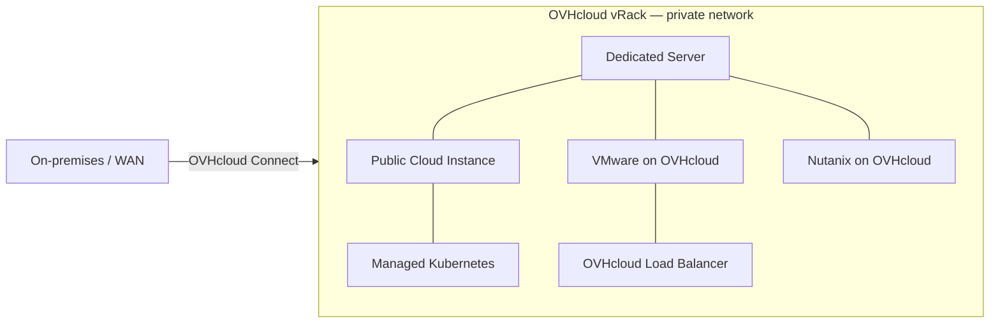
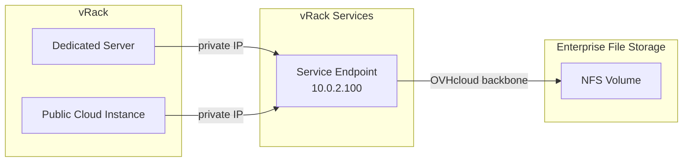

## Objective

This guide explains what the OVHcloud vRack is, how it transports traffic, which products it connects, and what you configure on each endpoint. After reading it, you will be able to plan a private network topology across OVHcloud services and choose the right configuration guides for your infrastructure.

## Overview

The OVHcloud vRack interconnects eligible OVHcloud services over a private Layer 2 backbone that spans every OVHcloud region. Traffic between services in the same vRack stays within the OVHcloud network and is never routed over the public internet.

At its core the vRack behaves like a virtual switch. It transparently forwards Ethernet frames — tagged or untagged, standard or jumbo-sized — without inspecting or modifying them. Features such as VLAN tagging, MTU, and IPv4 addressing are configured entirely on the endpoints (server OS, vSphere, OpenStack, Load Balancer API).

The vRack also provides managed IPv6 connectivity. When an Additional IPv6 block is added, the infrastructure supplies a gateway, can advertise prefixes via SLAAC, and supports routed subnets with next-hop definitions — all configurable through the OVHcloud API and Control Panel. This gives the vRack native Layer 3 capabilities for IPv6 alongside its Layer 2 transport.



### Key capabilities

| Capability | Description |
|---|---|
| **Cross-product connectivity** | Connect dedicated servers, Public Cloud instances, Kubernetes clusters, Hosted Private Cloud, Managed Bare Metal, Load Balancers, and Enterprise File Storage in a single private network |
| **Cross-region reach** | A single vRack spans all OVHcloud regions — services in different regions communicate as if on the same LAN |
| **VLAN transparency** | The vRack transparently carries 802.1Q-tagged traffic, supporting up to 4,000 VLANs (IDs 1–4094). VLANs are configured on each endpoint (server OS, vSphere, OpenStack), not on the vRack itself. |
| **Jumbo Frame support** | The vRack backbone transports frames with up to 9,000 bytes of payload (MTU 9000). Jumbo Frames must be configured on each endpoint's network interface — the vRack does not enforce or manage MTU. |
| **IPv4 and IPv6** | Additional IP blocks (IPv4 and IPv6) can be added to the vRack so that traffic for those blocks is carried over the private backbone instead of the public internet. IPv6 blocks additionally involve L3 functions (gateway, SLAAC, routed subnets) managed at the infrastructure level. |
| **Private bandwidth management** | Upgrade or downgrade the private bandwidth allocated to a dedicated server via the API |
| **vRack Services** | Expose OVHcloud managed services (such as Enterprise File Storage) on private IPs via Service Endpoints |

## Key concepts

The sections below describe what the vRack transports and what you configure on your endpoints. Understanding this division of responsibility is essential.

### The vRack container

A vRack is a free, logical container identified by a service name (e.g. `pn-12345`). You order one via the Control Panel or API, then attach eligible services to it. Every service in the same vRack shares the same Layer 2 domain. At the vRack level you manage membership (which services are attached) and, for Additional IPv6 blocks, gateway and SLAAC settings. All other traffic-level configuration (IPv4 addressing, VLANs, MTU) is done on the endpoints.

### VLAN segmentation

The vRack transparently forwards 802.1Q-tagged Ethernet frames, which allows you to segment traffic into up to 4,000 VLANs (IDs 1–4094). The vRack does not create or manage VLANs — it simply carries tagged frames without modification. Where and how VLANs are configured depends on the product:

| Product | Where VLANs are configured |
|---|---|
| **Dedicated Servers** | On the server OS: load the `8021q` kernel module (Linux) or configure NIC Teaming with a VLAN tag (Windows). |
| **VMware on OVHcloud / Managed Bare Metal** | In vSphere: create Distributed Port Groups on the `-vrack` distributed switch with the desired VLAN ID. 11 VLANs (VLAN10–VLAN20) are pre-configured at delivery. |
| **Public Cloud** | At the OVHcloud infrastructure level: set the VLAN ID (called "segment") when creating a private network via the Control Panel, OVHcloud APIv6, or OpenStack CLI (`--provider-segment`). Instances do not tag VLANs themselves. |
| **OVHcloud Load Balancer** | On the Load Balancer: specify a VLAN ID when creating a vRack network via the API (`POST /ipLoadbalancing/{serviceName}/vrack/network`). |

VLAN ID 0 (untagged) is the default and carries traffic that is not explicitly tagged.

### Private IP addressing

The vRack is a Layer 2 service with no awareness of IP. You are responsible for assigning private IP addresses on each endpoint. Any RFC 1918 range works (`10.0.0.0/8`, `172.16.0.0/12`, `192.168.0.0/16`). OVHcloud Additional IP blocks can also be added to the vRack so their traffic is carried over the private backbone instead of the public internet.

### Additional IP blocks

Additional IP blocks can be added to a vRack via the Control Panel or API. Once added, a block is no longer attached to a single physical server — it can be used across any service in the vRack.

Public IP traffic routed through the vRack has a default bandwidth of 5 Gbps in EU/CA/US regions and 100 Mbps in APAC regions. Additional bandwidth can be purchased per-vRack and per-region, either during the Additional IP order or from the vRack management page. This is separate from the Dedicated Server private bandwidth described [below](#private-bandwidth).

For IPv6, the vRack provides managed connectivity. When a /56 block is added, the infrastructure supplies a gateway at the first address and supports two addressing modes:

- **Basic mode** — static or SLAAC addressing on the first /64 subnet. SLAAC is off by default and can be toggled via the OVHcloud API or Control Panel, allowing connected endpoints to auto-configure their IPv6 addresses.
- **Routed mode** — delegated /57–/64 subnets routed to a next-hop address, configured via the API. This is useful for distributing IPv6 ranges to VMs or containers behind a router.

Additional IPv6 constraints:

| Constraint | Value |
|---|---|
| VLAN support | Native VLAN (VLAN 0) only — cannot be combined with 802.1Q-tagged VLANs |
| APAC regions | Not supported |
| Blocks per vRack per region | 1 (/56 block) |
| Maximum blocks per region | 3 (across all vRacks) |
| Cross-region transfer | Not possible — blocks are tied to the region where they were allocated |
| Maximum hosts in bridged subnet | 128 |
| Maximum next-hop routes (routed mode) | 128 |
| Outbound public bandwidth | 5 Gbps per region (EU/CA/US) |
| SLAAC in multi-region setups | Must be disabled |

### Jumbo Frames

The vRack backbone transports frames with up to 9,000 bytes of payload (MTU 9000), but it does not manage or enforce MTU. To use Jumbo Frames you must set MTU 9000 on each endpoint's network interface and on any VLAN subinterfaces. All devices in the communication path must use the same MTU to avoid fragmentation. The vRack requires no configuration — it passes whatever frame size the endpoints send.

### NIC bonding (OVHcloud Link Aggregation)

On Dedicated Servers from the Advance, Scale, and High Grade ranges, the physical NICs connected to the vRack can be bonded using OVHcloud Link Aggregation (OLA). OLA aggregates two NICs into one logical link using LACP (802.3ad), increasing bandwidth and providing link redundancy.

OLA is a server-and-switch feature, not a vRack feature. You enable it in the OVHcloud Control Panel (which configures the switch-side LACP), then create the bond interface at OS level (`bond1` on Linux with `ifenslave`, NIC Teaming on Windows). The vRack carries the resulting bonded traffic without any awareness of the aggregation.

### Cross-network routing

When services in the same vRack are on different private subnets they cannot communicate directly at Layer 2. A gateway instance with interfaces on both subnets is needed to route traffic between them.

For Public Cloud and Managed Kubernetes environments, static routes can be pushed via DHCP using OpenStack's `--host-route` parameter on subnets. This makes instances and Kubernetes nodes automatically aware of other private networks without manual route configuration.

### Private bandwidth <a name="private-bandwidth"></a>

Each Dedicated Server has a private bandwidth allocation for vRack traffic, separate from its public bandwidth. The default allocation depends on the server range. You can upgrade or downgrade private bandwidth via the OVHcloud API using the `baremetalPrivateBandwidth` order-upgrade endpoint.

## Compatible products

Each product connects to the vRack differently. The table below summarises connection methods, VLAN handling, and key considerations.

| Product | How it connects | VLAN handling | Key considerations |
|---|---|---|---|
| **Dedicated Servers** | Add server to vRack via Control Panel or API. Configure the vRack network interface at OS level. | 802.1Q tagging configured on the server OS. | IP, VLAN, and MTU are configured entirely on the server. Supported OS: Debian 11+, Ubuntu 22.04+, AlmaLinux/Rocky 8–10, Fedora 42+, Windows Server. NIC bonding via OLA on High Grade/Scale/Advance ranges. Hypervisor-specific guides for Proxmox VE and Hyper-V. |
| **Public Cloud** | Add a Public Cloud project to a vRack, then create private networks via Control Panel, OVHcloud APIv6, OpenStack CLI, Horizon, or Terraform. | VLAN ID set at the OVHcloud infrastructure level when creating the private network. Instances do not tag VLANs. | Private networks can span regions. Up to 4,000 VLANs. |
| **Managed Kubernetes** | Select a private network (created in a Public Cloud project within the vRack) at cluster creation. | Inherits from the Public Cloud private network. | Nodes and pods use private IPs. Known subnet restrictions apply. Cross-network communication requires DHCP-pushed static routes or a gateway instance. |
| **VMware on OVHcloud** | Linked at delivery. VLANs configured in vSphere as Distributed Port Groups on the `-vrack` distributed switch. | 11 VLANs (VLAN10–VLAN20) pre-configured by OVHcloud. Additional VLANs created in vSphere. | VLAN tagging is managed by vSphere, not by the vRack. "VM Network" vRack type (single VLAN, OVHcloud-managed switch) and "Datacenter vRack" type (up to 4,000 VLANs, customer-managed switch) have different capabilities — see the [compatibility guide](/pages/hosted_private_cloud/hosted_private_cloud_powered_by_vmware/vrack_and_hosted_private_cloud). |
| **Managed Bare Metal** | Linked at delivery. Same architecture as VMware on OVHcloud. | 11 VLANs (VLAN10–VLAN20) pre-configured. Additional VLANs created in vSphere. | VLAN tagging managed by vSphere; the vRack transports the frames. |
| **OVHcloud Load Balancer** | Link to vRack via API (`POST /vrack/{serviceName}/ipLoadbalancing`), then define a vRack network (subnet, NAT IP, VLAN ID) on the Load Balancer. | VLAN ID configured on the Load Balancer, not on the vRack. | Farms linked to a vRack network communicate via private IPs only — public IP connectivity is disabled for those farms. |
| **Nutanix on OVHcloud** | vRack pre-configured at cluster deployment. | Yes. | vRack can be changed post-installation by removing all services from the original vRack and re-adding them to the target vRack. Clusters in different regions can be interconnected through a shared vRack. |
| **Enterprise File Storage** | Exposed via vRack Services (Service Endpoints). | Via vRack Services subnet. | Requires a vRack Services instance. See the [vRack Services section](#vrack-services) below. |
| **Public Cloud Databases** | Attach a private network to the database instance. | Via the Public Cloud private network. | Database nodes receive private IPs on the selected network. |
| **OVHcloud Connect** | Associate the OVHcloud Connect service with a vRack via the Control Panel or API. | The OVHcloud Connect L3 virtual router does not support VLANs or trunking — traffic is untagged at L3. | Provides a private Layer 2 or Layer 3 link between your external infrastructure and services in the vRack. Two variants: OVHcloud Connect Direct (physical cross-connect at an OVHcloud PoP) and OVHcloud Connect Provider (via Megaport, Equinix Fabric, etc.). |

## vRack Services

vRack Services extends the vRack to OVHcloud managed services that cannot be attached to a vRack directly. It creates **Service Endpoints** — private IP addresses within a dedicated subnet that route traffic to a managed service over the OVHcloud backbone.

Currently supported: **Enterprise File Storage (NetApp)** — expose NFS volumes on private IPs accessible from any service in the vRack.

Connecting Enterprise File Storage requires three steps: select or create a vRack, activate vRack Services, and create a subnet. The NFS client must be in the same subnet and the same VLAN as the vRack Services endpoint. For Public Cloud instances, the private network must also be in the same region as the EFS volume, and the VLAN ID and subnet CIDR must match between the Public Cloud private network and the vRack Services configuration.

vRack Services is managed via the Control Panel (**Bare Metal Cloud** > **Network** > **vRack Services**) or the API (`/vrackServices/*`).



## Use cases

The vRack supports a range of architecture patterns depending on which products you combine.

### Hybrid cloud (Dedicated Server + Public Cloud)

Connect bare metal servers and Public Cloud instances on the same private network. The Dedicated Server uses a VLAN subinterface configured at OS level; the Public Cloud instance uses a Neutron private network created with the same VLAN ID. The vRack carries the tagged frames between both — VLAN matching is handled by each endpoint's configuration.

### Multi-tier application with Load Balancer

Configure different VLAN IDs on your endpoints to separate application tiers (frontend, backend, data). The vRack carries all tagged traffic transparently. The OVHcloud Load Balancer distributes traffic from the public internet to the frontend tier via its vRack network integration.

### Managed Kubernetes with database backend

Deploy a Managed Kubernetes cluster and a Public Cloud instance (e.g. MariaDB) on the same private network inside a vRack. Kubernetes pods reach the database over private IPs, keeping database traffic off the public internet.

### Nutanix multi-site interconnection

Interconnect Nutanix clusters in different OVHcloud regions through a shared vRack. This enables cross-site replication, disaster recovery with Nutanix Leap, and metro availability configurations.

### Virtualisation with Additional IPs (Proxmox / Hyper-V)

Add a public Additional IP block to a vRack and bridge the hypervisor's vRack interface. VMs are assigned usable IPs from the block. Because the block is attached to the vRack rather than to a single server, VMs can be migrated between hypervisors without moving individual IPs.

### Hybrid connectivity with OVHcloud Connect

Extend your on-premises network or WAN into the vRack over a private, dedicated link. OVHcloud Connect Direct provides a physical cross-connect at an OVHcloud PoP; OVHcloud Connect Provider uses a partner network. In L3 mode, BGP or static routes exchange reachability between your network and the vRack subnets. In L2 mode, your Ethernet segments are extended transparently into the vRack.

### Cross-region disaster recovery

A single vRack spans all OVHcloud regions. You can replicate data between a primary site in one region and a secondary site in another using private connectivity, without any traffic touching the public internet.

## Automation

The vRack and related services are manageable via the OVHcloud API. The vRack API handles membership (which services are attached); traffic-level configuration is handled by each product's own API.

| Endpoint group | Base path | Purpose |
|---|---|---|
| **vRack service** | `/vrack/{serviceName}` | Get or update the vRack service (name, description) |
| **Eligible services** | `/vrack/{serviceName}/eligibleServices` | Check which services can be added |
| **Dedicated Servers** | `/vrack/{serviceName}/dedicatedServer` | Add/remove Dedicated Servers |
| **Public Cloud** | `/vrack/{serviceName}/cloudProject` | Add/remove Public Cloud projects |
| **Load Balancer** | `/vrack/{serviceName}/ipLoadbalancing` | Add/remove Load Balancer services |
| **OVHcloud Connect** | `/vrack/{serviceName}/ovhCloudConnect` | Add/remove OVHcloud Connect services |
| **Private networks (PCI)** | `/cloud/project/{serviceName}/network/private` | Create/list/delete private networks and subnets (Public Cloud) |
| **Private bandwidth** | `/order/upgrade/baremetalPrivateBandwidth/{serviceName}` | Upgrade/downgrade Dedicated Server private bandwidth |
| **IP block management** | `/ip/{ip}/move` | Add/remove Additional IP blocks to/from a vRack |
| **vRack Services** | `/vrackServices/resource/{vrackServicesId}` | Manage Service Endpoints and subnets |
| **OpenStack CLI** | `openstack network create`, `openstack subnet create` | Alternative for Public Cloud private networks via Neutron |

```python
import ovh

client = ovh.Client()
servers = client.get("/vrack/pn-12345/dedicatedServer")
print(servers)
```

Terraform users can use the `ovh_vrack_dedicated_server`, `ovh_vrack_cloudproject`, and related resources in the OVHcloud Terraform provider.

## Go further

### Configuration guides

- [Configuring an IP block in a vRack](/pages/bare_metal_cloud/dedicated_servers/configuring-an-ip-block-in-a-vrack)
- [Configuring an IPv6 block in a vRack](/pages/bare_metal_cloud/dedicated_servers/configure-an-ipv6-in-a-vrack)
- [Configuring Jumbo Frames in vRack](/pages/bare_metal_cloud/dedicated_servers/VRACK_MTU_Jumbo_Frames)
- [Creating multiple VLANs in a vRack](/pages/bare_metal_cloud/dedicated_servers/creating-multiple-vlans-in-a-vrack)
- [Change the announcement of an IP block in vRack](/pages/bare_metal_cloud/dedicated_servers/vrack_change_zone_announce)
- [Upgrade and downgrade private bandwidth via the API](/pages/bare_metal_cloud/dedicated_servers/manage_bandwidth_vRack_api)

### Dedicated Servers

- [Configuring the vRack on your Dedicated Servers](/pages/bare_metal_cloud/dedicated_servers/vrack_configuring_on_dedicated_server)
- [Configuring the network on Proxmox VE](/pages/bare_metal_cloud/dedicated_servers/proxmox-network-HG-Scale)
- [Configuring the network on Windows Server with Hyper-V](/pages/bare_metal_cloud/dedicated_servers/hyperv-network-HG-Scale)
- [Configuring the vRack between Public Cloud and a Dedicated Server](/pages/bare_metal_cloud/dedicated_servers/configuring-the-vrack-between-the-public-cloud-and-a-dedicated-server)
- [Setting up a VM using Additional IPs and Hyper-V over a vRack](/pages/bare_metal_cloud/dedicated_servers/ipfo-vrack-hyperv)
- [Configure Your NIC for OVHcloud Link Aggregation](/pages/bare_metal_cloud/dedicated_servers/ola-enable-debian9)

### Hosted Private Cloud

- [Interconnect Nutanix clusters through the vRack](/pages/hosted_private_cloud/nutanix_on_ovhcloud/45-vrack-interconnection)
- [Changing the vRack of a Nutanix cluster](/pages/hosted_private_cloud/nutanix_on_ovhcloud/26-change-vrack-postinstall)
- [How to create a VLAN (VMware)](/pages/hosted_private_cloud/hosted_private_cloud_powered_by_vmware/creation_vlan)
- [Using Private Cloud within a vRack](/pages/hosted_private_cloud/hosted_private_cloud_powered_by_vmware/using_private_cloud_in_vrack)
- [vRack compatibility with Hosted Private Cloud](/pages/hosted_private_cloud/hosted_private_cloud_powered_by_vmware/vrack_and_hosted_private_cloud)

### Load Balancer

- [Configuring the vRack on the Load Balancer](/pages/network/load_balancer/vrack_and_loadbalancer)

### Managed Bare Metal

- [Using Managed Bare Metal within a vRack](/pages/bare_metal_cloud/managed_bare_metal/using-vrack)
- [VLAN creation (Managed Bare Metal)](/pages/bare_metal_cloud/managed_bare_metal/vlan-creation)

### Public Cloud — Containers and Orchestration

- [Using vRack Private Network with Managed Kubernetes](/pages/public_cloud/containers_orchestration/managed_kubernetes/using-vrack)
- [Working with vRack — Communicating between different private networks](/pages/public_cloud/containers_orchestration/managed_kubernetes/vrack-example-between-private-networks)
- [Using vRack — Communicating between different private networks](/pages/public_cloud/containers_orchestration/managed_kubernetes/using-vrack-between-private-networks)
- [Working with vRack — Managed Kubernetes and Public Cloud instances](/pages/public_cloud/containers_orchestration/managed_kubernetes/vrack-example-k8s-and-pci)

### Public Cloud — Network Services

- [Configuring vRack for Public Cloud](/pages/public_cloud/public_cloud_network_services/getting-started-07-creating-vrack)
- [Configuring vRack for Public Cloud using OVHcloud APIv6](/pages/public_cloud/public_cloud_network_services/getting-started-08-creating-vrack-with-api)
- [Configuring vRack for Public Cloud using OpenStack CLI](/pages/public_cloud/public_cloud_network_services/getting-started-09-creating-vrack-with-openstack)
- [Configuring a public IP block in a vRack on a Public Cloud instance](/pages/public_cloud/public_cloud_network_services/configuration-06-configure-ip-block-vrack-to-instance)

### OVHcloud Connect

- [Associate OVHcloud Connect with your vRack](/pages/network/ovhcloud_connect_revamp/3.5_associate_vrack)
- [Set up vRack networking for OVHcloud Connect](/pages/network/ovhcloud_connect_revamp/3.6_vrack_network_setup)
- [Configure OVHcloud Connect L3 with BGP](/pages/network/ovhcloud_connect_revamp/3.7_occ_l3_bgp)
- [Configure OVHcloud Connect L3 with static routing](/pages/network/ovhcloud_connect_revamp/3.8_occ_l3_static)

### vRack Services

- [vRack Services — Exposing a Managed Service on your vRack](/pages/network/vrack_services/global)
- [Enterprise File Storage — Private network configuration](/pages/storage_and_backup/file_storage/enterprise_file_storage/netapp_network_config)
- [Enterprise File Storage — Connect a Public Cloud instance to an EFS volume via vRack](/pages/storage_and_backup/file_storage/enterprise_file_storage/netapp_pci_connection_via_vrack)

Join our [community of users](/links/community).
