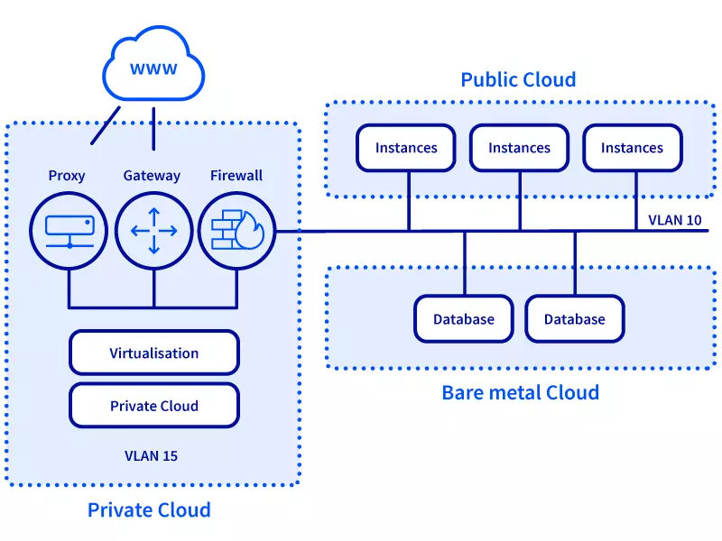
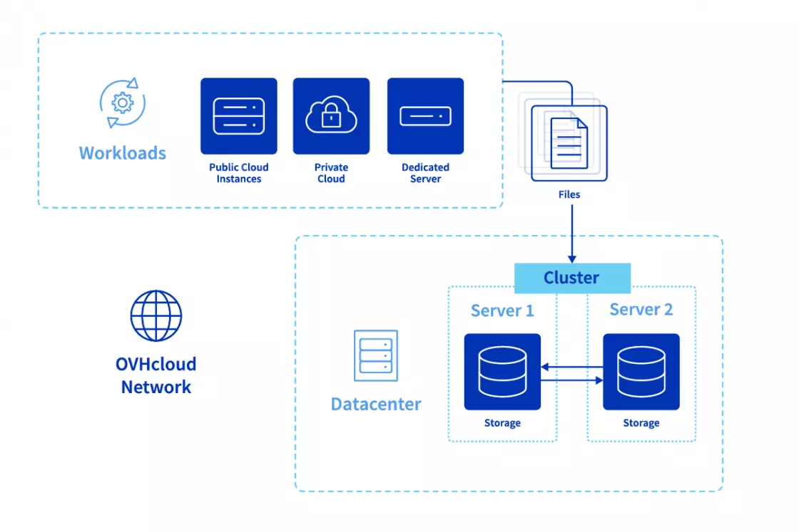

## Objectif

Dans un monde où la digitalisation des entreprises s'accélère, le besoin de solutions de connectivité et de stockage sécurisées, performantes et évolutives est plus critique que jamais.   
Face à ces défis, OVHcloud propose des solutions innovantes à travers le vRack et le Stockage de Fichiers d’Entreprise, basé sur la technologie NetApp ONTAP.   
Conçues pour répondre aux exigences les plus strictes en termes de sécurité des données, de performance et de disponibilité, ces solutions représentent une avancée significative dans la gestion des infrastructures IT d’entreprise modernes.   
Cet article explore comment le vRack d'OVHcloud permet une connectivité sécurisée et privée entre divers services cloud, et comment le Stockage de Fichiers d’Entreprise offre une solution de stockage de fichiers haute performance, le tout dans une synergie qui maximise l'efficacité et la flexibilité pour les entreprises en quête d'innovation et de croissance.   

Veuillez noter :   
- **Le vRack est mondial**, offrant des solutions de connectivité globales.
- **Les services vRack sont locaux**, assurant la résidence des données et la conformité.
- **Les services gérés peuvent être liés aux services vRack uniquement dans la même zone**, maintenant des normes élevées de performance et de sécurité.

## En Pratique

### vRack : Connectivité Privée Évolutive
Le vRack d'OVHcloud est une solution de réseau privé virtuel qui interconnecte de manière sécurisée et privée divers services au sein de l'écosystème OVHcloud, tels que les instances de cloud public, le cloud privé hébergé, les serveurs baremetal et les équilibreurs de charge. Cette technologie offre une isolation complète du trafic réseau, le protégeant ainsi d'Internet et d'autres clients.

    

#### Caractéristiques Avancées du vRack :   
- **Isolation et Sécurité :** Le vRack assure une isolation totale, offrant une sécurité renforcée pour les données critiques.
- **Flexibilité avec les VLANs :** La capacité de créer jusqu'à 4000 VLANs offre une gestion de réseau flexible et précise, adaptée aux besoins spécifiques de chaque projet.
- **Compatibilité Étendue :** Le vRack prend en charge une large gamme de services OVHcloud, permettant une intégration transparente et une évolutivité sans précédent.

### Services vRack

Les services vRack représentent la couche fondamentale de l'approche innovante d'OVHcloud en matière d'architecture réseau, permettant une connexion transparente et sécurisée entre divers services gérés au sein de l'environnement vRack. Cette instance de produit, une fois commandée par les clients, agit comme le centre névralgique pour orchestrer des configurations réseau complexes et faciliter l'intégration de services cloud divers.

#### Aspects clés des services vRack :
- **Portée Globale avec Précision Locale :** Alors que le vRack lui-même fournit un tissu réseau mondial, les services vRack sont conçus pour répondre à des exigences locales spécifiques, assurant la conformité avec les réglementations régionales de résidence des données et de sécurité.
- **Solutions Réseau Personnalisables :** Les clients ont la flexibilité de personnaliser leur infrastructure réseau selon leurs besoins commerciaux uniques, en exploitant les services vRack pour créer un environnement sur mesure qui soutient leurs objectifs opérationnels.
- **Sécurité et Isolation Renforcées :** Au cœur de leur conception, les services vRack privilégient la sécurité des données des clients. En permettant une connectivité privée, ils garantissent que le trafic de données entre les services reste isolé d'Internet et d'autres menaces réseau internes potentielles.
- **Gestion Simplifiée :** À travers le Panneau de Contrôle OVHcloud, les clients peuvent facilement gérer leurs services vRack, de la mise en place de nouvelles instances à l'ajustement de leurs configurations réseau. Cette interface conviviale démystifie les tâches de gestion de réseau complexes, les rendant accessibles aux entreprises de toutes tailles.
- **Interopérabilité avec les Services Gérés :** Les services vRack sont spécifiquement conçus pour fonctionner de manière transparente avec une gamme de services gérés OVHcloud, en commençant par le Stockage de Fichiers d’Entreprise comme premier service compatible. Cette interopérabilité est cruciale pour les entreprises cherchant à exploiter tout le spectre des offres OVHcloud au sein d'un écosystème réseau unifié.

### Stockage de Fichiers d’Entreprise : Performance et Fiabilité avec NetApp ONTAP
Le Stockage de Fichiers d’Entreprise, basé sur la technologie NetApp ONTAP, est une solution de stockage de fichiers haute performance conçue pour répondre aux exigences des entreprises en termes de disponibilité des données, de performance et de sécurité.

    

#### Forces du Stockage de Fichiers d’Entreprise :   
- **Haute Performance :** La technologie NVMe SSD assure des vitesses de lecture et d'écriture ultra-rapides, facilitant un accès instantané aux données stockées.
- **Haute Disponibilité :** Avec une disponibilité de 99,99%, cette solution garantit un accès constant aux données, crucial pour les applications commerciales critiques.
- **Sécurité et Conformité :** Des fonctionnalités avancées de protection et de récupération des données sont intégrées, répondant aux normes strictes de sécurité et de conformité.

### Intégration du Stockage de Fichiers d’Entreprise avec vRack
L'intégration du Stockage de Fichiers d’Entreprise avec les services vRack représente une avancée majeure, offrant une connectivité privée native et sécurisée pour les applications commerciales critiques. Cette solution utilise la technologie Service Endpoint pour connecter les pools de capacité de stockage aux réseaux vRack privés, isolant ainsi le trafic de données d'Internet.

    

#### Processus et Avantages de l'Intégration :
- **Configuration Simplifiée :** L'accès au panneau de contrôle permet une configuration facile du pool de capacité et la création de points de service en quelques étapes simples.
- **Sécurité Renforcée :** Cette intégration assure que toutes les communications restent privées et sécurisées, car elles ne quittent pas le réseau privé isolé.
- **Performance et Flexibilité :** En exploitant NetApp ONTAP, cette solution offre non seulement une performance optimale mais aussi une grande flexibilité pour répondre aux besoins de stockage évolutifs.

## Pour Résumer
En combinant le vRack et le Stockage de Fichiers d’Entreprise avec leur intégration, OVHcloud fournit une solution complète qui répond aux défis de connectivité et de stockage des entreprises modernes.   
Cette combinaison renforce non seulement la sécurité et la performance des infrastructures IT mais offre également une flexibilité et une évolutivité pour soutenir la croissance et l'innovation des entreprises.   
Avec l'assurance d'une haute disponibilité et une gestion facile, ces solutions OVHcloud se positionnent comme des choix stratégiques pour les entreprises cherchant à optimiser leur infrastructure de données dans un environnement sécurisé et performant.
