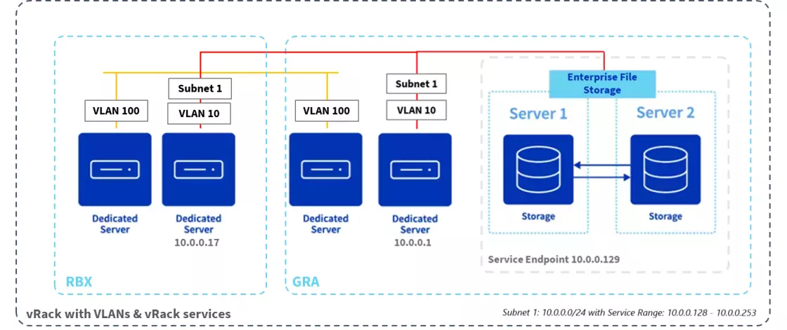

## Objective

Dans un monde où la digitalisation des entreprises s'accélère, la nécessité de solutions de connectivité et de stockage sécurisées, performantes et évolutives n'a jamais été aussi cruciale.   
Face à ces enjeux, OVHcloud propose des solutions innovantes à travers le vRack et le Stockage de Fichiers d'Entreprise, basé sur la technologie NetApp ONTAP.   
Ces solutions, conçues pour répondre aux exigences les plus strictes en matière de sécurité, de performance et de disponibilité des données, représentent une avancée significative dans la gestion des infrastructures IT des entreprises modernes.   
Cet article explore en détail comment le vRack d'OVHcloud permet une connectivité privée et sécurisée entre divers services cloud, et comment le Stockage de Fichiers d'Entreprise offre une solution de stockage de fichiers haute performance, le tout dans une synergie qui maximise l'efficacité et la flexibilité pour les entreprises en quête d'innovation et de croissance.   

## En pratique

### vRack : Une Connectivité Privée Évolutive
Le vRack d'OVHcloud est une solution de réseau privé virtuel qui permet d'interconnecter de manière sécurisée et privée divers services au sein de l'écosystème OVHcloud, tels que les instances de cloud public, le cloud privé hébergé, les serveurs baremetal, et les équilibreurs de charge. Cette technologie offre une isolation complète du trafic réseau, le protégeant ainsi d'Internet et des autres clients.

    

#### Caractéristiques Avancées du vRack :   
- **Isolation et Sécurité :** Le vRack assure une isolation totale, permettant une sécurité renforcée pour les données critiques.
- **Flexibilité avec les VLAN :** La possibilité de créer jusqu'à 4000 VLANs offre une gestion réseau flexible et précise, adaptée aux besoins spécifiques de chaque projet.
- **Compatibilité Étendue :** Le vRack supporte une large gamme de services OVHcloud, permettant une intégration transparente et une évolutivité sans précédent.

### Stockage de Fichiers d'Entreprise : Performance et Fiabilité avec NetApp ONTAP
Le Stockage de Fichiers d'Entreprise, basé sur la technologie NetApp ONTAP, est une solution de stockage de fichiers haute performance conçue pour répondre aux exigences des entreprises en matière de disponibilité, de performance et de sécurité des données.

    

#### Points Forts du Stockage de Fichiers d'Entreprise :   
- **Haute Performance :** La technologie NVMe SSD assure des vitesses de lecture et d'écriture ultra-rapides, facilitant un accès instantané aux données stockées.
- **Haute Disponibilité :** Avec une disponibilité de 99,99%, cette solution garantit un accès constant aux données, crucial pour les applications d'entreprise critiques.
- **Sécurité et Conformité :** Des fonctionnalités avancées de protection et de récupération des données sont intégrées, répondant aux normes strictes de sécurité et de conformité.

### Intégration du Stockage de Fichiers d'Entreprise avec vRack
L'intégration du Stockage de Fichiers d'Entreprise avec les services vRack représente une avancée majeure, offrant une connectivité privée native et sécurisée pour les applications critiques d'entreprise. Cette solution utilise la technologie Service Endpoint pour connecter les pools de capacité de stockage aux réseaux privés vRack, isolant ainsi le trafic de données d'Internet.

    

#### Processus d'Intégration et Avantages :
- **Configuration Simplifiée :** L'accès au panneau de contrôle permet une configuration aisée du pool de capacité et la création de points de service en quelques étapes simples.
- **Sécurité Renforcée :** Cette intégration garantit que toutes les communications restent privées et sécurisées, car elles ne quittent pas le réseau privé isolé.
- **Performance et Flexibilité :** En s'appuyant sur NetApp ONTAP, cette solution offre non seulement des performances optimales mais aussi une grande flexibilité pour répondre aux besoins de stockage évolutifs.

## Pour résumer
En combinant le vRack et le Stockage de Fichiers d'Entreprise avec leur intégration, OVHcloud fournit une solution complète qui répond aux défis de connectivité et de stockage des entreprises modernes.   
Cette combinaison non seulement renforce la sécurité et la performance des infrastructures IT mais offre également une flexibilité et une évolutivité permettant de soutenir la croissance et l'innovation dans les entreprises.   
Avec l'assurance d'une haute disponibilité et la facilité de gestion, ces solutions d'OVHcloud se positionnent comme des choix stratégiques pour les entreprises cherchant à optimiser leur infrastructure de données dans un environnement sécurisé et performant.
