# Product definition
vRack Services answers the need for a private access of managed services with in the vRack. It brings IP connectivity to vRack on a private adressage
plan.

The first Managed Service compatible with vRack Services is 'Entreprise File Storage' (NetApp).

The vRack Services product is composed on three main primitives:

## 1. Vrack Services
   
 It represents the product instance ordered by the customers.  
 
## 2. Subnet
   
The Subnet is a network segment of the associated vRack. It represents an IP addressing scheme inside the private network.
It is characterized by a **range** (CIDR) and a unique inner **vlan** that allows Subnets segregation in a given vRack Services.

While customer creates and removes Service Endpoints on a Subnet, it must be ensured that attributed IPs does not conflict with customer IPs used in that **range**.

To do so, the **serviceRange** specifies a smaller subnet reserved to the Managed Service IPs. Customer must no use these IPs.

## 3. Service Endpoint

The Service Endpoint provides to customer an access to their Managed Services directly form one or several private IPs in the associated vRack.

For each spawned Managed Services, the service provider publishes the number of private IPs required and a custom description for each of them. 

Then, those private IPs are dynamically allocated by the vRack Services automation at the primitive creation request. 


# Product configuration experience
## Requirements

- You can start configuring the vRack Services product before associating any vRack.
- You can switch the vRack associated with a vRack Services from one vRack (x) to another (y).
- You have the flexibility to acquire a vRack, vRack Services, and a Managed Service in any order, at any time.
- The vRack Services product incurs charges based on the Managed Services price. Infrastructure involved in the vRack Services configuration should not be used until a Managed Service is ordered.
- According to the OneAPI consumption requirements, a Subnet primitive cannot exist without an associated Network relationship.

## By API

Behind the scenes, the status of VrackServices (VrackServices.productStatus) mirrors the state of the infrastructure configuration. This configuration is initiated once the following three criteria are met:

- The product is not suspended.
- There is an existing vRack association.
- At least one Service Endpoint has been set up.

If any of these requirements are no longer satisfied, the configuration is withdrawn from the OneAPI (either marked as DRAFT or SUSPENDED).

> [!primary]
>
> As an helper, a summary of the configuration is available with the VrackServices.productStatus attribut.
It answers the question `does my current configuration makes the Managed Services to be reachable from the vRack ?`
> 
> ACTIVE - yes, it does
> 
> DRAFT - no, either a Service Endpoint needs to be created or a vRack needs to be associated to the vRack Services
> 
> SUSPENDED - no, product is in Agora `suspension` state


<details>
  <summary><b>1. Create a Subnet (productStatus=DRAFT)</b> </summary>
    
  Request Subnet creation (always synchronous)
  
```bash
$ curl -XPOST -d '{"range": "172.16.0.0/26", "serviceRange": "172.16.0.0/27"}' https://api.ovh.com/2.0/vrackServices/vrs-1234567/subnet
```

> <details>
> <summary><i>Click here to see the result</i> </summary>    
>     
>   ```console
> HTTP/1.1 201 Created
> Location: https://api.ovh.com/2.0/vrackServices/vrs-1234567/subnet/sub-9876543
> {
>   "id": "sub-9876543",
>   "resourceStatus": "READY",
>   "targetSpec": {
>     "displayName": "",
>     "serviceRange": "172.16.0.0/27"
>   },
>   "currentState": {
>     "displayName": "",
>     "vrackServicesId": "vrs-1234567",
>     "range": "172.16.0.0/26",
>     "serviceRange": "172.16.0.0/27",
>     "vlan": 0
>   },
>   "createdAt": "2024-01-19T14:49:22.323452Z",
>   "updatedAt": "2024-01-19T14:49:22.323452Z"
> }
> ```
> 
> </details>

</details>


<details>
  <summary><b>2. Create a Service Endpoint (productStatus=DRAFT) </b>     </summary>

  1. List all Managed Services compatible with the vRack Services (here: same zone and not already linked to a
vRack Services)

```bash
$ curl -XGET https://api.ovh.com/2.0/vrackServices/vrs-2034567/compatibleManagedService
```

> <details>
>   <summary>Click here to see the result</summary>
> 
> ```console
> [
>     "1a994681-661d-4f12-ae10-597cbc124f48",
>     "1fd7bf30-6722-4658-b3db-92e269185f46",
>     "15edf087-2b94-4980-9fdf-792ecdd414ca",
>     "1d65f8e0-edde-448f-b907-a85404eb0752"
> ]
> ```
>   
> </details>


</details>


### 2. Create a Service Endpoint (productStatus=DRAFT)


2. Request Service Endpoint creation (synchronous as no vRack association exists)

```bash
$ curl -XPOST -d '{"name": "end-11", "serviceType": "entreprise-file-storage", "serviceId": "1a994681-661d-4f12-
ae10-597cbc124f48"}' https://api.ovh.com/2.0/vrackServices/vrs-1234567/subnet/sub-9876543/serviceEndpoint
```

```console
HTTP/1.1 201 Created
Location: https://api.ovh.com/2.0/vrackServices/vrs-1234567/subnet/sub-9876543/serviceEndpoint/end-2345678
{
  "id": "end-2345678",
  "resourceStatus": "READY",
  "targetSpec": {
    "displayName": "EFS_critical_data"
  },
  "currentState": {
    "displayName": "EFS_critical_data",
    "subnetId": "sub-9876543",
    "serviceType": "entreprise-file-storage",
    "serviceId": "1a994681-661d-4f12-ae10-597cbc124f48",
    "endpoints": {
      1: {
        "ip": "172.16.0.1",
        "description": "Nominal"         // Fetched from the Managed Service 'create' event
      },
      2: {
        "ip": "172.16.0.2",
        "description": "Replication"     // Fetched from the Managed Service 'create' event
      }
    }
  },
  "createdAt": "2024-01-19T14:50:22.323452Z",
  "updatedAt": "2024-01-19T14:50:22.323452Z"
}
```


### 3. Associate to a vRack

1. Check eligibility to the vRack

```bash
$ curl -XGET https://api.ovh.com/1.0/vrack/pn-12345/allowedServices?serviceFamily=vrackServices
```

```console
{
  "ipLoadbalancing": null,
  "dedicatedConnect": null,
  "dedicatedServer": null,
  "vrackServices": [
    "vrs-2345678",
    "vrs-1234567"
  ],
  "ip": null,
  "dedicatedCloudDatacenter": null,
  "ovhCloudConnect": null,
  "cloudProject": null,
  "dedicatedCloud": null,
  "legacyVrack": null,
  "dedicatedServerInterface": null
}
```

2. Request vRack association

```bash
$ curl -XPOST -d '{"vrackServices": "vrs-1234567"}' https://api.ovh.com/1.0/vrack/pn-12345/vrackServices
```

```console
[
    todoDate: "2024-01-19T14:51:22.323452Z"
    status: "init"
    serviceName: "pn-12345"
    orderId: null
    lastUpdate: "2024-01-19T14:51:22.323452Z"
    targetDomain: "vrs-1234567"
    function: "addVrackServices"
    id: 3456789
]
```

3. Fetch asynchronous task because it can takes few secondes. Perhaps you can have some error during the execution of this task

```bash
$ curl -XGET https://api.ovh.com/1.0/vrack/pn-12345/task/3456789
```

```console
HTTP/1.1 404 Not Found
{
    "message": "The requested object (taskId = 3456789) does not exist"
}
```

4. When this synchronous task is done you can fetch the vRack Services status

```bash
$ curl -XGET https://api.ovh.com/2.0/vrackServices/vrs-1234567
```

```console
{
  "id": "vrs-1234567",
  "resourceStatus": "READY",
  "targetSpec": {
    "displayName": "Sample_Display_Name"
  },
  "currentState": {
    "productStatus": "ACTIVE",
    "displayName": "Sample_Display_Name",
    "nicAdmin": "dp12345-ovh",
    "nicTech": "dp12345-ovh",
    "vrackId": "pn-12345",
    "zone": "rbx",
    "region": "eu-east-1",
    "az": "eu-east-1-a"
  },
  "createdAt": "2024-01-19T14:40:22.323452Z",
  "updatedAt": "2024-01-19T14:52:22.323452Z"
}
```

### 4. Create a Subnet (productStatus=ACTIVE)

Request Subnet creation (always synchronous)

```bash
$ curl -XPOST -d '{"range": "172.21.0.0/27", "serviceRange": "172.21.0.0/29", "vlan": "10"}' https://api.ovh.com/2.0/vrackServices/vrs-1234567/subnet
```

```console
HTTP/1.1 201 Created
Location: https://api.ovh.com/2.0/vrackServices/vrs-2034567/subnet/sub-4567890
{
    "id": "sub-4567890",
    "resourceStatus": "READY",
    "targetSpec" : {
        "displayName": "rbx_nominal_services",
        "serviceRange": "172.21.0.0/29"
    },
    "currentState": {
        "displayName": "rbx_nominal_services",
        "vrackServicesId": "vrs-1234567",
        "range": "172.21.0.0/27",
        "serviceRange": "172.21.0.0/29",
        "vlan": 10,
    },
    "createdAt": "2024-01-19T14:53:22.323452Z",
    "updatedAt": "2024-01-19T14:53:22.323452Z"
}
```

### 5. Create a Service Endpoint (productStatus=ACTIVE)

1. Request Service Endpoint creation (asynchronous as a vRack association exists)   
Here we use the second managed serice listed previously in 3.1 section "List all Managed Services compatible with the vRack Services"

```bash
$ curl -XPOST -d '{"serviceType": "entreprise-file-storage", "serviceId": "1fd7bf30-6722-4658-b3db-
92e269185f46"}' https://api.ovh.com/2.0/vrackServices/vrs-1234567/subnet/sub-4567890/serviceEndpoint
```

```console
HTTP/1.1 201 Created
Location: https://api.ovh.com/2.0/vrackServices/vrs-1234567/subnet/sub-4567890/serviceEndpoint/end-5678901
{
  "id": "end-5678901",
  "resourceStatus": "CREATING",
  "targetSpec": {
    "displayName": "secured_data"
  },
  "currentState": {
    "displayName": "secured_data",
    "subnetId": "sub-4567890",
    "serviceType": "entreprise-file-storage",
    "serviceId": "1fd7bf30-6722-4658-b3db-92e269185f46",
    "endpoints": {
      1: {
        "ip": "172.21.0.1",
        "description": null        // Fetched from the Managed Service 'create' event
      },
      2: {
        "ip": "172.21.0.2",
        "description": null        // Fetched from the Managed Service 'create' event
      },
      3: {
        "ip": "172.21.0.3",
        "description": null        // Fetched from the Managed Service 'create' event
      }
    }
  },
  "createdAt": "2024-01-19T14:54:22.323452Z",
  "updatedAt": "2024-01-19T14:54:22.323452Z"
}
```

2. Request a second Service Endpoint creation   
Just in order to show you the behavior when you want launch a new request during the execution of the previous one.

```bash
$ curl -XPOST -d '{"serviceType": "entreprise-file-storage", "serviceId": "95569efa-61f2-4deb-8beea60b4213e1dc"}' https://api.ovh.com/2.0/vrackServices/vrs-1234567/subnet/sub-4567890/serviceEndpoint
```

```console
HTTP/1.1 409 Conflict
{
  "class": "Client::Conflict::ResourceBusy",
  "message": "Subnet sub-1234567 is busy",
  "details": {
    "subnetId": "sub-1234567"
  }
}
```

3. So you can fetch resource status of the first requested Service Endpoint.
In this way we can see the status of the resource is now READY
   

```bash
$ curl -XGET https://api.ovh.com/2.0/vrackServices/vrs-1234567/subnet/sub-4567890/serviceEndpoint/end-5678901
```

```console
{
  "id": "end-5678901",
  "resourceStatus": "READY",
  "targetSpec": {
    "displayName": "critical_business"
  },
  "currentState": {
    "displayName": "critical_business",
    "subnetId": "sub-4567890",
    "serviceType": "entreprise-file-storage",
    "serviceId": "1fd7bf30-6722-4658-b3db-92e269185f46",
    "endpoints": {
      1: {
        "ip": "172.21.0.1",
        "description": null        // Fetched from the Managed Service 'create' event
      },
      2: {
        "ip": "172.21.0.2",
        "description": null        // Fetched from the Managed Service 'create' event
      },
      3: {
        "ip": "172.21.0.3",
        "description": null        // Fetched from the Managed Service 'create' event
      }
    }
  },
  "createdAt": "2024-01-19T14:54:22.323452Z",
  "updatedAt": "2024-01-19T14:54:22.323452Z"
}
```


### 6. Create a Service Endpoint with a wrong Managed Service localization [Error]


```bash
$ curl -XPOST -d '{"serviceType": "entreprise-file-storage", "serviceId": "95569efa-61f2-4deb-8beea60b4213e1dc"}'
https://api.ovh.com/2.0/vrackServices/vrs-1234567/subnet/sub-4567890/serviceEndpoint
```

```console
HTTP/1.1 400 Bad Request
{
  "class": "Client::BadRequest::LocalizationMismatch",
  "message": "Service 95569efa-61f2-4deb-8bee-a60b4213e1dc zone (rbx) does not match vRack Services vrs-2034567 zone (sbg)",
  "details": {
    "serviceId": "95569efa-61f2-4deb-8bee-a60b4213e1dc",
    "vrackServiceZone": "rbx",
    "vrackServiceId": "vrs-2034567",
    "serviceZone": "sbg"
  }
}
```

### 7. Create two Service Endpoints (productStatus=ACTIVE)

1. Request a first Service Endpoint creation (asynchronous as a vRack association exists)

```bash
$ curl -XPOST -d '{"serviceType": "entreprise-file-storage", "serviceId": "7c2c74b5-de0f-4deb-bb34-
e4f63d7dcf5e"}' https://api.ovh.com/2.0/vrackServices/vrs-1234567/subnet/sub-4567890/serviceEndpoint
```

```console
HTTP/1.1 201 Created
Location: https://api.ovh.com/2.0/vrackServices/vrs-1234567/subnet/sub-4567890/serviceEndpoint/end-8765432
{
  "id": "end-8765432",
  "resourceStatus": "CREATING",
  "targetSpec": {
    "displayName": "IA_data"
  },
  "currentState": {
    "displayName": "IA_data",
    "subnetId": "sub-4567890",
    "serviceType": "entreprise-file-storage",
    "serviceId": "7c2c74b5-de0f-4deb-bb34-e4f63d7dcf5e",
    "endpoints": {
      1: {
        "ip": "172.21.0.4",
        "description": null        // Fetched from the Managed Service 'create' event
      }
    }
  },
  "createdAt": "2024-01-19T14:55:22.323452Z",
  "updatedAt": "2024-01-19T14:55:22.323452Z"
}
```

2. Request a second Service Endpoint creation

```bash
$ curl -XPOST -d '{"serviceType": "entreprise-file-storage", "serviceId": "45edf087-2b94-4980-9fdf-
792ecdd414ca"}' https://api.ovh.com/2.0/vrackServices/vrs-1234567/subnet/sub-4567890/serviceEndpoint
```

```console
HTTP/1.1 201 Created
Location: https://api.ovh.com/2.0/vrackServices/vrs-1234567/subnet/sub-4567890/serviceEndpoint/end-7654321
{
  "id": "end-7654321",
  "resourceStatus": "CREATING",
  "targetSpec": {
    "displayName": "snapshots"
  },
  "currentState": {
    "displayName": "snapshots",
    "subnetId": "sub-4567890",
    "serviceType": "entreprise-file-storage",
    "serviceId": "45edf087-2b94-4980-9fdf-792ecdd414ca",
    "endpoints": {
      1: {
        "ip": "172.21.0.5",
        "description": null        // Fetched from the Managed Service 'create' event
      },
      2: {
        "ip": "172.21.0.6",
        "description": null        // Fetched from the Managed Service 'create' event
      }
    }
  },
  "createdAt": "2024-01-19T14:55:30.323452Z",
  "updatedAt": "2024-01-19T14:55:30.323452Z"
}
```

### 8. Create a Service Endpoint while Subnet ServiceRange is fully allocated [Error]


```bash
$ curl -XPOST -d '{"serviceType": "entreprise-file-storage", "serviceId": "2d65f8e0-edde-448f-b9-
a85404eb52"}' https://api.ovh.com/2.0/vrackServices/vrs-1234567/subnet/sub-4567890/serviceEndpoint
```

```console
HTTP/1.1 400 Bad Request
{
  "class": "Client::BadRequest::ServiceRangeFullyAllocated",
  "message": "Service 2d65f8e0-edde-448f-b9-a85404eb52 requires 2 IPs while 0 IP(s) still available on the Subnet sub-2778273",
  "details": {
    "serviceId": "2d65f8e0-edde-448f-b9-a85404eb52",
    "requestedIPsCount": "2",
    "availableIPsCount": "0",
    "SubnetId": "sub-4567890"
  }
}
```

### 9. Extend the Subnet service range

1. Create a 'extend-subnet-service-range.json' text file with these informations inside

```bash
$ cat extend-subnet-service-range.json
```

```console
{
  "targetSpec": {
    "displayName": "rbx_nominal_services",
    "serviceRange": "172.21.0.0/28"
  }
}
```

2. Request service range extension (asynchronous)

```bash
$ curl -XPUT -d@extend-subnet-service-range.json https://api.ovh.com/2.0/vrackServices/vrs-1234567/subnet/sub-
4567890
```

```console
{
  "id": "sub-4567890",
  "resourceStatus": "UPDATING",
  "targetSpec": {
    "displayName": "rbx_nominal_services",
    "serviceRange": "172.21.0.0/28"
  },
  "currentState": {
    "displayName": "rbx_nominal_services",
    "vrackServicesId": "vrs-1234567",
    "range": "172.21.0.0/27",
    "serviceRange": "172.21.0.0/29",
    "vlan": 10
  },
  "createdAt": "2024-01-19T14:53:22.323452Z",
  "updatedAt": "2024-01-19T14:58:22.323452Z"
}
```

3. Fetch final state


```bash
$ curl -XGET https://api.ovh.com/2.0/vrackServices/vrs-1234567/subnet/sub-4567890
```

```console
{
  "id": "sub-4567890",
  "resourceStatus": "READY",
  "targetSpec": {
    "displayName": "rbx_nominal_services",
    "serviceRange": "172.21.0.0/28"
  },
  "currentState": {
    "displayName": "rbx_nominal_services",
    "vrackServicesId": "vrs-1234567",
    "range": "172.21.0.0/27",
    "serviceRange": "172.21.0.0/28",
    "vlan": 10
  },
  "createdAt": "2024-01-19T14:53:22.323452Z",
  "updatedAt": "2024-01-19T14:58:33.323452Z"
}
```


### 10. Delete a Subnet that is associated to Service Endpoints [Error]


```bash
$ curl -XDELETE https://api.ovh.com/2.0/vrackServices/vrs-1234567/subnet/sub-4567890
```

```console
HTTP/1.1 409 Conflict
{
  "class": "Client::Conflict::SubnetNotEmpty",
  "message": "Subnet sub-4567890 contains 3 Service Endpoints",
  "details": {
    "subnetId": "sub-4567890",
    "serviceEndpointsCount": 3
  }
}
```

### 11. Dissociate the vRack Services from the vRack

1. Request vRack disassociation

```bash
$ curl -XDELETE https://api.ovh.com/1.0/vrack/pn-12345/vrackServices/vrs-1234567
```

```console
{
    todoDate: "2022-05-04T14:59:22.323452Z"
    status: "init"
    serviceName: "pn-12345"
    orderId: null
    lastUpdate: "2022-05-04T14:58:55.323452Z"
    function: "removeVrackServices"
    id: 5678901
}
```

2. Fetch asynchronous task using the created task id


```bash
$ curl -XGET https://api.ovh.com/1.0/vrack/pn-12345/task/5678901
```

```console
HTTP/1.1 404 Not Found
{
    "message": "The requested object (taskId = 3205546) does not exist"
}
```

3. Asynchronous task done -> Fetch the vRack Services status

```bash
$ curl -XGET https://api.ovh.com/2.0/vrackServices/vrs-1234567
```

```console
{
    "id": "vrs-1234567",
    "resourceStatus": "READY",
    "targetSpec" : {
        "displayName": "Backup_infra.",
    },
    "currentState": {
        "productStatus": "DRAFT",
        "displayName": "Backup_infra.",
        "nicAdmin": "dp12345-ovh",
        "nicTech": "dp12345-ovh",
        "vrackId": null,
        "zone": "rbx",
        "region": "eu-east-1",
        "az": "eu-east-1-a"
    },
    "createdAt": "2024-01-19T14:40:22.323452Z",
    "updatedAt": "2024-01-19T14:59:55.323452Z"
}
```

### 11bis. Suspend the vRack Services

Suspend triggered on Agora 'SUSPENSION' event consumption
Here we have the same result than dissociation


### 12. Delete the vRack Services

Deletion triggered on Agora 'TERMINATION' event consumption
Then every resources deleted in cascade


## By Manager

### 1. Vrack Creation

| 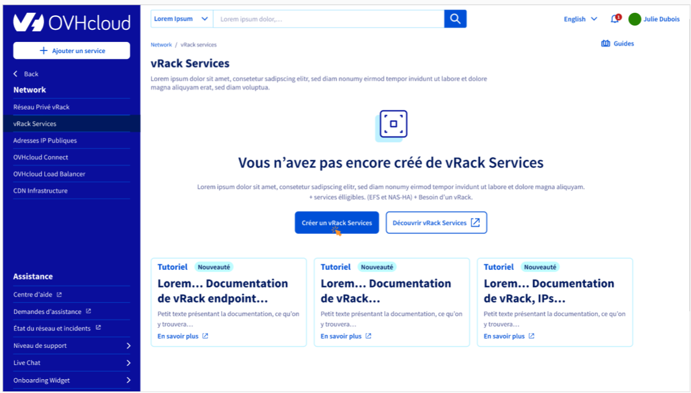 | 
|:--:| 
| When you don't have any vrack services on, you have this screen |

| 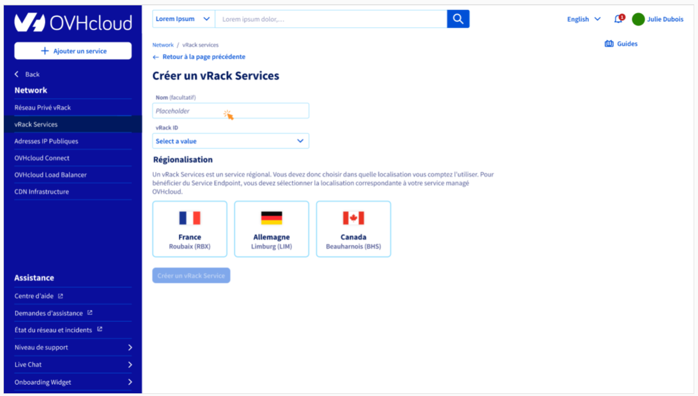 | 
|:--:| 
| First you need to define a name for this Vrack Service |

| 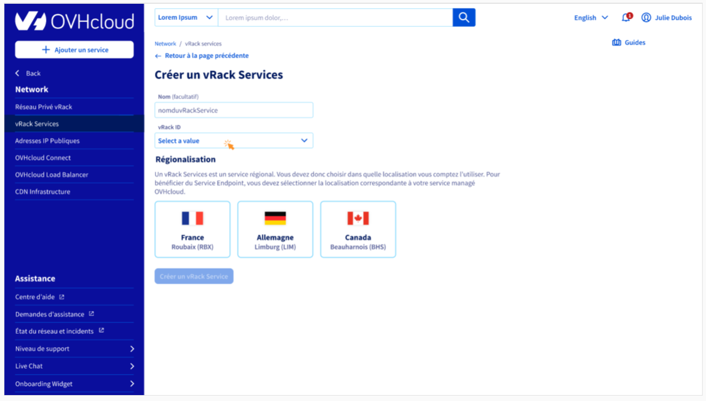 | 
|:--:| 
| Then you need to attach this service to an existing Vrack ...  |

| 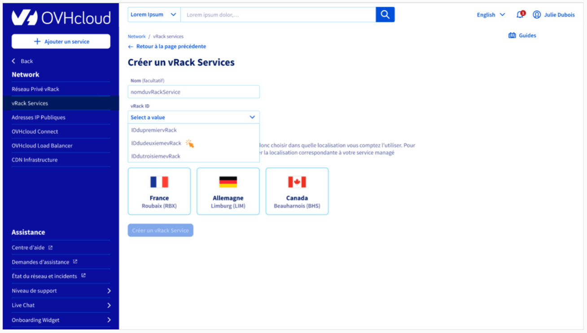 | 
|:--:| 
| ... by selecting in your Vrack existing list |

| 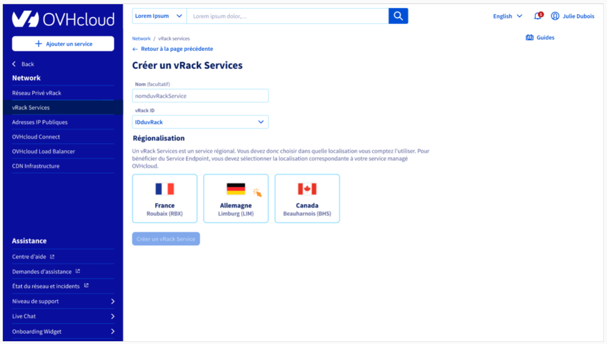 | 
|:--:| 
| Then you need to select a region |

|  | 
|:--:| 
| Now you can create your new Vrack Service |

|  | 
|:--:| 
| If you don't have a Vrack you can createone here |


| 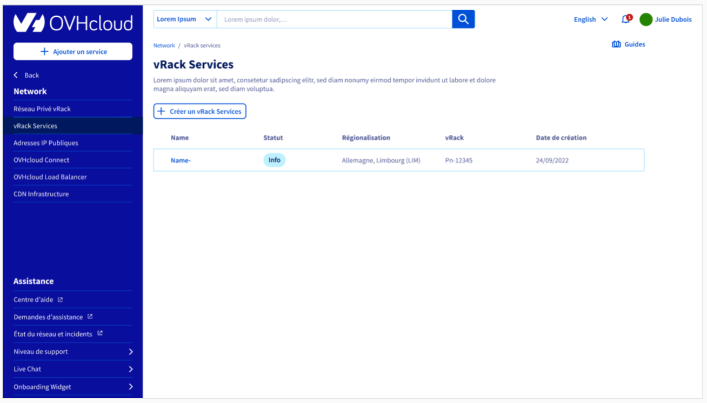 | 
|:--:| 
| Here you have a list of all your Vrack Services |

### 2. Overview

| 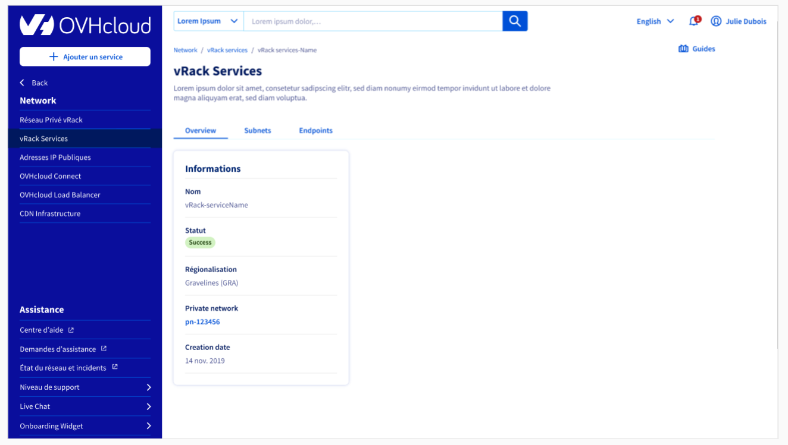 | 
|:--:| 
| Details |

| 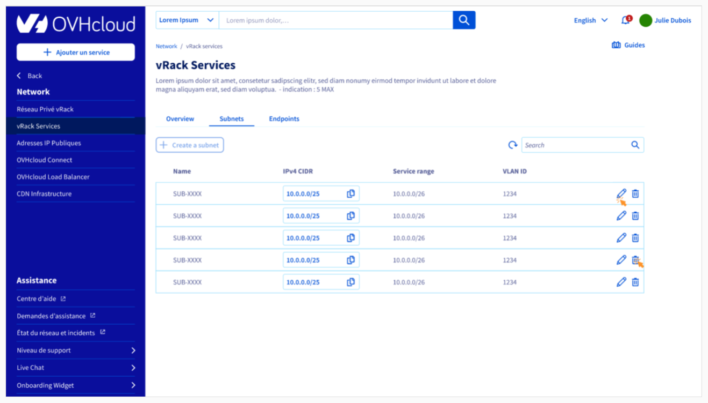 | 
|:--:| 
| Subnets listing |

| 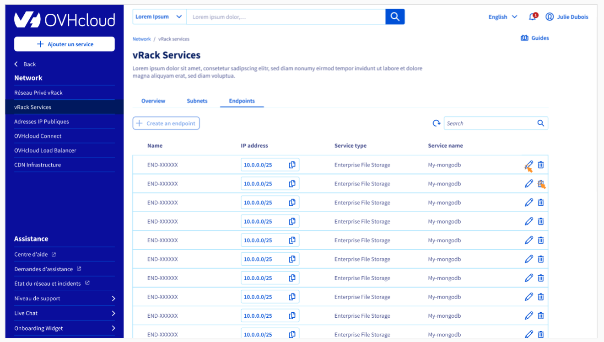 | 
|:--:| 
| Endpoints listing |


### 3. Subnet creation

| 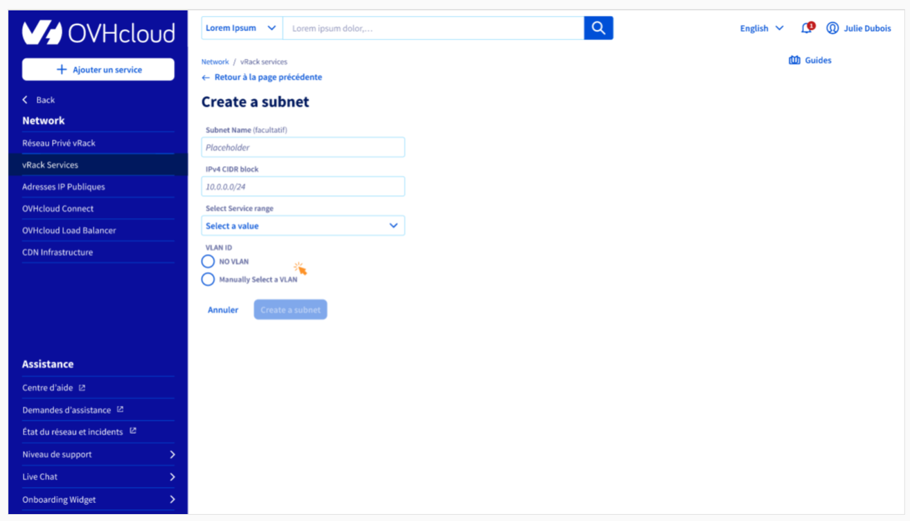 | 
|:--:| 
| 12 |

| 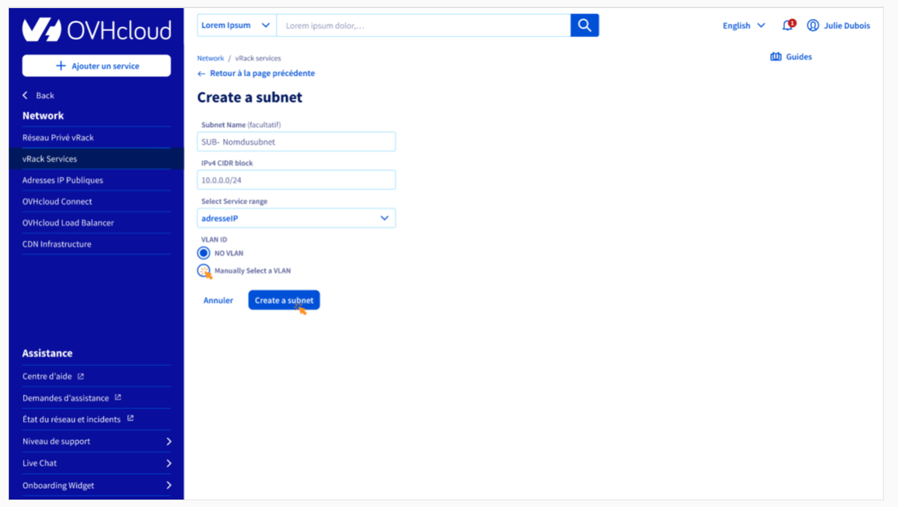 | 
|:--:| 
| 13 |

| 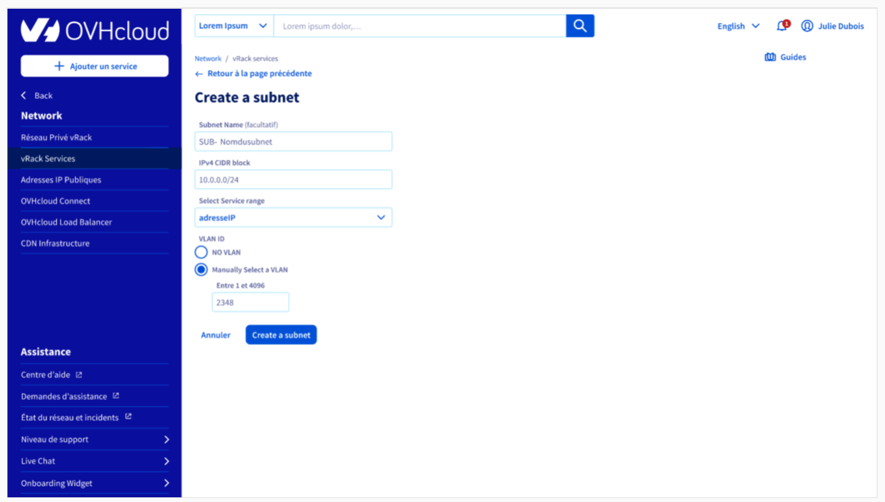 | 
|:--:| 
| 14 |

### 4. Endpoint creation


| 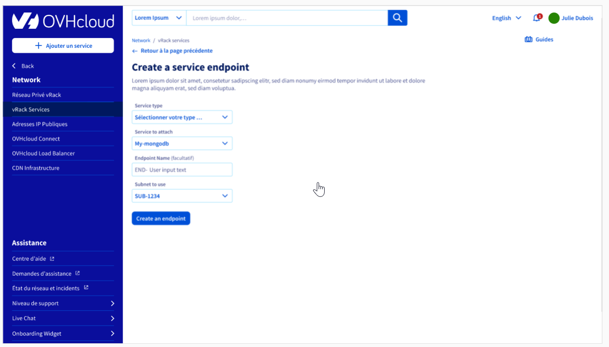 | 
|:--:| 
| 16 |


# Contraints and limits
## Vrack Services
- A vRack Services is attached to a unique Zone.
- Up to 20 vRack Services can be associated to a same vRack. So, customer is able to make reachable Managed Services from various Availability Zones.


## Subnet
- Maximum of 5 Subnets per vRack Services can be defined by the customer.
- The **range** attribut definition follows the **RFC 1918**.
- Every Subnet **range** must be unique on a given vRack Services. Overlapping is detected and discarded at Subnet creation.
- Every Subnet **vlan** must be unique on a given vRack Services. The default 'null' value can only be used by one Subnet.
- Available **serviceRange** starts from /(range_length + 1) to /29

## Service Endpoint
- To guarantee the Subnet consistency, the Service Endpoint creation request is rejected if the remaining IPs pool on the Subnet does not fit the number of IPs required by the Managed Service.
- Target Managed Service must be part of the same Zone than the vRack Services.
- Each customer is allowed to create a maximum of 20 Service Endpoints.
- Service range IPs are attributed to only one Managed Service at a time.
