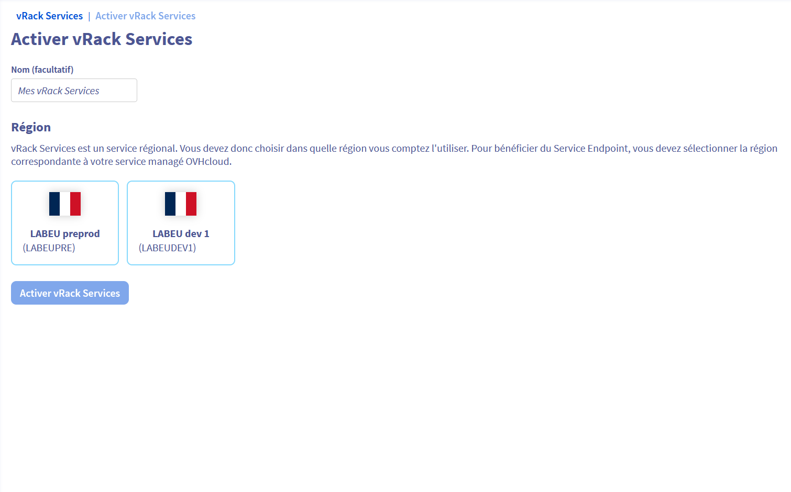
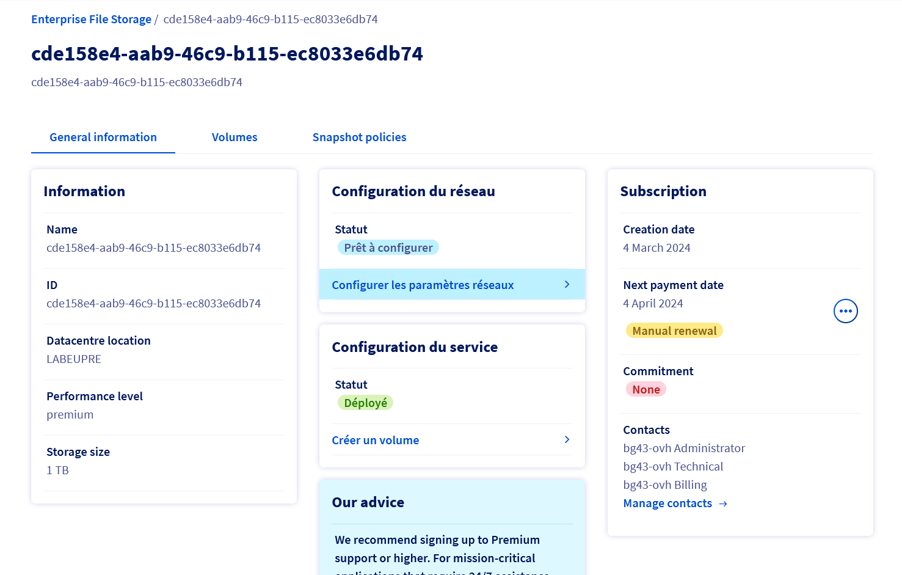
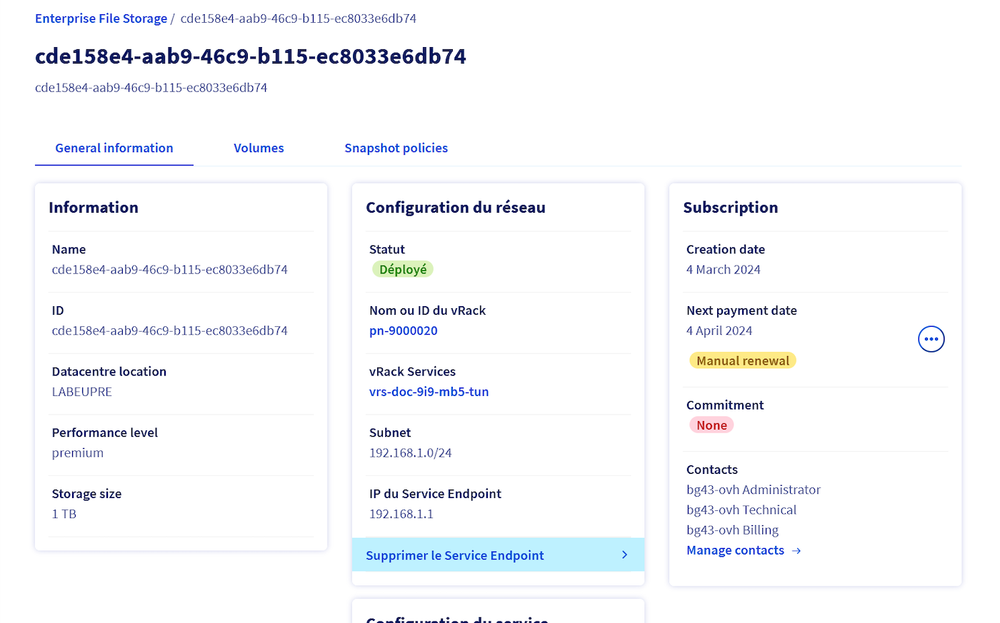
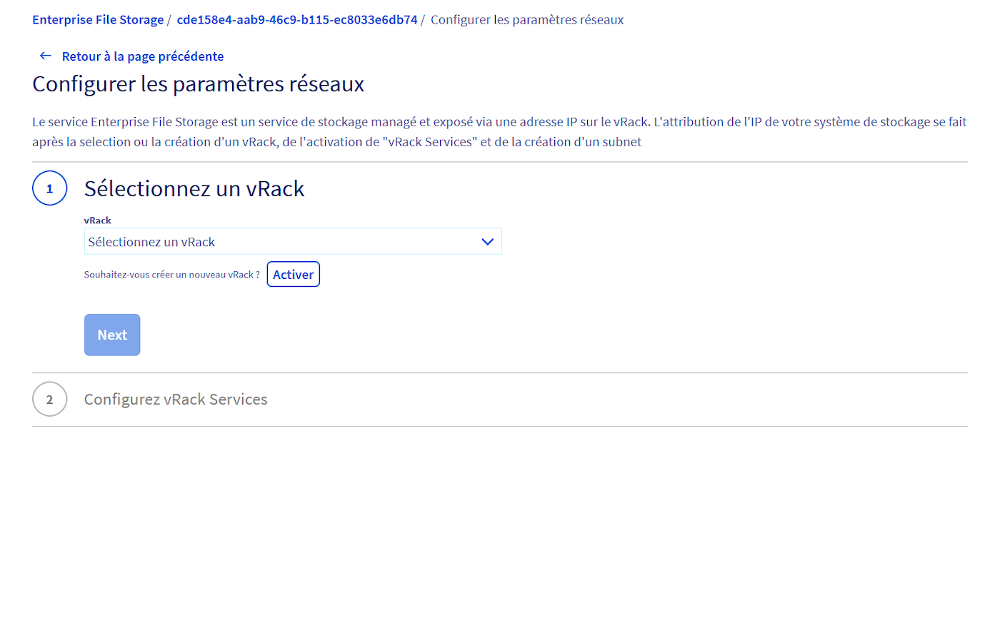
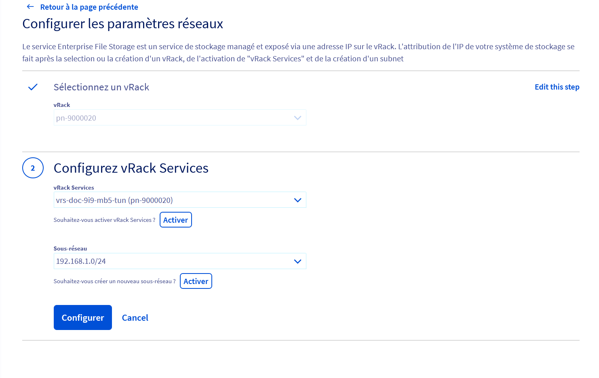
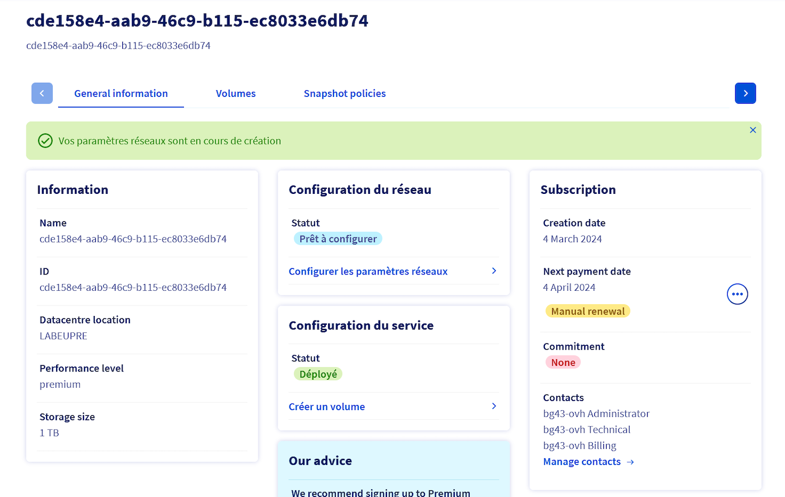
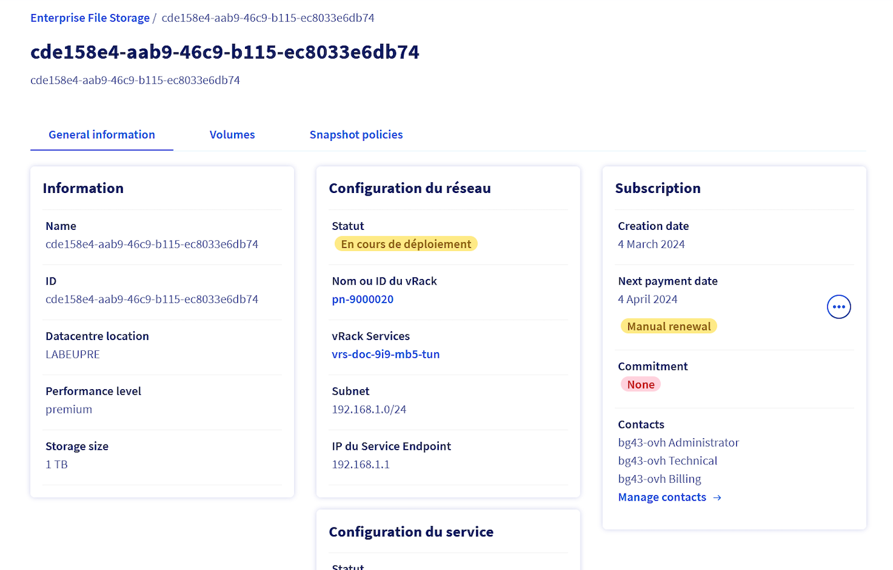
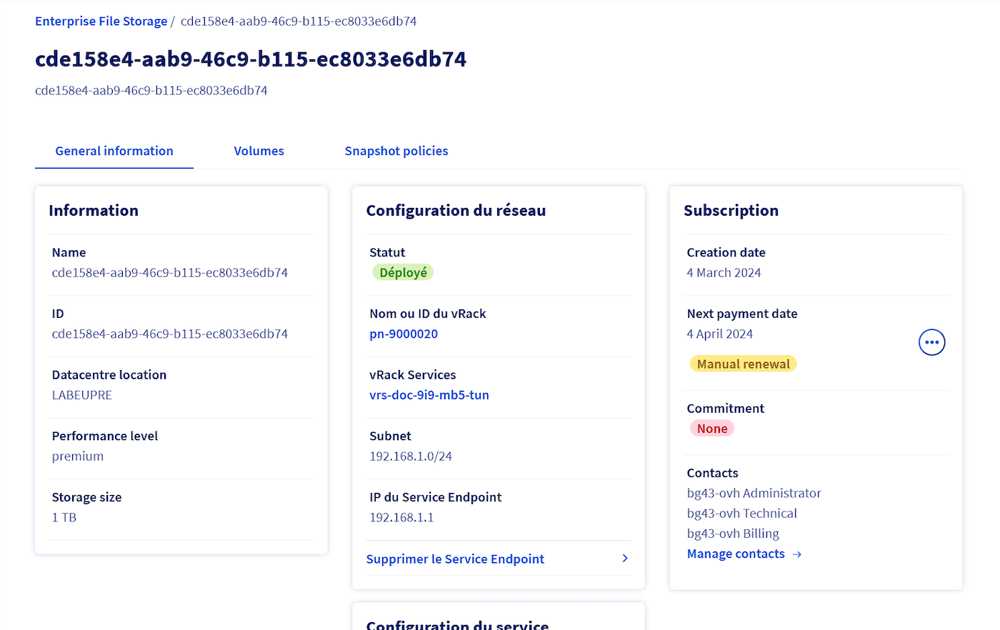
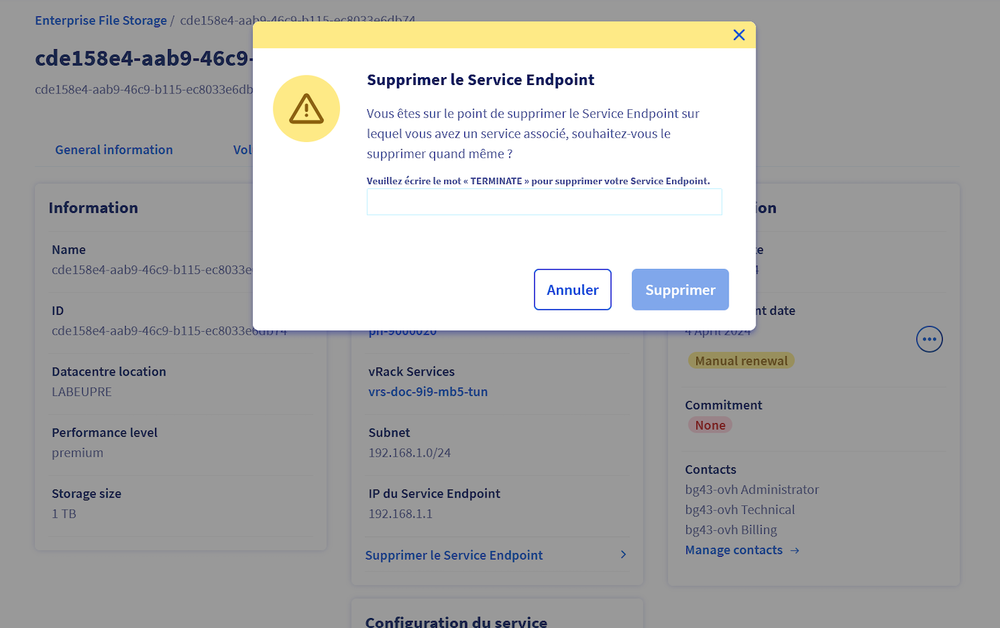

# Documentation on Enterprise File Storage with vRack Services by OVHcloud

# Overview
OVHcloud stands out for its cutting-edge solutions, in particular vRack and Enterprise File Storage (EFS), based on cutting-edge NetApp ONTAP technology. These solutions meet the crucial needs of businesses in terms of security, performance and scalability of connectivity and storage solutions. The vRack provides secure and private global connectivity, while vRack services, focused on local requirements, ensure compliance and data residency. EFS stands out for its ability to deliver high-performance file storage, which is crucial for enterprise applications requiring constant and rapid access to data. The integration between vRack and EFS, facilitated by Service Endpoint technology, enables a native and secure connection, effectively isolating data traffic from the Internet. This synergy between vRack and EFS from OVHcloud represents a complete solution, addressing the connectivity and storage challenges faced by businesses, while laying the foundations for a secure, high-performance and ready IT infrastructure.
In this article, we also present the actions that can be carried out via the screens available in the Manager, offering users a detailed overview and practical management of their services.

    

# Key Benefits

- **Native Private Connectivity:** Enjoy a secure and isolated connection thanks to integration with the vRack private network by OVHcloud.
- **High Performance:** The service relies on NetApp ONTAP technology to deliver optimal performance in terms of speed and reliability.
- **High Availability:** Thanks to an active-active architecture, the solution ensures high availability, essential for critical operations.

# With Vrack Services as entry point   

  
<b>List of your VRacks Services</b> 

    
{.thumbnail}

    
  
<b>Overview </b> 

    
{.thumbnail}

---

{.thumbnail}

---

{.thumbnail}

---

{.thumbnail}

  
<b>VRack Service Creation</b> 

...
    

  
<b>Subnet creation</b> 

    ...

  
<b>Endpoint creation</b> 

    ...

# With Enterprise File Storage as entry point   

  
<b>Overview</b> 
   
When you don't have any network configuration, the overview section, mainly network configuration looks like this:   
    
{.thumbnail}

---

When you have network configuration, the overview section, mainly network configuration looks like this:   
    
{.thumbnail}

  
<b>Network Configuration</b> 
   

{.thumbnail}

---

{.thumbnail}

---

{.thumbnail}

---

{.thumbnail}

  
<b>Statuses</b> 
   

{.thumbnail}

---

{.thumbnail}

---

{.thumbnail}

  
<b>Remove Service Endpoint</b> 
   

{.thumbnail}

---

{.thumbnail}

# Contraints and limits
## Vrack Services
- A vRack Services is attached to a unique Zone.
- Up to 20 vRack Services can be associated to a same vRack. So, customer is able to make reachable Managed Services from various Availability Zones.

## Subnet
- Maximum of 5 Subnets per vRack Services can be defined by the customer.
- The **range** attribut definition follows the **RFC 1918**.
- Every Subnet **range** must be unique on a given vRack Services. Overlapping is detected and discarded at Subnet creation.
- Every Subnet **vlan** must be unique on a given vRack Services. The default 'null' value can only be used by one Subnet.
- Available **serviceRange** starts from /(range_length + 1) to /29

## Service Endpoint
- To guarantee the Subnet consistency, the Service Endpoint creation request is rejected if the remaining IPs pool on the Subnet does not fit the number of IPs required by the Managed Service.
- Target Managed Service must be part of the same Zone than the vRack Services.
- Each customer is allowed to create a maximum of 20 Service Endpoints.
- Service range IPs are attributed to only one Managed Service at a time.

# Go further

Join our community of users on <https://community.ovh.com/en/>.
