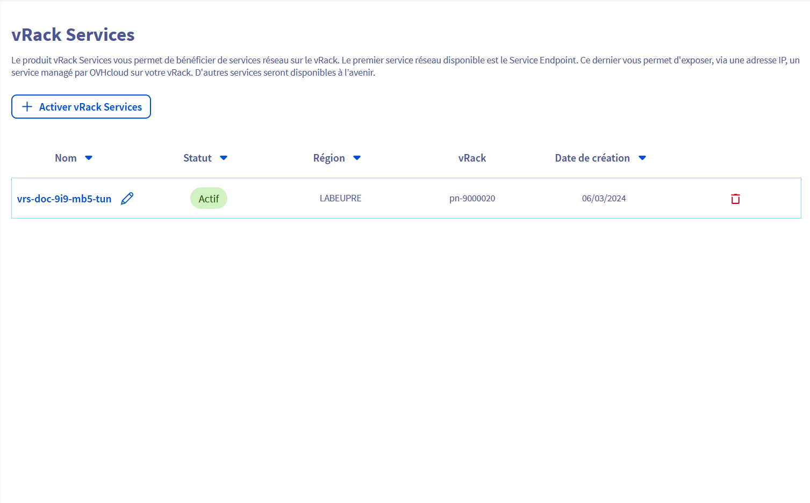
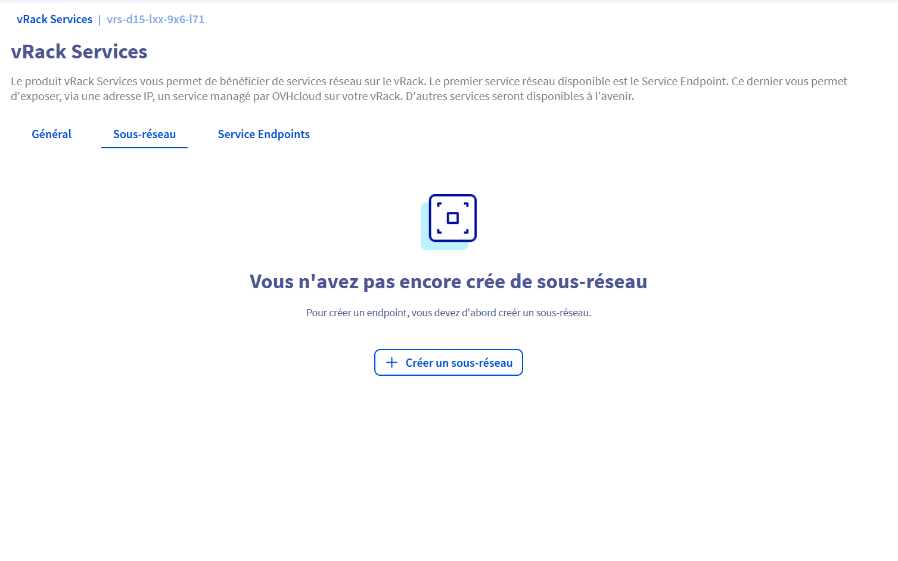
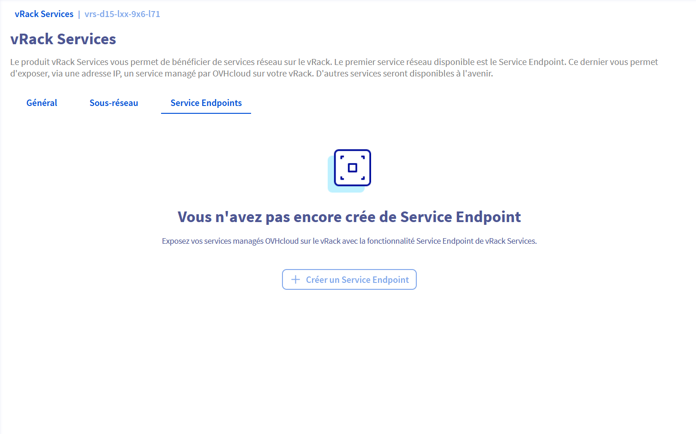
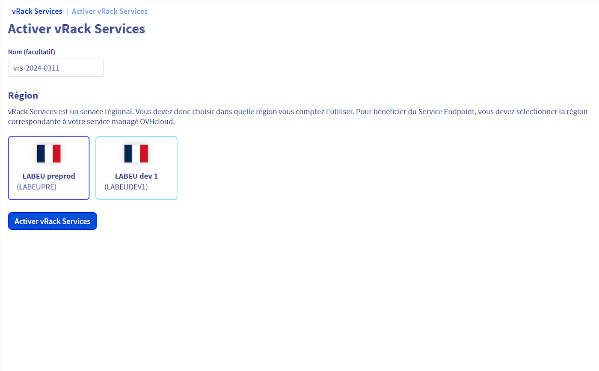
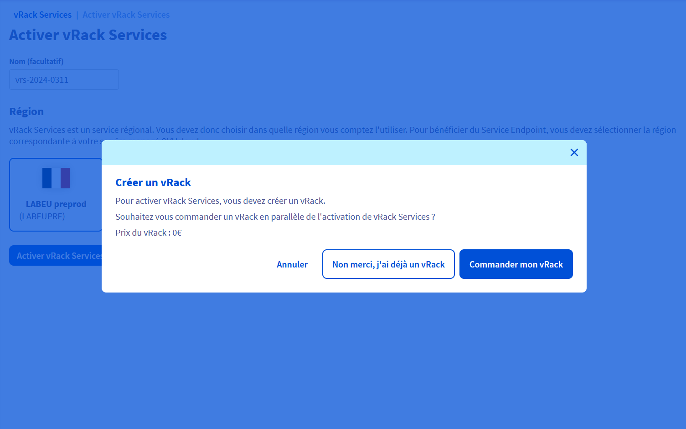
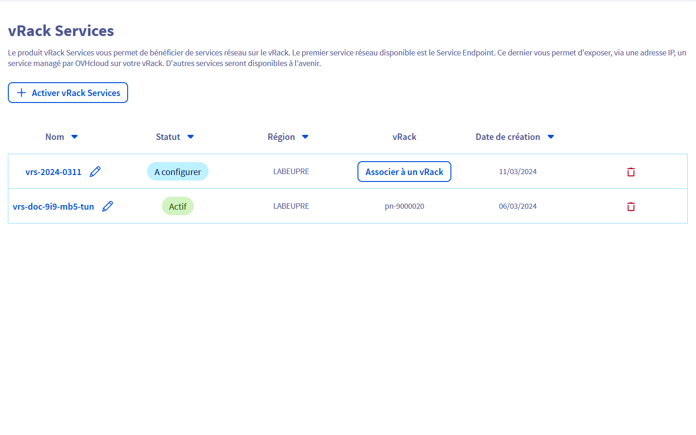
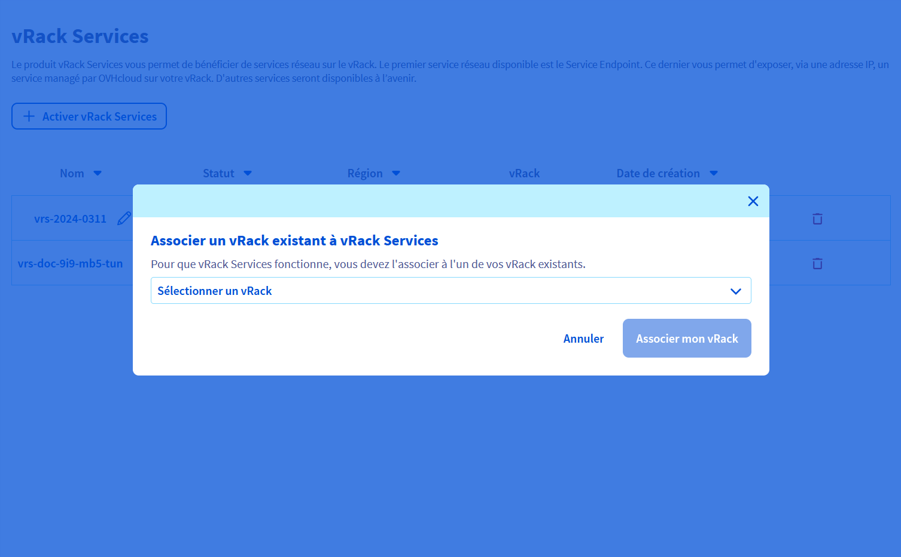
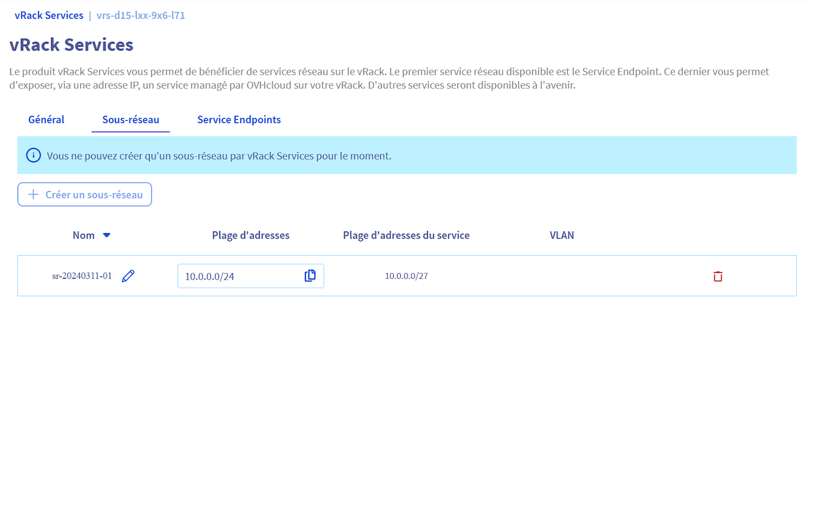
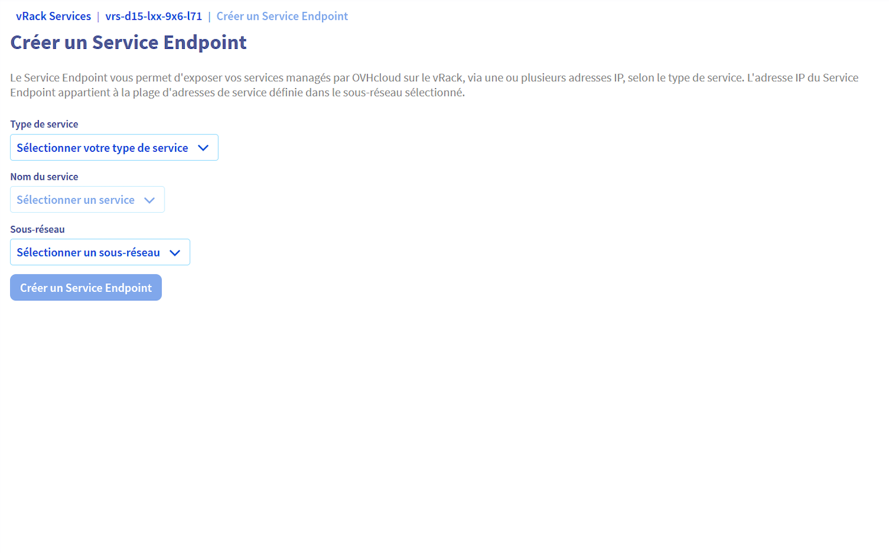

## Introduction

Le produit vRack Services fournit une gamme de services réseaux pour votre vRack. Le premier de ces services réseau est le Service Endpoint. Ce dernier vous permet d'exposer un service managé par OVHcloud (par exemple un service de stockage géré par OVHcloud de type Enterprise File Storage) avec une adresse IP privée dans un sous-réseau spécifique, sur votre vRack. De cette façon, vous vous assurez que toutes les communications avec votre service managé restent privées et sécurisées, car elles ne quittent pas votre réseau privé, qui est isolé des autres clients et du réseau public. Il est également simple et rapide à configurer, soit via l'API, soit via le panneau de contrôle. Le premier service managé qui prend en charge Service Endpoint est Enterprise File Storage (lien). De nombreux autres services managés OVHcloud prendront en charge Service Endpoint à l’avenir.

Pour plus d'informations sur le réseau privé vRack veuillez consulter (doc...) (web : https://www.ovhcloud.com/fr/network/vrack/)

(place de la dernière version du schéma)

## Objectif

Cet article vous explique comment exposer votre service managé sur le vRack avec le produit vRack Services.

## Overview
3 Composants Principaux de la Configuration Réseau   

<ins>1. vRack Service</ins>   
Le service vRack constitue la couche fondamentale de votre configuration réseau, nécessitant une activation dans une région choisie. Ce choix influence l'emplacement physique de vos ressources, affectant ainsi la latence, la conformité et la souveraineté des données. vRack facilite les interconnexions sécurisées et isolées des dispositifs et services à travers les data centers, optimisant l'organisation et la sécurité du réseau.
   
<ins>2. Sous-réseau</ins>   
Les sous-réseaux divisent un réseau plus large en segments gérables, chacun disposant d'une plage spécifique d'adresses IP. Attribuer des sous-réseaux à vos services aide à organiser le trafic réseau, améliore la performance et renforce la sécurité. Cette division logique permet une gestion efficace des ressources et du flux de trafic au sein de votre réseau.
   
<ins>3. Service Endpoint</ins>   
Les Services Endpoint relient vos services au réseau en les associant à un sous-réseau, ce qui attribue automatiquement une adresse IP unique à chaque service. Cette configuration simplifie le déploiement des services, assure un accès facile et permet la mise en place de contrôles d'accès spécifiques et de mesures de sécurité.


## En pratique

### Manager


<details>

  <summary><b>Liste de vos VRacks Services</b> </summary>

<blockquote>
    
{.thumbnail}

</blockquote>

</details>


<details>
    
  <summary><b>Vue d'ensemble </b> </summary>

{.thumbnail}

---

{.thumbnail}

---

{.thumbnail}
  
    

</details>

<details>
  <summary><b>Création d'un VRack Service</b> </summary>

{.thumbnail}

---

{.thumbnail}

---

{.thumbnail}

---

{.thumbnail}
    
</details>

<details>
  <summary><b>Création d'un Sous-réseau</b> </summary>

    

{.thumbnail}

---

{.thumbnail}

---

{.thumbnail}

</details>


<details>
  <summary><b>Création d'un Service Endpoint</b> </summary>

{.thumbnail}
    

</details>


---

### API

Cette section aborde les applications pratiques et les actions qui peuvent être effectuées via l'API. Cela inclut la création de sous-réseaux et de Service Endpoint, l'association de services vRack à un vRack et la gestion de ces services à l'aide d'instructions détaillées. Ces actions mettent en évidence les capacités opérationnelles des services vRack, en démontrant comment ils peuvent être exploités pour améliorer et sécuriser votre infrastructure réseau.

#### Basics

<details>
  <summary><b>1. Création d'un sous-réseau</b> </summary>
    
<blockquote>
    
  Request Subnet creation (always synchronous)

```bash
$ curl -XPOST -d '{"range": "172.21.0.0/27", "serviceRange": "172.21.0.0/29", "vlan": "10"}' https://api.ovh.com/2.0/vrackServices/vrs-1234567/subnet
```

> <details>
>   <summary>Click here to see the result</summary>
> 
> ```console
> HTTP/1.1 201 Created
> Location: https://api.ovh.com/2.0/vrackServices/vrs-2034567/subnet/sub-4567890
> {
>     "id": "sub-4567890",
>     "resourceStatus": "READY",
>     "targetSpec" : {
>         "displayName": "rbx_nominal_services",
>         "serviceRange": "172.21.0.0/29"
>     },
>     "currentState": {
>         "displayName": "rbx_nominal_services",
>         "vrackServicesId": "vrs-1234567",
>         "range": "172.21.0.0/27",
>         "serviceRange": "172.21.0.0/29",
>         "vlan": 10,
>     },
>     "createdAt": "2024-01-19T14:53:22.323452Z",
>     "updatedAt": "2024-01-19T14:53:22.323452Z"
> }
> ```    
>     
> </details>

</blockquote>

</details>


<details>
  <summary><b>2. Create a Service Endpoint </b>     </summary>

<blockquote>

1. <ins>Request Service Endpoint creation (asynchronous as a vRack association exists)</ins>   
Here we use the second managed serice listed previously in 3.1 section "List all Managed Services compatible with the vRack Services"

```bash
$ curl -XPOST -d '{"serviceType": "entreprise-file-storage", "serviceId": "1fd7bf30-6722-4658-b3db-
92e269185f46"}' https://api.ovh.com/2.0/vrackServices/vrs-1234567/subnet/sub-4567890/serviceEndpoint
```  

> <details>
>   <summary>Click here to see the result</summary>
>     
> ```console
> HTTP/1.1 201 Created
> Location: https://api.ovh.com/2.0/vrackServices/vrs-1234567/subnet/sub-4567890/serviceEndpoint/end-5678901
> {
>   "id": "end-5678901",
>   "resourceStatus": "CREATING",
>   "targetSpec": {
>     "displayName": "secured_data"
>   },
>   "currentState": {
>     "displayName": "secured_data",
>     "subnetId": "sub-4567890",
>     "serviceType": "entreprise-file-storage",
>     "serviceId": "1fd7bf30-6722-4658-b3db-92e269185f46",
>     "endpoints": {
>       1: {
>         "ip": "172.21.0.1",
>         "description": null        // Fetched from the Managed Service 'create' event
>       },
>       2: {
>         "ip": "172.21.0.2",
>         "description": null        // Fetched from the Managed Service 'create' event
>       },
>       3: {
>         "ip": "172.21.0.3",
>         "description": null        // Fetched from the Managed Service 'create' event
>       }
>     }
>   },
>   "createdAt": "2024-01-19T14:54:22.323452Z",
>   "updatedAt": "2024-01-19T14:54:22.323452Z"
> }
> ```
> 
> </details>

2. <ins>Request a second Service Endpoint creation</ins>   
Just in order to show you the behavior when you want launch a new request during the execution of the previous one.

```bash
$ curl -XPOST -d '{"serviceType": "entreprise-file-storage", "serviceId": "95569efa-61f2-4deb-8beea60b4213e1dc"}' https://api.ovh.com/2.0/vrackServices/vrs-1234567/subnet/sub-4567890/serviceEndpoint
```


> <details>
>   <summary>Click here to see the result</summary>
> 
>     
> ```console
> HTTP/1.1 409 Conflict
> {
>   "class": "Client::Conflict::ResourceBusy",
>   "message": "Subnet sub-1234567 is busy",
>   "details": {
>     "subnetId": "sub-1234567"
>   }
> }
> ```
> 
> </details>

3. <ins>So you can fetch resource status of the first requested Service Endpoint.</ins>   
In this way we can see the status of the resource is now READY
   
```bash
$ curl -XGET https://api.ovh.com/2.0/vrackServices/vrs-1234567/subnet/sub-4567890/serviceEndpoint/end-5678901
```


> <details>
>   <summary>Click here to see the result</summary>
>      
> ```console
> {
>   "id": "end-5678901",
>   "resourceStatus": "READY",
>   "targetSpec": {
>     "displayName": "critical_business"
>   },
>   "currentState": {
>     "displayName": "critical_business",
>     "subnetId": "sub-4567890",
>     "serviceType": "entreprise-file-storage",
>     "serviceId": "1fd7bf30-6722-4658-b3db-92e269185f46",
>     "endpoints": {
>       1: {
>         "ip": "172.21.0.1",
>         "description": null        // Fetched from the Managed Service 'create' event
>       },
>       2: {
>         "ip": "172.21.0.2",
>         "description": null        // Fetched from the Managed Service 'create' event
>       },
>       3: {
>         "ip": "172.21.0.3",
>         "description": null        // Fetched from the Managed Service 'create' event
>       }
>     }
>   },
>   "createdAt": "2024-01-19T14:54:22.323452Z",
>   "updatedAt": "2024-01-19T14:54:22.323452Z"
> }
> ```
> 
> </details>

</blockquote>

</details>


<details>
  <summary><b>3. Associate to a vRack</b>    </summary>

<blockquote>

1. <ins>Check eligibility to the vRack</ins>

```bash
$ curl -XGET https://api.ovh.com/1.0/vrack/pn-12345/allowedServices?serviceFamily=vrackServices
```  

> <details>
>   <summary>Click here to see the result</summary>
>    
> ```console
> {
>   "ipLoadbalancing": null,
>   "dedicatedConnect": null,
>   "dedicatedServer": null,
>   "vrackServices": [
>     "vrs-2345678",
>     "vrs-1234567"
>   ],
>   "ip": null,
>   "dedicatedCloudDatacenter": null,
>   "ovhCloudConnect": null,
>   "cloudProject": null,
>   "dedicatedCloud": null,
>   "legacyVrack": null,
>   "dedicatedServerInterface": null
> }
> ```
> 
> </details>


2. <ins>Request vRack association</ins>

```bash
$ curl -XPOST -d '{"vrackServices": "vrs-1234567"}' https://api.ovh.com/1.0/vrack/pn-12345/vrackServices
```

> <details>
>   <summary>Click here to see the result</summary>
> 
>     
> ```console
> [
>     todoDate: "2024-01-19T14:51:22.323452Z"
>     status: "init"
>     serviceName: "pn-12345"
>     orderId: null
>     lastUpdate: "2024-01-19T14:51:22.323452Z"
>     targetDomain: "vrs-1234567"
>     function: "addVrackServices"
>     id: 3456789
> ]
> ```
> 
> </details>


3. <ins>Fetch asynchronous task because it can takes few secondes</ins>
   Perhaps you can have some error during the execution of this task
   
```bash
$ curl -XGET https://api.ovh.com/1.0/vrack/pn-12345/task/3456789
```

> <details>
>   <summary>Click here to see the result</summary>
>     
> ```console
> HTTP/1.1 404 Not Found
> {
>     "message": "The requested object (taskId = 3456789) does not exist"
> }
> ```
>     
> </details>
   
4. <ins>When this synchronous task is done you can fetch the vRack Services status</ins>

```bash
$ curl -XGET https://api.ovh.com/2.0/vrackServices/vrs-1234567
```

> <details>
>   <summary>Click here to see the result</summary>
> 
>     
> ```console
> {
>   "id": "vrs-1234567",
>   "resourceStatus": "READY",
>   "targetSpec": {
>     "displayName": "Sample_Display_Name"
>   },
>   "currentState": {
>     "productStatus": "ACTIVE",
>     "displayName": "Sample_Display_Name",
>     "nicAdmin": "dp12345-ovh",
>     "nicTech": "dp12345-ovh",
>     "vrackId": "pn-12345",
>     "zone": "rbx",
>     "region": "eu-east-1",
>     "az": "eu-east-1-a"
>   },
>   "createdAt": "2024-01-19T14:40:22.323452Z",
>   "updatedAt": "2024-01-19T14:52:22.323452Z"
> }
> ```
>     
> </details>

</blockquote>

</details>


#### Others

<details>
  <summary><b>1. Extend the Subnet service range</b></summary>

<blockquote>

1. <ins>Create a 'extend-subnet-service-range.json' text file with these informations inside</ins>

```bash
$ cat extend-subnet-service-range.json
```

> <details>
>   <summary>Click here to see the result</summary>
> 
> ```console
> {
>   "targetSpec": {
>     "displayName": "rbx_nominal_services",
>     "serviceRange": "172.21.0.0/28"
>   }
> }
> ```
> 
> </details>

2. <ins>Request service range extension (asynchronous)</ins>

```bash
$ curl -XPUT -d@extend-subnet-service-range.json https://api.ovh.com/2.0/vrackServices/vrs-1234567/subnet/sub-
4567890
```

> <details>
>   <summary>Click here to see the result</summary>
>   
> ```console
> {
>   "id": "sub-4567890",
>   "resourceStatus": "UPDATING",
>   "targetSpec": {
>     "displayName": "rbx_nominal_services",
>     "serviceRange": "172.21.0.0/28"
>   },
>   "currentState": {
>     "displayName": "rbx_nominal_services",
>     "vrackServicesId": "vrs-1234567",
>     "range": "172.21.0.0/27",
>     "serviceRange": "172.21.0.0/29",
>     "vlan": 10
>   },
>   "createdAt": "2024-01-19T14:53:22.323452Z",
>   "updatedAt": "2024-01-19T14:58:22.323452Z"
> }
> ```
> 
> </details>

3. <ins>Fetch final state</ins>
   
```bash
$ curl -XGET https://api.ovh.com/2.0/vrackServices/vrs-1234567/subnet/sub-4567890
```

> <details>
>   <summary>Click here to see the result</summary>
>   
> ```console
> {
>   "id": "sub-4567890",
>   "resourceStatus": "READY",
>   "targetSpec": {
>     "displayName": "rbx_nominal_services",
>     "serviceRange": "172.21.0.0/28"
>   },
>   "currentState": {
>     "displayName": "rbx_nominal_services",
>     "vrackServicesId": "vrs-1234567",
>     "range": "172.21.0.0/27",
>     "serviceRange": "172.21.0.0/28",
>     "vlan": 10
>   },
>   "createdAt": "2024-01-19T14:53:22.323452Z",
>   "updatedAt": "2024-01-19T14:58:33.323452Z"
> }
> ```
> 
> </details>

</blockquote>

</details>


<details>
  <summary><b>2. Dissociate the vRack Services from the vRack</b></summary>

<blockquote>
  
1. <ins>Request vRack disassociation</ins>

```bash
$ curl -XDELETE https://api.ovh.com/1.0/vrack/pn-12345/vrackServices/vrs-1234567
```

> <details>
>   <summary>Click here to see the result</summary>
> 
> ```console
> {
>     todoDate: "2022-05-04T14:59:22.323452Z"
>     status: "init"
>     serviceName: "pn-12345"
>     orderId: null
>     lastUpdate: "2022-05-04T14:58:55.323452Z"
>     function: "removeVrackServices"
>     id: 5678901
> }
> ```
> 
> </details>


2. <ins>Fetch asynchronous task using the created task id</ins>

```bash
$ curl -XGET https://api.ovh.com/1.0/vrack/pn-12345/task/5678901
```


> <details>
>   <summary>Click here to see the result</summary>
> 
> ```console
> HTTP/1.1 404 Not Found
> {
>     "message": "The requested object (taskId = 3205546) does not exist"
> }
> ```
> 
> </details>

3. <ins>Asynchronous task done -> Fetch the vRack Services status</ins>

```bash
$ curl -XGET https://api.ovh.com/2.0/vrackServices/vrs-1234567
```


> <details>
>   <summary>Click here to see the result</summary>
> 
> ```console
> {
>     "id": "vrs-1234567",
>     "resourceStatus": "READY",
>     "targetSpec" : {
>         "displayName": "Backup_infra.",
>     },
>     "currentState": {
>         "productStatus": "DRAFT",
>         "displayName": "Backup_infra.",
>         "nicAdmin": "dp12345-ovh",
>         "nicTech": "dp12345-ovh",
>         "vrackId": null,
>         "zone": "rbx",
>         "region": "eu-east-1",
>         "az": "eu-east-1-a"
>     },
>     "createdAt": "2024-01-19T14:40:22.323452Z",
>     "updatedAt": "2024-01-19T14:59:55.323452Z"
> }
> ```
> 
> </details>

</blockquote>

</details>


<details>
  <summary><b>3. Suspend the vRack Services</b></summary>

<blockquote>
    
  Suspend triggered on Agora 'SUSPENSION' event consumption
Here we have the same result than dissociation

</blockquote>

</details>


<details>
  <summary><b>4. Delete the vRack Services</b></summary>

<blockquote>

   Deletion triggered on Agora 'TERMINATION' event consumption
   Then every resources deleted in cascade

</blockquote>

</details>


#### Errors

<details>
  <summary><b>1. Create a Service Endpoint with a wrong Managed Service localization</b></summary>

<blockquote>  

```bash
$ curl -XPOST -d '{"serviceType": "entreprise-file-storage", "serviceId": "95569efa-61f2-4deb-8beea60b4213e1dc"}'
https://api.ovh.com/2.0/vrackServices/vrs-1234567/subnet/sub-4567890/serviceEndpoint
```

> <details>
>   <summary>Click here to see the result</summary>
> 
> ```console
> HTTP/1.1 400 Bad Request
> {
>   "class": "Client::BadRequest::LocalizationMismatch",
>   "message": "Service 95569efa-61f2-4deb-8bee-a60b4213e1dc zone (rbx) does not match vRack Services vrs-2034567 zone (sbg)",
>   "details": {
>     "serviceId": "95569efa-61f2-4deb-8bee-a60b4213e1dc",
>     "vrackServiceZone": "rbx",
>     "vrackServiceId": "vrs-2034567",
>     "serviceZone": "sbg"
>   }
> }
> ```
> 
> </details>

</blockquote>

</details>


<details>
  <summary><b>2. Create a Service Endpoint while Subnet ServiceRange is fully allocated</b></summary>

<blockquote>
  
```bash
$ curl -XPOST -d '{"serviceType": "entreprise-file-storage", "serviceId": "2d65f8e0-edde-448f-b9-
a85404eb52"}' https://api.ovh.com/2.0/vrackServices/vrs-1234567/subnet/sub-4567890/serviceEndpoint
```

> <details>
>   <summary>Click here to see the result</summary>
> 
> ```console
> HTTP/1.1 400 Bad Request
> {
>   "class": "Client::BadRequest::ServiceRangeFullyAllocated",
>   "message": "Service 2d65f8e0-edde-448f-b9-a85404eb52 requires 2 IPs while 0 IP(s) still available on the Subnet sub-2778273",
>   "details": {
>     "serviceId": "2d65f8e0-edde-448f-b9-a85404eb52",
>     "requestedIPsCount": "2",
>     "availableIPsCount": "0",
>     "SubnetId": "sub-4567890"
>   }
> }
> ```
> 
> </details>

</blockquote>

</details>


<details>
  <summary><b>3. Delete a Subnet that is associated to Service Endpoints</b></summary>

<blockquote>

```bash
$ curl -XDELETE https://api.ovh.com/2.0/vrackServices/vrs-1234567/subnet/sub-4567890
```

> <details>
>   <summary>Click here to see the result</summary>
> 
> ```console
> HTTP/1.1 409 Conflict
> {
>   "class": "Client::Conflict::SubnetNotEmpty",
>   "message": "Subnet sub-4567890 contains 3 Service Endpoints",
>   "details": {
>     "subnetId": "sub-4567890",
>     "serviceEndpointsCount": 3
>   }
> }
> ```
> 
> </details>

</blockquote>

</details>

---

## Product configuration experience

Behind the scenes, the status of VrackServices (VrackServices.productStatus) mirrors the state of the infrastructure configuration. This configuration is initiated once the following three criteria are met:

- The product is not suspended.
- There is an existing vRack association.
- At least one Service Endpoint has been set up.

If any of these requirements are no longer satisfied, the configuration is withdrawn from the OneAPI (either marked as DRAFT or SUSPENDED).

As an helper, a summary of the configuration is available with the VrackServices.productStatus attribut.
It answers the question `does my current configuration makes the Managed Services to be reachable from the vRack ?`   
- **ACTIVE:** yes, it does
- **DRAFT:** no, either a Service Endpoint needs to be created or a vRack needs to be associated to the vRack Services
- **SUSPENDED:** no, product is in Agora `suspension` state

---

## Contraints and limits
### Vrack Services
- A vRack Services is attached to a unique Zone.
- Up to 20 vRack Services can be associated to a same vRack. So, customer is able to make reachable Managed Services from various Availability Zones.


### Subnet
- Maximum of 5 Subnets per vRack Services can be defined by the customer.
- The **range** attribut definition follows the **RFC 1918**.
- Every Subnet **range** must be unique on a given vRack Services. Overlapping is detected and discarded at Subnet creation.
- Every Subnet **vlan** must be unique on a given vRack Services. The default 'null' value can only be used by one Subnet.
- Available **serviceRange** starts from /(range_length + 1) to /29

### Service Endpoint
- To guarantee the Subnet consistency, the Service Endpoint creation request is rejected if the remaining IPs pool on the Subnet does not fit the number of IPs required by the Managed Service.
- Target Managed Service must be part of the same Zone than the vRack Services.
- Each customer is allowed to create a maximum of 20 Service Endpoints.
- Service range IPs are attributed to only one Managed Service at a time.


## Go further

Join our community of users on <https://community.ovh.com/en/>.
