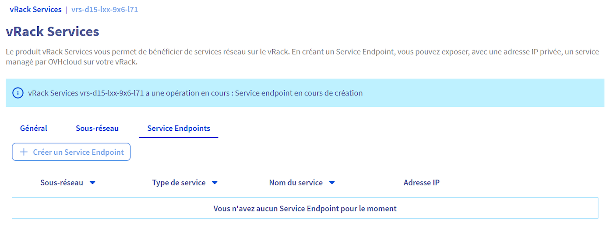

## Introduction

Le produit vRack Services vous permet de bénéficier de services réseau sur le réseau privé vRack. En créant un Service Endpoint, vous pouvez exposer, avec une adresse IP privée, un service managé par OVHcloud sur votre vRack. De cette façon, vous vous assurez que toutes les communications avec votre service managé restent privées et sécurisées, car elles ne quittent pas votre réseau privé, qui est isolé des autres clients et du réseau public. Il est également simple et rapide à configurer, soit via l'API, soit via l'espace client. Le premier service managé qui prend en charge Service Endpoint est [Enterprise File Storage](https://www.ovhcloud.com/fr/storage-solutions/enterprise-file-storage/){.external}. D'autres services managés OVHcloud prendront en charge le Service Endpoint à l’avenir.

Pour plus d'informations sur le réseau privé vRack veuillez consulter cette [page](https://www.ovhcloud.com/fr/network/vrack/){.external}.

{.thumbnail}

## Objectif

Cet article vous explique comment exposer votre service managé sur le vRack avec le produit vRack Services, en utilisant la fonctionnalité Service Endpoint.

## Overview
Il y 3 composants principaux dans la mise en place de cette configuration:

1.&nbsp;<ins>vRack Service</ins>   
Le produit vRack Services est le composant principal de votre configuration, nécessitant une activation dans une région choisie, ainsi qu'une association à un vRack. La région choisie doit correspondre à l'emplacement de votre service managé. Le service managé sera disponible à partir de la région choisie et accessible à tous serveurs connectés au vRack, quelque soit la région.
   
2.&nbsp;<ins>Sous-réseau</ins>  
Le produit vRack Services utilise le concept de sous-réseau (ou subnet) afin de définir une plage d'addresse IP privée utilisable pour communiquer avec les services managés. De manière générale, les sous-réseaux divisent un réseau plus large en segments, chacun disposant d'une plage spécifique d'adresses IP. Cette division logique permet une gestion efficace des ressources et du flux de trafic au sein de votre réseau.
   
3.&nbsp;<ins>Service Endpoint</ins>   
Le Service Endpoint représente votre point d'accès au service managé. Il est associé à un sous-réseau et dispose d'une ou plusieurs addresses IP privées attribuées automatiquement.

## En pratique
Configurer un Service Endpoint se déroule en 3 étapes:
1. Activer et configurer vRack Services
2. Crée un sous-réseau et une plage d'adresse pour les services managés
3. Crée le Service Endpoint

Ces 3 étapes sont réalisables soit via l'API, soit via l'espace client et sont décrites en détails ci-dessous.

### Manager via le Menu vRack

<details>
  <summary><b>Création d'un vRack Service</b> </summary>

<blockquote>    

La création d'un vRack Service se déroule en lui attribuant un nom et une région.

En effet vRack Services est un service régional. Vous devez donc choisir dans quelle région vous comptez l'utiliser. Pour bénéficier du Service Endpoint, vous devez sélectionner la région correspondante à votre service managé OVHcloud.

{.thumbnail}

---

Pour activer vRack Services vous devez avoir un vRAck. Si vous n'en avez pas à cette étape il est possible d'en commander un. 
Vous n'êtes pas obligé d'un commander un à cette étape, vous pouvez le faire plus tard et revenir sur le processus de création du vRack Service.

{.thumbnail}

---

Ici, vous avez donc un état des lieux de votre de demande de création du vRack Service et pour ceux qui n'ont pas de vRAck associé, il est possible de le faire.

{.thumbnail}

---

L'association à un vRack est assez simple car il suffit simplement de sélectionner le vRack souhaité dans la liste proposée ici.

{.thumbnail}

</blockquote>    
    
</details>


<details>
  <summary><b>Création d'un Sous-réseau</b> </summary>
    
<blockquote>  

Afin de créer un sous-réseau il vous faudra renseigner 4 informations:
- Son nom
- Sa plage d'adresses
- La plage d'adresses réservée aux services managés. Par conséquent, les adresses de cette plage ne doivent pas être utilisées par d'autres nœuds connectés au vRack. La plage d'adresse de service doit être un sous-ensemble de la plage d'addresses du sous-réseau, et sa taille doit être comprise entre /27 et /29.
- Un VLAN sur lequel vous pouvez exposer ce sous-réseau. Vous pouvez très bien ne pas choisir de VLAN.

{.thumbnail}

---

Dans le cas contraire il vous sera demandé de préciser le numéro du VLAN.

{.thumbnail}

---

Ainsi, après un bref instant de mise en place vous serez en capacité de voir et surtout d'administrer ce sous-réseau en vous rendant dans cet onglet.

{.thumbnail}

</blockquote>  

</details>


<details>
  <summary><b>Création d'un Service Endpoint</b> </summary>

<blockquote>  

Les actions à mener sont très simple. En effet il suffit uniquement de renseigner 3 informations:
- Le type du Service Managé.
- Le nom du Service Managé.
- Le sous-réseau souhaité

{.thumbnail}

---

Et après un rapide moment d'attente ...

{.thumbnail}

---

... votre nouveau Service Endpoint est configuré et disponible.

{.thumbnail}

</blockquote>      

</details>


<details>

  <summary><b>Liste de vos vRacks Services</b> </summary>

<blockquote>
    
Dans cet écran vous avez la liste des différents vRack Services déclarés.

{.thumbnail}

</blockquote>

</details>


<details>
    
  <summary><b>Vue d'ensemble </b> </summary>

<blockquote>  

Dans ce premier onglet, vous avez toutes les informations générales relatives au Service vRack sélectionné.

{.thumbnail}

---

Dans cet onglet, qui ne contient aucune information lors de la création d'un Service vRack, vous avez la liste des sous-réseaux créés et disponibles pour le Service vRack sélectionné.

{.thumbnail}

---

Dans cet onglet, qui ne contient aucune information lors de la création d'un Service vRack, vous avez la liste des Services Endpoints créés et disponibles pour le Service vRack sélectionné.

Il est a noter que pour créer un Service Endpoint il faut d'abord passer par l'étape de création d'un sous-réseau.

{.thumbnail}

</blockquote>    

</details>


### Manager via le Menu Enterprise File Storage

<details>

  <summary><b>Vue d'ensemble</b> </summary>

<blockquote>
    
Sans configuration réseau

{.thumbnail}

---

Avec configuration réseau

{.thumbnail}

</blockquote>

</details>


<details>

  <summary><b>Configurer les paramètres réseaux</b> </summary>

<blockquote>

{.thumbnail}

--- 

{.thumbnail}

--- 

{.thumbnail}


</blockquote>

</details>


<details>

  <summary><b>Retirer une configuration réseau</b> </summary>

<blockquote>

{.thumbnail}

{.thumbnail}


</blockquote>

</details>

---

### API

Cette section aborde les actions qui peuvent être effectuées via l'API. Cela inclut la création de sous-réseaux et de Service Endpoint, l'association de vRack Services à un vRack et la gestion de ces services à l'aide d'instructions détaillées. Ces actions mettent en évidence les capacités opérationnelles des vRack Services, en démontrant comment ils peuvent être exploités pour améliorer et sécuriser votre infrastructure réseau.

#### Basics

<details>
  <summary><b>1. Créer un sous-réseau</b> </summary>
    
<blockquote>
    
  Demande de création de Sous-réseau (toujours synchrone)

```bash
$ curl -XPOST -d '{"range": "172.21.0.0/27", "serviceRange": "172.21.0.0/29", "vlan": "10"}' https://api.ovh.com/2.0/vrackServices/vrs-1234567/subnet
```

> <details>
>   <summary>Afficher le retour de cette commande</summary>
> 
> ```console
> HTTP/1.1 201 Created
> Location: https://api.ovh.com/2.0/vrackServices/vrs-2034567/subnet/sub-4567890
> {
>     "id": "sub-4567890",
>     "resourceStatus": "READY",
>     "targetSpec" : {
>         "displayName": "rbx_nominal_services",
>         "serviceRange": "172.21.0.0/29"
>     },
>     "currentState": {
>         "displayName": "rbx_nominal_services",
>         "vrackServicesId": "vrs-1234567",
>         "range": "172.21.0.0/27",
>         "serviceRange": "172.21.0.0/29",
>         "vlan": 10,
>     },
>     "createdAt": "2024-01-19T14:53:22.323452Z",
>     "updatedAt": "2024-01-19T14:53:22.323452Z"
> }
> ```    
>     
> </details>

</blockquote>

</details>


<details>
  <summary><b>2. Créer un Service Endpoint </b>     </summary>

<blockquote>
1.&nbsp;<ins>Demande de création d'un Service Endpoint (asynchrone si une association vRack existe)</ins>  

Ici nous utilisons un identifiant `serviceId` présent dans la liste des services managés disponibles.

```bash
$ curl -XPOST -d '{"serviceType": "entreprise-file-storage", "serviceId": "1fd7bf30-6722-4658-b3db-
92e269185f46"}' https://api.ovh.com/2.0/vrackServices/vrs-1234567/subnet/sub-4567890/serviceEndpoint
```  

> <details>
>   <summary>Afficher le retour de cette commande</summary>
>     
> ```console
> HTTP/1.1 201 Created
> Location: https://api.ovh.com/2.0/vrackServices/vrs-1234567/subnet/sub-4567890/serviceEndpoint/end-5678901
> {
>   "id": "end-5678901",
>   "resourceStatus": "CREATING",
>   "targetSpec": {
>     "displayName": "secured_data"
>   },
>   "currentState": {
>     "displayName": "secured_data",
>     "subnetId": "sub-4567890",
>     "serviceType": "entreprise-file-storage",
>     "serviceId": "1fd7bf30-6722-4658-b3db-92e269185f46",
>     "endpoints": {
>       1: {
>         "ip": "172.21.0.1",
>         "description": null        // Fetched from the Managed Service 'create' event
>       },
>       2: {
>         "ip": "172.21.0.2",
>         "description": null        // Fetched from the Managed Service 'create' event
>       },
>       3: {
>         "ip": "172.21.0.3",
>         "description": null        // Fetched from the Managed Service 'create' event
>       }
>     }
>   },
>   "createdAt": "2024-01-19T14:54:22.323452Z",
>   "updatedAt": "2024-01-19T14:54:22.323452Z"
> }
> ```
> 
> </details>   
2.&nbsp;<ins>Création d'un second Service Endpoint</ins>   
Juste pour vous montrer le comportement lorsque vous souhaitez lancer une nouvelle demande pendant l'exécution de la précédente.

```bash
$ curl -XPOST -d '{"serviceType": "entreprise-file-storage", "serviceId": "95569efa-61f2-4deb-8beea60b4213e1dc"}' https://api.ovh.com/2.0/vrackServices/vrs-1234567/subnet/sub-4567890/serviceEndpoint
```


> <details>
>   <summary>Afficher le retour de cette commande</summary>
> 
>     
> ```console
> HTTP/1.1 409 Conflict
> {
>   "class": "Client::Conflict::ResourceBusy",
>   "message": "Subnet sub-1234567 is busy",
>   "details": {
>     "subnetId": "sub-1234567"
>   }
> }
> ```
> 
> </details>

3. <ins>Ainsi, vous pouvez récupérer le statut de la demande de création du premier Service Endpoint.</ins>
  
De cette manière, nous pouvons voir que le statut de la ressource est maintenant READY.
   
```bash
$ curl -XGET https://api.ovh.com/2.0/vrackServices/vrs-1234567/subnet/sub-4567890/serviceEndpoint/end-5678901
```


> <details>
>   <summary>Afficher le retour de cette commande</summary>
>      
> ```console
> {
>   "id": "end-5678901",
>   "resourceStatus": "READY",
>   "targetSpec": {
>     "displayName": "critical_business"
>   },
>   "currentState": {
>     "displayName": "critical_business",
>     "subnetId": "sub-4567890",
>     "serviceType": "entreprise-file-storage",
>     "serviceId": "1fd7bf30-6722-4658-b3db-92e269185f46",
>     "endpoints": {
>       1: {
>         "ip": "172.21.0.1",
>         "description": null        // Fetched from the Managed Service 'create' event
>       },
>       2: {
>         "ip": "172.21.0.2",
>         "description": null        // Fetched from the Managed Service 'create' event
>       },
>       3: {
>         "ip": "172.21.0.3",
>         "description": null        // Fetched from the Managed Service 'create' event
>       }
>     }
>   },
>   "createdAt": "2024-01-19T14:54:22.323452Z",
>   "updatedAt": "2024-01-19T14:54:22.323452Z"
> }
> ```
> 
> </details>

</blockquote>

</details>


<details>
  <summary><b>3. Associer à un vRack</b>    </summary>

<blockquote>

1. <ins>Vérifier l'éligibilité du vRack</ins>

```bash
$ curl -XGET https://api.ovh.com/1.0/vrack/pn-12345/allowedServices?serviceFamily=vrackServices
```  

> <details>
>   <summary>Afficher le retour de cette commande</summary>
>    
> ```console
> {
>   "ipLoadbalancing": null,
>   "dedicatedConnect": null,
>   "dedicatedServer": null,
>   "vrackServices": [
>     "vrs-2345678",
>     "vrs-1234567"
>   ],
>   "ip": null,
>   "dedicatedCloudDatacenter": null,
>   "ovhCloudConnect": null,
>   "cloudProject": null,
>   "dedicatedCloud": null,
>   "legacyVrack": null,
>   "dedicatedServerInterface": null
> }
> ```
> 
> </details>


2. <ins>Requête d'association du vRack</ins>

```bash
$ curl -XPOST -d '{"vrackServices": "vrs-1234567"}' https://api.ovh.com/1.0/vrack/pn-12345/vrackServices
```

> <details>
>   <summary>Afficher le retour de cette commande</summary>
> 
>     
> ```console
> [
>     todoDate: "2024-01-19T14:51:22.323452Z"
>     status: "init"
>     serviceName: "pn-12345"
>     orderId: null
>     lastUpdate: "2024-01-19T14:51:22.323452Z"
>     targetDomain: "vrs-1234567"
>     function: "addVrackServices"
>     id: 3456789
> ]
> ```
> 
> </details>


3. <ins>Récupérer la tâche asynchrone car cela peut prendre quelques secondes</ins>
  Il se peut que vous rencontriez des erreurs lors de l'exécution de cette tâche
   
```bash
$ curl -XGET https://api.ovh.com/1.0/vrack/pn-12345/task/3456789
```

> <details>
>   <summary>Afficher le retour de cette commande</summary>
>     
> ```console
> HTTP/1.1 404 Not Found
> {
>     "message": "The requested object (taskId = 3456789) does not exist"
> }
> ```
>     
> </details>
   
4. <ins>Lorsque cette tâche synchrone est terminée, vous pouvez récupérer le statut du service vRack</ins>

```bash
$ curl -XGET https://api.ovh.com/2.0/vrackServices/vrs-1234567
```

> <details>
>   <summary>Afficher le retour de cette commande</summary>
> 
>     
> ```console
> {
>   "id": "vrs-1234567",
>   "resourceStatus": "READY",
>   "targetSpec": {
>     "displayName": "Sample_Display_Name"
>   },
>   "currentState": {
>     "productStatus": "ACTIVE",
>     "displayName": "Sample_Display_Name",
>     "nicAdmin": "dp12345-ovh",
>     "nicTech": "dp12345-ovh",
>     "vrackId": "pn-12345",
>     "zone": "rbx",
>     "region": "eu-east-1",
>     "az": "eu-east-1-a"
>   },
>   "createdAt": "2024-01-19T14:40:22.323452Z",
>   "updatedAt": "2024-01-19T14:52:22.323452Z"
> }
> ```
>     
> </details>

</blockquote>

</details>


#### Autres

<details>
  <summary><b>1. Etendre la plage du sous-réseau</b></summary>

<blockquote>

1. <ins>Créer un fichier texte 'extend-subnet-service-range.json' contenant ces informations</ins>

```bash
$ cat extend-subnet-service-range.json
```

> <details>
>   <summary>Afficher le retour de cette commande</summary>
> 
> ```console
> {
>   "targetSpec": {
>     "displayName": "rbx_nominal_services",
>     "serviceRange": "172.21.0.0/28"
>   }
> }
> ```
> 
> </details>

2. <ins>Demander l'extension de la plage de service (asynchrone)</ins>

```bash
$ curl -XPUT -d@extend-subnet-service-range.json https://api.ovh.com/2.0/vrackServices/vrs-1234567/subnet/sub-
4567890
```

> <details>
>   <summary>Afficher le retour de cette commande</summary>
>   
> ```console
> {
>   "id": "sub-4567890",
>   "resourceStatus": "UPDATING",
>   "targetSpec": {
>     "displayName": "rbx_nominal_services",
>     "serviceRange": "172.21.0.0/28"
>   },
>   "currentState": {
>     "displayName": "rbx_nominal_services",
>     "vrackServicesId": "vrs-1234567",
>     "range": "172.21.0.0/27",
>     "serviceRange": "172.21.0.0/29",
>     "vlan": 10
>   },
>   "createdAt": "2024-01-19T14:53:22.323452Z",
>   "updatedAt": "2024-01-19T14:58:22.323452Z"
> }
> ```
> 
> </details>

3. <ins>Récupérer l'état final</ins>
   
```bash
$ curl -XGET https://api.ovh.com/2.0/vrackServices/vrs-1234567/subnet/sub-4567890
```

> <details>
>   <summary>Afficher le retour de cette commande</summary>
>   
> ```console
> {
>   "id": "sub-4567890",
>   "resourceStatus": "READY",
>   "targetSpec": {
>     "displayName": "rbx_nominal_services",
>     "serviceRange": "172.21.0.0/28"
>   },
>   "currentState": {
>     "displayName": "rbx_nominal_services",
>     "vrackServicesId": "vrs-1234567",
>     "range": "172.21.0.0/27",
>     "serviceRange": "172.21.0.0/28",
>     "vlan": 10
>   },
>   "createdAt": "2024-01-19T14:53:22.323452Z",
>   "updatedAt": "2024-01-19T14:58:33.323452Z"
> }
> ```
> 
> </details>

</blockquote>

</details>


<details>
  <summary><b>2. Dissocier les vRack Services du vRack</b></summary>

<blockquote>
  
1. <ins>Demander la dissociation du vRack</ins>

```bash
$ curl -XDELETE https://api.ovh.com/1.0/vrack/pn-12345/vrackServices/vrs-1234567
```

> <details>
>   <summary>Afficher le retour de cette commande</summary>
> 
> ```console
> {
>     todoDate: "2022-05-04T14:59:22.323452Z"
>     status: "init"
>     serviceName: "pn-12345"
>     orderId: null
>     lastUpdate: "2022-05-04T14:58:55.323452Z"
>     function: "removeVrackServices"
>     id: 5678901
> }
> ```
> 
> </details>


2. <ins>Récupérer la tâche asynchrone en utilisant l'identifiant de tâche créé</ins>

```bash
$ curl -XGET https://api.ovh.com/1.0/vrack/pn-12345/task/5678901
```


> <details>
>   <summary>Afficher le retour de cette commande</summary>
> 
> ```console
> HTTP/1.1 404 Not Found
> {
>     "message": "The requested object (taskId = 3205546) does not exist"
> }
> ```
> 
> </details>

3. <ins>Tâche asynchrone terminée -> Récupérer le statut du service vRack</ins>

```bash
$ curl -XGET https://api.ovh.com/2.0/vrackServices/vrs-1234567
```


> <details>
>   <summary>Afficher le retour de cette commande</summary>
> 
> ```console
> {
>     "id": "vrs-1234567",
>     "resourceStatus": "READY",
>     "targetSpec" : {
>         "displayName": "Backup_infra.",
>     },
>     "currentState": {
>         "productStatus": "DRAFT",
>         "displayName": "Backup_infra.",
>         "nicAdmin": "dp12345-ovh",
>         "nicTech": "dp12345-ovh",
>         "vrackId": null,
>         "zone": "rbx",
>         "region": "eu-east-1",
>         "az": "eu-east-1-a"
>     },
>     "createdAt": "2024-01-19T14:40:22.323452Z",
>     "updatedAt": "2024-01-19T14:59:55.323452Z"
> }
> ```
> 
> </details>

</blockquote>

</details>


#### Erreurs

<details>
  <summary><b>1. Créer un Service Endpoiint avec une localisation de Service Managé incorrecte</b></summary>

<blockquote>  

```bash
$ curl -XPOST -d '{"serviceType": "entreprise-file-storage", "serviceId": "95569efa-61f2-4deb-8beea60b4213e1dc"}'
https://api.ovh.com/2.0/vrackServices/vrs-1234567/subnet/sub-4567890/serviceEndpoint
```

> <details>
>   <summary>Afficher le retour de cette commande</summary>
> 
> ```console
> HTTP/1.1 400 Bad Request
> {
>   "class": "Client::BadRequest::LocalizationMismatch",
>   "message": "Service 95569efa-61f2-4deb-8bee-a60b4213e1dc zone (rbx) does not match vRack Services vrs-2034567 zone (sbg)",
>   "details": {
>     "serviceId": "95569efa-61f2-4deb-8bee-a60b4213e1dc",
>     "vrackServiceZone": "rbx",
>     "vrackServiceId": "vrs-2034567",
>     "serviceZone": "sbg"
>   }
> }
> ```
> 
> </details>

</blockquote>

</details>


<details>
  <summary><b>2. Créer un Service Endpoint alors que la plage de service du Sous-réseau est entièrement allouée</b></summary>

<blockquote>
  
```bash
$ curl -XPOST -d '{"serviceType": "entreprise-file-storage", "serviceId": "2d65f8e0-edde-448f-b9-
a85404eb52"}' https://api.ovh.com/2.0/vrackServices/vrs-1234567/subnet/sub-4567890/serviceEndpoint
```

> <details>
>   <summary>Afficher le retour de cette commande</summary>
> 
> ```console
> HTTP/1.1 400 Bad Request
> {
>   "class": "Client::BadRequest::ServiceRangeFullyAllocated",
>   "message": "Service 2d65f8e0-edde-448f-b9-a85404eb52 requires 2 IPs while 0 IP(s) still available on the Subnet sub-2778273",
>   "details": {
>     "serviceId": "2d65f8e0-edde-448f-b9-a85404eb52",
>     "requestedIPsCount": "2",
>     "availableIPsCount": "0",
>     "SubnetId": "sub-4567890"
>   }
> }
> ```
> 
> </details>

</blockquote>

</details>


<details>
  <summary><b>3. Supprimer un Sous-réseau qui est associé à un ou plusieurs Service Endpoint</b></summary>

<blockquote>

```bash
$ curl -XDELETE https://api.ovh.com/2.0/vrackServices/vrs-1234567/subnet/sub-4567890
```

> <details>
>   <summary>Afficher le retour de cette commande</summary>
> 
> ```console
> HTTP/1.1 409 Conflict
> {
>   "class": "Client::Conflict::SubnetNotEmpty",
>   "message": "Subnet sub-4567890 contains 3 Service Endpoints",
>   "details": {
>     "subnetId": "sub-4567890",
>     "serviceEndpointsCount": 3
>   }
> }
> ```
> 
> </details>

</blockquote>

</details>

---

## Expérience de configuration du produit

En coulisses, le statut de VrackServices (VrackServices.productStatus) reflète l'état de la configuration de l'infrastructure. Cette configuration est initiée une fois que les trois critères suivants sont remplis :

- Le produit n'est pas suspendu.
- Une association vRack existe déjà.
- Au moins un Service Endpoint a été configuré.

Si l'une de ces exigences n'est plus satisfaite, la configuration est retirée (marquée soit comme BROUILLON soit comme SUSPENDUE).

Comme aide, un résumé de la configuration est disponible avec l'attribut VrackServices.productStatus.
Il répond à la question `Ma configuration actuelle permet-elle aux Services Gérés d'être accessibles depuis le vRack ?`
- **ACTIF :** oui, c'est le cas
- **DRAFT :** non, soit un Service Endpoint doit être créé, soit un vRack doit être associé aux vRack Services
- **SUSPENDED :** non, le produit est dans l'état de `suspension` d'Agora

 
---


## Contraintes et limites
### vRack Services
- Un vRack Services est attaché à une seule région.
- Le service managé cible doit faire partie de la même région que le vRack Services.
- Jusqu'à 20 vRack Services peuvent être associés au même vRack. Ainsi, le client peut rendre les service managés accessibles depuis différentes régions.

### Sous-réseau
- Un maximum de 1 sous-réseau par service vRack peut être défini par le client.
- La définition de l'attribut **plage** suit le **RFC 1918**.
- Chaque plage de sous-réseau **range** doit être unique pour un service vRack donné. Les chevauchements sont détectés et écartés lors de la création du sous-réseau.
- Chaque **vlan** de sous-réseau doit être unique pour un service vRack donné. La valeur par défaut 'null' ne peut être utilisée que par un Sous-réseau.
- La plage de **serviceRange** disponible commence de /27 à /29

### Service Endpoint
- Pour garantir la cohérence du sous-réseau, la demande de création de Service Endpoint est rejetée si le pool d'IPs restantes sur le sous-réseau ne correspond pas au nombre d'adresses IP requis par le service managé.
- Chaque client est autorisé à créer un maximum de 20 Service Endpoints.
- Les adresses IP de plage de service sont attribuées à un seul service managé à la fois.

## Aller plus loin

Rejoignez notre communauté d'utilisateurs sur <https://community.ovh.com/en/>.
