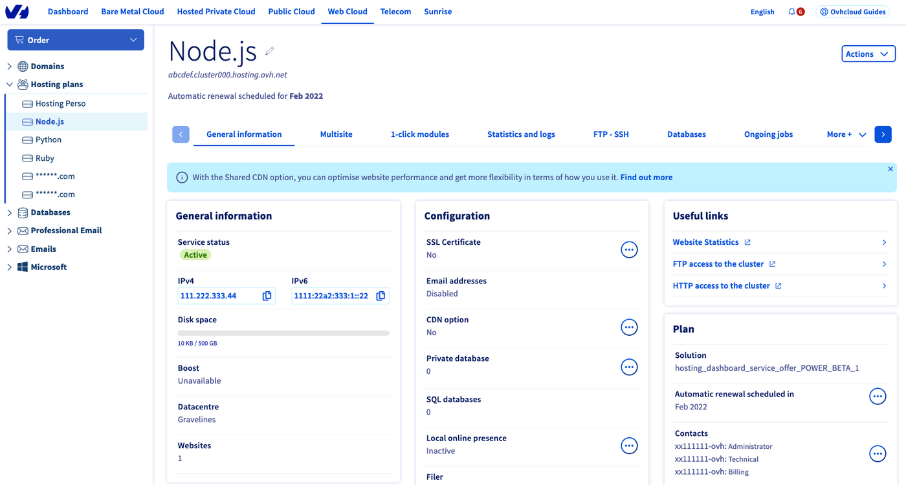
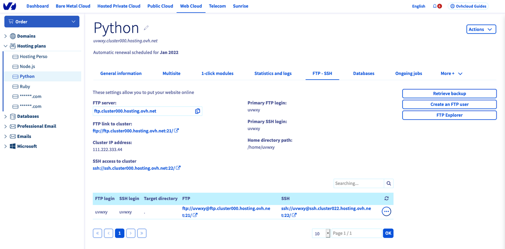
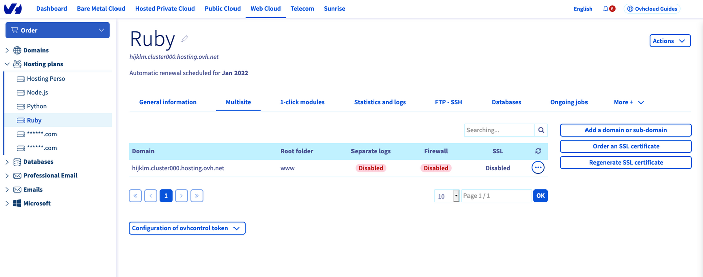
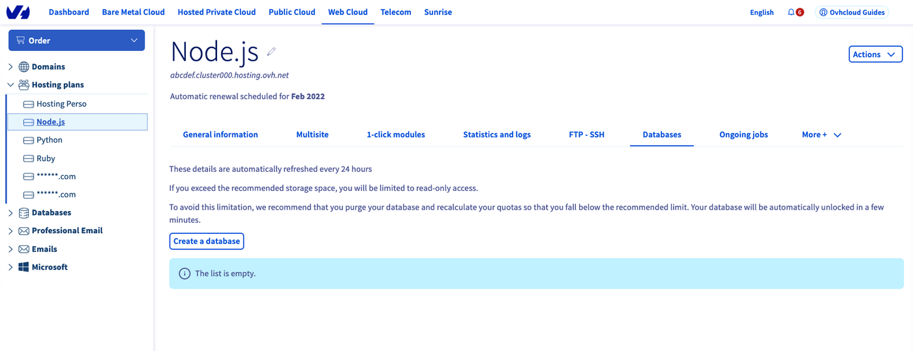
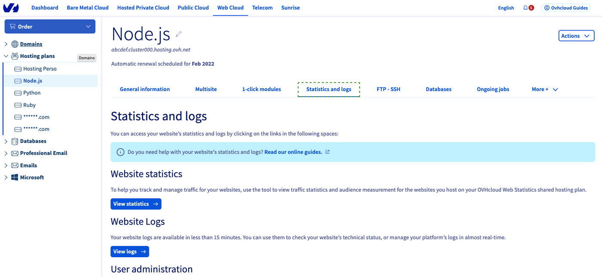

## Objective

You've subscribed to a Web POWER web hosting plan to deploy **Node.js**, **Python** or **Ruby** applications, and you want to begin developing your project.

This guide will explain how to manage your POWER web hosting using the [OVHcloud Control Panel](https://www.ovh.com/auth/?action=gotomanager&from=https://www.ovh.ie/&ovhSubsidiary=ie) and the [OVHcloud APIs](https://api.ovh.com/).

**Find out how to get started with a POWER web hosting plan.**

## Requirements

- one of the 3 POWER web hosting plans: [Node.js](https://labs.ovh.com/managed-nodejs), [Python](https://labs.ovh.com/managed-python) or [Ruby](https://labs.ovh.com/managed-ruby)
- access to the [OVHcloud Control Panel](https://www.ovh.com/auth/?action=gotomanager&from=https://www.ovh.ie/&ovhSubsidiary=ie)

## Instructions

### From the OVHcloud Control Panel

The POWER web hosting management UI is in the `Web Cloud`{.action} section, under `Hosting plans`{.action} in the sidebar. 

{.thumbnail}

#### FTP - SSH access <a name="ssh"></a>

At the activation of your POWER web hosting plan, we have sent you an email with the SSH and FTP credentials. You can also manage them from the `FTP - SSH`{.action} tab.

{.thumbnail}

You will find detailed information on this topic in our [SSH guide](/pages/web_cloud/web_hosting/ssh_on_webhosting).

#### Adding a domain name

For default, your POWER web hosting plan is attached to a generated URL. In order to use your own [domain name](https://www.ovh.ie/domains/), you can add it in the `Multisite`{.action} tab.

{.thumbnail}

You will find detailed information on this topic in our [Hosting multiple websites on your Web Hosting plan](/pages/web_cloud/web_hosting/multisites_configure_multisite) guide.

#### Using a database

Your POWER web hosting plan includes databases. They can be accessed from the `Databases`{.action} tab.

{.thumbnail}

You will find detailed information on this topic in our [Creating and managing a database in your Web Hosting plan](/pages/web_cloud/web_hosting/sql_create_database) guide.

#### Accessing logs and statistics

Web server logs and website statistics are included in your POWER web hosting plan,under the `Statistics and logs`{.action} tab. 

{.thumbnail}

You will find detailed information on this topic in our [Accessing a website’s logs and statistics on a Web Hosting](/pages/web_cloud/web_hosting/logs_and_statistics) guide.

### Node.js

#### Hello World in Node.js 

Let's suppose you have the default configuration for Node.js hosting:

- Runtime: nodejs 14   
- Entrypoint: index.js 
- DocumentRoot: www

> [!primary]
>
> To verify your configuration, you can use the [Retrieve active configuration](#api-get-active-configuration) API endpoint.

Connect via SSH to your POWER web hosting, go to the `www` folder and create an `index.js` file there:

`index.js`
```javascript
const http = require('http');
const port = 3000;
const msg = `Hello World from NodeJS ${process.version}\n`;
const server = http.createServer((req, res) => {
res.statusCode = 200;
res.setHeader('Content-Type', 'text/plain');
res.end(msg);
});
server.listen(port);
```

```console
~ $ vi www/index.js
const http = require('http');
const port = 3000;
const msg = `Hello World from NodeJS ${process.version}\n`;
const server = http.createServer((req, res) => {
res.statusCode = 200;
res.setHeader('Content-Type', 'text/plain');
res.end(msg);
});
server.listen(port);

~ $ mkdir -p www/tmp
~ $ touch www/tmp/restart.txt
```

Then [restart your instance](#restart).

{.thumbnail}

### Python

#### Hello World in Python

Let's suppose you have the default configuration for Python hosting:

- Runtime: Python 3.7   
- Entrypoint: app.py
- DocumentRoot: www

> [!primary]
>
> To verify your configuration, you can use the [Retrieve active configuration](#api-get-active-configuration) API endpoint.

Connect via SSH to your POWER web hosting, go to the `www` folder and create an `app.py` file there:

`app.py`
```python
import sys
 
def application(environ, start_response):
    status = '200 OK'
    output = '\n'.join(['Hello World!', f"Version : {sys.version}",
                        f"Executable : {sys.executable}"])
 
    response_headers = [('Content-type', 'text/plain'),
                        ('Content-Length', str(len(output)))]
    start_response(status, response_headers)
 
    return [output]    
```

Then [restart your instance](#restart).

{.thumbnail}

### Ruby

#### Hello World in Ruby 

Let's suppose you have the default configuration for Ruby hosting:

- Runtime: Ruby 2.6   
- Entrypoint: config.ru
- DocumentRoot: www

> [!primary]
>
> To verify your configuration, you can use the [Retrieve active configuration](#api-get-active-configuration) API endpoint.

Connect via SSH to your POWER web hosting, go to the `www` folder and create a `config.ru` file there:

`config.ru`
```ruby
require 'socket'
require 'timeout'
 
class Application
 
    def call(env)
        msg = "Hello World from ruby #{ RUBY_VERSION }p#{ RUBY_PATCHLEVEL }"
        [200, { "Content-Type" => "text/plain" }, [msg]]
    end
end
 
run Application.new
```

Then [restart your instance](#restart).

{.thumbnail}

### From the API

This tutorial presupposes that you already have some familiarity with the [OVHcloud APIs](https://api.ovh.com/). If you want to know more on this topic, please look at the [First Steps with the OVHcloud APIs](/pages/manage_and_operate/api/first-steps) guide.

The [OVHcloud APIs](https://api.ovh.com/) currently available for POWER hosting plans are:

#### List available configurations

> [!api]
>
> @api {v1} /hosting/web WE /hosting/web/{serviceName}/availableConfigurations

#### Retrieve active configuration <a name="api-get-active-configuration"></a>

> [!api]
>
> @api {v1} /hosting/web WE /hosting/web/{serviceName}/configuration
.
> This endpoint allows you to verify your configuration parameters, for example your entry point.
 
#### Modify active configuration

> [!api]
>
> @api {v1} /hosting/web WE /hosting/web/{serviceName}/configuration

> This endpoint allows you to modify your configuration parameters, for example your entry point.

#### Restart the service

> [!api]
>
> @api {v1} /hosting/web WE /hosting/web/{serviceName}/attachedDomain/{domain}/restart

### Setting up a redirection from HTTP to HTTPS

You can create an `.htaccess` file in your POWER web hosting root folder (usually `www`) to set up a redirection from HTTP to HTTPS:

```
RewriteCond %{ENV:HTTPS} !on
RewriteRule (.*) https://%{HTTP_HOST}%{REQUEST_URI} [L,R=301]
```

```console
~ $ cd www
~/www $ vi .htaccess
RewriteCond %{ENV:HTTPS} !on
RewriteRule (.*) https://%{HTTP_HOST}%{REQUEST_URI} [L,R=301]
```

### Restart your instance <a name="restart"></a>

Each time you modify your application, you should tell the server to restart it.

In your document root you should `touch` the file `tmp/restart.txt`.

```console
~ $ cd www
~/www$ mkdir tmp
~/www$ touch tmp/restart.txt
```

> [!primary]
>
> As this operation is performed on SSH server, you may need to wait before the web server notices your changes (max. 30 seconds).

## Go further

[Accessing a web hosting plan via SSH](/pages/web_cloud/web_hosting/ssh_on_webhosting) 

[Hosting multiple websites on your Web Hosting plan](/pages/web_cloud/web_hosting/multisites_configure_multisite)

[Creating and managing a database in your Web Hosting plan](/pages/web_cloud/web_hosting/sql_create_database)

[Accessing a website’s logs and statistics on a Web Hosting](/pages/web_cloud/web_hosting/logs_and_statistics)

Join our community of users on [https://community.ovh.com/en/](https://community.ovh.com/en/).

**Join [our Discord](https://discord.gg/ovhcloud) on our web-hosting-power channel to discuss directly with the team and other users of this lab.**