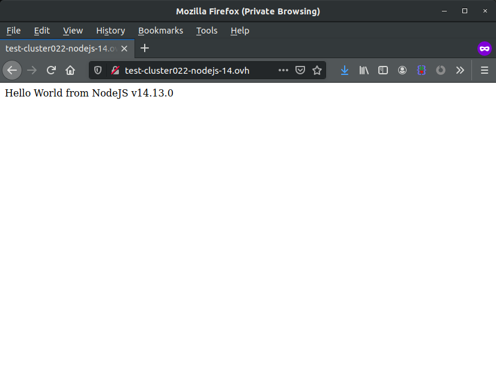

<style>
 pre {
     font-size: 14px;
 }
 pre.console {
   background-color: #300A24; 
   color: #ccc;
   font-family: monospace;
   padding: 5px;
   margin-bottom: 5px;
 }
 pre.console code {
   border: solid 0px transparent;
   font-family: monospace !important;
 }
 .small {
     font-size: 0.75em;
 }
</style>


## Objective

You've subscribed to a Web POWER web hosting plan to deploy **Node.js** applications, and you want to begin developing your project using [Express](https://expressjs.com/){.external}.

This guide will explain how to deploy a simple *Hello World* server on Express.


**Find out how to install Express on your POWER web hosting plan.**


## Requirements

- a [Node.js](https://labs.ovh.com/managed-nodejs) POWER web hosting plan
- access to the [OVHcloud Control Panel](https://www.ovh.com/auth/?action=gotomanager&from=https://www.ovh.ie/&ovhSubsidiary=ie)

If you have just started to use your Web POWER web hosting plan, we suggest to have a look at our [Getting started with a POWER web hosting plan](/pages/ovhcloud_labs/power_web_hosting/getting-started) guide before going further.

## Instructions

Let's suppose you have the default configuration for Node.js hosting:

- Runtime: nodejs 14   
- Entrypoint: index.js 
- DocumentRoot: www

> [!primary]
>
> To verify your configuration, you can use the [Retrieve active configuration](/pages/ovhcloud_labs/power_web_hosting/getting-started#api-get-active-configuration) API endpoint.

[Connect via SSH](/pages/ovhcloud_labs/power_web_hosting/getting-started#ssh) to your POWER web hosting, and install Express using `npm`:

```sh
npm install express --save
```

Then go to the `www` folder and create an `index.js` file there:

`index.js`
```javascript
const express = require('express');
const port = 3000;
const msg = `Hello World from NodeJS ${process.version}\n`;
const app = express();app.get('/', function (req, res) {
res.send(msg);
});
app.listen(port);
```

[Restart your instance](/pages/ovhcloud_labs/power_web_hosting/getting-started#restart) and your Express *Hello World* will be online.

{.thumbnail}

Terminal output:

<pre class="console"><code>~/www $ cd www
~/www $ node -v
v14.13.0
~/www $ npm install express --save
~/www $ vi index.js
const express = require('express');
const port = 3000;
const msg = `Hello World from NodeJS ${process.version}\n`;
const app = express();app.get('/', function (req, res) {
res.send(msg);
});
app.listen(port);
~/www $ mkdir -p tmp
~/www $ touch tmp/restart.txt</code></pre>

## Go further

Join our community of users on [https://community.ovh.com/en/](https://community.ovh.com/en/).

**Join [our Discord](https://discord.gg/ovhcloud) on our web-hosting-power channel to discuss directly with the team and other users of this lab.**