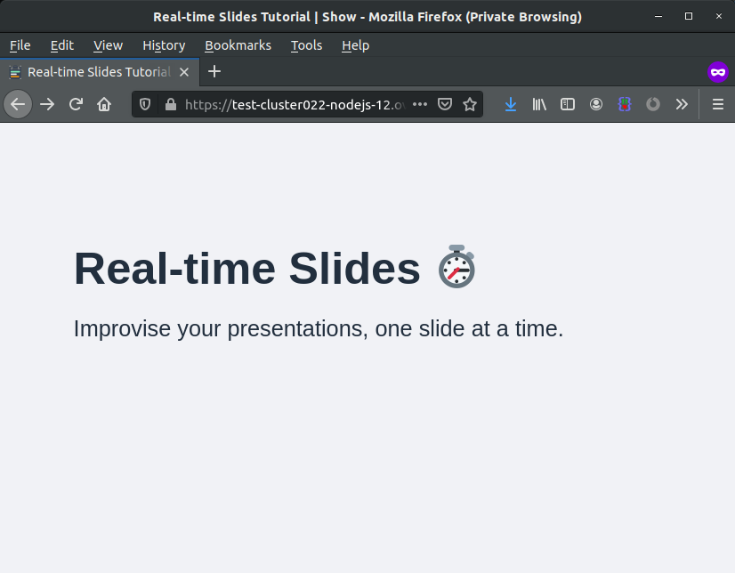

<style>
 pre {
     font-size: 14px;
 }
 pre.console {
   background-color: #300A24; 
   color: #ccc;
   font-family: monospace;
   padding: 5px;
   margin-bottom: 5px;
 }
 pre.console code {
   border: solid 0px transparent;
   font-family: monospace !important;
 }
 .small {
     font-size: 0.75em;
 }
</style>


## Objective

You've subscribed to a Web POWER web hosting plan to deploy **Node.js** applications, and you want to deploy a [real-time presentation slide platform](https://nafeu.medium.com/real-time-presentation-slides-with-socket-io-express-node-js-and-javascript-cf08a95ff098){.external} on it.

This guide will explain how to do it.


**Find out how to install Slideshow on your POWER web hosting plan.**


## Requirements

- A [Node.js](https://labs.ovh.com/managed-nodejs) POWER web hosting plan
- access to the [OVHcloud Control Panel](https://www.ovh.com/auth/?action=gotomanager&from=https://www.ovh.co.uk/&ovhSubsidiary=GB)

If you have just started to use your Web POWER web hosting plan, we suggest to have a look at our [Getting started with a POWER web hosting plan](/pages/ovhcloud_labs/power_web_hosting/getting-started) guide before going further.

## Instructions


Let's suppose you have the default configuration for Node.js hosting:

- Runtime: nodejs 14   
- Entrypoint: index.js 
- DocumentRoot: www

> [!primary]
>
> To verify your configuration, you can use the [Retrieve active configuration](/pages/ovhcloud_labs/power_web_hosting/getting-started#api-get-active-configuration) API endpoint.

[Connect via SSH](/pages/ovhcloud_labs/power_web_hosting/getting-started#ssh) to your POWER web hosting.
Let's begin by retrieving the sources of the project:

```sh
rm -rf www
git clone https://github.com/nafeu/realtime-slides-tut.git www
```

Now let's go into the `www` folder, do an `npm install` and *symlink* the entrypoint to the application main file:

```sh
cd www
npm install --save
ln -fs server.js index.js
```

Then [restart your instance](/pages/ovhcloud_labs/power_web_hosting/getting-started#restart) and your slideshow platform will be online.


{.thumbnail}


Terminal output:

<pre class="console"><code> ~ $ rm -rf www

~ $ git clone https://github.com/nafeu/realtime-slides-tut.git www
Cloning into 'www'...
remote: Enumerating objects: 91, done.
remote: Total 91 (delta 0), reused 0 (delta 0), pack-reused 91
Extracting objects: 100% (91/91), done.

~ $ cd www
 
~/www $ npm install --save
npm WARN realtime-slides-tut@1.0.0 No repository field.
added 297 packages from 253 contributors and audited 297 packages in 6.689s
found 18 vulnerabilities (9 low, 3 moderate, 5 high, 1 critical)
  run `npm audit fix` to fix them, or `npm audit` for details

~/www $ ln -fs server.js index.js

~/www $ mkdir -p tmp

~/www $ touch tmp/restart.txt

</code></pre>


## Go further

Join our community of users on [https://community.ovh.com/en/](https://community.ovh.com/en/).

**Join [our Discord](https://discord.gg/ovhcloud) on our web-hosting-power channel to discuss directly with the team and other users of this lab.**