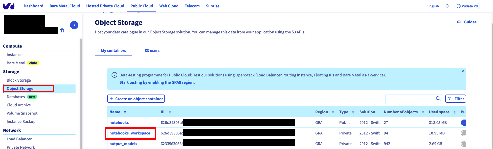
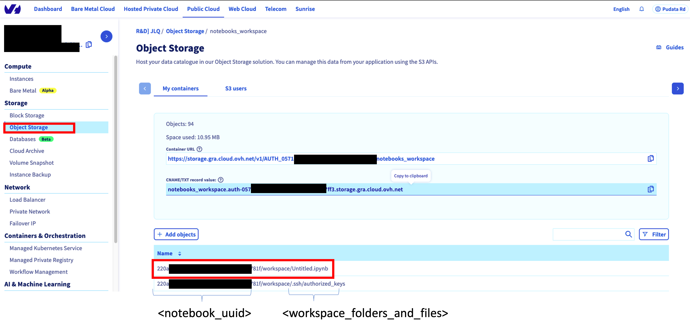
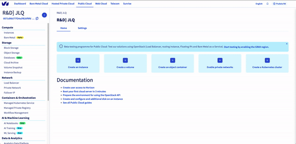

*Last updated 28th Sept, 2021.*

## Definition

A **notebook** in **AI Training** is used to easily work with one of the well-known machine learning frameworks on
either JupyterLab or VSCode and powerful hardware.

The advantage compared to doing your own setup is that everything is already installed for you, and that you pay only
for your notebooks while they are running.

Each notebook is linked to a **Public Cloud** project and specifies hardware resources along with a machine learning framework and an editor among those available.

The easiest way to create and manage notebooks currently is to use the ovhai CLI. You can start learning to use it
by reading the [Getting Started](https://docs.ovh.com/ie/en/publiccloud/ai/notebooks/getting-started-cli/) page.

Notebooks also provide an easy way to access data from your Object Storage, you can read more about it [here](https://docs.ovh.com/ie/en/publiccloud/ai/notebooks/access-object-storage-data/).

## Considerations

-   A notebook will run indefinitely until manual interruption.
-   If you do not customise your resource request, the default requested is 1 GPU. Memory is not customisable.
-   Billing for **notebooks** is minute-based. Each commenced minute is billed completely.

## Notebook lifecycle

During its lifetime the notebook will transition between the following statuses:

> [!primary]
> * Billing starts once a notebook is `RUNNING` and ends when its status switches to `STOPPING`.
> * Only notebooks in states `STARTING` and `RUNNING` are included in the resource quota computation.

-   `STARTING` the notebook is starting, and volumes are synchronised from the Object Storage
-   `RUNNING` the notebook is running and can be accessed from your browser
-   `STOPPING` the notebook is still running, but an interruption order was received and `RW` volumes are uploaded to your Object Storage
-   `STOPPED` the notebook is stopped and `RW` volumes have been synchronised back to your Object Storage

## Notebook data

### Workspace data

The workspace environment of the AI Notebooks products are automatically saved in your OVHcloud object storage container.
The associated object container is named `notebooks_workspace`:

{.thumbnail}

The structure of the object storage container associated to the AI notebooks service is the following:
`notebooks_workspace/<notebook_uuid>/workspace`

{.thumbnail}

### Additional data storage

The AI notebook service also allows you to add data from your pre-existing object storage containers.
Here is how to attach data
{.thumbnail}

Feel free to check the [Accessing data from your Object Storage](https://docs.ovh.com/gb/en/publiccloud/ai/notebooks/access-object-storage-data/) page for further details and options. 

## Feedback

Please send us your questions, feedback and suggestions to improve the service:

-   On the OVHcloud [AI community forum](https://community.ovh.com/en/c/Data-AI)
