*Last updated 12th August, 2020.*

## Objective

This guide covers the initialization of **AI Training** and the submission of [**jobs**](../jobs) through the OVHcloud Control Panel.

## Requirements

- a **public cloud** project
- a user for AI Training (creation covered in Step 3)
- optionnally **data** objects to attach to the **job** at step 8, see our [create **data** object](../data) guide.
- access to the [OVHcloud Control Panel](https://www.ovh.com/auth/?action=gotomanager)

## Instructions

### Step 1: Going to the AI Training menu

Log in to the [OVHcloud Control Panel](https://www.ovh.com/auth/?action=gotomanager), go to the `Public Cloud`{.action} section then to the `AI Training` section which is located under `Data & Analytics`.

{.thumbnail}

### Step 2: Activating AI Training service

Once you read general information and validated this service's contract terms, you can start submitting your jobs. Upon activating the AI Training service you grant OVHcloud access to your Object Storage containers. This access is only used to synchronize your data within
**AI Training** with your containers.

{.thumbnail}

#### Dashboard

Once **AI Training** is activated you land on the **dashboard** service with several components.

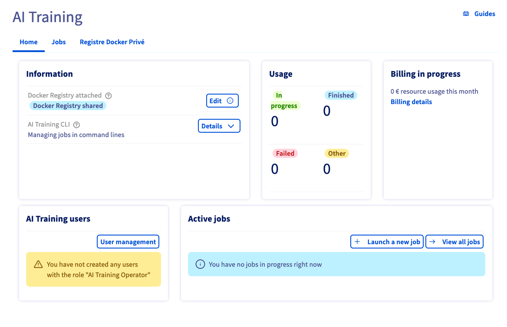{.thumbnail}

-   Informations: useful information for service usage
-   Usage: brief summary of number of jobs according to their status
-   Billing: an overview of your ongoing billing
-   **AI Training** users: list of users that can use this service
-   Jobs: list of active jobs

The list of **AI Training** users should be empty at the moment, let's add a new user.

### Step 3: Creating AI Training users

To use **AI Training** you need to create users with the correct roles.

Users management is available in the `Public Cloud` Control Panel under
`Project Management` &gt; `Users & Roles`

{.thumbnail}

Create a new [user](../users) and specify the required roles. Two roles
are used within **AI Training**

-   AI Training Operator: Grants access to **AI Training**
-   Objectstore Operator: Grants read/write access to the OVHcloud Object Storage, required to use **data** synchronization features.

It is recommended to assign both roles.

{.thumbnail}

### Step 4: Starting a job submission

From the **jobs** list in the dashboard you can start the job submission by clicking the `Submit Job`{.action} button.

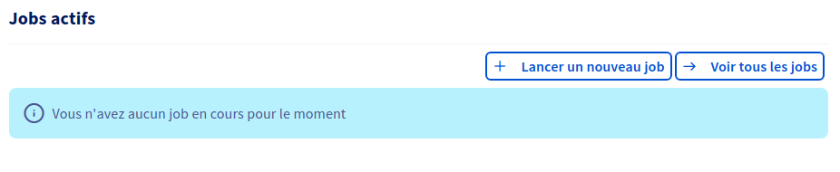{.thumbnail}

### Step 5: Selecting a region for your job

Each **job** is executed in an OVHcloud region. Each region has its own **AI Training** cluster with potentially varying capabilities. For more
information, see the [capabilities](../capabilities). Select the desired region and click `Next`{.action}.

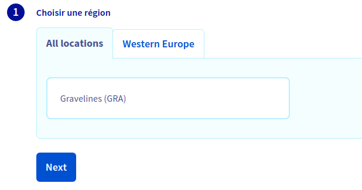{.thumbnail}

### Step 6: Selecting a user

All jobs submitted from the Control Panel are created using administrator privileges but are necessarily assigned to **AI
Training** users. Pick from the **AI Training** users filtered list the desired user and click `Next`{.action}.

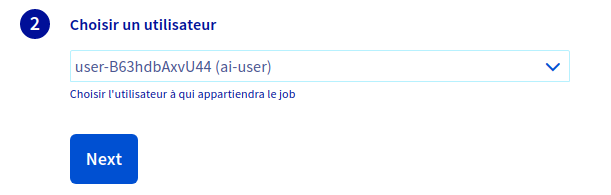{.thumbnail}

### Step 7: Providing a Docker image

A job is basically a Docker container that is run within the OVHcloud infrastructure. You need to provide a Docker image to be executed. There
are several options you can choose from:

#### Preset Images

OVHcloud provides a set of images from which you can choose to ease the submission of your first **jobs**. Provided images are essentially
JupyterLab environment bundled with some Deep Learning technology such as Tensorflow or MXNet.

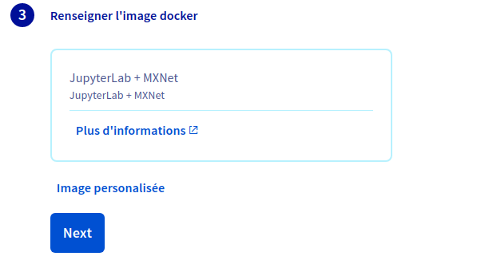{.thumbnail}

#### Custom Images

Preset images cannot cover all your needs so you can specify your own image if necessary. You can use any image that is accessible from **AI
Training**.

This includes public images (e.g. Dockerhub), images within the shared registry or images in your attached private registry. For more
information, see how to [attach a private registry](../attach-private-registry).

For more information about image tags for images within the shared registry, refer to the [\$partner\_full client documentation](https://docs.console.preprod.training.ai.cloud.ovh.net/pages/tutorial.html#docker-images).

Once your image is chosen, click `Next`{.action}.

{.thumbnail}

### Step 8: Attaching data to your job (optional)

You can attach [**data**](../data) objects to your job either as input for your training workload or as output for your results (e.g. model
weights).

Before attaching a data you need to [create one](../data). A **data** cannot be attached to a running **job**.

To attach a **data** object, just select among the list on the left. Next to each data, within the parenthesis, you can check the mount path in the
Docker container for the submitted **job**. If you wish to customize this mount path, you will need to use the **\$partner\_full client**, its
installation procedure is available [here](../install-client).

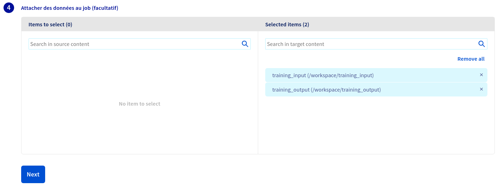{.thumbnail}

Once the data is configured click `Next`{.action}.

### Step 9: Overriding the Docker entrypoint (optional)

The Docker image you provided in Step 7 includes an entrypoint for your container. You can override this entrypoint by specifying your own
command. Once the entrypoint is set up click `Next`{.action}.

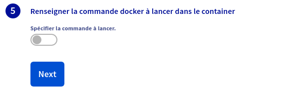{.thumbnail}

### Step 10: Specifying amount of resources

**AI Training** leverages \$partner\_full Orkestrator to orchestrate and schedule workloads using GPU resources. In this step you can select the
amount of GPUs you want to be used during your training workload.

The max amount of GPUs you can select for your **job** is region dependant. For more information see the [capabilities](../capabilities).

Once the number of GPUs is set you can see a preview of the minute billing rate for this amount of resources. Click `Next`{.action}.

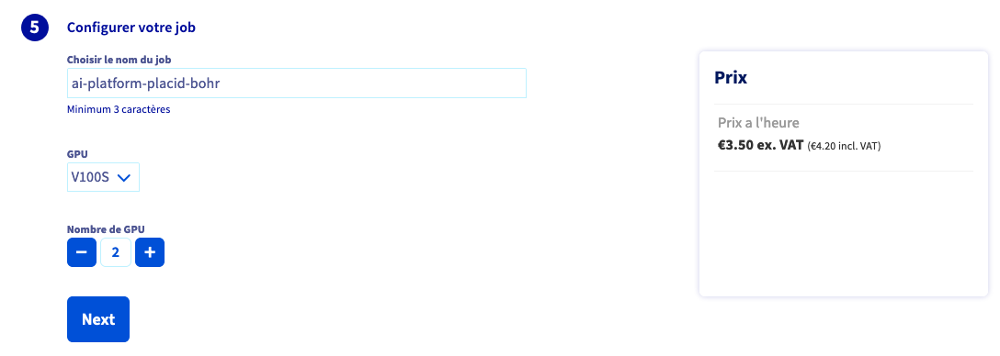{.thumbnail}

### Step 11: Submitting your job

In the final step you get an overview of the **job** you configured before submission. You also get the equivalent command to use with the
**\$partner\_short client**.

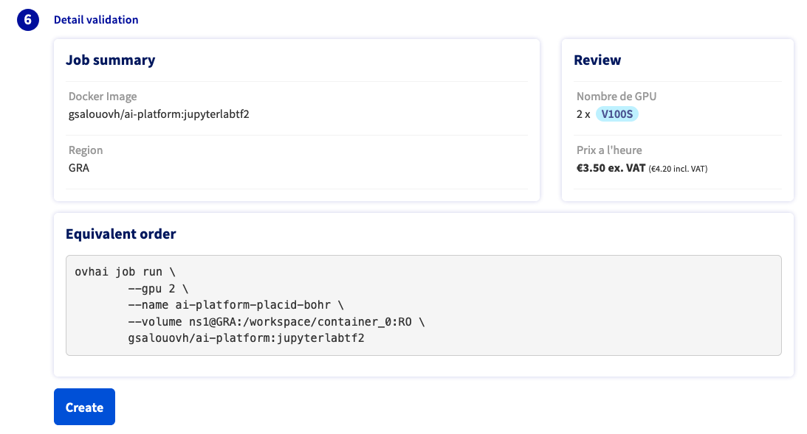{.thumbnail}

The **AI Training** service is mainly supposed to be used through the **\$partner\_full client**. The OVHcloud Control Panel only offers a subset of
the features and is meant to help you get started before using the client.

Finally click `Submit`{.action} to submit your **job** to the cluster.

> [!warning]
>
> A job will run indefinitely until completion or manual interruption.
>

### Step 12: Consulting your job

Once the job is submitted you are redirected to the **jobs** list page.

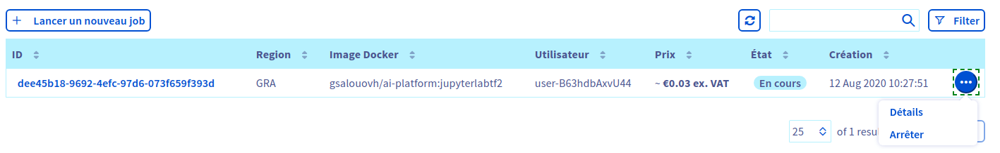{.thumbnail}

From this list you can access your job details either by clicking on its `ID` or by clicking on `...`{.action} and selecting `Details`. The details include several components:

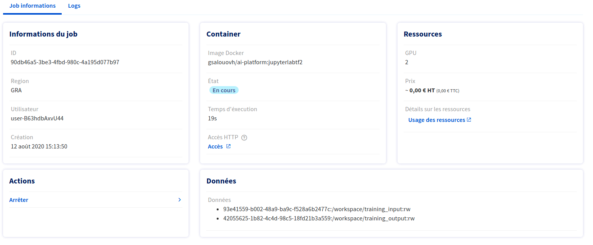{.thumbnail}

-   **Job Information**: basic information on the job you submitted
-   Container: describes the status of your job and provides you with the
    url to access any service exposed by your job on the port `8080`.
    The url is of the form
    `https://<JOB-ID>.job.console.<REGION>.training.ai.cloud.ovh.net/`.
    If the service is not exposed on the port `8080` it is still
    accessible by specifying the port in the url this way
    `https://<JOB-ID>-<PORT>.job.console.<REGION>.training.ai.cloud.ovh.net/`.
    You can check the list of available ports in the
    [capabilities](../capabilities).
-   Resources: a summary of the resources consumed by the **job**
-   Actions: available actions
-   Data: list of **data** objects attach to the job

### Step 14: Cancelling your job

If you are over using your notebook, if your model converged prematurely or if you just wish to interrupt your job you can do so from the **jobs** list.

From the list of **jobs** you can list the available actions at the far right of each entry and interrupt the job by clicking `Stop`{.action}.
Alternatively, from a **job** details you can also interrupt the job from the list of actions.

## Going Further

-   You can checkout the documentation about the [**\$partner\_fullclient**](https://docs.console.preprod.training.ai.cloud.ovh.net/)
-   You can checkout the documentation about [how to setup the\$partner\_full client](../install-client)

## Feedback

Please send us your questions, feedback and suggestions to improve the service:

-   On the OVHcloud [AI community forum](https://community.ovh.com/c/platform/ai-ml)
