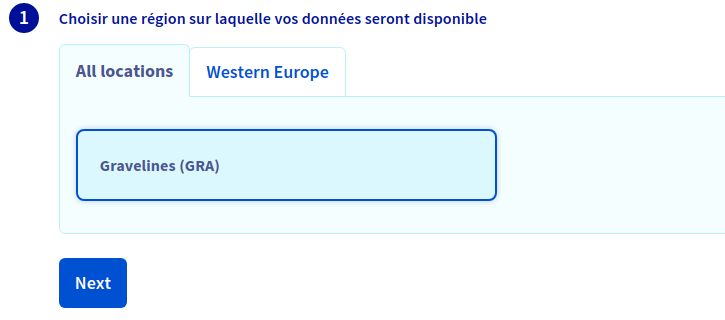
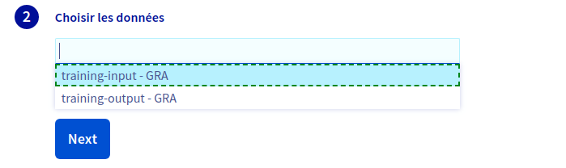
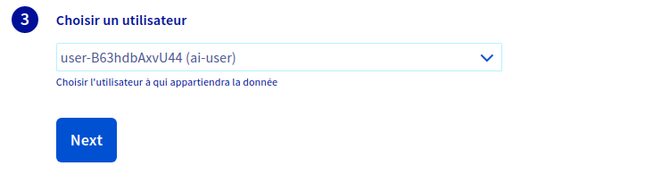
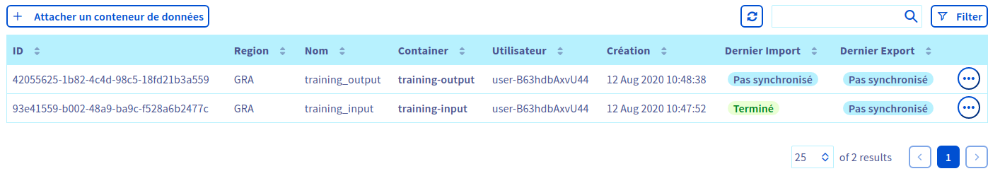

*Last updated 14th August, 2020.*

## Objective

This guide covers the creation of [**data**](../data) objects in **AI Training** through the OVHcloud Control Panel and their association with Object
Storage containers.

## Requirements

- a [Public Cloud project](https://www.ovhcloud.com/en-gb/public-cloud/) in your OVHcloud account
- **AI Training activated** for your account, see [how to submit a job Step 2](../submit-job)
- a user for AI Training [how to submit a job Step 3](../submit-job)
- access to the [OVHcloud Control Panel](https://www.ovh.com/auth/?action=gotomanager)

## Instructions

### Step 1: Creating an Object Storage container

If you already have Object Storage containers you want to use you can skip the following steps and directly start at Step 2.

You can access the Object Storage page in the `Public Cloud` section of the [OVHcloud Control Panel](https://www.ovh.com/auth/?action=gotomanager) under `Storage` &gt; `Object Storage`.

{.thumbnail}

From the Object Storage page click `Create an object container`{.action}.

Select the location for you data container. To improve synchronization performances, choose the closest location to the **AI Training** cluster
you plan to use. For more information about available regions see the [capabilities](../capabilities).

{.thumbnail}

Once you set a location, you need to select the type of container you want to use. For private data to use with **AI Training** it is recommended to use a `Private` container.

{.thumbnail}

Finally choose a name for your container and then click `Create the container`{.action}.

### Step 2: Going to the **data** objects tab of **AI Training**

Now find the `AI Training` section, located under `Data & Analytics` in the `Public Cloud` section of the OVHcloud Control Panel.

Within the **AI Training** control panel there is a dedicated tab for managing **data** objects: `Data`.

{.thumbnail}

You can initiate the creation of a new **data** by clicking the `Attach a container`{.action} button.

### Step 3: Selecting a region

In the control panel all **data** objects you create are associated with an Object Storage container for persistent storage. Select the location
of the **AI Training** cluster in which you plan to use this **data** object.

{.align-center}'

Once the region is selected click `Next`{.action}.

### Step 4: Selecting the data container

A drop-down menu lets you choose among all available containers. This container will be attached to the **data** object allowing synchronizations.

{.thumbnail}

Before a [**job**](../jobs) you can sync your data from the Object Storage to your **data** objects to refresh your data. Once your job
is completed you can sync your data from the **data** object to the Object Storage to make results persistent.

> [!warning]
>
> Object Storage containers and **data** objects are not automatically
> synchronized to avoid data loss in case of misbehaving training
> workload. To ensure the persistence of your results make sure to
> synchronize your containers after the training workload is over.

Once you selected your container click `Next`{.action}.

### Step 5: Selecting a user

All **data** objects created from the control panel are created using administrator priviledges but are necessarily assigned to an **AI Training** user. Pick from the **AI Training** users filtered list the desired user and click `Next`{.action}.

{.thumbnail}

### Step 6: Creating your **data** object

Set a name for your **data** object. This name should be an all lowercase alphanumeric string with underscores allowed.

Once the name is selected you can set a flag to directly import your data. This will trigger a synchronization between the Object Storage
container and your **data** object. If the data you are creating is input data for your training workload you should set this flag.

{.thumbnail}

Before submitting the creation you can see the equivalent command to use with the **\$partner\_short client** to create the same **data** object.

The **AI Training** service is mainly supposed to be used through the **\$partner\_full client**. The control panel only offers a subset of the features and is meant to help you get started before using the client.

Finally click `Send`{.action} to submit your **data** creation.

### Step 7: Consulting your **data** objects

Once the creation is submitted you are redirected towards the **data** objects menu of **AI Training**. From this list you can check the
**data** objects created along with their synchronization status.

{.thumbnail}

In particular: 
> * `Last import` gives you the status of the last synchronization triggered from the Object Storage to the **data** object.

> * `Last export` gives you the status of the last synchronization triggered from the **data** object to the Object Storage.

You can trigger a synchronization by accessing the actions on the far right of the list entry. You only need to select the direction of your
synchronization and you get the equivalent command to use with the **\$partner\_short client**.

{.thumbnail}

## Going Further

-   You can check the official documentation about [how to submit a **job**](../submit-job)

## Feedback

Please send us your questions, feedback and suggestions to improve the service:

-   On the OVHcloud [AI community forum](https://community.ovh.com/c/platform/ai-ml)
