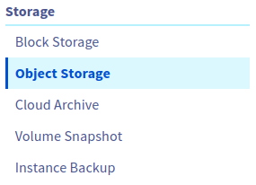
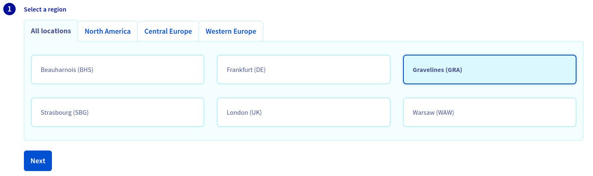
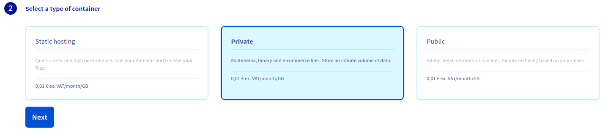

*Last updated 18th May, 2021.*

## Objective

This guide covers the creation of Object Storage containers to later use with your **AI Training** jobs or notebooks.

## Requirements

-   a [Public Cloud project](https://www.ovhcloud.com/en/public-cloud/) in your OVHcloud account
-   **AI Training activated** for your account, see [how to submit a job Step 2](../submit-job)
-   a user for AI Training, see [how to create a user](../create-user)
-   access to the [OVHcloud Control Panel](https://ca.ovh.com/auth/?action=gotomanager&from=https://www.ovh.com/world/&ovhSubsidiary=we)

## Instructions

### Creating an Object Storage container

You can access the Object Storage page in the `Public Cloud` section of the [OVHcloud Control Panel](https://ca.ovh.com/auth/?action=gotomanager&from=https://www.ovh.com/world/&ovhSubsidiary=we) under `Storage` > `Object Storage`.

{.thumbnail}

From the Object Storage page click `Create an object container`{.action}.

Select the location for your data container. To improve synchronisation performances, choose the closest location to the **AI Training** cluster you plan to use. For more information about available regions see the [capabilities](../capabilities).

{.thumbnail}

Once you set a location you need to select the type of container you want to use. For private data to use with **AI Training** it is recommended to use a `Private` container.

{.thumbnail}

Finally, choose a name for your container and then click `Create the container`{.action}.

## Going Further

-   You can check the official documentation about [how to submit a **job**](../submit-job)

## Feedback

Please send us your questions, feedback and suggestions to improve the service:

-   On the OVHcloud [AI community forum](https://community.ovh.com/en/c/Data-AI)
