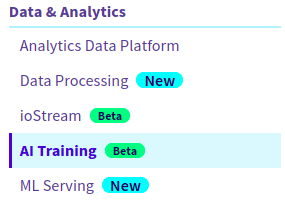
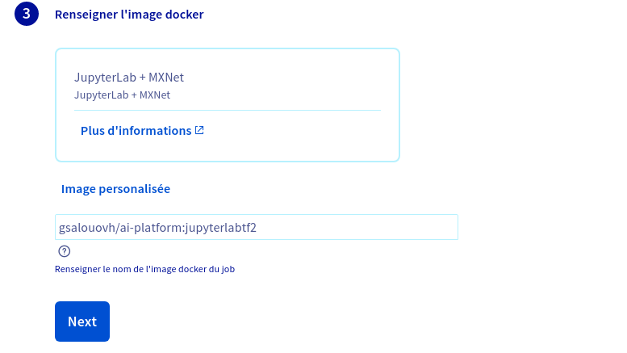

*Last updated 14th August, 2020.*

## Objective

This guide covers the process of attaching a private registry to the **AI Training** service.

## Requirements

-   a **public cloud** project
-   credentials for the Docker registry you wish to attach
-   access to the [OVHcloud Control Panel](https://www.ovh.com/auth/?action=gotomanager)

## Instructions

### Step 1: Going to the AI Training menu

Log in to the [OVHcloud Control Panel](https://www.ovh.com/auth/?action=gotomanager), go to the `Public Cloud`{.action} section then to the `AI Training` section which is located under `AI & Machine Learning`.

{.thumbnail}

From the dashboard you can initiate the attachment of your Docker registry by clicking `Update`{.action} &gt; `Attach a Docker registry`{.action} button.

### Step 2: Attaching the registry

To attach a registry you simply need to provide the credentials of your registry along with its URL.

{.thumbnail}

Once the form is filled out click `Attach`{.action}.

## Step 3: Submitting an image from your registry

Once your registry is attach you can use any images pushed on the registry for your jobs.

From the manager while [submitting a job](../submit-job) you can choose a custom Docker image in Step 7.

{.thumbnail}

With the \$partner\_full command line client simply provide the image using the flag `-- image`.

The default shared registry remains available even with a private registry attached.

## Going Further

-   You can check the official documentation about [how to submit a **job**](../submit-job)
-   You can checkout the documentation about the [**\$partner\_full client**](https://docs.console.preprod.training.ai.cloud.ovh.net/)
-   You can checkout the documentation about [how to setup the \$partner\_full client](../install-client)

## Feedback

Please send us your questions, feedback and suggestions to improve the service:

-   On the OVHcloud [AI community forum](https://community.ovh.com/c/platform/ai-ml)
