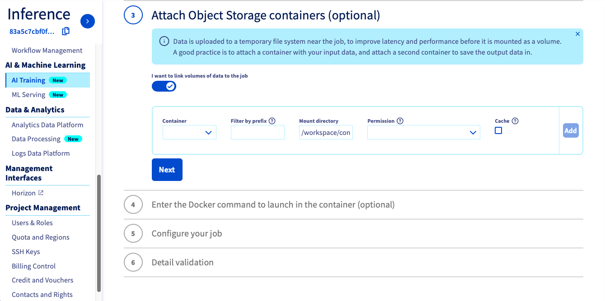

**Last updated 21st of June, 2021.**

## Objective

The purpose of this tutorial is to show how it is possible to train YOLOv5 to recognize objects. YOLOv5 is an object detection algorithm. Although closely related to image classification, object detection performs image classification on a more precise scale. Object detection locates and categories features in images.

It is based on the YOLOv5 open source repository by [Ultralytics](https://github.com/ultralytics/yolov5).

## Requirements

*access to the [OVHcloud Control Panel](https://ca.ovh.com/auth/?action=gotomanager&from=https://www.ovh.com/asia/&ovhSubsidiary=asia)
*an AI Training project created inside a Public Cloud project
*a user for AI Training
*your own dataset

## Instructions

### Uploading your dataset on Public Cloud Storage

If you want to upload it from the [OVHcloud Control Panel](https://ca.ovh.com/auth/?action=gotomanager&from=https://www.ovh.com/asia/&ovhSubsidiary=asia), go to the Object Storage section and create a new object container by clicking `Object Storage` > `Create an object container`.

{.thumbnail}

If you want to run it with the CLI, just follow this [guide](../data-cli). You have to choose the region, the name of your container and the path where your data is located and use the following command:

``` {.bash}
ovhai data upload <region> <container> <paths>
```

> [!primary]
>
> This tutorial has been realized with the COCO dataset. If you don't have your own dataset, you can use it by downloading the COCO version "YOLO v5 Pytorch" available for free on [Roboflow](https://public.roboflow.com/object-detection/microsoft-coco-subset/).

### Launching and accessing Jupyter notebook with Pytorch library

You need to attach a volume if your data is in your OVHcloud object storage and you want to use it during your experiment, or if you need to save the results of your work in the object storage. For more information on data, volumes and permissions, see [our guide on data](../data).

If you want to launch it from the [OVHcloud Control Panel](https://ca.ovh.com/auth/?action=gotomanager&from=https://www.ovh.com/asia/&ovhSubsidiary=asia), just follow this [guide](../start-use-notebooks).

`Choose the same region as your object container` > `select the Pytorch docker image` > `Attach Object Storage containers (the one that contains your dataset)`

{.thumbnail}

If you want to launch it with the CLI, choose the [volume](../run-job-cli/) you want to attach and the number of GPUs (`<nb-gpus>`) to use on your job and use the following command:

``` {.bash}
ovhai job run ovhcom/ai-training-pytorch:1.8.1 --volume <container@region/prefix:mount_path:permission:cache> --gpu <nb-gpus>
```

> [!warning]
>
> For this tutorial, we advise you to use at least 2 GPUs.

You can then reach your notebook's URL once the job is Running.

### Cloning the GitHub repository

The GitHub repository containing all examples for OVHcloud AI TRAINING is available [here](https://github.com/ovh/ai-training-examples).

Inside your notebook, open a new Terminal tab by clicking `File` > `New` > `Terminal`.

{.thumbnail}

Run the following command in the notebook's terminal to clone the repository:

``` {.bash}
git clone https://github.com/ovh/ai-training-examples.git
```

Once the repository has been cloned, find your notebook by following this path: `ai-training-examples` > `notebooks` > `pytorch` > `tuto` > `notebook_object_detection_yolov5`.

{.thumbnail}

### Experimenting YOLOv5 notebook

Once your dataset is ready and uploaded, you are able to train the YOLOv5 model of your choice!

A preview of this notebook can be found on GitHub [here](https://github.com/ovh/ai-training-examples/blob/main/notebooks/pytorch/tuto/notebook_object_detection_yolov5.ipynb).

## Feedback

Please send us your questions, feedback and suggestions to improve the service:

-   On the OVHcloud [AI community forum](https://community.ovh.com/en/c/Data-AI)
