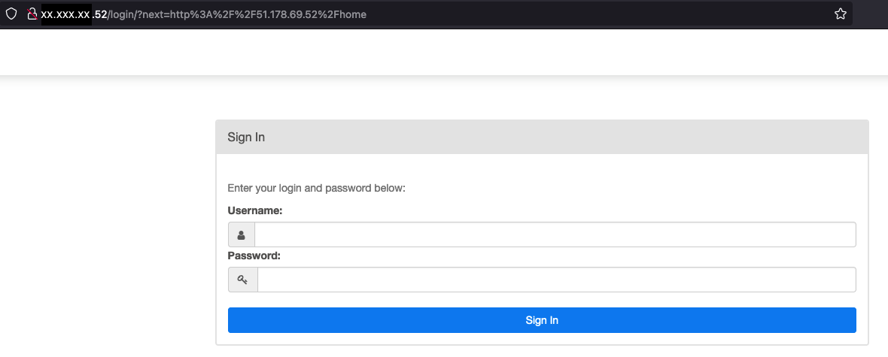
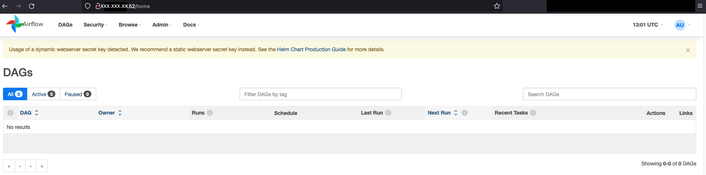

**Last updated 11th August, 2022.**

<style>
 pre {
     font-size: 14px;
 }
 pre.console {
   background-color: #300A24; 
   color: #ccc;
   font-family: monospace;
   padding: 5px;
   margin-bottom: 5px;
 }
 pre.console code {
   border: solid 0px transparent;
   font-family: monospace !important;
   font-size: 0.75em;
   color: #ccc;
 }
 .small {
     font-size: 0.75em;
 }
</style>
## Objective

The purpose of this guide is to explain how to deploy [Airflow](https://airflow.apache.org/) on a OVH Managed Kubernetes cluster.

{.thumbnail}

## Requirements

- Access to the [OVHcloud Control Panel](https://www.ovh.com/auth/?action=gotomanager&from=https://www.ovh.co.uk/&ovhSubsidiary=GB);
- An [OVH Managed Kubernetes created](https://docs.ovh.com/gb/en/kubernetes/creating-a-cluster/) inside a [Public Cloud project](https://www.ovhcloud.com/en-gb/public-cloud/) in your OVHcloud account;
- A [Nginx ingress deployed](https://docs.ovh.com/gb/en/kubernetes/installing-nginx-ingress/) on the cluster;
- [Helm CLI](https://helm.sh/docs/intro/install/) and [kubectl CLI](https://kubernetes.io/docs/tasks/tools/#kubectl) installed

## Instructions

> [!primary]
>
> Airflow needs Kubernetes nodes with at least 16 Go of RAM and 4 CPU.
>


### Create the custom Helm chart configuration file (values.yml)

By default the Airflow Helm chart doesn't install an ingress or a service in load balancer mode.
You need activate it by configuration, the easiest way is to override the Helm chart configuration creating a `values.yml` file:

```yaml
ingress:
  web:
    enabled: true
    # nginx is the ingressClass default name setted by the helm chart of the nginx ingress (see https://github.com/kubernetes/ingress-nginx/tree/main/charts/ingress-nginx#values)
    ingressClassName: nginx
```

### Deploy Airflow with the Helm chart

Airflow come with a ready to use [Helm chart](https://airflow.apache.org/docs/helm-chart/stable/index.html).

First, you need to add the remote repository to your repositories list:

```bash
helm repo add apache-airflow https://airflow.apache.org
```

Output should be like this:

<pre class="console"><code>$ helm repo add apache-airflow https://airflow.apache.org
"apache-airflow" has been added to your repositories
</code>
</pre>

Next, you can use the Airflow Helm chart to deploy Airflow:

```bash
helm upgrade --install airflow apache-airflow/airflow --namespace airflow --create-namespace -f values.yml
```

> [!primary]
>
> Note the use of the previously created `values.yml` file to override some configuration keys of the chart.
>

Output should be like this:

<pre class="console"><code>$ helm upgrade --install airflow apache-airflow/airflow --namespace airflow --create-namespace -f values.yml

Release "airflow" does not exist. Installing it now.
NAME: airflow
LAST DEPLOYED: Thu Aug 11 14:49:39 2022
NAMESPACE: airflow
STATUS: deployed
REVISION: 1
TEST SUITE: None
NOTES:
Thank you for installing Apache Airflow 2.3.0!

Your release is named airflow.
You can now access your service(s) by following defined Ingress urls:

DEPRECATION WARNING:
   `ingress.web.tls` has been renamed to `ingress.web.hosts[*].tls` and can be set per host.
   Please change your values as support for the old name will be dropped in a future release.

DEPRECATION WARNING:
   `ingress.flower.tls` has been renamed to `ingress.flower.hosts[*].tls` and can be set per host.
   Please change your values as support for the old name will be dropped in a future release.
Airflow Webserver:
      http:////
Default Webserver (Airflow UI) Login credentials:
    username: admin
    password: admin
Default Postgres connection credentials:
    username: postgres
    password: postgres
    port: 5432

You can get Fernet Key value by running the following:

    echo Fernet Key: $(kubectl get secret --namespace airflow airflow-fernet-key -o jsonpath="{.data.fernet-key}" | base64 --decode)

###########################################################
#  WARNING: You should set a static webserver secret key  #
###########################################################

You are using a dynamically generated webserver secret key, which can lead to
unnecessary restarts of your Airflow components.

Information on how to set a static webserver secret key can be found here:
https://airflow.apache.org/docs/helm-chart/stable/production-guide.html#webserver-secret-key
</code>
</pre>

Next, get the external IP of your nginx ingress:

```bash
kubectl get ingress airflow-airflow-ingress -n airflow
```

Output should be like this:

<pre class="console"><code>$ kubectl get ingress airflow-airflow-ingress -n airflow

NAME                      CLASS   HOSTS   ADDRESS        PORTS   AGE
airflow-airflow-ingress   nginx   *       XX.XXX.XX.52   80      3m17s
</code>
</pre>

At this stage you can connect to the admin UI (default login and password are `admin`) and test your Airflow installation by entered the url http://xx.xxx.xx.52 in your browser:

{.thumbnail}
{.thumbnail}
