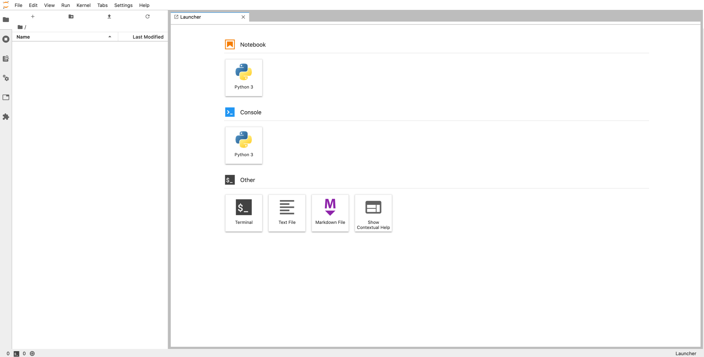

**Last updated 9th May, 2023.**

## Objective

This guide covers the submission of [**notebooks**](https://docs.ovh.com/pl/publiccloud/ai/notebooks/definition/) through the **ovhai** CLI.

## Requirements

-   a working `ovhai` CLI ([how to install ovhai CLI](https://docs.ovh.com/pl/publiccloud/ai/cli/install-client/))

## Instructions

### Run a new notebook

First, you need to select one of the machine learning frameworks and an editor among those available. You can
get a list of them using the `ovhai capabilities framework list` and `ovhai capabilities editor list` commands:

``` {.console}
$ ovhai capabilities framework list
ID              NAME                               DOC_URL                                         VERSIONS
fastai          fastai Course                      https://docs.fast.ai/                           2021-08-04-ovh.beta.1,fastai2.7.10-py310-cuda11.6-v22-4
colatible       Miniconda with Colab compatibility                                                 colatible-py37-cudaDevel11.1-v22-4
pytorch         PyTorch                            https://pytorch.org/docs/stable/index.html      pytorch1.10.1-py39-cuda10.2-v22-4,pytorch1.9.0-py39-cuda10.2-v22-4,pytorch1.11.0-py310-cuda11.3-v22-4,pytorch1.12.1-py310-cuda11.6-v22-4
mxnet           MXNet                              https://mxnet.apache.org/versions/1.5.0/        mxnet1.9.1-py310-cuda11.2-v22-4
conda           Miniconda                          https://docs.conda.io/en/latest/miniconda.html  conda-py39-cuda11.7-v22-4,conda-py39-cuda11.6-v22-4,conda-py39-cuda11.5-v22-4,conda-py39-cuda11.4-v22-4,conda-py39-cuda11.3-v22-4,conda-py39-cuda11.2-v22-4,conda-py39-cuda11.1-v22-4,conda-py39-cuda11.0-v22-4,conda-py39-cuda10.2-v22-4,conda-py39-cuda10.1-v22-4,conda-py39-cuda10.0-v22-4,conda-py39-cpu-v22-4,conda-py38-cuda11.7-v22-4,conda-py38-cuda11.6-v22-4,conda-py38-cuda11.5-v22-4,conda-py38-cuda11.4-v22-4,conda-py38-cuda11.3-v22-4,conda-py38-cuda11.2-v22-4,conda-py38-cuda11.1-v22-4,conda-py38-cuda11.0-v22-4,conda-py38-cuda10.2-v22-4,conda-py38-cuda10.1-v22-4,conda-py38-cuda10.0-v22-4,conda-py38-cpu-v22-4,conda-py310-cuda11.7-v22-4,conda-py310-cuda11.6-v22-4,conda-py310-cuda11.5-v22-4,conda-py310-cuda11.4-v22-4,conda-py310-cuda11.3-v22-4,conda-py310-cuda11.2-v22-4,conda-py310-cuda11.1-v22-4,conda-py310-cuda11.0-v22-4,conda-py310-cuda10.2-v22-4,conda-py310-cuda10.1-v22-4,conda-py310-cuda10.0-v22-4,conda-py310-cpu-v22-4,conda-py39-cudaDevel11.7-v22-4,conda-py39-cudaDevel11.6-v22-4,conda-py39-cudaDevel11.5-v22-4,conda-py39-cudaDevel11.4-v22-4,conda-py39-cudaDevel11.3-v22-4,conda-py39-cudaDevel11.2-v22-4,conda-py39-cudaDevel11.1-v22-4,conda-py39-cudaDevel11.0-v22-4,conda-py39-cudaDevel10.2-v22-4,conda-py39-cudaDevel10.1-v22-4,conda-py39-cudaDevel10.0-v22-4,conda-py38-cudaDevel11.7-v22-4,conda-py38-cudaDevel11.6-v22-4,conda-py38-cudaDevel11.5-v22-4,conda-py38-cudaDevel11.4-v22-4,conda-py38-cudaDevel11.3-v22-4,conda-py38-cudaDevel11.2-v22-4,conda-py38-cudaDevel11.1-v22-4,conda-py38-cudaDevel11.0-v22-4,conda-py38-cudaDevel10.2-v22-4,conda-py38-cudaDevel10.1-v22-4,conda-py38-cudaDevel10.0-v22-4,conda-py310-cudaDevel11.7-v22-4,conda-py310-cudaDevel11.6-v22-4,conda-py310-cudaDevel11.5-v22-4,conda-py310-cudaDevel11.4-v22-4,conda-py310-cudaDevel11.3-v22-4,conda-py310-cudaDevel11.2-v22-4,conda-py310-cudaDevel11.1-v22-4,conda-py310-cudaDevel11.0-v22-4,conda-py310-cudaDevel10.2-v22-4,conda-py310-cudaDevel10.1-v22-4,conda-py310-cudaDevel10.0-v22-4
sklearn         Scikit Learn                       https://scikit-learn.org/stable/user_guide.html sklearn1.0.2-py39-cpu-v22-4
perceval        Quandela Perceval                  https://perceval.quandela.net/docs/index.html   perceval0.7.2-py39-cpu-v22-4,perceval0.6.1-py39-cpu-v22-4,perceval0.5.2-py39-cpu-v22-4,perceval0.7.3-py39-cpu-v22-4
myqlm           Atos myQLM                         https://atos.net/en/lp/myqlm                    myqlm1.7.3-py39-cpu-v22-4
tensorflow      Tensorflow                         https://www.tensorflow.org/api_docs             tf2.8-py39-cuda11.2-v22-4,tf2.7-py39-cuda11.2-v22-4,tf2.6-py39-cuda11.2-v22-4,tf2.5-py39-cuda11.2-v22-4,tf2.4-py38-cuda11.0-v22-4,tf2.3-py38-cuda10.1-v22-4,tf2.2-py38-cuda10.1-v22-4,tf2.10-py310-cuda11.2-v22-4,tf2.11-py310-cuda11.2-v22-4,tf2.9-py310-cuda11.2-v22-4
huggingface     Hugging Face Transformers          https://huggingface.co/docs/transformers/index  hf4.26.0-py310-cuda11.6-v22-4
one-for-all     One image to rule them all                                                         v98-ovh.beta.1
autogluon-mxnet AutoGluon + MXNet                                                                  0.1.0-ovh.beta.1

$ ovhai capabilities editor list
ID         NAME       DOC_URL
jupyterlab              JupyterLab              https://jupyterlab.readthedocs.io/en/stable/
jupyterlabcollaborative JupyterLab Experimental https://jupyterlab.readthedocs.io/en/stable/user/rtc.html
vscode                  VSCode                  https://code.visualstudio.com/docs
```

In our example, we will create a new notebook using PyTorch and JupyterLab, with 1 GPU:

``` {.console}
$ ovhai notebook run --gpu 1 pytorch jupyterlab

Id:         fa43cdad-97cc-46e7-ac3b-31dd1d7d5a1e
Created At: 09-05-23 14:50:36
Updated At: 09-05-23 14:50:36
User:       user-6quQBpkve6AT
Spec:
  Name:            “”
  Labels: {}
  Resources:
    Gpu:               1
    Cpu:               13
    Memory:            40.0 GiB
    Public Network:    1.5 Gbps
    Private Network:   0 bps
    Ephemeral Storage: 750.0 GiB
    Gpu Model:         Tesla-V100S
    Gpu Brand:         NVIDIA
    Gpu Memory:        32.0 GiB
    Flavor:            ai1-1-gpu
  Volumes: []
  Unsecure Http:   false
  Env:
    Framework Id:      pytorch
    Framework Version: pytorch1.10.1-py39-cuda10.2-v22-4
    Editor Id:         jupyterlab
  Env Vars:        ~
  Ssh Public Keys: ~
Status:
  Last Transition Date: ~
  Info:
    Message: Notebook is starting
  State:                STARTING
  Duration:             0
  Url:                  https://fa43cdad-97cc-46e7-ac3b-31dd1d7d5a1e.notebook.gra.ai.cloud.ovh.net
  Info Url:             https://ui.gra.ai.cloud.ovh.net/notebook/fa43cdad-97cc-46e7-ac3b-31dd1d7d5a1e
  Monitoring Url:       ~
  Ssh Url:              ~
  Last Started At:      ~
  Last Stopped At:      ~
  Data Sync:            ~
  …
```

The first line in the output shows the ID of the notebook: `fa43cdad-97cc-46e7-ac3b-31dd1d7d5a1e`.

The "Url" corresponds to your JupyterLab server. Pasting this URL in your browser displays the following screen:



If you don't have the ID of the notebook you want to access, you can list all your notebooks using:

``` {.console}
$ ovhai notebook ls
```

We need to wait a few seconds for the notebook to start. You can get the notebook information again using its ID:

``` {.console}
$ ovhai notebook get fa43cdad-97cc-46e7-ac3b-31dd1d7d5a1e

Id:         fa43cdad-97cc-46e7-ac3b-31dd1d7d5a1e
Created At: 09-05-23 14:50:36
Updated At: 09-05-23 14:50:36
User:       user-6quQBpkve6AT
Spec:
  Name:            jupyterlab-hardcore
  Labels: {}
  Resources:
    Gpu:               1
    Cpu:               13
    Memory:            40.0 GiB
    Public Network:    1.5 Gbps
    Private Network:   0 bps
    Ephemeral Storage: 750.0 GiB
    Gpu Model:         Tesla-V100S
    Gpu Brand:         NVIDIA
    Gpu Memory:        32.0 GiB
    Flavor:            ai1-1-gpu
  Volumes: {}
  Unsecure Http:   false
  Env:
    Framework Id:      pytorch
    Framework Version: pytorch1.10.1-py39-cuda10.2-v22-4
    Editor Id:         jupyterlab
Status:
  Last Transition Date: ~
  Info:
    Message: Notebook is running
  State:                RUNNING
  Duration:             592
  Url:                  https://fa43cdad-97cc-46e7-ac3b-31dd1d7d5a1e.notebook.gra.ai.cloud.ovh.net
  Info Url:             https://ui.gra.ai.cloud.ovh.net/notebook/fa43cdad-97cc-46e7-ac3b-31dd1d7d5a1e
  Monitoring Url:       https://monitoring.gra.ai.cloud.ovh.net/d/gpu?var-notebook=fa43cdad-97cc-46e7-ac3b-31dd1d7d5a1e&from=1622118974763
  …
```

Now that the notebook is in the `RUNNING` state, a https address is defined in the "Url" field. This URL corresponds to your JupyterLab server. Pasting this URL in your browser displays the following screen:

{.thumbnail}

You can now start writing code in your notebook. Since we used the PyTorch framework in our example, we will be able to use it without having to install anything ourselves.

Once you are done with your notebook, you can stop it with the command below:

``` {.console}
$ ovhai notebook stop fa43cdad-97cc-46e7-ac3b-31dd1d7d5a1e
```

Stopping a notebook will make it unavailable from your browser, and start synchronising volumes mounted with `RW` permissions to your object storage.

Once the synchronisation is finished, and the notebook state is `STOPPED`, you can either start it again or delete it.

Being able to restart a notebook is one of the main differences compared to using [jobs](https://docs.ovh.com/pl/publiccloud/ai/training/jobs/). Restarting a notebook will restore your notebook code as it was when you stopped it. However, you will need to re-run your code to reload your variables because the program state is not saved.
To restart a notebook, run this command:

``` {.console}
$ ovhai notebook start fa43cdad-97cc-46e7-ac3b-31dd1d7d5a1e
```

You are billed for `RUNNING` notebooks but not for `STARTING`, `STOPPING` and `STOPPED` notebooks.
However, to restore your code when you restart a `STOPPED` notebook, it needs to be stored in your object storage, which you are billed for.

This is useful when you work on a notebook for some time. If you know you will not use a notebook anymore, you can delete it:

``` {.console}
$ ovhai notebook delete fa43cdad-97cc-46e7-ac3b-31dd1d7d5a1e
```

Note that a notebook can be deleted even if it is not stopped, and that deleted notebook cannot be restarted.

> [!primary]
>
> The notebook state stored in the Object Storage (including your notebook files) is not cleaned up automatically after notebook deletion.
> You can find it and delete it in the `notebooks_workspace` container of your Object Storage, under the notebook ID directory.

## Going further

Learn how to access your object storage data from your notebooks [here](https://docs.ovh.com/pl/publiccloud/ai/cli/access-object-storage-data/).

Learn how to share your notebooks with other people [here](https://docs.ovh.com/pl/publiccloud/ai/cli/sharing-notebooks/).

## Feedback

Please send us your questions, feedback and suggestions to improve the service:

- On the OVHcloud [Discord server](https://discord.com/invite/vXVurFfwe9)
