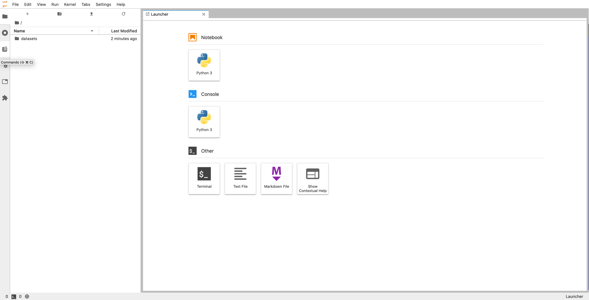

**Last updated 13th April, 2022.**

## Objective

This guide shows how to access Object Storage data from your [**notebooks**](https://docs.ovh.com/es/publiccloud/ai/notebooks/definition/).

## Requirements

- a working `ovhai` CLI ([how to install ovhai CLI](https://docs.ovh.com/es/publiccloud/ai/cli/install-client/))

## Upload data to your Object Storage

First, we need to push some data to the Object Storage before accessing it from the notebook.

Assuming a file named `my-dataset.zip` exists in your current working directory, you can use the following command
to create a data container named `my-dataset` in the GRA region that will contain your `my-dataset.zip` file.

``` {.console}
$ ovhai data upload GRA my-dataset my-dataset.zip
```

This file can now be accessed from your notebooks, either with read-only or read-write permissions.

## Access with Read-Only permissions

In order to access your dataset, you can use the `--volume` option.

``` {.console}
$ ovhai notebook run tensorflow jupyterlab --volume my-dataset@GRA:/workspace/datasets:ro
```

This command can be read as "Load the container `my-dataset` from the GRA region, in the /workspace/datasets directory,
with `ro` (read-only) permissions".

Wait a few seconds for the notebook to start, then you should see its URL in the output that you can access from your browser.
You can read the [Getting started](https://docs.ovh.com/es/publiccloud/ai/cli/getting-started-cli/) page to know how to find this URL.

You should get a page like this, showing your dataset in the file explorer:

{.thumbnail}

You will not be able to modify the dataset from this notebook because you loaded it with read-only permissions.

Read-only permissions are to ensure you don't modify your data by mistake. If you want to modify data from your
notebooks, to store a trained neural network for example, you can use the read-write permission instead.

## Access with Read-Write permissions

Similarly to the read-only mode, you can use the `--volume` option to load data with read-write permission.
The only difference is that you specify `rw` instead of `ro` in the command:

``` {.console}
$ ovhai notebook run tensorflow jupyterlab --volume my-neural-networks@GRA:/workspace/neural-networks:rw
```

Once you have some data that you want to save (a trained neural network in this example), you can simply write it
to the `/workspace/neural-networks` folder.

This folder will be uploaded to your Object Storage when you stop your notebook.
As long as your notebook is in the `STOPPING` state, this means that the upload is still in progress. Once the state
changes to `STOPPED`, it means all the data were uploaded to your Object Storage.

With the `RW` permission, you can add or modify data but you **cannot permanently delete** it from your Object Storage.

> [!primary]
>
> If you want to add, modify or **delete data**, connect your volume with **Read-write-delete** specifying `RWD` instead of `RW`.

## Attach a public Git repository

If Python code, notebooks or other files are available on a public GitHub repository, you can attach them to your notebook with the `--volume` option.
To be able to edit it and make changes easily, use the read-write permission (shorten by: `rw`).

The command is as follows:

``` {.console}
$ ovhai notebook run tensorflow jupyterlab --volume https://github.com/ovh/ai-training-examples.git:/workspace/git-hub-repository:rw
```

> [!warning]
>
> To make your command valid, don't forget to add a `.git` at the end of the GitHub repository URL.

## Access multiple volumes

In many cases you need at least one volume for your dataset, and another to store your results. You can load as many
volumes as you want by chaining the `--volume` options:

``` {.console}
$ ovhai notebook run tensorflow jupyterlab
    --volume my-dataset@GRA:/workspace/datasets:ro \
    --volume my-neural-networks@GRA:/workspace/neural-networks:rw \
    --volume https://github.com/ovh/ai-training-examples.git:/workspace/git-hub-repository:rw
```

In this case, we loaded `my-dataset` in read-only, and `my-neural-networks` and the GitHub repository in read-write mode.

## Using cached volumes

When loading large files from the Object Storage, it can take some time to download to your notebooks. In these cases, you can cache the volumes so that it does not need to be downloaded again when you start new notebooks that use the same data.

To do so, you can append `:cache` after the permissions when specifying volumes:

``` {.console}
$ ovhai notebook run tensorflow jupyterlab --volume my-dataset@GRA:/workspace/datasets:ro:cache
```

Cached volumes will be deleted at least 72 hours after the last notebook using it has stopped.
Note that the cache is shared with all users in your project. The main consequence you need to be careful about
is the fact that if someone else modifies the data in your cached volume, you will also see the modifications on your side.

## Update volume configuration

It's possible to update the volumes configuration of a notebook with the `patch` command.
It can be convenient if you need afterward a new object storage and don't want to recreate the whole notebook.

To do so, use the `patch` command with the `--volume` option:
```{.console}
$ ovhai notebook patch <notebook ID> -v my-dataset@GRA:/workspace/datasets:rw

```

> [!primary]
> 
> This is the same option as the `run` command above. You can choose to mount the volume in read-only or read & write mode and mount multiple volumes.
>

## Feedback

Please send us your questions, feedback and suggestions to improve the service:

- On the OVHcloud [Discord server](https://discord.com/invite/vXVurFfwe9) 
