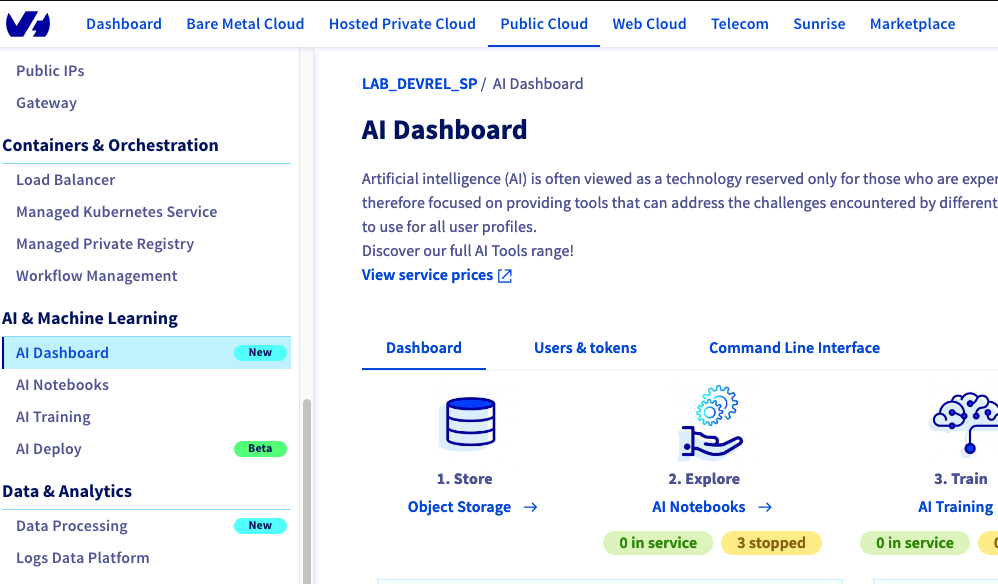

**Last updated 15th March, 2023.**

## Objective

OVHcloud provides a set of managed AI tools designed for building your machine learning projects.

This guide explains how to get started with OVHcloud AI Dashboard, a consolidated view of your usages of the OVHcloud AI tools.

## Requirements

- a [Public Cloud project](https://www.ovhcloud.com/en-gb/public-cloud/) in your OVHcloud account
- access to the [OVHcloud Control Panel](https://www.ovh.com/auth/?action=gotomanager&from=https://www.ovh.co.uk/&ovhSubsidiary=GB)

## Introduction

**AI Dashboard** is not a product but an overview of all AI products you use, billing information, security information and guide (like this one) that you can read.
It's accessible via the main menu `AI & Machine Learning` in the `Public Cloud` universe.

{.thumbnail}

The following chapters will help you to discover each section of the `AI Dashboard`.

## Dashboard tab

{.thumbnail}

In this section you will find all information related to your use of the AI Tools: [Object Storage](https://docs.ovh.com/gb/en/storage/), [AI Notebooks](https://docs.ovh.com/gb/en/publiccloud/ai/notebooks/definition/), [AI Training](https://docs.ovh.com/gb/en/publiccloud/ai/training/submit-job/) and [AI Deploy](https://docs.ovh.com/gb/en/publiccloud/ai/deploy/getting-started/).

At a glance, you can see the total amount of your next billing for your consumption with the AI tools.
You can see more details on the prices of the AI tools in the [documentation](https://www.ovhcloud.com/en-gb/public-cloud/prices/#ai-&-machine-learning).

You can also see some security information about the number of created users (and tokens) that can use your AI tools.

## Users & tokens

{.thumbnail}

In this section you will find all information about the users and tokens you have created.
You can also manage them (create, update and delete).
To know how to manage your users and token, please read the guide Manage [AI users and roles](https://docs.ovh.com/gb/en/publiccloud/ai/users/).

## Command Line Interface 

{.thumbnail}

In this section you will find all information about how to install and use our CLI.
You have also a list of the useful existing guides on the CLI.

## Documentation

{.thumbnail}

In this section you will find a random list of our guides about AI products.
You can refresh the list by clicking on the round arrow.

## Go further

Please send us your questions, feedback and suggestions to improve the service:

- On the OVHcloud [Discord server](https://discord.com/invite/vXVurFfwe9)
