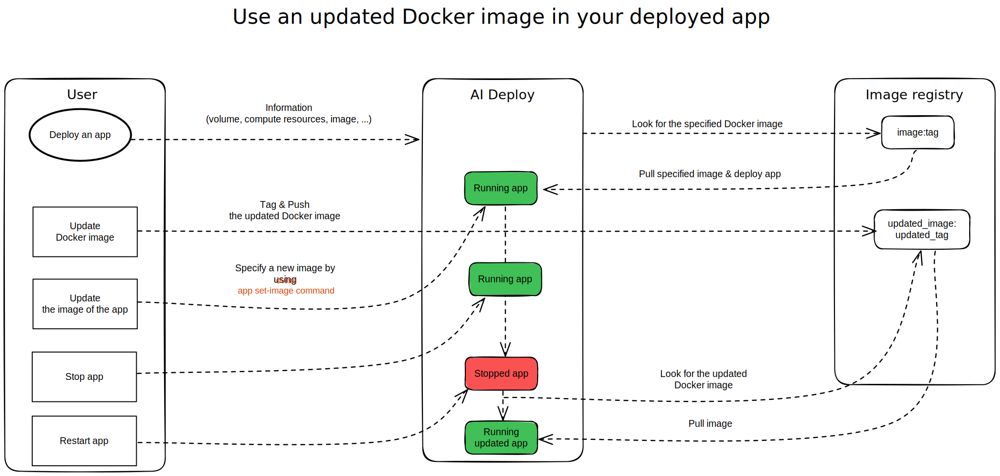

**Last updated 4th May, 2023.**

## Objective

In order to be launched, our AI Deploy application **has to be containerised**, inside a Docker image. 

While our app is running, it is likely that we will have to **update our Docker image** to correct or bring new features. That is why we will understand in this tutorial **how to make our app use the updated version of our Docker image**. 

{.thumbnail}

## Requirements

- Access to the [OVHcloud Control Panel](https://ca.ovh.com/auth/?action=gotomanager&from=https://www.ovh.com/sg/&ovhSubsidiary=sg)
- A [Public Cloud project](/pages/platform/public-cloud/create_a_public_cloud_project)
- A [user for AI Deploy](/pages/platform/ai/gi_01_manage_users)
- [Docker](https://www.docker.com/get-started) installed on your local computer or a virtual machine
- The [OVHcloud AI CLI](/pages/platform/ai/cli_10_howto_install_cli)

## Instructions

- Updating our Docker image
- Updating our app's image

### Updating our Docker image

When updating a Docker image, we have two options: 

- **Use an existing tag**: Will overwrite the old version of the image with the new one. 
- **Create a new tag**: Will keep the old version of the image while adding the new version.

> [!primary]
>
> In this tutorial, we will assume that you have already an app which is running on an Docker image, and an updated version of this image. The two previous possibilities (existing tag and new one) will be explained.
>

### Updating our app's image

Updating the image of our application is usually more interesting than restarting a new one. Indeed, this allows us first of all to keep the same link to the application. We will also avoid having to deploy a new app and specify again all our arguments (volumes, ports, resources, ...). Finally, this will allow us not to accumulate our number of deployed apps, resulting in a much more efficient management.

#### Reusing an existing tag

When updating our Docker image, we have **reused the same tag** as the one specified at the initial launch of our application. We will just have to **stop and restart** the application to use the new version of our Docker image. 

In fact, the image tag that was specified at the initial launch of the application will be pulled again during the restart step. Since the initial tag corresponds to the tag of the updated image, the new image version will be pulled and used within our restarted application.

> [!warning]
>
>As mentioned before, updating your Docker image using the same tag can be dangerous. Keep in mind that this will **overwrite, delete your previous version**.
>

##### Example 

Let's imagine that our AI Deploy app was initially launched based on the following image: `registry_adress.ovh.net/my_ai_app:v1.0.0`. As you can see, our image is stored in the `registry_adress.ovh.net` registry, is named `my_ai_app`, and the version used is tagged `v1.0.0`. 

Our app is still in a `RUNNING` state, which means that it is currently deployed. If we make changes to the image used by this application, by pushing our updated image version to the same registry, with the same tag, our old image will be replaced by the new version. But **as long as our app is running, the deployed image version will not change**, in order to keep the app running correctly.

However, if we **stop and restart** the app, the image used will be the one indicated when the app was initially launched, which means the one available at `registry_adress.ovh.net/my_ai_app:v1.0.0` in our case. As this image has been updated and the old one has been deleted, the last version (updated one) will now be used by the app.

This stop & restart operation can be performed from the [OVHcloud Control Panel](https://ca.ovh.com/auth/?action=gotomanager&from=https://www.ovh.com/sg/&ovhSubsidiary=sg) (UI) by clicking the `...` button, next to your app, as shown on the screenshot below:

{.thumbnail}

Execute it from the `ovhai` CLI with the following commands:

```console
ovhai app stop <app-id>
ovhai app start <app-id>
```

#### Creating a new tag

On the other hand, if we have updated our image under another tag, we will have to indicate this change to the application. Otherwise, the application will continue to pull the image that was specified when it was first launched. 

To indicate the updated version of the image to pull, you can use the `ovhai` CLI and enter:

```console
ovhai app stop <app-id>

ovhai app set-image <app-id> <registry-address>/<image-identifier>:<new-tag-name>

ovhai app start <app-id>
```

As you can see, you will need to stop and restart the app since the image change only takes effect when the app is restarted.

##### Example 

Let's now imagine that our AI Deploy app was initially launched based on the following image: `registry_adress.ovh.net/my_ai_app:v1.0.0`. We have updated our image, and pushed it on the same registry, but this time with a different tag: `registry_adress.ovh.net/my_ai_app:v2.0.0`.

If we only stop and restart our app, without specifying the image change (from `registry_adress.ovh.net/my_ai_app:v1.0.0` to `registry_adress.ovh.net/my_ai_app:v2.0.0`), the restarted app will continue to use the first image version (`registry_adress.ovh.net/my_ai_app:v1.0.0`). This means that it will not use the updated version.

To remedy this, we need to stop our application, change the image using the `image-set` command, and restart the app so that the change is affected. The deployed app will then use the new version of our Docker image.

## Go further

Learn how to use public and private registries when working with OVHcloud AI Tools [here](/pages/platform/ai/gi_07_manage_registry).

Discover some AI Deploy apps we built with API or Web frontend via our [Apps portfolio](/pages/platform/ai/deploy_guide_05_app_portfolio).

## Feedback

Please send us your questions, feedback and suggestions to help our team improve the service on the [OVHcloud Discord server](https://discord.gg/ovhcloud).
