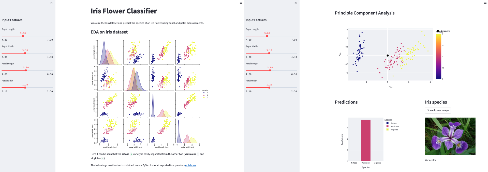

**Last updated 3rd November, 2022.**

> [!primary]
>
> AI Deploy is in `beta`. During the beta-testing phase, the infrastructure’s availability and data longevity are not guaranteed. Please do not use this service for applications that are in production, as this phase is not complete.
>
> AI Deploy is covered by **[OVHcloud Public Cloud Special Conditions](https://storage.gra.cloud.ovh.net/v1/AUTH_325716a587c64897acbef9a4a4726e38/contracts/d2a208c-Conditions_particulieres_OVH_Stack-WE-9.0.pdf)**.
>

## Objective

The objective of this tutorial is to deploy an application for **Exploratory Data Analysis** (EDA) and **interactive prediction**.

The use case is the [IRIS dataset](https://en.wikipedia.org/wiki/Iris_flower_data_set). It is a collection of data containing information on **50 observations** of four different variables: `petal length`, `petal width`, `sepal length` and `sepal width`.

{.thumbnail}

The first objective is to perform data mining on the source data from the **Iris dataset**.

Then, the goal is to make predictions using a trained model. We will therefore use a neural network and weights from this [notebook](https://github.com/ovh/ai-training-examples/blob/main/notebooks/getting-started/pytorch/notebook_classification_iris.ipynb) to classify iris flowers between different species (`Setosa`, `Versicolor` and `Virginica`). The four features are sent as input to the neural network.

The **PyTorch model** will be loaded and run, and the prediction probabilities for each class will be extracted. Depending on the input data, it will be possible to visualize the corresponding iris on a **PCA plot** to compare the input to other data points in our Iris dataset.

In order to do this, you will use [Streamlit](https://streamlit.io/), a Python framework that turns scripts into a shareable web application. You will also learn how to build and use a custom Docker image for a Streamlit application.

## Requirements

- Access to the [OVHcloud Control Panel](https://www.ovh.com/auth/?action=gotomanager&from=https://www.ovh.it/&ovhSubsidiary=it);
- An AI Deploy project created inside a [Public Cloud project](https://www.ovhcloud.com/it/public-cloud/) in your OVHcloud account;
- A [user for AI Deploy](https://docs.ovh.com/it/publiccloud/ai/users/);
- [Docker](https://www.docker.com/get-started) installed on your local computer;
- Some knowledge about building image and [Dockerfile](https://docs.docker.com/engine/reference/builder/);
- You also should have followed the **Step 6** of the *Classification of iris varieties within the same species* notebook from the [GitHub repository](https://github.com/ovh/ai-training-examples/blob/main/notebooks/getting-started/pytorch/notebook_classification_iris.ipynb). You will be able to save your PyTorch model `model_iris_classification.pth`.

## Instructions

You are going to follow different steps to build your Streamlit application.

- More information about Streamlit capabilities can be found [here](https://docs.streamlit.io/en/stable/).
- Direct link to the full Python file can be found here [here](https://github.com/ovh/ai-training-examples/blob/main/apps/streamlit/eda-classification-iris/app.py).

Here we will mainly discuss how to write the `utils.py` and `app.py` codes, the `requirements.txt` file and the `Dockerfile`. If you want to see the whole code, please refer to the [GitHub repository](https://github.com/ovh/ai-training-examples/tree/main/apps/streamlit/eda-classification-iris).

### Create the Streamlit application

Two Python files are created for the purpose of loading the PyTorch model and building the Streamlit app.

#### Define the utils.py file

This Python file is dedicated to load the **PyTorch model**. You can find the full code [here](https://github.com/ovh/ai-training-examples/blob/main/apps/streamlit/eda-classification-iris/utils.py).

First, we have to define the `Model` class with neural network architecture.

```python
class Model(nn.Module):
    def __init__(self):
        super().__init__()
        # fully connected layer : 4 input features for 4 parameters in X
        self.layer1 = nn.Linear(in_features=4, out_features=16)
        # fully connected layer
        self.layer2 = nn.Linear(in_features=16, out_features=12)
        # output layer : 3 output features for 3 species
        self.output = nn.Linear(in_features=12, out_features=3)

    def forward(self, x):
        # activation fonction : reLU
        x = F.relu(self.layer1(x))
        x = F.relu(self.layer2(x))
        x = self.output(x)
        return x
```

Then, we create the function to load model checkpoint.

```python
def load_checkpoint(path):

    model = Model()
    print("Model display: ", model)
    model.load_state_dict(torch.load(path))
    model.eval()

    return model
```

The last function allows us to load the model and get predictions.

> [!primary]
>
> To learn more about how you can save a model with PyTorch, please refer to the **last step** *"Save the model for future inference"* of the [notebook](https://github.com/ovh/ai-training-examples/blob/main/notebooks/getting-started/pytorch/notebook_classification_iris.ipynb).
>

> [!primary]
>
> You can find the PyTorch model `model_iris_classification.pth` on the [GitHub repository](https://github.com/ovh/ai-training-examples/tree/main/apps/streamlit/eda-classification-iris).
>

```python
def load_model(X_tensor):
    model = load_checkpoint(path)
    predict_out = model(X_tensor)
    _, predict_y = torch.max(predict_out, 1)
    return predict_out.squeeze().detach().numpy(), predict_y.item()

# pytorch model
path = "model_iris_classification.pth"
```

#### Write the app.py file

Load the IRIS dataset for EDA.

```python
@st.cache
def load_data():
    # load the iris dataset with sklearn
    dataset_iris = load_iris()
    # define inputs and output
    df_inputs = pd.DataFrame(dataset_iris.data, columns=dataset_iris.feature_names)
    df_output = pd.DataFrame(dataset_iris.target, columns=['variety'])
    return df_inputs, df_output
```

Display EDA figure based on source dataset.

```python
@st.cache(allow_output_mutation=True)
def data_visualization(df_inputs, df_output):
    df = pd.concat([df_inputs, df_output['variety']], axis=1)
    eda = sns.pairplot(data=df, hue="variety", palette=['#0D0888', '#CB4779', '#F0F922'])
    return eda
```

Create a sidebar with sliders.

```python
def create_slider(df_inputs):
    # slidebars with min, max and mean (by default) values
    sepal_length = st.sidebar.slider(
        label='Sepal Length',
        min_value=float(df_inputs['sepal length (cm)'].min()),
        max_value=float(df_inputs['sepal length (cm)'].max()),
        value=float(round(df_inputs['sepal length (cm)'].mean(), 1)),
        step=0.1)
    sepal_width = st.sidebar.slider(
        label='Sepal Width',
        min_value=float(df_inputs['sepal width (cm)'].min()),
        max_value=float(df_inputs['sepal width (cm)'].max()),
        value=float(round(df_inputs['sepal width (cm)'].mean(), 1)),
        step=0.1)
    petal_length = st.sidebar.slider(
        label='Petal Length',
        min_value=float(df_inputs['petal length (cm)'].min()),
        max_value=float(df_inputs['petal length (cm)'].max()),
        value=float(round(df_inputs['petal length (cm)'].mean(), 1)),
        step=0.1)
    petal_width = st.sidebar.slider(
        label='Petal Width',
        min_value=float(df_inputs['petal width (cm)'].min()),
        max_value=float(df_inputs['petal width (cm)'].max()),
        value=float(round(df_inputs['petal width (cm)'].mean(), 1)),
        step=0.1)
    return sepal_length, sepal_width, petal_length, petal_width
```

Run a PCA.

```python
@st.cache
def run_pca():
    pca = PCA(2)
    X = df_inputs.iloc[:, :4]
    X_pca = pca.fit_transform(X)
    df_pca = pd.DataFrame(pca.transform(X))
    df_pca.columns = ['PC1', 'PC2']
    df_pca = pd.concat([df_pca, df_output['variety']], axis=1)
    return pca, df_pca
```

Create a function that filters out negative values from the dataframe. Only positive values in the dataframe are kept. If a value is negative, it is set to zero.

```python
def extract_positive_value(prediction):
    # f(prediction) = max(0, prediction)
    prediction_positive = []
    for p in prediction:
        if p < 0:
            p = 0
        prediction_positive.append(p)
    return pd.DataFrame({'Species': ['Setosa', 'Versicolor', 'Virginica'], 'Confidence': prediction_positive})
```

Define a Python function to display image according to Iris species.

```python
def display_img(species):
    # define the list of images
    list_img = ['setosa.png', 'versicolor.png', 'virginica.png']
    return Image.open(list_img[species])
```

> [!primary]
>
> All the functions defined above are called in the `main` Python file `app.py` to build the Streamlit app.
> You can find this part of the code as well as the different functions defined previously on the [GitHub repository](https://github.com/ovh/ai-training-examples/blob/main/apps/streamlit/eda-classification-iris/app.py).
>

### Write the requirements.txt file for the application

The `requirements.txt` file will allow us to write all the modules needed to make our application work. This file will be useful when writing the `Dockerfile`.

```console
pandas==1.4.4
numpy==1.23.2
torch==1.12.1
streamlit==1.12.2
scikit-learn==1.1.2
plotly==5.10.0
Pillow==9.2.0
seaborn==0.12.0
```

### Write the Dockerfile for the application

Your Dockerfile should start with the the `FROM` instruction indicating the parent image to use. In our case we choose to start from the `one-for-all` OVHcloud image:

```console
python:3.8
```

Create the home directory and add your files to it:

```console
WORKDIR /workspace
ADD . /workspace
```

Install the `requirements.txt` file which contains your needed Python modules using a `pip install ...` command:

```console
RUN pip install -r requirements.txt
```

Define your default launching command to start the application:

```console
CMD [ "streamlit", "run", "/workspace/app.py", "--server.address=0.0.0.0" ]
```

Give correct access rights to **ovhcloud user** (`42420:42420`):

```console
RUN chown -R 42420:42420 /workspace
ENV HOME=/workspace
```

### Build the Docker image from the Dockerfile

Launch the following command from the **Dockerfile** directory to build your application image:

```console
docker build . -t streamlit-eda-iris:latest
```

> [!primary]
>
> The dot `.` argument indicates that your build context (place of the **Dockerfile** and other needed files) is the current directory.
>
> The `-t` argument allows you to choose the identifier to give to your image. Usually image identifiers are composed of a **name** and a **version tag** `<name>:<version>`. For this example we chose **streamlit-eda-iris:latest**.
>

### Test it locally (optional)

Launch the following **Docker command** to launch your application locally on your computer:

```console
docker run --rm -it -p 8501:8501 --user=42420:42420 streamlit-eda-iris:latest
```

> [!primary]
>
> The `-p 8501:8501` argument indicates that you want to execute a port redirection from the port **8501** of your local machine into the port **8501** of the Docker container. The port **8501** is the default port used by **Streamlit** applications.
>

> [!warning]
>
> Don't forget the `--user=42420:42420` argument if you want to simulate the exact same behaviour that will occur on **AI Deploy apps**. It executes the Docker container as the specific OVHcloud user (user **42420:42420**).
>

Once started, your application should be available on `http://localhost:8501`.

### Push the image into the shared registry

> [!warning]
>
> The shared registry of AI Deploy should only be used for testing purpose. Please consider attaching your own Docker registry. More information about this can be found [here](https://docs.ovh.com/it/publiccloud/ai/training/add-private-registry/).
>

Find the address of your shared registry by launching this command:

```console
ovhai registry list
```

Log in on the shared registry with your usual OpenStack credentials:

```console
docker login -u <user> -p <password> <shared-registry-address>
```

Push the compiled image into the shared registry:

```console
docker tag streamlit-eda-iris:latest <shared-registry-address>/streamlit-eda-iris:latest
docker push <shared-registry-address>/streamlit-eda-iris:latest
```

### Launch the AI Deploy app

The following command starts a new app running your Streamlit application:

```console
ovhai app run \
      --default-http-port 8501 \
      --cpu 12 \
      <shared-registry-address>/streamlit-eda-iris:latest
```

> [!primary]
>
> `--default-http-port 8501` indicates that the port to reach on the app URL is the `8501`.
>
> `--cpu 12` indicates that we request 12 CPUs for that app.
>

> [!primary]
>
> Consider adding the `--unsecure-http` attribute if you want your application to be reachable without any authentication.
>

## Go further

- You can imagine deploying an AI model with an other tool: **Gradio**. Refer to this [tutorial](https://docs.ovh.com/it/publiccloud/ai/deploy/tuto-gradio-sketch-recognition/).
- Another way to create an AI Deploy app is to use **Flask**! [Here it is](https://docs.ovh.com/it/publiccloud/ai/deploy/web-service-yolov5/).

## Feedback

Please send us your questions, feedback and suggestions to improve the service:

- On the OVHcloud [Discord server](https://discord.com/invite/vXVurFfwe9)
