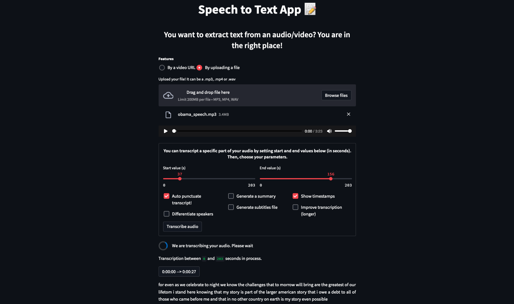

**Last updated 6th December, 2022.**

> [!primary]
>
> AI Deploy is in `beta`. During the beta-testing phase, the infrastructure’s availability and data longevity are not guaranteed. Please do not use this service for applications that are in production, as this phase is not complete.
>
> AI Deploy is covered by **[OVHcloud Public Cloud Special Conditions](https://storage.gra.cloud.ovh.net/v1/AUTH_325716a587c64897acbef9a4a4726e38/contracts/d2a208c-Conditions_particulieres_OVH_Stack-WE-9.0.pdf)**.
>

{.thumbnail}

## Objective

The purpose of this documentation is to **Deploy the Speech to Text Application** we have realised in our [blog article](https://blog.ovhcloud.com/how-to-build-a-speech-to-text-application-with-python-1-3/) using [Streamlit](https://streamlit.io/) and pre-trained models. 

Deploying your app will allow you to benefit from **very powerful resources** which will make the speech to text application extremely fast. It can also be easily shared, unlike a local application.

Here, the use case is **English Speech Recognition**, but you can choose another model as explained in our [blog article](https://blog.ovhcloud.com/how-to-build-a-speech-to-text-application-with-python-1-3/). Some models work with Chinese, French, German, Japanese, Russian, etc.

Overview of the Speech to text app:

{.thumbnail}

## Requirements

To deploy your app, you need:

- An access to the [OVHcloud Control Panel](https://ca.ovh.com/auth/?action=gotomanager&from=https://www.ovh.com/ca/fr/&ovhSubsidiary=qc).
- An AI Deploy Project created inside a [Public Cloud project](https://www.ovhcloud.com/fr-ca/public-cloud/) in your OVHcloud account
- A [user for AI Deploy](https://docs.ovh.com/ca/fr/publiccloud/ai/users/).
- [The OVHcloud AI CLI](https://cli.bhs.training.ai.cloud.ovh.net/) **and** [Docker](https://www.docker.com/get-started) installed on your local computer, **or** only an access to a Debian Docker Instance on the [Public Cloud](https://www.ovh.com/manager/public-cloud/).
- To deploy your app, you must have the full code of the application, either by cloning the [GitHub repository](https://github.com/ovh/ai-training-examples/tree/main/apps/streamlit/speech-to-text), or by having followed our [blog article](https://blog.ovhcloud.com/how-to-build-a-speech-to-text-application-with-python-1-3/) that taught you how to build this app step by step.

## Instructions

You are going to follow different steps to deploy your **Streamlit Speech to Text application**:

- **Write & Install** the libraries and packages in our environment so that our application can work.
- **Write the `Dockerfile`** that contains all the commands to launch our speech to text app.
- **Build the Docker image** from the Dockerfile
- **(Optional) - Import the models and save them locally** in an *Object Storage (volume)* to speed up the initialization of the app.
- **Deploy your app**.

*If you have cloned the [GitHub repository](https://github.com/ovh/ai-training-examples/tree/main/apps/streamlit/speech-to-text), you will not need to rewrite the files (requirements.txt, packages.txt and Dockerfile) since you already have them. In this case, you can go directly to the "Build the Docker image" step, even if it is better to understand the global operation.*

### Write the requirements.txt file for the application

The `requirements.txt` file will allow us to write all the modules needed by our application. This file will be useful for the `Dockerfile`. 
Put this file (and the next ones) in the same directory as your python scripts.

```console
librosa==0.9.1
youtube_dl==2021.12.17
numba==0.56.4
streamlit==1.9.0
transformers==4.18.0
httplib2==0.20.2
torch==1.11.0
torchtext==0.12.0
torchaudio==0.11.0
sentencepiece==0.1.96
tokenizers==0.12.1
pyannote.audio==2.1.1
pyannote.core==4.4
pydub==0.25.1
```

### Write the packages.txt file

Then, you need to write the `packages.txt` file, which contains general system packages:

```console
libsndfile1-dev
ffmpeg
```

### Write the Dockerfile for the application

A `Dockerfile` is a text document that contains all the commands a user could call on the command line to build an image.

This file should start with the `FROM` instruction, indicating the parent image to use. In our case, we choose to start from the official `python:3.8` image:

```console
FROM python:3.8
```

We recommend that you do not downgrade the version of python. Indeed, according to *pyannote.audio's* [documentation](https://github.com/pyannote/pyannote-audio), only python 3.8+ is officially supported for the moment.

Then, define the home directory and add all your files (python scripts, requirements.txt, packages.txt, and the Dockerfile) to it thanks to the following commands:

```console
WORKDIR /workspace
ADD . /workspace
```

With AI Deploy, `workspace` will be your home directory.

We can now install our needed system packages. To do this, use `apt-get`, which is a command-line tool which helps in handling packages:

```console
RUN apt-get update
RUN xargs -a packages.txt apt-get install --yes
```

Use a `pip install ...` command to install our needed python modules that are in the `requirements.txt` file:

```console
RUN pip install -r requirements.txt
```

Once your environment is set up, define your default launching command to start the application:

```console
CMD [ "streamlit" , "run" , "/workspace/main.py", "--server.address=0.0.0.0" ]
```

Finally, create a `data` folder which will temporarily store users' audio files until they are transcribed. Then, give correct access rights to the **OVHcloud user** (`42420:42420`):

```console
RUN mkdir /data ; chown -R 42420:42420 /workspace /data
ENV HOME=/workspace
```

### Build the Docker image from the Dockerfile

Before continuing, **make sure you are in the directory containing the application files** (requirements.txt, packages.txt, Dockerfile, python files). 

Once you are in it, launch the following command to build your application image:

```console
docker build . -t streamlit_app:latest
```

> [!primary]
>
> The dot `.` argument indicates that your build context (place of the **Dockerfile** and other needed files) is the current directory.
>
> The `-t` argument allows you to choose the identifier to give to your image. Usually image identifiers are composed of a **name** and a **version tag** `<name>:<version>`. For this example, we choose **streamlit_app:latest**.
>

### Push the image into the shared registry

> [!warning]
>
> The shared registry of AI Deploy should only be used for testing purposes. Please consider attaching your own Docker registry. More information about this can be found [here](https://docs.ovh.com/ca/fr/publiccloud/ai/training/add-private-registry/).
>

Find the address of your shared registry by launching this command:

```console
ovhai registry list
```

Log in on your shared registry with your usual OpenStack credentials:

```console
docker login -u <user> -p <password> <shared-registry-address>
```

Tag the compiled image and push it into your shared registry:

```console
docker tag streamlit_app:latest <shared-registry-address>/streamlit_app:latest
docker push <shared-registry-address>/streamlit_app:latest
```

### Import the models and save them locally (Optional)

As we explained in the blog article, you will considerably reduce the initialization time of the app if you download the models and store them in a local folder. This will allow you not to have to download them again every time you relaunch the application. 

To do this, we will use **AI Training**. This will allow us to launch a python script from *GitHub* that will **download the models and store them in an OVHcloud volume** named `speech_to_text_app_models`. 
When the models will be downloaded and added to this volume, the status of the job will automatically switch from `Running` to `Done` and the **job will be immediately stopped**. This operation should be quite fast.

*Unfortunately, the diarization model can't be saved anymore since pyannote.audio v2. Make sure you have replaced the `use_auth_token="ACCESS TOKEN GOES HERE"` code line in the app.py file by your own token so it can download the model. If the model fails to be downloaded during the initialization of the app, the diarization option will be disabled.*

To launch this **AI Training** job and download the models, use the following OVHcloud's CLI command:

```console
ovhai job run <shared-registry-address>/streamlit_app:latest \
    --cpu 12 \
    --volume speech_to_text_app_models@GRA/:/workspace/speech_to_text_app_models:RW \
    --volume https://github.com/ovh/ai-training-examples.git:/workspace/github_repo:rw \
    -- bash -c 'python /workspace/github_repo/apps/streamlit/speech-to-text/download_models.py'
```

> [!primary]
> `streamlit_app:latest` corresponds to the name of your Docker image.
>
> `--volume` allows you to specify what volume you want to add to your job. As mentioned, we add the volume `speech_to_text_app_models` and we put it in `RW` (read and write) mode since we want to add our models to this volume. If you do not have this volume in your Object Storage list, do not worry, it will be created automatically. As you can see, the `--volume` parameter also allows you to get files from a GitHub repository, which in our case contains the script to download the models.
> 
> `--bash` allows you to provide commands through which you install the librairies mentioned in your `requirements.txt` file, and run the python script.
>

When you run this command, an `Info url` will appear. Opening it will allow you to **track the status of the job**.
Once the *GitHub* repository is recovered, the python script will be launched and the job status will switch to `Running`. Then, you just have to wait for the job to end.

We advise you to **turn on the auto-refresh option** (`Running` status automatically disables it). This will allow you to see when the job will end (job status switches to `Done`). Otherwise, you can refresh the page manually. 

Once the models have been uploaded and the status is `Done`, you can continue.

### Launch the app on AI Deploy

> [!primary]
>
> If you followed the optional part `Import the models and save them locally`, you can load the volume where your models are stored with the `--volume` parameter. This time, we put this volume in read-only (`RO`) mode because we only need to have an access to the models so we can use them. We don't need to write or delete anything in this Object Storage container.
>
> Otherwise, you can remove the `--volume` line, since it will not bring anything to your app.
>

The following command starts a new app running your Streamlit application:

```console
ovhai app run \
      --default-http-port 8501 \
      --gpu 1 \
      --volume speech_to_text_app_models@GRA/:/workspace/models:RO \
      <shared-registry-address>/streamlit_app:latest
```

> [!primary]
>
> `default-http-port 8501` indicates that the port to reach on the app URL is the `8501`.
>
> `--gpu 1` indicates that we request 1 GPU for our app.
>

If you want your app to be accessible without the need to authenticate, specify it as follows:

> [!primary]
>
> Consider adding the `--unsecure-http` attribute if you want your application to be reachable without any authentication.
>

## Feedback

Please send us your questions, feedback and suggestions to improve the service:

- On the OVHcloud [Discord server](https://discord.com/invite/vXVurFfwe9)
