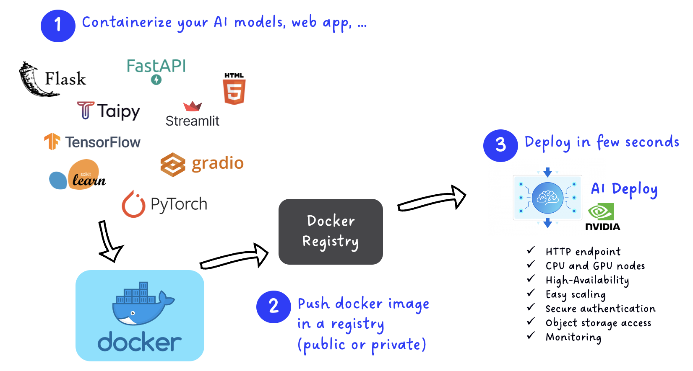

**Last updated 29th March, 2023.**

## Objective

This tutorial covers the process of building your own Docker image for AI Deploy. After detailing major guidelines, we will cover a quick example.

## Requirements

- Access to the [OVHcloud Control Panel](https://www.ovh.com/auth/?action=gotomanager&from=https://www.ovh.es/&ovhSubsidiary=es)
- A **Public Cloud** project
- A [user for AI Deploy](https://docs.ovh.com/es/publiccloud/ai/users)
- [Docker](https://www.docker.com/get-started) installed on a personal computer or a virtual machine
- Knowledge about building a Docker image (see the [official Getting Started guide](https://docs.docker.com/get-started/))

## Quick overview

AI Deploy main goal is to simplify AI models or applications deployment, release them in production, with resiliency and security, in a few seconds.
Each application is linked to compute resources such as CPUs or GPUs, and can be accessed through an HTTP Endpoint provided by AI Deploy for each app.

In order to be deployed, your model or application **has to be containerised**, inside a Docker image. Containers provide isolation but also flexibility for your deployments.
The Docker images that you build can be deployed locally, with OVHcloud AI Deploy but also with cloud competitors such as AWS or GCP.

Inside your Docker image, you are free to install almost anything and everything as long as you follow guidelines below.

AI Deploy accept images from **public** or **private** repositories. In short, we can summarize AI deploy with the following schema:


{.thumbnail}


## Guidelines to follow

### Start from an existing Docker image

Instead of starting from scratch, feel free to start from an existing Docker image, as long as it is compliant with the following guidelines.
For example, you can start from 'python', from 'alpine' or equivalent.

If you need to work with GPUs, please read the next paragraph.

### Use specific images with CUDA drivers for GPUs

> [!primary]
>
> If you want to communicate with our **GPU** hardware in your **AI Deploy apps**, the base image should have **cuda drivers installed**.

Here is a potential list of official base images (featuring **cuda drivers**) that you can use:

- [pytorch/pytorch:latest](https://hub.docker.com/r/pytorch/pytorch)
- [tensorflow/tensorflow:latest-gpu](https://hub.docker.com/r/tensorflow/tensorflow)
- [huggingface/transformers-pytorch-gpu:latest](https://hub.docker.com/r/huggingface/transformers-pytorch-gpu/) (docker pull huggingface/transformers-pytorch-gpu:latest)
- [mxnet/python](https://hub.docker.com/r/mxnet/python)
- [nvidia/cuda](https://hub.docker.com/r/nvidia/cuda)

For example, if you want to start from the base image `tensorflow/tensorflow:latest-gpu`:

```{.console}
FROM tensorflow/tensorflow:latest-gpu
```

### Use the linux/amd64 architecture

Your Docker image has to support at least the `linux/amd64` platform to be deployed correctly. Otherwise deployment will fail.

When you invoke a build, you can set the `--platform` flag to specify the target platform for the build output, `linux/amd64`.
This is especially relevant if you use newer Apple computers (M1/M2/... chipsets) or ARM-based computers.

```{.console}
docker buildx build --platform linux/amd64,linux/arm64 ...
```

More information can be found in the [official Docker documentation](https://docs.docker.com/build/building/multi-platform/).

### Create an OVHcloud user and a working directory

Deployed containers are not run as root, but by an “OVHcloud” user with **UID 42420**. 
It means that if you want to be able to write in a specific directory at runtime, you will have to give it specific rights. 

This is the case in the vast majority of use cases.

You can do it with the following instructions:


```{.console}
# Define a working directory called workspace
WORKDIR /workspace
 
# Copy some files from your computer to the Docker image
COPY my_app.py /workspace/
COPY my_models /workspace/my_models/
 
# Create a HOME dedicated to the OVHcloud user (42420:42420)
RUN chown -R 42420:42420 /workspace
ENV HOME=/workspace
 
# Change the ownership of any other useful directory to the OVHcloud user (42420:42420)
RUN chown -R 42420:42420 <another_useful_directory>
 
# Run your app
CMD [ "python3" , "/workspace/my_app.py" ]
```

### Install dependencies via apt or pip

Usually, Python or Linux packages will be required for your application. You can follow [Docker best practices](https://docs.docker.com/develop/develop-images/dockerfile_best-practices/) for that, meaning install dependencies with `apt` or `pip`.

Here is a compliant example:

```{.console}
RUN apt-get update && apt-get install -y \
  git \
  other_linux_packages \
  ... \

# Install few Python requirements, such as pandas, scikit-learn, taipy...
COPY requirements.txt /workspace/requirements.txt
RUN pip install -r requirements.txt
``` 

### Manage output data effectively (S3, ...)

Just like AI Notebooks and AI Training, AI Deploy is easily connected to remote storage such as S3 object storage containers at launch.
However, unlike AI Notebooks and AI Training, AI Deploy **does NOT** synchronise data back to your remote storage.

If you need to write data somewhere, for example output from your AI model (generated images), your code application should include storage connection.
For example, you can use the Python `Boto3` library when using Python and S3. 

Be careful, **if you write data directly in your working directory, it will be lost when you stop your application**.

### Use environment variables for dynamic values

> [!primary]
>
> For sensitive data such as passwords or tokens, consider using [Docker Secrets](https://docs.docker.com/engine/swarm/secrets/).

Sometimes, instead of hardcoding a variable inside a Dockerfile, it is much more powerful to pass variables during deployment. Docker provides this option natively through the `--env` argument, and OVHcloud AI tools follow the same logic.

During AI Deploy app creation, you will be able to pass environment variables via CLI, API or UI in the control panel. In your Dockerfile, you can gather theses variables with the `ENV` value.

For example, you can launch a new app with two variables like this:

```
ovhai run app <my_docker_image> -e LANGUAGE=english TOKEN=12345678 
```

In your Dockerfile, you can easily reuse the variables:


```{.console}
# no default value
ENV LANGUAGE
ENV TOKEN

# a default value
ENV foo /bar
# or ENV foo=/bar

# ENV values can be used during the build
ADD . $foo
# or ADD . ${foo}
# translates to: ADD . /bar
```

### Exposing your model or application with an API

Inside your Dockerfile, you will need to expose your model or application so anyone can use it. The easiest way is to expose API via REST endpoint.
The most popular open source frameworks for exposing APIs are [Flask]() and [Fast API]().

You can find a basic example in the section below, and more advanced tutorials in our [AI Deploy documentation](https://docs.ovh.com/es/publiccloud/ai/).

### Exposing your application with a web frontend

While an API is useful for automation and code, sometimes you will need to expose your application or model through a web interface.

AI Deploy is fully compliant with multiple frontend frameworks, such as [Streamlit](https://streamlit.io/), [Gradio](https://gradio.app/) or [Taipy](https://www.taipy.io/).
You can of course also build your own frontend with your favourite tools, such as HTML/CSS.

You can find a basic example in the section below, and more advanced tutorials in our [AI Deploy documentation](https://docs.ovh.com/es/publiccloud/ai/).

## Basic example: Write your own Dockerfile and build your image

Here we will build a basic Docker image, following the guidelines.

### Prepare the Dockerfile

Create a new file and name it `Dockerfile`, following the guidelines.

1. First you need to choose a base image to start from. 
2. Install what you need as dependencies with `apt` or `pip`. Bash command instructions on your Dockerfile should begin with the `RUN` prefix.
3. Copy files from your local directory inside the Docker image with the `COPY` prefix.
4. Allow user "OVHcloud UID 42420" to get specific rights.
5. Run your script.

A basic example can be summarised like this:

```{.console}
# Start from official Python image since we don't need GPU
FROM python:3.9

# Create a working directory
WORKDIR /workspace

# Install a few requirements, such as vim and git
RUN apt-get update && apt-get install -y vim git 

# Add your files to your Docker image. NB: best practice is to put data outside, such as S3 storage
ADD example.py /workspace/
ADD dataset.csv /workspace/

# Create a HOME dedicated to the OVHcloud user (42420:42420). Mandatory step
RUN chown -R 42420:42420 /workspace
ENV HOME=/workspace

# Run your script 
CMD [ "python3" , "/workspace/example.py" ]
```

### Build your Docker image

Once your **Dockerfile** is complete and matches your needs, you have to choose a name and build the image using the following command in the same directory:

```{.console}
docker build . -t <image-identifier>
```

> [!primary]
>
> The dot argument `.` indicates that your build context (place of the **Dockerfile** and other needed files) is the current directory.

> [!primary]
>
> The `-t` argument allows you to choose the identifier to give to your image. Usually, image identifiers are composed of a **name** and a **version tag** `<name>:<version>`.

> [!warning]
>
> Please make sure that the Docker image you will push in order to run containers using AI products respects the **linux/amd64** architecture. You could, for instance, build your image using **buildx** as follows:
>
> `docker buildx build --platform linux/amd64 ...`
>

## Test it locally (optional)

If you want to verify that your built image is working properly, run the following command:

```{.console}
docker run --rm -it --user=42420:42420 <image-identifier>
```

> [!warning]
>
> Don't forget the `--user=42420:42420` argument if you want to simulate the exact same behaviour that will occur on **AI Deploy apps**. It executes the Docker container as the specific OVHcloud user (user **42420:42420**).

### Push the image to the registry of your choice

Pushing your image to a registry is needed in order for AI Deploy to pull it.

AI Deploy provides a default registry called **Shared registry** where users are able to push their custom images. It is linked with every project by default.

If you prefer using your own private Docker registry instead of the shared one, feel free to use it. Just don't forget to [add your registry in your AI Tools project](https://docs.ovh.com/es/publiccloud/ai/training/add-private-registry) before using it.

The basic commands to push a Docker image to a registry is:

```{.console}
# Add a new registry into OVHcloud AI Tools
ovhai registry add <url>

# Push your image
docker login -u <registry-user> -p <registry-password> <registry>
docker tag <image-identifier> <registry>/<image-identifier>
docker push <registry>/<image-identifier>
```

Example: If you want to push an image named `custom-image` inside a registry `registry.gra.ai.cloud.ovh.net`:

```{.console}
# Add a new registry into OVHcloud AI Tools
ovhai registry add my-registry.ai.cloud.ovh.net

docker login -u <registry-user> -p <registry-password> my-registry.ai.cloud.ovh.net
docker tag custom-image:latest my-registry.ai.cloud.ovh.net/custom-image:latest
docker push my-registry.ai.cloud.ovh.net/custom-image:latest
```

If you want to know the exact commands to push on the shared registry, please consult the `Details`{.action} button of the **Shared Docker Registry** section in the **Home** panel of AI Training.

{.thumbnail}


## Go further

- Discover some AI Deploy apps we built with API or Web frontend via our [Apps portfolio](https://docs.ovh.com/es/publiccloud/ai/deploy/apps-portfolio/).

## Feedback

Please send us your questions, feedback and suggestions to improve the service:

- On the OVHcloud [Discord server](https://discord.gg/ovhcloud)
