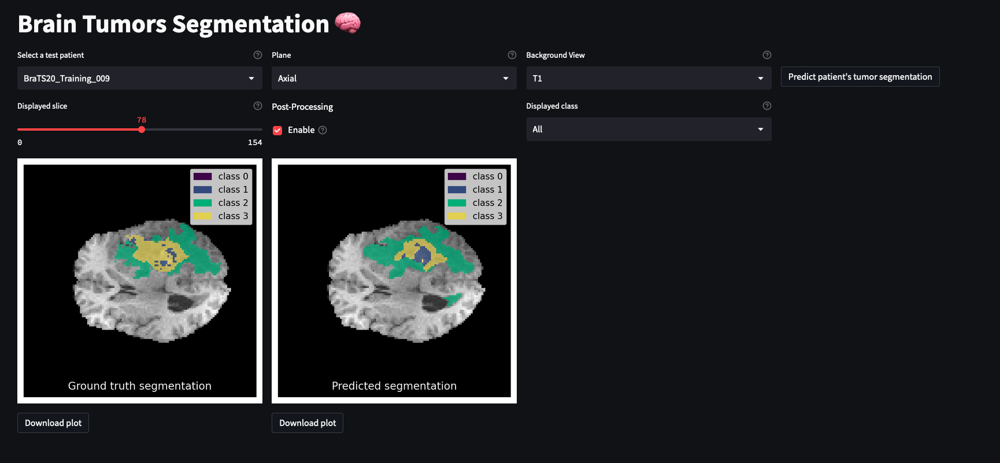

**Last updated 11th May, 2023.**

> [!primary]
>
> AI Deploy is covered by **[OVHcloud Public Cloud Special Conditions](https://storage.gra.cloud.ovh.net/v1/AUTH_325716a587c64897acbef9a4a4726e38/contracts/d2a208c-Conditions_particulieres_OVH_Stack-WE-9.0.pdf)**.
>

## Objective

The purpose of this tutorial is to show how to **deploy an image segmentation application**, which allows to use the U-Net model we trained in [this notebook](https://github.com/ovh/ai-training-examples/blob/main/notebooks/computer-vision/image-segmentation/tensorflow/brain-tumor-segmentation-unet/notebook_image_segmentation_unet.ipynb). This will allow us to visualize and segment brain tumors.

In order to do this, we will use [Streamlit](https://streamlit.io/), a Python framework that turns scripts into a shareable web application. You will also learn how to build and use a custom Docker image for a Streamlit application.

For more information on how to train U-Net on the [BraTS2020 Dataset](https://www.kaggle.com/datasets/awsaf49/brats20-dataset-training-validation), refer to the following [documentation](/pages/platform/ai/notebook_tuto_12_image-segmentation-unet-tumors).

Overview of our image segmentation app:

{.thumbnail}

## Requirements

To deploy your app, you need:

- Access to the [OVHcloud Control Panel](https://www.ovh.com/auth/?action=gotomanager&from=https://www.ovh.pt/&ovhSubsidiary=pt)
- An AI Deploy Project created inside a [Public Cloud project](https://www.ovhcloud.com/pt/public-cloud/) in your OVHcloud account
- A [user for AI Deploy](https://docs.ovh.com/pt/publiccloud/ai/users)
- [The OVHcloud AI CLI](https://docs.ovh.com/pt/publiccloud/ai/cli/install-client/) installed on your local computer
- [Docker](https://www.docker.com/get-started) installed on your local computer, **or** access to a Debian Docker Instance, which is available on the [Public Cloud](https://www.ovh.com/manager/public-cloud/).
- Some knowledge about building image and [Dockerfile](https://docs.docker.com/engine/reference/builder/)
- The BraTS2020 dataset. [Download it here](https://www.kaggle.com/datasets/awsaf49/brats20-dataset-training-validation)
- Your weights obtained from training the U-Net model on this dataset (refer to the *"Step 6 - Train and Save the model"* part of the [image segmentation notebook tutorial](https://github.com/ovh/ai-training-examples/blob/main/notebooks/computer-vision/image-segmentation/tensorflow/brain-tumor-segmentation-unet/notebook_image_segmentation_unet.ipynb)). 
- The full code of the application, which can be found on this [GitHub repository](https://github.com/ovh/ai-training-examples/tree/main/apps/streamlit/image-segmentation-brain-tumors), which I invite you to clone.

## Instructions

We are going to follow different steps to deploy our **brain tumor segmentation application**:

- **Write the requirements.txt** that contains the required libraries that need to be installed so that our application can work.
- **Write the `Dockerfile`** that contains all the commands to launch our image segmentation app.
- **Upload the dataset and the model's weights to an Object Storage** *(volume)* to be able to use this data within the app's environment.
- **Build the Docker image** from the Dockerfile.
- **Push the image into a registry.**
- **Deploy your app**.

*If you have cloned the [app's repository](https://github.com/ovh/ai-training-examples/tree/main/apps/streamlit/image-segmentation-brain-tumors), you will not need to rewrite the files (`requirements.txt` and `Dockerfile`) since you already have them. In this case, you can go directly to the "Build the Docker image" step, even if it is better to understand the global process.*

### Write the requirements.txt file for the application

The `requirements.txt` file will allow us to write all the modules needed by our application. This file will be useful for the `Dockerfile`.
Put this file (and the next ones) in the same directory as your python scripts.

```console
keras==2.10.0
matplotlib==3.5.1
nibabel==5.1.0
numpy==1.22.0
opencv-python-headless==4.7.0.68
scikit-image==0.20.0
scikit-learn==1.0.2
streamlit==1.20.0
tensorflow==2.10.0
```

### Write the Dockerfile for the application

A `Dockerfile` is a text document that contains all the commands a user could call on the command line to build an image.

This file should start with the `FROM` instruction, indicating the parent image to use. In our case, we choose to start from the official `tensorflow/tensorflow` image:

```console
FROM tensorflow/tensorflow
```

Then, define the home directory and add all your files (python scripts, requirements.txt and the Dockerfile) to it thanks to the following commands:

```console
WORKDIR /workspace
ADD . /workspace
```

With AI Deploy, `workspace` will be your home directory.

Now, let's indicate that we must install the `requirements.txt` file which contains our needed Python modules, by using a `pip install ...` command:

```console
RUN pip install -r requirements.txt
```

Once our environment is set up, we must define our default launching command to start the application:

```console
CMD [ "streamlit" , "run" , "/workspace/main.py", "--server.address=0.0.0.0" ]
```

Finally, give correct access rights to the **OVHcloud user** (`42420:42420`):

```console
RUN chown -R 42420:42420 /workspace
ENV HOME=/workspace
```

### Upload the dataset and the model's weights in an Object Storage

In order to use our trained model on the dataset images, we need to create two container objects, one for the model's weights, one for the BraTS2020 dataset. We can either:

- upload the dataset as a `.zip` file (4GB) which will be unzipped by the app's python code when the Streamlit application is started.
- upload the whole dataset. Though it is much heavier to upload (40GB), it will not require an unzip step. 

In this tutorial, we will upload the `.zip` format.

> [!warning]
>
> If your model's weights and/or your .zip are in a folder, be careful to only add the files, not their folders. Otherwise, the path to these resources will no longer be directly attached to the root `/workspace`. The name of the folder must be specified before the name of the file, which means that you will need to adapt the application code, especially the places where the resource paths are mentioned (`variables.py` and `dataset_unzip()` function from `utils.py`).
>

You can upload your data to the cloud either by using the [OVHcloud Control Panel (UI)](https://www.ovh.com/auth/?action=gotomanager&from=https://www.ovh.pt/&ovhSubsidiary=pt) or with the [OVHcloud AI CLI](https://docs.ovh.com/pt/publiccloud/ai/cli/install-client/).

#### Upload data via UI (Control Panel)

If you do not feel comfortable with commands, this method will be more intuitive.

First, log in to the [OVHcloud Control Panel](https://www.ovh.com/auth/?action=gotomanager&from=https://www.ovh.pt/&ovhSubsidiary=pt) and access the `Public Cloud`{.action} section.

Then, select the `Object Storage`{.action} section (in the Storage category) and [create a new object container](https://docs.ovh.com/pt/storage/object-storage/pcs/create-container/) by clicking `Storage`{.action} > `Object Storage`{.action} > `Create an object container`{.action}.

Here you can create the object container that will store the dataset and the model's weights. Several `types` and `regions` are available, choose the best parameters for you.

We advise you to separate your data by creating a container dedicated to the model weights and a second container for the dataset.

We will name our object containers `BraTS2020_dataset_zip` and `BraTS2020_model_weights`.

Once your object containers are created, you will see them in the Object Storage list. By clicking on them, you will be able to click the `Add Objects`{.action} button, which will allow you to upload your data to the cloud.

#### 1.2 - Upload data via CLI

To follow this part, make sure you have installed the [ovhai CLI](https://cli.bhs.ai.cloud.ovh.net/) on your computer or on an instance.

As in the Control Panel, you will have to specify the `region`, the `name of your container` and the `path` where your data will be located. The creation of an object container can be done with the following command:

```console
ovhai bucket object upload <container>@<region> <paths>
```

Here are the commands that we will enter:

- Upload the dataset (`.zip`):

```console
ovhai bucket object upload BraTS2020_dataset_zip@GRA brats20-dataset-training-validation.zip
```

- Upload the model's weights:

```console
ovhai bucket object upload BraTS2020_model_weights@GRA model_.26-0.025329.m5.index model_.26-0.025329.m5.data-00000-of-00001
```

> [!warning]
>
> Make sure to upload the 2 files obtained during the training of your model.
> Weight files names can change for you. Make sure that the variable `best_weights_path` (of the `variables.py` file) indicates the path of your model's weights. Change it if necessary.
>

Once your data is uploaded, it can be accessed from all OVHcloud AI tools, either with read-only (RO) or read-write (RW) permissions.

> [!warning]
>
> Before continuing, make sure to modify the `samples_test` list in the `variables.py` file.
> Indeed, this list must contain the patients of the test set, which were not used for the training of the model. This list will not be the same for you, since the patients were randomly shuffled. It is therefore important that you replace it with your own test samples list!
>

### Build the Docker image from the Dockerfile

Before continuing, **make sure you are in the directory containing the application files** (requirements.txt, packages.txt, Dockerfile, python files).

Once you are in it, launch the following command to build your application image:

```console
docker build . -t tumor_seg_streamlit_app:latest
```

> [!primary]
> **Notes**
>
> - The dot `.` argument indicates that our build context (place of the **Dockerfile** and other needed files) is the current directory.
>
> - The `-t` argument allows us to choose the identifier to give to our image. Usually image identifiers are composed of a **name** and a **version tag** `<name>:<version>`. For this example we chose **tumor_seg_streamlit_app:latest**.

> [!warning]
>
> In order to run containers using AI products, please make sure that the docker image you will push respects the **linux/AMD64** target architecture. You could, for instance, build your image using **buildx** as follows:
>
> `docker buildx build --platform linux/amd64 ...`
>

### Test it locally (optional)

Launch the following **Docker command** to launch the application locally on your computer:

```console
docker run --rm -it -p 8501:8051 --user=42420:42420 tumor_seg_streamlit_app:latest
```

> [!primary]
> **Notes**
>
> - The `-p 8501:8501` argument indicates that you want to execute a port redirection from the port **8501** of your local machine into the port **8501** of the Docker container. The port **8501** is the default port used by **Streamlit** applications.
>
> - Don't forget the `--user=42420:42420` argument if you want to simulate the exact same behaviour that will occur on **AI Deploy apps**. It executes the Docker container as the specific OVHcloud user (user **42420:42420**).

Once started, your application should be available on `http://localhost:8501`.

### Push the image into the shared registry

> [!warning]
> **Warning**
> The shared registry of AI Deploy should only be used for testing purposes. Please consider attaching your own Docker registry. More information about this can be found [here](https://docs.ovh.com/pt/publiccloud/ai/training/add-private-registry).

Find the address of your shared registry by launching this command:

```console
ovhai registry list
```

Log in on your shared registry with your usual OpenStack credentials:

```console
docker login -u <user> -p <password> <shared-registry-address>
```

Tag the compiled image and push it into your shared registry:

```console
docker tag tumor_seg_streamlit_app:latest <shared-registry-address>/tumor_seg_streamlit_app:latest
docker push <shared-registry-address>/tumor_seg_streamlit_app:latest
```

### Launch the AI Deploy app

The following command starts a new app running your Streamlit application:

```console
ovhai app run <shared-registry-address>/tumor_seg_streamlit_app:latest \
      --gpu 1 \
      --default-http-port 8501 \
      --volume BraTS2020_model_weights@GRA/:/workspace/weights:RO:cache \
      --volume BraTS2020_dataset_zip@GRA/:/workspace/BraTS2020_dataset_zip:RO:cache
```

> [!primary]
> **Notes**
>
> - `--default-http-port 8501` indicates that the port to reach on the app URL is `8501`.
>
> - `--gpu 1` indicates that we request 1 GPU for that app.
>
> - `--volume` allows us to specify what volume we want to add to our job. As mentioned, we add the **BraTS2020 dataset and weights** volumes, which we put in `RO:cache` mode. RO stands for Read-Only, which means that we will only be able to read the data from these volumes and not modify them. Since all our volumes are in RO mode, a good idea is to cache our data, which will allow faster initialization of apps connected to these same volumes. 
>
> - Consider adding the `--unsecure-http` attribute if you want your application to be reachable without any authentication.

## Go further

- Do you want to use Streamlit to create an audio classification app? [Learn how to do it](https://docs.ovh.com/pt/publiccloud/ai/deploy/tuto-streamlit-sounds-classification/).
- Learn how to create & deploy a Speech-to-Text app [here](https://docs.ovh.com/pt/publiccloud/ai/deploy/tuto-streamlit-speech-to-text-app/).

## Feedback

Please send us your questions, feedback and suggestions to improve the service:

- On the OVHcloud [Discord server](https://discord.com/invite/vXVurFfwe9)
