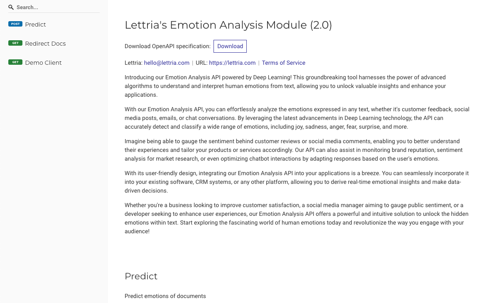

## Objective

OVHcloud offers different Artificial Intelligence services through its AI Partners Ecosystem. You will benefit from a catalogue of **ready-to-use applications** provided by our partners which you will be able to easily deploy according to your needs through **AI Deploy**.

**Lettria is an OVHcloud partner that offers AI services dedicated to text. This guide will introduce Lettria models features, as well as covering how it works and associated billing.**

## Introduction

**Lettria** is a start-up specialized in **NLP** (Natural Language Processing). The platform enables all organizations, from start-ups to large corporations, to perform textual analysis on their data to take the best strategic decisions.

Lettria provides text understanding models that allow users to easily identify and extract key information from their text. This method relies on artificial intelligence and NLP techniques to extract **sentiments**, **emotions** and **entities** from a text.

The uses are many:

- Customer service automation
- Social media monitoring
- Content moderation
- Text classification

## Lettria models features

The Lettria models available at OVHcloud cover three NLP tasks: **sentiment analysis**, **emotion extraction** and **name entity recognition**.

### Sentiment

Lettria gives you the possibility to analyze the sentiments of a text. The principle is to automatically classify textual data as **positive**, **negative** or **neutral** based on the underlying sentiment expressed in the text.

Input example:

```console
I love Lettria and OVHcloud!
```

Output example:

```console
{"type":"positive","score":0.893}
```

{.thumbnail}

> [!primary]
>
> To learn more about **Lettria's sentiment analysis model**, please refer to this [documentation](https://doc.lettria.com/api-reference/comprehension/2.0/schemas/sentence/ml-sentiment).
>

### Emotion

Lettria allows you to extract emotion from text data. The goal is to automatically classify text data according to the emotions it conveys: **happiness**, **sadness**, **anger**, **fear**, ...

Input example:

```console
I love Lettria and OVHcloud!
```

Output example:

```console
{"type":"love","confidence":0.99}
{"type":"admiration","confidence":0.65}
{"type":"joy","confidence":0.585}
```

{.thumbnail}

> [!primary]
>
> To learn more about **Lettria's emotion extraction model**, please refer to this [documentation](https://doc.lettria.com/api-reference/comprehension/2.0/schemas/sentence/ml-emotion).
>

### Name Entity Recognition

Lettria gives you the possibility to extract entities from a text. The principle is to automatically identify and classify key entities such as **Locations** (LOC), **Persons** (PER), **Organizations** (ORG), and **Miscellaneous** (MISC) within a text.

Input example:

```console
John is using Lettria app for NER task.
```

Output example:

```console
{
   "predictions":[
      [
         {
            "entity":"PER",
            "score":0.834,
            "confidence":0.673,
            "words":"John",
            "start":0,
            "end":4
         },
         {
            "entity":"MISC",
            "score":0.941,
            "confidence":0.919,
            "words":"Lettria",
            "start":14,
            "end":21
         }
      ]
   ],
   "analysed_chars":32
}
```

{.thumbnail}

> [!primary]
>
> To learn more about **Lettria's NER model**, please refer to this [documentation](https://doc.lettria.com/api-reference/comprehension/2.0/schemas/sentence/ml-ner).
>

## Lettria quick start

To be able to query the Lettria models, you must first deploy one of the Lettria images with AI Deploy.

In this example, we will rely on the **emotions extraction** from a text.

### Launch a Lettria app

To launch an AI Deploy app, there are several possibilities. You can do it from the [OVHcloud Control Panel](https://www.ovh.com/auth/?action=gotomanager&from=https://www.ovh.co.uk/&ovhSubsidiary=GB) or the CLI `ovhai`.

#### Launch an app from the OVHcloud Control Panel

To launch your Lettria app from the UI, you have to fill in some information:

- **Location**
- **Application to deploy** - *in this example, we choose the "emotions" image with gpu compliance*

{.thumbnail}

> [!warning]
>
> Please be careful when choosing the image, depending on the required resources.
>
> For a `GPU` app, choose the Lettria image containing `gpu` in its tag, then choose one or more GPUs as resources.
> The same principle of operation also applies for CPU apps.
>

- **Resources** - *we advise you to use 1 GPU*
- **Configure your app** - *add a label if you have chosen a restricted access*

> [!primary]
>
> To know how to launch an app from the [OVHcloud Control Panel](https://www.ovh.com/auth/?action=gotomanager&from=https://www.ovh.co.uk/&ovhSubsidiary=GB), refer to this [guide](/pages/platform/ai/deploy_guide_02_getting_started).
>

#### Launch an app with ovhai CLI

You can also start this app with the `ovhai` [CLI](/pages/platform/ai/cli_10_howto_install_cli) by running the following command:

```console
ovhai app run \
    --gpu 1 \
    --label <name=value> \
    --partner lettria \
    emotion-analysis:v0.1.0-gpu
```

> [!primary]
>
> Replace `<label=name>` by the variables corresponding to your **token**. To know more about the management of the token, refer to this [documentation](/pages/platform/ai/deploy_guide_03_tokens).
>

#### Access to your Lettria apps

Once the app is launched and in `RUNNING` status, you can copy the URL and access your app. You will then be redirected and you can interact with the Lettria API.

{.thumbnail}

### Ask Lettria models

You can now question the **Lettria models** about your text sentiments or emotions.

> [!primary]
>
> In the following example, we will focus on the model that extracts text **emotions**.
> For more detailed information on Lettria models, please refer to this [documentation](/pages/platform/ai/ecosystem_02_lettria_models).
>

#### Generate a cURL query

Now that your Lettria app is running with AI Deploy, you are ready for questioning the AI models.

You can use the following example with the following parameters:

- url of the app - *replace `<app_url>` with yours*
- access token (since we are on restricted access) - *replace `<your_token_bearer>` with yours*
- data format
- data to process (text)

```console
curl --request POST \
    --url <app_url>/predict \
    -H "Authorization: Bearer <your_token_bearer>" \
    --header 'Content-Type: application/json' \
    --data '["Congratulations! You have successfully launched your Lettria app."]'
```

Result:

```console
[{"type":"gratitude","confidence":0.936,"detail":{"gratitude":0.936,"admiration":0.921,"pride":0.861,"joy":0.701,"excitement":0.689,"amusement":0.306,"caring":0.244,"approval":0.239,"optimism":0.207,"relief":0.168,"neutral":0.154,"surprise":0.148,"realization":0.081,"curiosity":0.07,"love":0.06,"desire":0.04,"anger":0.04,"annoyance":0.035,"fear":0.019,"embarrassment":0.017,"disappointment":0.017,"disapproval":0.014,"confusion":0.014,"grief":0.013,"sadness":0.012,"disgust":0.011,"nervousness":0.005,"remorse":0.004}}]
```

#### Generate a Python query

If you want to query the **Lettria API** with Python, this code sample with Python Request library may suit you:

```console
import requests
import json
from requests.structures import CaseInsensitiveDict

url = "<app_url>/predict"

headers = CaseInsensitiveDict()
headers = {'content-type': 'application/json',
           'Accept-Charset': 'UTF-8',
           'Authorization': 'Bearer <your_token_bearer>'}

j_data = json.dumps(["Congratulations! You have successfully launched your Lettria app."])
r = requests.post(url, data = j_data, headers = headers)

print(r.text)
```

Result:

```console
[{"type":"gratitude","confidence":0.936,"detail":{"gratitude":0.936,"admiration":0.921,"pride":0.861,"joy":0.701,"excitement":0.689,"amusement":0.306,"caring":0.244,"approval":0.239,"optimism":0.207,"relief":0.168,"neutral":0.154,"surprise":0.148,"realization":0.081,"curiosity":0.07,"love":0.06,"desire":0.04,"anger":0.04,"annoyance":0.035,"fear":0.019,"embarrassment":0.017,"disappointment":0.017,"disapproval":0.014,"confusion":0.014,"grief":0.013,"sadness":0.012,"disgust":0.011,"nervousness":0.005,"remorse":0.004}}]
```

## Lettria billing concept

The pricing of Lettria differs slightly from the classic AI Deploy offer. In order to better understand your invoice, we detail the offer below.

> [!primary]
>
> The total cost of your app will include the price of the resources you have selected as well as the partner's model license price.
>

*Please bear in mind Lettria models are billed on pay-per-use. We do not offer yet pay-per-call billing.*

### Estimate the cost of a Lettria app

**How to calculate the total cost of a Lettria app?**

The total price is composed of two different parts:

- `Resources price`
- `Lettria model licencing price`

#### Resources price

The first step consists in calculating the price of an AI Deploy app according to the chosen computing resources.

*Please keep in mind we bill per second although pricing is displayed per hour HT for a more user-friendly experience.*

> [!primary]
>
> To launch your app you can choose between two types of resources: `CPU` or `GPU`. The price will therefore vary depending on the resource chosen.
>

```console
Resources price = (nb app) x (nb resources) x (nb replicas) x [ (unit price per hour HT) x (nb hour) ]
```

To learn more about the basic cost of an app launched with AI Deploy, please refer to this [documentation](/pages/platform/ai/deploy_guide_06_billing_concept).

#### Lettria model licenses price

The second step consists in calculating the cost of one of the Lettria partners services according to the chosen resource.

```console
Lettria model licensing price = (nb app) x (nb resources) x (nb replicas) x [ (Lettria model licensing unit price per hour for specified resource type) x (nb hour) ]
```

#### Total price

To obtain the total cost of a Lettria app started with AI Deploy, add the two amounts from the previous calculations:

```console
Total price = Resources price + Lettria model licencing price
```

{.thumbnail}

> [!primary]
>
> To learn more about the basic cost (resource price) of an app launched with AI Deploy, please refer to this [documentation](/pages/platform/ai/deploy_guide_06_billing_concept).
>
> Please refer to the [OVHcloud Public Cloud website](https://www.ovhcloud.com/en-gb/public-cloud/prices/) for all information about resources and partners models prices.
>

### Examples

#### Example 1: 1 GPU app for 10 hours then deleted

We deploy one Lettria app with AI Deploy, with 1 GPU and we keep it running for 10 hours then we **delete it**.

*You receive thousands of calls: it's included (no pay per call provided, you pay running compute).*

- compute resources per replica: 1 x GPU NVIDIA V100s (1,93€ /hour /gpu)
- scaling: fixed
- replicas: 1
- amount of calls: unlimited
- duration: 10 hours then deleted
- lettria service: 1 x Lettria service for GPU usage (2,50€ /hour /gpu)

Price calculation for **compute**: 1,93€ (price /hour /gpu) x 1 (gpu) x 1 (replica) x 10 (hours) = `19,30€`
Price calculation for **Lettria service**: 2,50€ (lettria price /hour /gpu) x 1 (gpu) x 1 (replica) x 10 (hours) = `25,00€`

**Total price calculation: `19,30€` + `25,00€` = `44,30€`**

#### Example 2: 2 CPUs and autoscaling

Deploy one Lettria app with 1 CPU, choose autoscaling configuration with 1 replica minimum, and 3 replicas maximum.

*You receive thousands of calls: it's included (no pay per call provided, you pay running compute).*

- compute resources per replica : 2 x CPUs (0,03€ /hour /cpu)
- scaling : auto-scaling, from 1 to 3 replicas
- amount of calls : unlimited
- duration: 5 hours with 1 replica running, then a peak with 1 hour at 3 replicas, then stopped and deleted.
- lettria service: 2 x Lettria services for CPU usage (1,50€ /hour /cpu)

Price calculation for **compute** (it will vary over time due to auto-scaling):

0,03€ (price /hour /cpu) x 2 (cpus) x 1 (replica) x 5 (hours) = `0,30€`
+
0,03€ (price /hour /cpu) x 2 (cpus) x 3 (replicas) x 1 (hour) = `0,18€`

Total for **compute** is `0,48€`.

Price calculation for **Lettria service** (it will vary over time due to auto-scaling):

1,50€ (lettria price /hour /cpu) x 2 (cpus) x 1 (replica) x 5 (hours) = `15,00€`
+
1,50€ (lettria price /hour /cpu) x 2 (cpus) x 3 (replicas) x 1 (hour) = `9,00€`

Total for **Lettria service** is `24,00€`.

**Total price calculation: `0,48€` + `24,00€` = `24,48€`**

## Feedback

Please send us your questions, feedback and suggestions to improve the service:

- On the OVHcloud [Discord server](https://discord.gg/ovhcloud)
