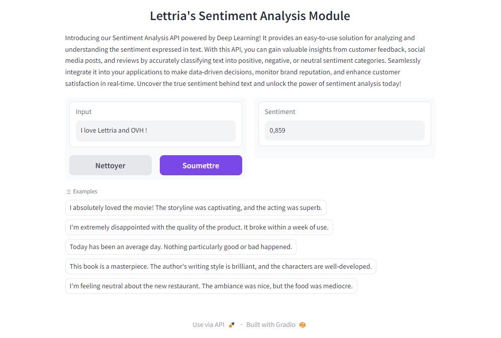
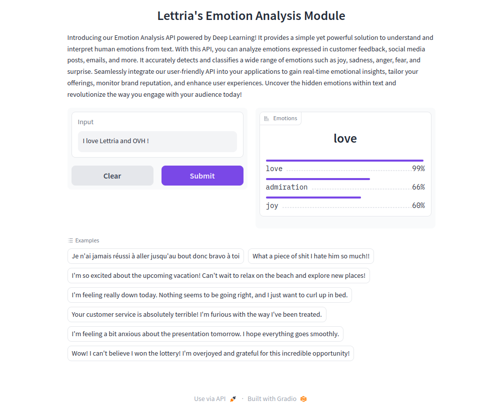

## Objective

OVHcloud offers different Artificial Intelligence services through its AI Partners Ecosystem. You will benefit from a catalogue of **ready-to-use applications** provided by our partners which you will easily be able to deploy according to your needs through **AI Deploy**.

**Lettria is an OVHcloud partner that offers AI services dedicated to text. This guide will provide a detailed understanding of how Lettria services work.**

> [!primary]
>
> To find out more about Lettria billing, launching and capabilities, please refer to this [guide](/pages/platform/ai/ecosystem_01_lettria_billing_features_capabilities).
>

## Introduction

**Lettria** is a start-up specialized in **NLP** (Natural Language Processing). The platform enables all organizations, from start-ups to large corporations, to perform textual analysis on their data to take the best strategic decisions.

Lettria provides text understanding models that allow users to easily identify and extract key information from their text. This method relies on artificial intelligence and NLP techniques to understand the sentiment or emotions of a text.

## Lettria’s Sentiment Analysis API

Lettria's Sentiment Analysis API, powered by Deep Learning, applies advanced algorithms to examine and predict sentiment values from -1 to 1, offering key insights into the emotional tone of text.

The Sentiment Analysis API facilitates sentiment assessment in diverse content, including:

- customer feedback
- social media posts
- product reviews

By attributing a numerical value to the sentiment of text, it provides an understanding of the overall positivity or negativity of the content.

The API enables objective measurement of sentiment in large data sets, helping informed decision-making and timely actions. It caters to needs such as brand reputation monitoring, market research and customer experience optimization, empowering you with actionable insights.

Our API delivers sentiment values from -1 (signifying strong negative sentiment) to 1 (indicating strong positive sentiment), facilitating comprehensive understanding of sentiment intensity. This allows you to identify sentiment polarity and measure its degree in the text.

The API's user-friendly design allows effortless integration into your applications, unlocking the capabilities of sentiment analysis. Enhance customer satisfaction, take data-driven decisions and optimize business strategies with sentiment analysis. Discover and understand the true sentiment behind text, revolutionizing your audience engagement.

### How sentiment analysis works?

> [!primary]
>
> By reaching the root endpoint `/` of your API, you can access the full documentation.

#### Sentiment

The API returns a float value between -1.0 and 1.0.

-1 indicates a strong negative sentiment and 1 describes a strong positive sentiment.

A value between -0.33 and 0.33 can be understood as neutral.

#### Predict

This predicts sentiment in a list of documents. It takes a string as input and gives a JSON as output.

- **URL**: `/api/predict/`

- **Method**: `POST`

- **Payload**:

```json
[
    "string"
]
```

- **Payload example**:

```json
[
    "Je n'ai jamais réussi à aller jusqu'au bout donc bravo à toi",
    "What a terrible person I hate him so much!!",
    "I'm so excited about the upcoming vacation!",
    "othing seems to be going right, and I just want to curl up in bed.",
    "Your customer service is absolutely terrible!",
    "I'm feeling a bit anxious about the presentation tomorrow.",
    "Wow! I can't believe I won the lottery!",
]
```

#### Success Response

- **Code**: `200 OK`

- **Response content**:

```json
[
  {
    "type": "neutral",
    "score": "Confidence score for the detected sentiment, between -1.0 and 1.0"
  }
]
```

- **Example response**:

For the input `The headphones broke after two weeks, not worth their price.`

```json
[
  {
    "type": "negative",
    "score": -0.861
  }
]
```

### Demo

A Gradio is available on `/demo` or `/gradio`.

{.thumbnail}

### Calling the API in Python

- **Requirement**:

Install the requests package :

```console
pip install requests
```

- **Code**:

```python
import requests

base_ovh_endpoint = ""
url = f"{base_ovh_endpoint}/predict"

headers = {
 "Accept": "*/*",
 "Content-Type": "application/json"
}

payload = json.dumps([
    "I love pizzas and I hate apples.",
    "Wow! I can't believe I won the lottery!"
])

response = requests.post(url, json=payload, headers=headers)
print(response.body())
```

## Lettria’s Emotion Analysis API

Lettria's Emotion Analysis API enables efficient emotion detection from a variety of text types, including:

- customer feedback
- social media content
- emails
- chat conversations

Utilizing Deep Learning technology, the API precisely identifies and categorizes numerous emotions such as joy, sadness, anger, fear, surprise, and more.

The API uses algorithms to interpret human emotions from text, enabling the extraction of valuable insights to enrich your applications. It supports sentiment analysis behind customer reviews and social media content, brand reputation monitoring, market research sentiment analysis, and chatbot interaction optimization.

The API's user-friendly design simplifies its integration into your applications, making it compatible with existing softwares, CRM systems and various platforms. This allows for the extraction of real-time emotional insights for data-driven decision making.

The Emotion Analysis API is an effective solution for businesses looking to enhance customer satisfaction, for social media managers seeking public sentiment understanding, or for developers aiming to improve user experiences.

### How emotion analysis works?

**Note**

By reaching the root endpoint `/` of your API, you can access the full API documentation.

<details>
<summary>The model is trained to detect the folowing emotions</summary>

```json
{
    "admiration": "A feeling of deep respect and appreciation for someone or something.",
    "amusement": "A lighthearted feeling of enjoyment or entertainment.",
    "anger": "A strong feeling of displeasure and hostility towards someone or something.",
    "annoyance": "A feeling of irritation or slight anger.",
    "approval": "A positive sentiment indicating agreement or acceptance.",
    "caring": "A feeling of concern, kindness, and support towards others.",
    "confusion": "A state of being puzzled or uncertain about something.",
    "curiosity": "A strong desire to know or learn about something.",
    "desire": "A strong feeling of longing or wanting something.",
    "disappointment": "A feeling of sadness or dissatisfaction due to unfulfilled expectations.",
    "disapproval": "A negative sentiment indicating disagreement or rejection.",
    "disgust": "A strong feeling of revulsion or intense dislike.",
    "embarrassment": "A feeling of self-consciousness or discomfort in a social situation.",
    "excitement": "A state of being emotionally aroused and enthusiastic.",
    "fear": "An intense emotion triggered by the anticipation of danger, pain, or threat.",
    "gratitude": "A feeling of thankfulness and appreciation.",
    "grief": "A deep sorrow or sadness, usually caused by the loss of someone or something.",
    "joy": "A feeling of great happiness, delight, or pleasure.",
    "love": "An intense affection and deep emotional attachment towards someone or something.",
    "nervousness": "A state of feeling uneasy or apprehensive.",
    "optimism": "A hopeful and positive outlook or expectation.",
    "pride": "A feeling of satisfaction and deep pleasure in one's achievements or qualities.",
    "realization": "The act of becoming fully aware or understanding something.",
    "relief": "A sense of reassurance and comfort after a period of difficulty or distress.",
    "remorse": "A feeling of deep regret or guilt for a past action.",
    "sadness": "A state of feeling sorrowful, unhappy, or mournful.",
    "surprise": "A sudden feeling of astonishment or unexpectedness.",
    "neutral": "A lack of strong emotion or bias, indicating a state of indifference or objectivity."
}
```

 </details>

#### Predict

This function predicts emotions in a list of documents. It takes a string as input and gives a JSON as output.

- **URL**: `/api/predict/`

- **Method**: `POST`

- **Payload**:

```json
[
    "string"
]
```

- **Payload example**:

```json
[
    "Je n'ai jamais réussi à aller jusqu'au bout donc bravo à toi",
    "What a terrible person, I hate him so much!!",
    "I'm so excited about the upcoming vacation!",
    "othing seems to be going right, and I just want to curl up in bed.",
    "Your customer service is absolutely terrible!",
    "I'm feeling a bit anxious about the presentation tomorrow.",
    "Wow! I can't believe I won the lottery!",
]
```

#### Success Response

- **Code**: `200 OK`

- **Response content**:

```json
[
  {
    "type": "The detected emotion",
    "confidence": "Confidence score for the detected emotion, between 0 and 1.0",
    "detail": "Detail score for each emotion"
  }
]
```

- **Example response**:

For the input `I love pizzas and I hate apples.`

```json
[
  {
    "type": "love",
    "confidence": 0.952,
    "detail": {
      "love": 0.952,
      "anger": 0.841,
      "disapproval": 0.786,
      "disgust": 0.702,
      "annoyance": 0.584,
      "disappointment": 0.412,
      "approval": 0.373,
      "joy": 0.343,
      "admiration": 0.265,
      "excitement": 0.251,
      "desire": 0.231,
      "sadness": 0.217,
      "confusion": 0.161,
      "neutral": 0.156,
      "amusement": 0.154,
      "fear": 0.135,
      "optimism": 0.133,
      "realization": 0.122,
      "embarrassment": 0.119,
      "relief": 0.117,
      "curiosity": 0.105,
      "remorse": 0.092,
      "gratitude": 0.09,
      "caring": 0.087,
      "nervousness": 0.07,
      "surprise": 0.031,
      "pride": 0.015,
      "grief": 0.014
    }
  }
]
```

### Demo

A Gradio is available on `/demo` or `/gradio`.

{.thumbnail}

### Calling the API in Python

- **Requirement**:

Install the requests package:

```console
pip install requests
```

- **Code**:

```python
import requests

base_ovh_endpoint = ""
url = f"{base_ovh_endpoint}/predict"

headers = {
 "Accept": "*/*",
 "Content-Type": "application/json"
}

payload = json.dumps([
    "I love pizzas and I hate apples.",
    "Wow! I can't believe I won the lottery!"
])

response = requests.post(url, json=payload, headers=headers)
print(response.body())
```

## Lettria’s Name Entity Recognition API

Lettria's NER Model API is a text analysis tool powered by deep learning. The NER model accurately predicts and extracts essential information from your data. 

The API is specifically designed to identify and classify key entities such as **Locations** (`LOC`), **Persons** (`PER`), **Organizations** (`ORG`), and **Miscellaneous** (`MISC`) within your text, providing unparalleled insights and boosting your understanding of textual data. 

NER Model API delivers accurate, reliable results, enabling you to streamline workflows, improve data-driven decision-making and achieve a new level of efficiency.

Discover and understand the true entities behind text to improve customer satisfaction, make data-driven decisions and optimize your business strategies with entity analysis.

### How does NER work?

**Note**

By reaching the root endpoint `/` of your API, you can access the full documentation.

#### Entities

The API returns a list of detected entities for each input sentence.

Entities:

| Entity | Description |
| --- | --- |
| LOC (Location) | locations or places mentioned in the text, such as cities, countries, and landmarks |
| ORG (Organization) | organizational entities including companies, institutions, government agencies and other formal or informal groups with recognized names |
| PER (Person) | personal entities, such as individuals’ names, including people, fictional characters, or any other references to specific persons in the text |
| MISC (Miscellaneous) | named entities that do not fall into other specific categories, such as events, social media or other entities that do not fit into the predefined tags LOC, ORG, or PER |

#### Logits

By setting `return_logits=true`, the API will return the raw scores of each entity class for each word in the sentence.

This can be useful to gain finer control over the prediction.

Example of post-processing alteration:

If a word is predicted as MISC with a score of 0.6 and as LOC with a score of 0.5, in some use cases, we might want to consider it a Location instead of a Miscellaneous entity.

> [!primary]
>
> In logit mode, the NER tags are prefixed by B or I. B stands for Beginning (the word is the beginning of an entity) and I stands for Inside (the word is inside an entity). Example: In Alan Turing invented AI. Alan | B-PER Turing | I-PER invented AI | B-MISC.
> 

#### Language Support

The model supports the following languages:

- English
- French
- Spanish
- Portuguese
- Italian

#### Predict

This predicts sentiment in a list of documents. It takes a string as input and gives a JSON as output.

**URL**: `/api/predict/`

**Method**: `POST`

**Payload**

```json
{
	"inputs": [str],
	"return_logits": bool
}
```

**Payload example**

```json
{
   "inputs":[
      "I bought an apple yesterday.",
      "I bought an Apple yesterday."
   ],
   "return_logits":true
}
```

#### Success Response

**Code**: `200 OK`

**Response content**

```json
{
   "predictions":[
      [
         {
            "entity":"string",
            "score":"float",
            "confidence":"float",
            "words":"string",
            "start":"int",
            "end":"int",
            "scores":{
               "property1":"float",
               "property2":"float"
            }
         }
      ]
   ],
   "analysed_chars":"int"
}
```

**Example response**

For the input `I bought an Apple yesterday.`

```json
{
   "predictions":[
      [
         {
            "entity":"ORG",
            "score":0.935,
            "confidence":0.872,
            "words":"Apple",
            "start":13,
            "end":18
         }
      ]
   ],
   "analysed_chars":50
}
```

### Demo

A Gradio is available on `/demo` or `/gradio`.

{.thumbnail}

### Calling the API in Python

**Requirement**

Install the requests package :

```console
pip install requests
```

**Code**

```python
import requests

base_ovh_endpoint = ""
url = f"{base_ovh_endpoint}/predict"
headers = {"Accept": "*/*", "Content-Type": "application/json"}
payload = json.dumps(
    {
        "inputs": ["I bought an apple yesterday.", "I bought an Apple yesterday."],
        "return_logits": true,
    }
)
response = requests.post(url, json=payload, headers=headers)
print(response.body())
```

## Feedback

Please send us your questions, feedback and suggestions to improve the service:

- On the OVHcloud [Discord server](https://discord.gg/ovhcloud)
