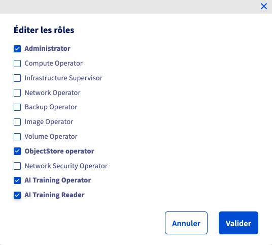
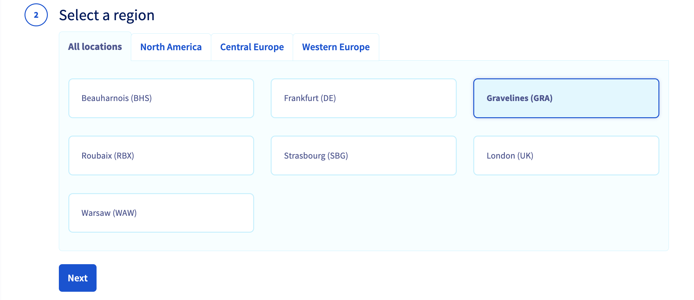
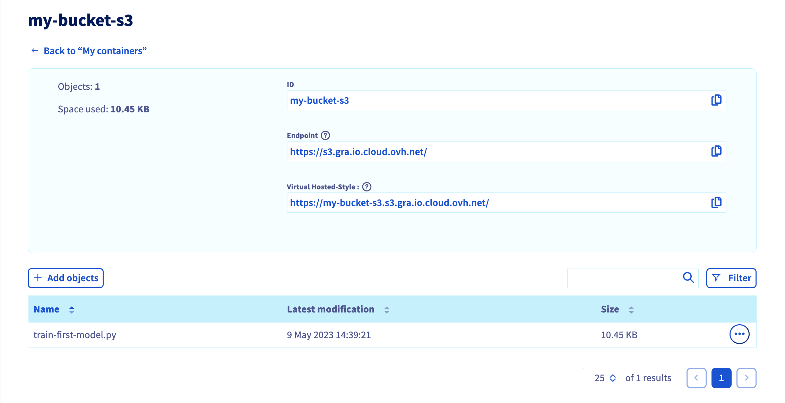

**Last updated 10th May, 2023.**

## Objective

This guide is intended to help you to use `S3 buckets` with **AI Tools** via the OVHcloud Control Panel and `ovhai` CLI. This will help you to manage your data when working with AI Notebooks, AI Training and AI Deploy.

## Requirements

- A **Public Cloud project**.
- Access to the [OVHcloud Control Panel](https://ca.ovh.com/auth/?action=gotomanager&from=https://www.ovh.com/ca/fr/&ovhSubsidiary=qc).
- A working `ovhai` CLI. See our guide on [how to install ovhai CLI](/pages/platform/ai/cli_10_howto_install_cli).

## Instructions

In the next steps, you will be able to **create a user to manage your S3 buckets**, **add a new datastore** dedicated to your buckets, then **create and increment a bucket**.

Then, you will be able to use this bucket with the different **OVHcloud AI Tools** through the `ovhai` CLI.

### Creating a S3 user

First of all, you must have a user with the correct rights to manage S3 buckets.

You have two options:

- [create a new user](/pages/cloud/storage/object_storage/s3_identity_and_access_management)
- edit your [user roles](/pages/platform/ai/gi_01_manage_users) (the one you use with AI Tools)

> [!primary]
>
> Whether you create a *new user* or use an *existing one*, don't forget to grant him at least the `AI Training Operator` and `ObjectStore Operator` rights.
>



> [!warning]
>
> Please be sure to save your S3 credentials: **user name**, **S3 access key** and **S3 secret key**.
>

### Adding a new datastore

Now that you have a user for S3 buckets management, you have to add a dedicated datastore through `ovhai CLI`.

> [!warning]
>
> Please make sure you are connected to the `ovhai CLI` with the right user.
>

You can list the existing datastores with the following command:

```console
ovhai datastore list
```

You should obtain the following result:

```console
ALIAS STORE_TYPE OWNER    ENDPOINT
BHS   swift      ovhcloud ~
DE    swift      ovhcloud ~
GRA   swift      ovhcloud ~
SBG   swift      ovhcloud ~
SGP   swift      ovhcloud ~
UK    swift      ovhcloud ~
WAW   swift      ovhcloud ~
```

> [!primary]
>
> Here you can see that there are **no S3 stores** in the list. That's why you will create your own!
>

If you want to know more about adding **S3 datastores**, run the following command:

```console
ovhai datastore add s3 --help
```

You can see the different arguments to fill in your command line.

```console
Add an S3 data store

Usage: ovhai datastore add s3 [OPTIONS] <ALIAS> <ENDPOINT_URL> <REGION> <ACCESS_KEY> <SECRET_KEY>

Arguments:
  <ALIAS>         Alias for the data store
  <ENDPOINT_URL>  Data store connection URL
  <REGION>        Data store region
  <ACCESS_KEY>    Connection access key
  <SECRET_KEY>    Connection secret key

Options:
      --store-credentials-locally  Whether or not to store the data store credentials locally when creating or updating a data store
      --token <TOKEN>              Authentication using Token rather than OAuth
      --no-color                   Remove colors from output
  -h, --help                       Print help
```

> [!primary]
>
> In this guide, an **OVHcloud S3 datastore** will be used. You are free to use the S3 datastore of your choice.
>

Here is the basic command to create an OVHcloud S3 datastore:

```console
ovhai datastore add s3 <alias> https://s3.<region>.io.cloud.ovh.net/ <region> <my-access-key> <my-secret-key>
```

In this example, the datastore created will be located in Gravelines (`GRA`) and its alias will be `S3GRA`.

```console
ovhai datastore add s3 S3GRA https://s3.gra.io.cloud.ovh.net/ gra <my-access-key> <my-secret-key> --store-credentials-locally
```

You can now check the datastore list:

```console
ovhai datastore list
```

You should see your S3 datastore in the list.

```console
ALIAS STORE_TYPE OWNER    ENDPOINT
BHS   swift      ovhcloud ~
DE    swift      ovhcloud ~
GRA   swift      ovhcloud ~
S3GRA s3         customer https://s3.gra.io.cloud.ovh.net/
SBG   swift      ovhcloud ~
SGP   swift      ovhcloud ~
UK    swift      ovhcloud ~
WAW   swift      ovhcloud ~
```

Now that you have a dedicated datastore, you can create some S3 buckets via the OVHcloud Control Panel and `ovhai` CLI.

### Creating an S3 bucket

There are two methods to [create a new S3 bucket](/pages/cloud/storage/object_storage/s3_create_bucket). The first one is to use the UI.

#### Using the Control Panel

To create an **Object Storage bucket**, first log in to your [OVHcloud Control Panel](https://ca.ovh.com/auth/?action=gotomanager&from=https://www.ovh.com/ca/fr/&ovhSubsidiary=qc) and open your `Public Cloud`{.action} project. Click on `Object Storage`{.action} in the side bar and then on the `My containers`{.action} tab. Now, click the `Create an object container`{.action} button.

First, select the solution you need.

*In this tutorial, a `Standard Object Storage S3` will be created.*


Select a region (`GRA`):



You have to link your user to the bucket:


Finally, name your bucket:


Once your bucket is created, you can add files (images, codes, templates,...).

*In this example, the python file `train-first-model.py` is added.*



> [!warning]
>
> Warning! You have to be sure that your user has the rights to **all the files** in your S3 bucket. Otherwise you may encounter permission issues.
>

#### Using the `ovhai` CLI

You can also create the same S3 bucket using the OVHcloud `ovhai` CLI.

To do this, connect to your CLI with your user credentials and run the following command:

*In this guide, the S3 bucket name will be `my-bucket-s3`.*

```console
ovhai bucket create S3GRA my-bucket-s3
```

You can check that your S3 bucket has been created:

```console
ovhai bucket list S3GRA
```

You should see your bucket in the list.

```console
DATE                     NAME
2023-05-09T12:36:36.000Z my-bucket-s3
```

Now, you can upload all the objects you want:

*In this example, the python file `train-first-model.py` is added.*

```console
ovhai bucket object upload my-bucket-s3@S3GRA train-first-model.py
```

You are now able to list the content of your S3 bucket:

```console
ovhai bucket object list my-bucket-s3@S3-GRA
```

You should see your object (here the python file).

```console
DATE                     BYTES    NAME                 DESCRIPTION ETAG
2023-05-09T12:39:21.000Z 10.4 KiB train-first-model.py STANDARD    092da9edf113d84e65ba4866892cf249
```

### Using S3 buckets with AI Tools

Now that your **S3 bucket** has been created, you are free to use it with any OVHcloud AI tool.

> [!primary]
>
> Please note that for the moment this feature can be used through `ovhai` CLI and API only. It will soon be available from the OVHcloud Control Panel.
>
> *For more information about this, refer to our [Public Roadmap](https://github.com/ovh/public-cloud-roadmap/projects/4).*
>

You can now link your **S3 buckets** to AI notebooks, AI Training and AI Deploy.

#### AI Notebooks

In the following command, replace the **editor** and **framework** by those of your choice:

*For more information about the notebooks commands, please check this [documentation](/pages/platform/ai/cli_11_howto_run_notebook_cli).*

```console
ovhai notebook run <framework-id> <editor-id> \
      --volume my-bucket-s3@S3GRA/:/workspace/my-codes:Rw
```

> [!primary]
>
> In this example the simplest command is used. To learn more about the capabilities, run the following command:
>
> `ovhai notebook run --help`
>

#### AI Training

In the following command, replace the **docker image** by yours:

*For more information about the jobs commands, please check this [documentation](/pages/platform/ai/cli_12_howto_run_job_cli).*

```console
ovhai job run <docker-image> \
      --volume my-bucket-s3@S3GRA/:/workspace/my-codes:rw
```

> [!primary]
>
> In this example the simplest command is used. To learn more about the capabilities, run the following command:
>
> `ovhai job run --help`
>

#### AI Deploy

In the following command, replace the **docker image** by yours:

```console
ovhai app run <docker-image> \
      --volume my-bucket-s3@S3GRA/:/workspace/my-codes:rw
```

> [!primary]
>
> In this example the simplest command is used. To learn more about the capabilities, run the following command:
>
> `ovhai app run --help`
>

## Feedback

Please send us your questions, feedback and suggestions to improve the service:

- On the OVHcloud [Discord server](https://discord.com/invite/vXVurFfwe9)

If you need training or technical assistance to implement our solutions, contact your sales representative or click on [this link](https://www.ovhcloud.com/fr-ca/professional-services/) to get a quote and ask our Professional Services experts for a custom analysis of your project.
