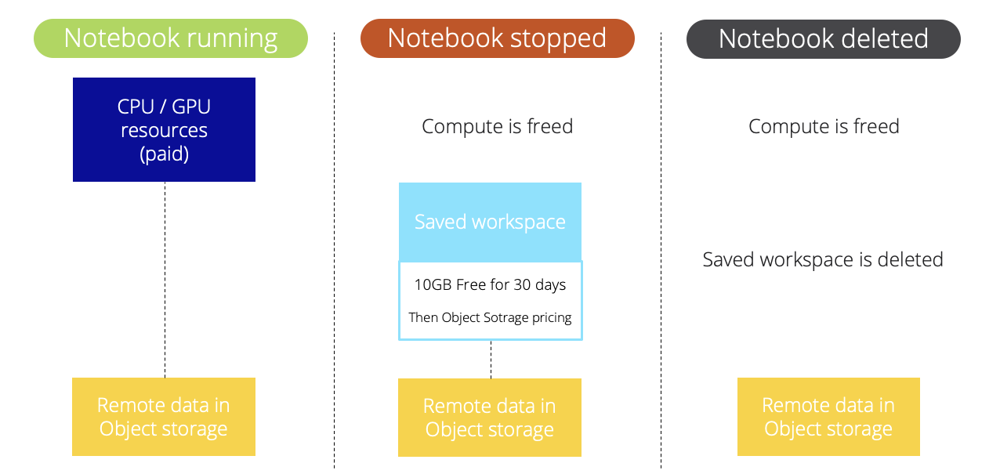

**Last updated 27th April, 2022.**

## Objective

The OVHcloud AI Notebooks service provides you with Jupyter or VSCode notebooks, linked to CPU or GPU resources, without the hassle of installing or operating them. This guide will cover the lifecycle of a notebook, and associated billing.

## Introduction

AI Notebooks are linked to a Public Cloud project. The whole project is billed at the end of the month, with pay-as-you-go. It means you will only pay for what you consume, based on the compute resources you use (CPus and GPUs) and their running time.

## AI Notebooks lifecycle

During its lifetime, the notebook will go through the following statuses:

- `STARTING`: the notebook is being started and, if any, the remote data is synchronized. To learn more about data synchronization, please check out the [Data - How it works](https://docs.ovh.com/ie/en/publiccloud/ai/data/#how-it-works) documentation.
- `RUNNING`: the notebook is running, you can connect to it and use it. Compute resources (GPUs/CPUs) are allocated to your specific notebook and data are available.
- `STOPPING`: the notebook is stopping, your compute resources are freed, your status is saved and, if any, the data is synchronized back.
- `STOPPED`: the notebook ended normally. You can restart it whenever you want or delete it.
- `FAILED`: the notebook ended in error, e.g. the process in the notebook finished with a non 0 exit code. For more information, refer to [this section](https://docs.ovh.com/ie/en/publiccloud/ai/notebooks/debug-notebooks/#cli-my-notebook-is-in-failed-status) of our [Troubleshooting documentation](https://docs.ovh.com/ie/en/publiccloud/ai/notebooks/debug-notebooks/).
- `ERROR`: the notebook ended due to a backend error. You may reach our support.
- `DELETING`: the notebook is being removed. When it is deleted, you will no longer see it, it will no longer exist.

{.thumbnail}

## Billing principles

AI Notebooks are a pay-per-use solution. You only pay for the resources consumption, during the `RUNNING` phase of your notebooks.

Billing principle is quite simple, you select the amount of compute resource (CPUs or GPUs) you would like to work with and pay only for this.

**Included** in AI Notebooks resources:

- AI Notebooks managed service
- Dedicated CPU/GPU compute resources (based on the selected amount)
- Ephemeral local storage (size depends on the selected compute resources)
- Workspace storage when notebook is running
- Ingress/Egress network traffic

**Optional** with AI Notebooks:

- Remote storage space, based on OVHcloud Object Storage pricing
- Egress traffic for remote Object storage
- Saved workspace storage. First 10GB are free.

Visual explanations about paid items:

{.thumbnail}

A more detailed view:

{.thumbnail}

### Compute resources details

During the notebook creation, you can select **compute resources**, known as CPUs or GPUs.
Their official pricing is available in the [OVHcloud Control Panel](https://www.ovh.com/auth/?action=gotomanager&from=https://www.ovh.ie/&ovhSubsidiary=ie) or on the[OVHcloud Public Cloud website](https://www.ovhcloud.com/en-ie/public-cloud/prices/).

Rates for compute are mentioned per hour to facilitate reading of the prices, but the billing granularity remains **per minute**.

### Storage details

#### Ephemeral local storage

Each compute resource (CPU or GPU) comes with local storage, that we can consider ephemeral since this storage space is not saved when you delete an AI Notebooks.

The sizing depends on the selected amount of compute resources, check the details on the [OVHcloud Public Cloud website](https://www.ovhcloud.com/en-ie/public-cloud/prices/).

#### Remote Object storage

When working with remote data, you pay separately for the storage of this data.
The pricing of object storage is apart from the notebook pricing.

#### Workspace storage

When you attach remote data to an AI Notebook, you can select the mounting point. If you opt for /workspace/*, we will save your data when you stop your notebook.

This workspace is saved as long as your notebook is in `STOPPED` state.

- Included: worskpace is included when your notebook is in "running" state.
- Paid: the first 10GB are free during 30 consecutive days, then you pay at the price of OVHcloud Object Storage.

### Pricing examples

#### Example 1: one GPU notebook for 10 hours then deleted

We start one AI Notebook, with two GPUs and we keep it running for 10 hours then we **delete it**.

- compute resources: 2 x GPU NVIDIA V100s (1,75€ / hour)
- remote storage:  nothing
- duration: 10 hours then deleted

Price calculation for compute: 10 (hours) x 2 (GPU) x 1,75€ (price / GPU) = **35 euros**, billed at the end of the month

#### Example 2: one GPU notebook for 10 hours but stopped, not deleted

We start one AI Notebook, with two GPUs and we keep it running for 10 hours then we stop it and finally we **delete it after 10 days**.

- compute resources: 2 x GPU NVIDIA V100s (1,75€ / hour)
- remote storage: nothing
- workspace storage: 100GB used. First 10GB are free
- duration: 10 hours then stopped for 10 days

Price calculation for compute : 10 (hours) x 2 (GPU) x 1,75€ (price / GPU) = **35 euros**, billed at the end of the month
Price calculation for workspace : 90 (GB) x 0,01€ (price for object storage / GB) = **0,9 euros**, billed at the end of the month

#### Example 3: one GPU notebook for 10 hours with 1TB remote storage

We start one AI Notebook, with two GPUs and 1TB remote storage. We keep it running for 10 hours then we delete it.

- compute resources: 2 x GPU NVIDIA V100s (1,75€ / hour)
- remote storage: 1TB in OVHcloud Object Storage
- workspace storage: 1TB used. First 10GB are free
- duration: 10 hours then we delete it.

Price calculation for compute: 10 (hours) x 2 (GPU) x 1,75€ (price / GPU) = **35 euros**, billed at the end of the month
Price calculation for workspace: 1000 (GB) x 0,01€ (price for object storage / GB) = **0,9 euros**, billed at the end of the month

Also, price calculation for remote Object Storage : 1000 (GB) x 0,01€ (price for object storage / GB) = **10 euros**, billed at the end of the month

#### Example 4: 15 CPU notebooks for 5 hours then deleted

We start 15 AI Notebooks, each of them with one vCPU

 - compute resources: 1 x vCPU (0,03€ /hour /cpu)
 - remote storage: nothing
 - duration: 5 hours then we delete it.

Price calculation for compute: 15 (notebooks) x 5 (hours) x 1 (CPU) x 0,03€ (price / CPU) = **2,25 euros**, billed at the end of the month

## Feedback

Please send us your questions, feedback and suggestions to improve the service:

- On the OVHcloud [Discord server](https://discord.com/invite/vXVurFfwe9)
