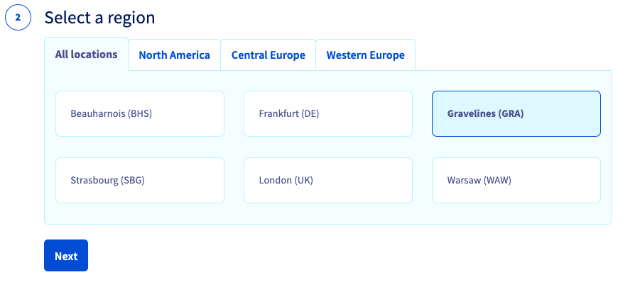
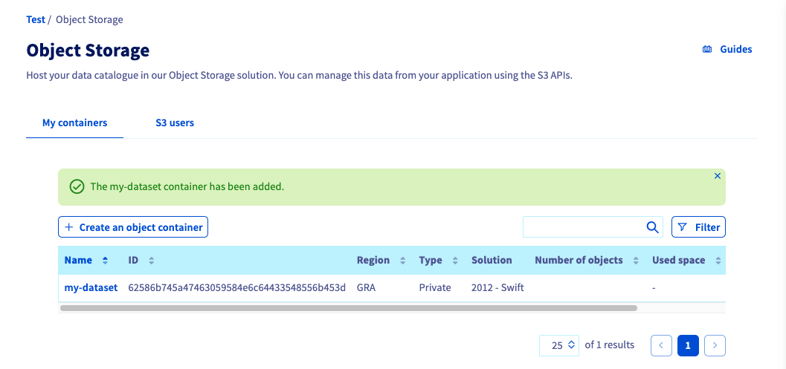
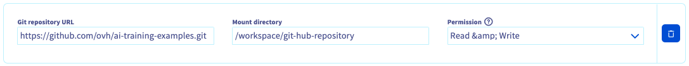

**Last updated 13th April, 2022.**

## Objective

This guide shows how to access Object Storage data from your [**notebooks**](https://docs.ovh.com/au/en/publiccloud/ai/notebooks/definition/) via the OVHcloud Control Panel.

## Requirements

- a [Public Cloud project](https://www.ovhcloud.com/en-au/public-cloud/) in your OVHcloud account
- access to the [OVHcloud Control Panel](https://ca.ovh.com/auth/?action=gotomanager&from=https://www.ovh.com.au/&ovhSubsidiary=au)
- a Public Cloud user with `Administrator` or `AI Training operator` role, see [here](https://docs.ovh.com/au/en/publiccloud/ai/users/) for more information

## Upload data to your Object Storage

First, you need to push some data to the `Object Storage` before accessing it from the notebook.

You can access to the `Object Storage` section of your Public Cloud project on the OVHcloud Control Panel.

{.thumbnail}

> [!primary]
>
> You can upload different types of data: datasets, code, notebooks, connection weights, text or csv files, etc.
>

To upload your data, go to `Create an object container`.

Let's assume that a file named `my-dataset.zip` exists locally on your computer and contains your dataset. You will be able to upload it into an object container in your Object Storage by following these steps.

### 1- Select your solution

If you want to know more about the different storage solutions, refer to this [page](https://docs.ovh.com/au/en/storage/).

{.thumbnail}

### 2- Select a region

> [!primary]
>
> To optimize the download and upload times, we advise you to store your data in the same place as your notebook (`GRA` or `BHS`).
>

{.thumbnail}

### 3- Select a type of container

Choose the type of your data according to what you want to do.

> [!primary]
>
> **Example:** for a dataset that you use to train your model, the `Private` type is appropriate
>

{.thumbnail}

### 4- Name your container

{.thumbnail}

You have created your container to host your dataset.

{.thumbnail}

You are now ready to load your data!

### 5- Add objects to your container

In order to upload your dataset into your object container `my-dataset`, you have to go on `Add objects` and select your local `my-dataset.zip` file.

{.thumbnail}

You will now see your `my-dataset.zip` file displayed in your object container.

{.thumbnail}

> [!primary]
>
> You can also create a new empty `my-weights` container in which you can save your **connection weights** (or your **validated model**) at the end of your training.
>

We assume that we now have two object containers available:

- `my-dataset`, containing the file `my-dataset.zip`
- `my-weights`, empty

You are now ready to launch a notebook with your data!

## Launch a notebook with attached data

To launch an AI notebook, access the **AI Notebooks** section of your Public Cloud project in the OVHcloud Control Panel.

{.thumbnail}

For the *first 4 steps* of the notebook creation, please refer to this [tutorial](https://docs.ovh.com/au/en/publiccloud/ai/notebooks/definition/).

### Choose the notebook location

You can choose between *2 datacenters* for the storage of your notebook: `GRA` or `BHS`.

{.thumbnail}

### Attach container or a Git repository

You can attach your different types of data to your notebook.

#### Access with Read-Only permissions

You can load the container `my-dataset` in the `/workspace/dataset` directory, with `Read-only` permission.

{.thumbnail}

You will not be able to modify the dataset from this notebook because you loaded it with `Read-only` permission.

`Read-only` permissions are to ensure you don't modify your data by mistake. If you want to modify data from your
notebooks, to store a trained neural network for example, you can use the `Read-write` permission instead.

#### Access with Read-Write permissions

Similarly to the `Read-only` mode, you can load data with `Read-write` permission.

Once you have some data that you want to save from the notebook to Object Storage (connection weights in this example), you can simply write it to the `/workspace/weights` folder.

{.thumbnail}

This folder will be uploaded to your Object Storage when you stop your notebook.

As long as your notebook is in the `STOPPING` state, this means that the upload is still in progress. Once the state changes to `STOPPED`, it means all the data was uploaded to your Object Storage.

#### Attach a public Git repository

If Python code, notebooks or other files are available on a public GitHub repository, you can attach them to your notebook.
To be able to edit and make changes easily, use the Read-write permission.

The command is as follows:

{.thumbnail}

> [!warning]
>
> To make your command valid, don't forget to add a `.git` at the end of the GitHub repository URL.
>

#### Use cached volumes

When loading large files from the `Object Storage`, it can take some time to download to your notebooks. In these cases, you can cache the volumes so that it does not need to be downloaded again when you start new notebooks that use the same data.

To do so, you can check `Cache`.

{.thumbnail}

Cached volumes will be deleted at least 72 hours after the last notebook using it has stopped.
Note that the cache is shared with all users in your project. The main consequence you need to be careful about
is the fact that if someone else modifies the data in your cached volume, you will also see the modifications on your side.

### Launch and access the notebook

Your notebook is now ready to be launched with your data!

{.thumbnail}

You can read the [Getting started](https://docs.ovh.com/au/en/publiccloud/ai/notebooks/definition/) page to know how to find this URL.

As soon as you access your notebook, you will see your different folders containing your data.

{.thumbnail}

## Feedback

Please send us your questions, feedback and suggestions to improve the service:

- On the OVHcloud [Discord server](https://discord.com/invite/vXVurFfwe9)
